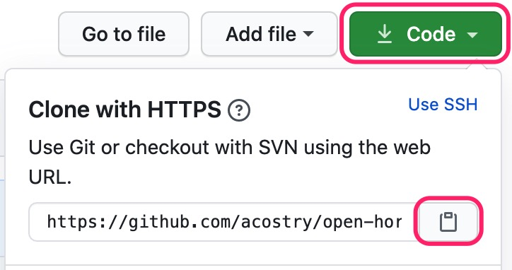
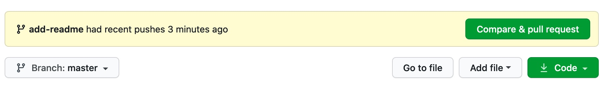
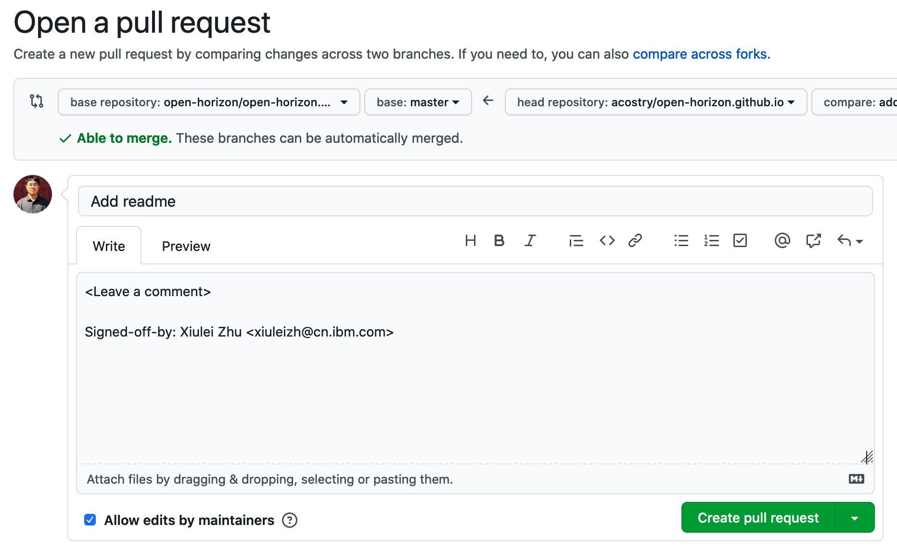

<p style="text-align:center;" align="center">
  
</p>

<p align="center">
<a href="https://github.com/open-horizon/open-horizon.github.io" alt="GitHub contributors">
</a>
<a href="https://github.com/open-horizon/open-horizon.github.io" alt="anazdocscopy.yml">
</a>
<a href="https://github.com/open-horizon/open-horizon.github.io" alt="Check_broken_link.yml">
</a>
<a href="https://github.com/open-horizon/open-horizon.github.io" alt="Twitter Follow">
</a>
<a href="https://matrix.to/#/#open-horizon-docs:chat.lfx.linuxfoundation.org" alt="chat on matrix">
</a>
</p>

# Contributing to Open Horizon pages

If you would like to contribute content, read the following documentation for helpful information and guidelines.

We appreciate and recognize all contributors.

# Table of Contents

- [Contributing to Open Horizon Pages](#contributing-to-open-horizon-pages)
- [Table of Contents](#table-of-contents)
- [Fork the Repository](#fork-the-repository)
- [Make Necessary Changes](#make-necessary-changes)
  - [Clone the repository](#clone-the-repository)
  - [Create a branch](#create-a-branch)
  - [Make necessary changes](#make-necessary-changes-1)
- [Test in Local and Push Changes to GitHub](#test-in-local-and-push-changes-to-github)
  - [Prerequisites](#prerequisites)
  - [Test your changes locally](#test-your-changes-locally)
  - [Commit changes](#commit-changes)
  - [Push changes to GitHub](#push-changes-to-github)
  - [Possible Errros you may get.](#possible-errros-you-may-get)
- [Submit a Pull Request for Review](#submit-a-pull-request-for-review)
- [Clean Up](#clean-up)
  - [Delete the branch](#delete-the-branch)
  - [Syncing a fork](#syncing-a-fork)

# Fork the Repository

Fork this repository by clicking on the fork button on the top of this page. This will create a copy of this repository in your account.

# Make Necessary Changes

To make changes, clone the forked repository to your machine.

## Clone the repository



Go to your GitHub account, open the forked repository, click **Code**, and then **copy to clipboard**.

Open a terminal and run the following git command:

```
git clone "url you just copied"
```

where "url you just copied" (without the quotation marks) is the url to this repository (your fork of this project).

## Create a branch

Change to the repository directory on your computer:

```
cd open-horizon.github.io
```

Now create a branch using the `git checkout` command:

```
git checkout -b <add-your-new-branch-name>
```

For example:

```
git checkout -b add-readme
```

(The name of the branch does not need to have the word add in it, but it's a reasonable thing to include because the purpose of this branch is to add README to this repository.)

## Make necessary changes

Now, you can suggest contributions, make necessary changes to existing files, or add new files.

# Test in local and push changes to GitHub

Before you push changes to GitHub, build this GitHub pages site locally to preview and test the changes.

## Prerequisites

This GitHub Pages site is built with Jekyll. Before you can use Jekyll to test a site, you must [install Jekyll](https://jekyllrb.com/docs/installation/).

## Test your changes locally

Change to the repository directory on your computer and execute the following command to run the Jekyll site locally.

1. To install and update all dependencies.

```
make init
```

**Note**: Run the above command one time before using the tools each day.

2. start the local web server, does not build the site first

```
make run
```

**Note**: This runs a local web server with live reload enabled. When running the make command on Windows, an error might occur that identifies the installed command as unrecognized. This can happen when the binary path is set incorrectly.

To preview the site in your web browser navigate to [http://localhost:4000](http://localhost:4000).

3. To build and test the local documentation site:

```
make dev
```

4. To Build the local documentation site:

```
make build
```

5. Test the local documentation site locally:

```
make test
```

**Note**: This is typically done before `make run`

## Commit changes

After you have a successful testing in local with your changes, you are ready to commit those changes.

If you go to the project directory and execute the command `git status`, you'll see your changes.

Add those changes to the branch you just created using the `git add` command:

```
git add <file>
```

All commits should be signed off (`-s` flag on `git commit`). To use `-s` option, follow the [guidance](common-requests/contribute.md#how-to-attest) to make sure you configure your git name (user.name) and email address (user.email).

Now commit those changes using the git commit command:

```
git commit -s -m "Add README.md"
```

## Push changes to GitHub

Push your changes using the command `git push`:

```
git push origin <add-your-branch-name>
```

replacing `<add-your-branch-name>` with the name of the branch you created earlier.

## Possible Errros 

When setting up a project locally, some errors can occur. Some of those are listed below.

- Missing `webrick` and `wdm` in `Gemfile`

Change to:

Some users use the latest version of `ruby`, which is `>2.7` that does not have pre-added `webrick` support. If they are using `ruby` versions `>= 3.0.0`, they might see the error listed below.

```
  Add the following to your Gemfile to avoid polling for changes:
    gem 'wdm', '>= 0.1.0' if Gem.win_platform?
 Auto-regeneration: enabled for 'C:/Users/yourUserName/Desktop/open-horizon/open-horizon.github.io'
C:/Ruby30-x64/lib/ruby/gems/3.0.0/gems/jekyll-3.9.0/lib/jekyll/commands/serve/servlet.rb:3:in `require': cannot load such file -- webrick (LoadError)
        from C:/Ruby30-x64/lib/ruby/gems/3.0.0/gems/jekyll-3.9.0/lib/jekyll/commands/serve/servlet.rb:3:in `<top (required)>'
        from C:/Ruby30-x64/lib/ruby/gems/3.0.0/gems/jekyll-3.9.0/lib/jekyll/commands/serve.rb:184:in `require_relative'
        from C:/Ruby30-x64/lib/ruby/gems/3.0.0/gems/jekyll-3.9.0/lib/jekyll/commands/serve.rb:184:in `setup'
        from C:/Ruby30-x64/lib/ruby/gems/3.0.0/gems/jekyll-3.9.0/lib/jekyll/commands/serve.rb:102:in `process'
        from C:/Ruby30-x64/lib/ruby/gems/3.0.0/gems/jekyll-3.9.0/lib/jekyll/commands/serve.rb:93:in `block in start'
        from C:/Ruby30-x64/lib/ruby/gems/3.0.0/gems/jekyll-3.9.0/lib/jekyll/commands/serve.rb:93:in `each'
        from C:/Ruby30-x64/lib/ruby/gems/3.0.0/gems/jekyll-3.9.0/lib/jekyll/commands/serve.rb:93:in `start'
        from C:/Ruby30-x64/lib/ruby/gems/3.0.0/gems/jekyll-3.9.0/lib/jekyll/commands/serve.rb:75:in `block (2 levels) in init_with_program'
        from C:/Ruby30-x64/lib/ruby/gems/3.0.0/gems/mercenary-0.3.6/lib/mercenary/command.rb:220:in `block in execute'
        from C:/Ruby30-x64/lib/ruby/gems/3.0.0/gems/mercenary-0.3.6/lib/mercenary/command.rb:220:in `each'
        from C:/Ruby30-x64/lib/ruby/gems/3.0.0/gems/mercenary-0.3.6/lib/mercenary/command.rb:220:in `execute'
        from C:/Ruby30-x64/lib/ruby/gems/3.0.0/gems/mercenary-0.3.6/lib/mercenary/program.rb:42:in `go'
        from C:/Ruby30-x64/lib/ruby/gems/3.0.0/gems/mercenary-0.3.6/lib/mercenary.rb:19:in `program'
        from C:/Ruby30-x64/lib/ruby/gems/3.0.0/gems/jekyll-3.9.0/exe/jekyll:15:in `<top (required)>'
        from C:/Ruby30-x64/bin/jekyll:25:in `load'
        from C:/Ruby30-x64/bin/jekyll:25:in `<main>'
```

To solve this error, add `webrick` and `wdm` to your local `Gemfile` by using the commands listed below and re-run the serve.

add webrick:

```
bundle add webrick
```

add wdm:

```
gem install wdm
```

# Submit a Pull Request for Review

If you go to your repository on GitHub, you'll see a `Compare & pull request button`. Click on that button.



Now submit the pull request by clicking `Create pull request`.



You will get a notification email once the changes have been merged.

# Clean Up

## Delete the branch

Once your Pull Request has been approved/merged, you are safe to delete the branch created ealier. Change to the repository directory on your computer and execute the following commands to delete the branch:

Delete the local branch:

```
git branch -d <branch-name>
```

Delete remote branch:

```
git push origin :<branch-name>
```

## Synching a fork

Connect your local repository to the original, upstream repository by adding it as a remote. You should pull in changes from upstream often, so that you stay up-to-date. This helps avoid merge conflicts when you submit pull requests.

For more information, see [Sync a fork of a repository to keep it up-to-date with the upstream repository.](https://docs.github.com/en/github/collaborating-with-issues-and-pull-requests/syncing-a-fork)

## 📌 Our valuable contributors👩‍💻👨‍💻 :

<table>
  <tr>
    <a href="https://github.com/open-horizon/open-horizon.github.io/graphs/contributors">
      
    </a>
  </tr>
</table>
