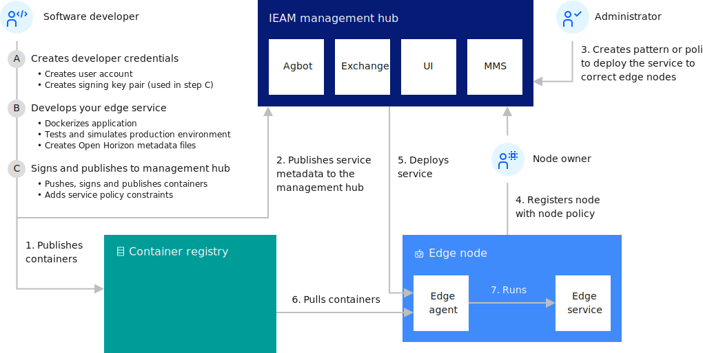

---

copyright:
years: 2021
lastupdated: "2021-02-20"

---

{:new_window: target="blank"}
{:shortdesc: .shortdesc}
{:screen: .screen}
{:codeblock: .codeblock}
{:pre: .pre}
{:child: .link .ulchildlink}
{:childlinks: .ullinks}

# Developing an edge service for devices
{: #developing}

<!--This file is shared w/IEAM-->

To begin developing edge services for {{site.data.keyword.edge_notm}} ({{site.data.keyword.ieam}}), you need to first set up your credentials for publishing content. Because all services must be signed, you must also create a cryptographic signing key pair. Make sure to complete the prerequisite steps, [Preparing to create an edge service](service_containers.md).

This diagram shows the typical interactions between the components within {{site.data.keyword.horizon}}.

 

## Examples
{: #edge_devices_ex_examples}

Use your credentials and signing keys to complete the development examples. These examples show you how to build simple services and help you learn about {{site.data.keyword.ieam}} development basics.

Each of these development examples demonstrates a few more aspects of developing edge services. For an optimum learning experience, complete the examples in the order they are listed here.

* [Transform image to edge service](transform_image.md) - Demonstrates deploying an existing docker image as an edge service.

* [Creating your own hello world edge service](developingstart_example.md) - Demonstrates the basics of developing, testing, publishing, and deploying an edge service.

* [CPU to {{site.data.keyword.message_hub_notm}} service](cpu_msg_example.md) - Demonstrates how to define edge service configuration parameters, specify that your edge service requires other edge services, and send data to a cloud data ingest service.

* [Hello world using model management](model_management_system.md) - Demonstrates how to develop an edge service that uses the model management service. The model management service asynchronously provides file updates to edge services on edge nodes, for example to dynamically update a machine learning model each time it evolves.

* [Hello world using secrets](developing_secrets.md) - Demonstrates how to develop an edge service that uses secrets. Secrets are used to protect sensitive data like login credentials or private keys. Secrets are deployed securely to services running on the edge.

* [Updating an edge service with rollback](../using_edge_services/service_rollbacks.md) - Demonstrates how to monitor the success of the deployment, and if it fails on any edge node, revert the node back to the previous version of the edge service.

After you finish building these example services, review the following documentation for more detailed information about developing services for {{site.data.keyword.ieam}}:

## Further reading
{: #developing_more_info}

Review the important principles and best practices for {{site.data.keyword.ieam}} software development.

* [Edge-native development best practices](best_practices.md)

With {{site.data.keyword.ieam}}, you can optionally put service container images into the IBM private secure container registry instead of the public Docker Hub. For example, if you have a software image that includes assets that are not appropriate to include in a public registry.

* [Using a private container registry](container_registry.md)

You can {{site.data.keyword.ieam}} use to put your service containers into the IBM private secure container registry instead of the public Docker Hub.

* [Development details](developing_details.md)

With {{site.data.keyword.ieam}}, you can develop any service containers that you want for your edge machines.

* [APIs](../api/index.md)

{{site.data.keyword.ieam}} provides RESTful APIs for enabling components to collaborate, and to enable your organization's developers and users to control the components.

