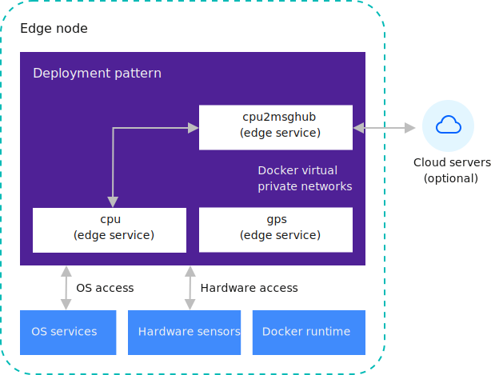

---

copyright:
years: 2021
lastupdated: "2021-02-20"

---

{:new_window: target="blank"}
{:shortdesc: .shortdesc}
{:screen: .screen}
{:codeblock: .codeblock}
{:pre: .pre}
{:child: .link .ulchildlink}
{:childlinks: .ullinks}

# Development details
{: #developing}

The following content provides more details on the software development practices and concepts for {{site.data.keyword.edge_notm}} ({{site.data.keyword.ieam}}) development.
{:shortdesc}

## Introduction
{: #developing_intro}

{{site.data.keyword.edge_notm}} ({{site.data.keyword.ieam}}) is built on the [Open Horizon - EdgeX Project Group ](https://wiki.edgexfoundry.org/display/FA/Open+Horizon+-+EdgeX+Project+Group) open source software.

With {{site.data.keyword.ieam}}, you can develop any service containers that you want for your edge machines. You can then cryptographically sign and publish your code. Finally, you can specify policies within an {{site.data.keyword.edge_deploy_pattern}} to govern software installation, monitoring, and updating. After you complete these tasks, you can view the {{site.data.keyword.horizon_agents}} and {{site.data.keyword.horizon_agbots}} forming agreements to collaborate on managing the software lifecycle. These components then manage the software lifecycle details on your {{site.data.keyword.edge_nodes}} fully autonomously based on the registered deployment pattern for each edge node. {{site.data.keyword.ieam}} can also use policies to determine where and when to autonomously deploy services and machine learning models. Policies are an alternative to deployment patterns.

The software development process within {{site.data.keyword.ieam}} is focused on maintaining system security and integrity, while greatly simplifying the effort that is required for active software management on your edge nodes. {{site.data.keyword.ieam}} can also use policies to determine where and when to autonomously deploy services and machine learning models. Policies are an alternative to deployment patterns. You can build {{site.data.keyword.ieam}} publishing procedures into your continuous integration and deployment pipeline. When the distributed autonomous agents discover published changes in the software or a policy, such as within the {{site.data.keyword.edge_deploy_pattern}} or deployment policy, the autonomous agents independently act to update the software or enforce your policies across your entire fleet of edge machines, wherever they are located.

## Services and deployment patterns
{: #services_deploy_patterns}

{{site.data.keyword.edge_services}} are the building blocks of deployment patterns. Each service can contain one or more Docker containers. Each Docker container can in turn contain one or more long-running processes. These processes can be written in almost any programming language, and use any libraries or utilities. However, the processes must be developed for, and run in, the context of a Docker container. This flexibility means that there are almost no constraints on the code that {{site.data.keyword.ieam}} can manage for you. When a container runs, the container is constrained in a secure sandbox. This sandbox restricts access to hardware devices, some operating system services, the host file system, and the host edge machine networks. For information on sandbox constraints, see [Sandbox](#sandbox).

The `cpu2evtstreams` example code consists of a Docker container that uses two other local edge services. These local edge services connect over local private Docker virtual networks by using HTTP REST APIs. These services are named `cpu` and `gps`. The agent deploys each service on a separate private network along with each service that declared a dependency on the service. One network is created for `cpu2evtstreams` and `cpu`, and another network is created for `cpu2evtstreams` and `gps`. If there is a fourth service in this deployment pattern that is also sharing the `cpu` service, then another private network is created for just the `cpu` and the fourth service. In {{site.data.keyword.ieam}}, this network strategy restricts access for services to only the other services that are listed in `requiredServices` when the other services were published. The following diagram shows the `cpu2evtstreams` deployment pattern when the pattern runs on an edge node:

Note: Set up IBM Event Streams only needed for some examples.

The two virtual networks enable the `cpu2evtstreams` service container to access the REST APIs that are provided by the `cpu` and `gps` service containers. These two containers manage access to operating system services and the hardware devices. Although REST APIs are used, there are many other possible forms of communication that you can use to enable your services to share data and control.

Often the most effective coding pattern for edge nodes involves deploying multiple small, independently configurable, and deployable services. For example, Internet of Things patterns often have low-level services that need access to the edge node hardware, such as sensors or actuators. These services provide shared access to this hardware for other services to use.

This pattern is useful when the hardware requires exclusive access to provide a useful function. The low-level service can properly manage this access. The role of the `cpu` and `gps` service containers is similar in principle to that of the device driver software in the host's operating system, but at a higher level. Segmenting the code into independent small services, some specializing in low-level hardware access, enables a clear separation of concerns. Each component is free to evolve and be updated in the field independently. Third-party applications can also be securely deployed together along with your proprietary traditional embedded software stack by selectively allowing them access to particular hardware or other services.

For example, an industrial controller deployment pattern might be composed of a low-level service for monitoring power usage sensors and other low-level services. These other low-level services can be used to enable control of the actuators for powering the devices that are monitored. The deployment pattern might also have another top-level service container that consumes the services of the sensor and actuator. This top-level service can use the services to alert operators or to automatically power down devices when anomalous power consumption readings are detected. This deployment pattern might also include a history service that records and archives sensor and actuator data, and possibly complete analysis on the data. Other useful components of such a deployment pattern might be a GPS location service.

Each individual service container can be independently updated with this design. Each individual service might also be reconfigured and composed into other useful deployment patterns without any code changes. If needed, a third-party analytics service can be added to the pattern. This third-party service can be given access to only a particular set of read-only APIs, which restricts the service from interacting with the actuators on the platform.

Alternatively, all of the tasks in this industrial controller example can be run within a single service container. This alternative is not usually the best approach since a collection of smaller independent and interconnected services usually makes software updates faster and more flexible. Collections of smaller services can also be more robust in the field. For more information about how to design your deployment patterns, see [Edge-native development practices](best_practices.md).

## Sandbox
{: #sandbox}

The sandbox in which deployment patterns run restricts access to the APIs that are provided by your service containers. Only the other services that explicitly state dependencies on your services are permitted access. Other processes on the host normally do not access to these services. Similarly, other remote hosts do not normally have access to any of these services unless the service explicitly publishes a port to the host's external network interface.

## Services that use other services
{: #using_services}

Edge services often use various API interfaces that are provided by other edge services to acquire data from them, or to deliver control commands to them. These API interfaces are commonly HTTP REST APIs, like the ones provided by the low-level `cpu` and `gps` services in the `cpu2evtstreams` example. However, those interfaces can really be anything that you want, such as shared memory, TCP, or UDP, and can be with or without encryption. Since these communications typically take place within a single edge node, with messages never leaving this host, often encryption is unnecessary.

As an alternative to REST APIs, you can use a publishing and subscribing interface, such as the interface that is provided by MQTT. When a service provides data intermittently only, a publishing and subscribing interface is usually simpler than repeatedly polling a REST API as the REST APIs can timeout. For example, consider a service that monitors a hardware button, and provides an API for other services to detect whether a button press occurred. If a REST API is used, the caller cannot call the REST API and wait for a reply that would come when the button was pressed. If the button remained unpressed for too long, the REST API would timeout. Instead, the API provider would need to respond promptly to avoid an error. The caller must repeatedly and frequently call the API to be sure not to miss a brief button press. A better solution is for the caller to subscribe to an appropriate topic on a publishing and subscribing service and block. Then, the caller can wait for something to be published, which might occur far in the future. The API provider can take care of monitoring the button hardware and then publish only the state changes to that topic, such as `button pressed`, or `button released`.

MQTT is one of the more popular publishing and subscribing tools that you can use. You can deploy an MQTT broker as an edge service, and have your publisher and subscriber services require it. MQTT is also frequently used as a cloud service. The IBM Watson IoT Platform, for example, uses MQTT to communicate with IoT devices. For more information, see [IBM Watson IoT Platform ](https://www.ibm.com/cloud/watson-iot-platform). Some of the {{site.data.keyword.horizon_open}} project examples use MQTT. For more information, see [{{site.data.keyword.horizon_open}} examples](https://github.com/open-horizon/examples).

Another popular publishing and subscribing tool is Apache Kafka, which is also frequently used as a cloud service. {{site.data.keyword.message_hub_notm}}, which is used by the `cpu2evtstreams` example to send data to the {{site.data.keyword.cloud_notm}}, is also based on Kafka. For more information, see [{{site.data.keyword.message_hub_notm}} ](https://www.ibm.com/cloud/event-streams).

Any edge service container can provide or consume other local edge services on the same host, and edge services provided on nearby hosts on the local LAN. Containers might communicate with centralized systems in a remote corporate or cloud provider data center. As a service author, you determine with whom and how your services communicate.

You might find it useful to review the `cpu2evtstreams` example again to see how the example code uses the other two local services. For instance, how the example code specifies dependencies on the two local services, declares and uses configuration variables, and communicates with Kafka. For more information, see [`cpu2evtstreams` example](cpu_msg_example.md).

## Service definition
{: #service_definition}

Note: See [Conventions used in this document](../getting_started/document_conventions.md) for more information about command syntax.

In every {{site.data.keyword.ieam}} project, you have a `horizon/service.definition.json` file. This file defines your edge service for two reasons. One of these reasons is to enable you to simulate the running of your service by the `hzn dev` tool, similar to how it runs in the {{site.data.keyword.horizon_agent}}. This simulation is useful for working out any special deployment instructions that you might need, such as port bindings, and hardware device access. The simulation is also useful for verifying communications between service containers on the docker virtual private networks that the agent creates for you. The other reason for this file is to enable you to publish your service to {{site.data.keyword.horizon_exchange}}. In the provided examples, the `horizon/service.definition.json` file is either provided for you within the example GitHub repository or is generated by the `hzn dev service new` command.

Open the `horizon/service.definition.json` file that contains the {{site.data.keyword.horizon}} metadata for one of the example service implementations, for example, the [cpu2evtstreams](https://github.com/open-horizon/examples/blob/master/edge/evtstreams/cpu2evtstreams/horizon/service.definition.json).

Every service that is published in {{site.data.keyword.horizon}} needs to have a `url` that uniquely identifies it within your organization. This field is not a URL. Instead, the `url` field forms a globally unique identifier, when combined with your organization name, and a specific implementation `version` and `arch` fields. You can edit the `horizon/service.definition.json` file to provide appropriate values for `url` and `version`. For the `version` value, use a semantic versioning style value. Use the new values when you push, sign, and publish your service containers. Alternatively, you can edit the `horizon/hzn.json` file and the tools substitute any variable values that are found there, in place of any variable references used in the `horizon/service.definition.json` file.

The `requiredServices` section of the `horizon/service.definition.json` file itemizes any service dependencies, such as any other edge services that this container uses. The `hzn dev dependency fetch` tool makes lets you add dependencies to this list, so you do not need to manually edit the list. After dependencies are added, when the agent runs the container, those other `requiredServices` are also automatically run (for example, when you use `hzn dev service start` or when you register a node with a deployment pattern that contains this service). For more information about required services, see [cpu2evtstreams](cpu_msg_example.md).

In the `userInput` section, you declare the configuration variables that your Service can consume to configure itself for a particular deployment. You provide variable names, data types, and default values here and you might also provide a human-readable description for each. When you use `hzn dev service start` or when you register an edge node with a deployment pattern containing this service, you need to provide a `userinput.json` file to define values for the variables that do not have default values. For more information about the `userInput` configuration variables and `userinput.json` files, see [cpu2evtstreams](cpu_msg_example.md).

The `horizon/service.definition.json` file also contains a `deployment` section, toward the end of the file. The fields in this section name each Docker container image that implements your logical Service. The name of each record that is used here in the `services` array is the name that other containers use to identify the container on the shared virtual private network. If this container provides a REST API for other containers to consume, you can access this REST API within the consuming container by using `curl http://<name>/<your-rest-api-uri>`. The `image` field for each name provides a reference to the corresponding Docker container image, such as within DockerHub or some private container registry. Other fields in the `deployment` section can be used to change the way that the agent indicates to Docker to run the container. For more information, see [{{site.data.keyword.horizon}} deployment strings ](https://github.com/open-horizon/anax/blob/master/docs/deployment_string.md).

## What to do next
{: #developing_what_next}

For more information about developing edge node code, review the following documentation:

* [Edge-native development practices](best_practices.md)

   Review the important principles and best practices for developing edge services for {{site.data.keyword.ieam}} software development.

* [Using {{site.data.keyword.cloud_registry}}](container_registry.md)

  With {{site.data.keyword.ieam}}, you can optionally put service containers into the IBM private secure container registry instead of the public Docker Hub. For instance, if you have a software image that includes assets that are not appropriate to include in a public registry, you can use a private Docker container registry like the {{site.data.keyword.cloud_registry}}.

* [APIs](../api/edge_rest_apis.md)

  {{site.data.keyword.ieam}} provides RESTful APIs to collaborate and enables your organization's developers and users to control the components.

* [Updating an edge service with rollback](../using_edge_services/service_rollbacks.md)

  Review additional details on how to roll out a new version of an existing edge service and the software development best practices for updating rollback settings in pattern or deployment policies.
