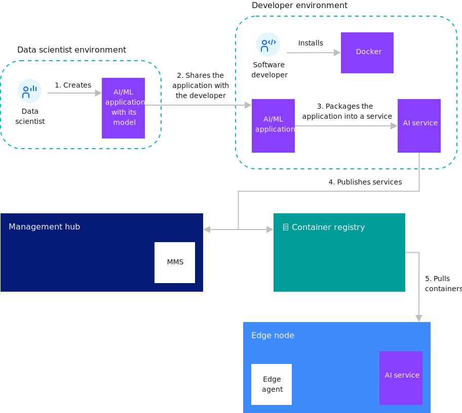
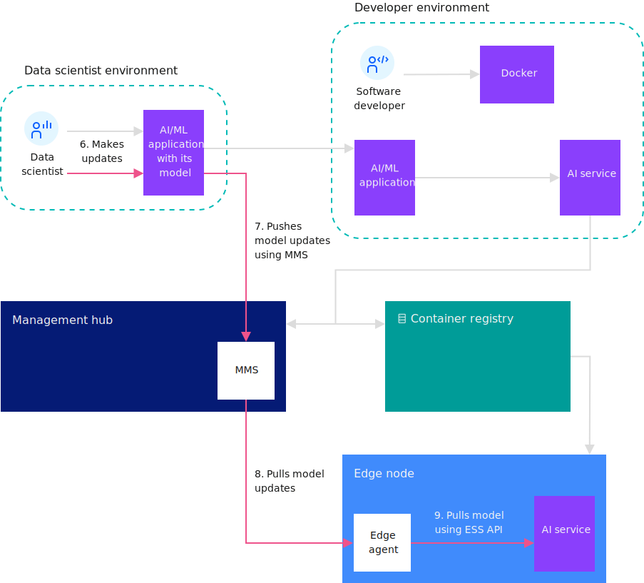

---

copyright:
years: 2021
lastupdated: "2021-02-20"

---

{:shortdesc: .shortdesc}
{:new_window: target="_blank"}
{:codeblock: .codeblock}
{:pre: .pre}
{:screen: .screen}
{:tip: .tip}
{:download: .download}

# Model management details
{: #model_management_details}

The model management system (MMS) eases the burden of Artificial Intelligence (AI) model management for cognitive services that run on edge nodes. The MMS can also be used to deliver other data file types to edge nodes. The MMS facilitates the storage, delivery, and security of models, data, and other metadata packages needed by edge services. This enables edge nodes to easily send and receive models and metadata to and from the cloud.

The MMS runs in the {{site.data.keyword.edge_notm}} ({{site.data.keyword.ieam}}) hub and on edge nodes. The Cloud Sync Service(CSS), delivers models, metadata, or data to specific nodes or groups of nodes within an organization. After the objects are delivered to the edge nodes, an API is available that enables the edge service to obtain the models or data from the Edge Sync Service (ESS).

Objects are populated in the MMS by service developers, devops administrators, and model authors. The MMS components facilitate integration between AI model tools and the cognitive services running on the edge. As authors complete models, the models are published to the MMS, which makes them immediately available to edge nodes. By default, integrity of the model is ensured by hashing and signing the model, and then uploading the signature and verification key before publishing the model. The MMS uses the signature and key to verify that the uploaded model has not been tampered with. This same procedure is also used when the MMS deploys the model to edge nodes.

{{site.data.keyword.ieam}} also provides a CLI (**hzn mms**) that enables manipulation of the model objects and their metadata.

The following diagrams show the work flow associated with developing and updating AI models using MMS.

### Developing and using an AI model with MMS

 

### Updating an AI model with MMS

 

## MMS concepts

Several components make up the MMS: CSS, ESS, and objects.

The CSS and ESS provide APIs that developers and administrators use to interact with the MMS. Objects are the machine learning models and other types of data files that are deployed to edge nodes.

### CSS

The CSS is deployed in the {{site.data.keyword.ieam}} management hub when {{site.data.keyword.ieam}} is installed. The CSS uses the  mongoDB database to store objects and maintain the status of each edge node.

### ESS

The ESS is embedded in the {{site.data.keyword.ieam}} agent that runs on the edge node. The ESS continually polls the CSS for object updates and stores any objects that are delivered to the node in a local database on the edge node. ESS APIs can be used by services that are deployed on the edge node to access the metadata and data or model objects.

### Objects (metadata and data)

Metadata describes your data models. An object is published to the MMS with metadata and data, or with metadata only. In the metadata, the fields **objectType** and **objectID** define the identity of the object within a given organization. These destination-related fields determine which edge nodes to send the object to:

* **destinationOrgID**
* **destinationType**
* **destinationID**
* **destinationList**
* **destinationPolicy**

Other object information including description, version, and others can be specified in the metadata. The version value has no semantic meaning to the sync service; therefore, only one copy of the object exists in the CSS.

A data file is the file that contains the ML-specific model definition that is used by a cognitive service. AI model files, configuration files, and binary data are examples of data files.

### AI model

The AI (Artificial Intelligence) model is not an MMS specific concept, but it is a major use case of the MMS. AI models are mathematical representations of a real-world process that relates to AI. Cognitive services that mimic the cognitive functions of humans use and consume the AI model. To generate an AI model, apply AI algorithms on training data. In summary, the AI model is distributed by the MMS and used by a cognitive service running on an edge node.

## MMS concepts in {{site.data.keyword.ieam}}

Specific relationships exist between the MMS concepts and other concepts in {{site.data.keyword.ieam}}.

{{site.data.keyword.ieam}}can register a node with a pattern or with a policy. When you are creating the metadata for an object, set the **destinationType** field in the object metadata to the pattern name of nodes that should receive this object. All {{site.data.keyword.ieam}} nodes by using the same pattern can be thought of as being in the same group. Therefore, this mapping makes it possible to target objects to all nodes of a given type. The **destinationID** field is the same as the {{site.data.keyword.ieam}} edge node node ID. If you do not set the **destinationID** metadata field, the object is broadcast to all nodes with the pattern (**destinationType**).

When you create metadata for objects that should be delivered to nodes registered with a policy, leave **destinationType** and **destinationID** blank, and instead set the **destinationPolicy** field. It holds the destination information (policy property, constraint, and service) that defines which nodes receive the object. Set the **services** fields to indicate which service processes the object. The **properties** and **constraints** fields are optional and are used to further narrow which nodes should receive the object.

An edge node can have several services running on it, which could have been developed by different entities. The {{site.data.keyword.ieam}} agent authentication and authorization layer controls which services can access a given object. Objects deployed through policy are only visible to the services referred to in **destinationPolicy**. However, objects deployed to nodes running a pattern do not have this level of isolation available to them. On a node that uses a pattern, all the objects that are delivered to that node are visible to all services on the node.

## MMS CLI commands

This section describes an MMS example and describes how to use some MMS commands.

For example, a user operates three cameras where a machine learning service (**weaponDetector**) is deployed to identify people who are carrying weapons. This model is already trained, and the service is running on the cameras (which act as nodes).

### Check the MMS status

Before publishing the model, issue the **hzn mms status** command to check the MMS status. Check **heathStatus** under **general** and **dbStatus** under **dbHealth**. The values of these fields should be green, which indicate that CSS and the database are running.

```
$ hzn mms status
{
  "general": {
    "nodeType": "CSS",
    "healthStatus": "green",
    "upTime": 21896
  },
  "dbHealth": {
    "dbStatus": "green",
    "disconnectedFromDB": false,
    "dbReadFailures": 0,
    "dbWriteFailures": 0
  }
}
```
{: codeblock}

### Create the MMS Object

In the MMS, the data model file is not published independently. The MMS requires a metadata file along with the data model file for publishing and distribution. The metadata file configures a set of attributes for the data model. The MMS stores, distributes, and retrieves the model objects based on the attributes that are defined in metadata.

The metadata file is a json file.

1. View a template of metadata file:

   ```
   hzn mms object new
   ```
   {: codeblock}
2. Copy the template to a file named **my_metadata.json**:

   ```
   hzn mms object new >> my_metadata.json
   ```
   {: codeblock}

   Alternatively, you can copy the template from the terminal and paste it into a file.

It is important to understand the meaning of the metadata fields and how they relate to the metadata example.

|Field|Description|Notes|
|-----|-----------|-----|
|**objectID**|The object ID.|A required unique identifier of the object within your organization.|
|**objectType**|The object type.|A required field that is defined by the user; there are no built-in object types.|
|**destinationOrgID**|The destination organization.|A required field used to distribute the object to nodes within the same organization.|
|**destinationType**|The destination type.|The pattern used by nodes that should receive this object.|
|**destinationID**|The destination ID.|An optional field set to the single node ID (without org prefix) where the object should be placed. If omitted, the object is sent to all nodes with the destinationType.|
|**destinationsList**|The destination list.|An optional field set to an array of pattern:nodeId  pairs that should receive this object. This is an alternative to setting **destinationType** and **destinationID**.|
|**destinationPolicy**|The destination policy.|Use when distributing the object to nodes registered with policy. Do not set **destinationType**, **destinationID**, or **destinationsList** in this case.|
|**expiration**|An optional field.|Indicates when the object will expire and be removed from the MMS.|
|**activationTime**|An optional field.|The date when this object should automatically be activated. It is not delivered to any nodes until after the activation time.|
|**version**|An optional field.|Arbitrary string value. The value is not semantically interpreted. The Model Management System does not keep multiple version of an object.| 
|**description**|An optional field.|An arbitrary description.|

Notes:

1. If using **destinationPolicy**, remove the **destinationType**, **destinationID**, and **destinationsList** fields from the metadata. The **properties**, **constraints**, and **services** inside **destinationPolicy** will determine the destinations to receive this object.
2. **version** and **description** can be given as strings within metadata. The value of version is not semantically interpreted. The MMS does not keep multiple versions of an object.
3. **expiration** and **activationTime** should be provided in RFC3339 format.

Fill out the fields in **my_metadata.json** using one of these two options:

1. Send the MMS object to the edge nodes running with policy.

   In this example, camera edge nodes node1, node2, and node3 are registered with policy. **weaponDetector** is one of the services running on the nodes, and you want your model file to be used by the **weaponDetector** service running on the camera edge nodes. Because the target nodes are registered with policy, only use **destinationOrgID** and **destinationPolicy**. Set the **ObjectType** field to **model**, but it could be set to any string that is meaningful to the service that retrieves the object.

   In this scenario, the metadata file can be:

   ```json
   {
     "objectID": "my_model",
     "objectType": "model",
     "destinationOrgID": "$HZN_ORG_ID",
     "destinationPolicy": {
       "properties": [],
       "constraints": [],
       "services": [
         {
           "orgID": "$SERVICE_ORG_ID",
           "arch": "$ARCH",
           "serviceName": "weaponDetector",
           "version": "$VERSION"
         }
       ]
     },
     "version": "1.0.0",
     "description": "weaponDetector model"
   }
   ```
   {: codeblock}

2. Send the MMS object to the edge nodes running with pattern.

   In this scenario, the same nodes are used, but now they are registered with pattern **pattern.weapon-detector**, which has **weaponDetector** as one of the services.

   To send the model to the nodes with a pattern, change the metadata file:

   1. Specify the node pattern in the **destinationType** field.
   2. Remove the **destinationPolicy** field.

   The metadata file is similar to:

   ```
   {
     "objectID": "my_model",
     "objectType": "model",
     "destinationOrgID": "$HZN_ORG_ID",
     "destinationType": "pattern.weapon-detector",
     "version": "1.0.0",
     "description": "weaponDetector model"
   }
   ```
   {: codeblock}

Now, the model file and metadata file are ready to publish.

### Publish the MMS object

Publish the object with both the metadata and data file:

```
hzn mms object publish -m my_metadata.json -f my_model
```
{: codeblock}

### List the MMS object

List the MMS object with this **objectID** and **objectType** within the given organization:

```
hzn mms object list --objectType=model --objectId=my_model
```
{: codeblock}

This is the result of the command will be similar to:

```
Listing objects in org userdev:
[
  {
    "objectID": "my_model",
    "objectType": "model"
  }
]
```

To show all of the MMS object metadata, add **-l** to the command:

```
hzn mms object list --objectType=model --objectId=my_model -l
```
{: codeblock}

To show object status and destinations along with the object, add **-d** to the command. The following destination result indicates that the object is delivered to the cameras: node1, node2, and node3. 

```
hzn mms object list --objectType=model --objectId=my_model -d
```
{: codeblock}

The output of the previous command looks like:

```
[
  {
    "objectID": "my_model",
    "objectType": "model",
    "destinations": [
      {
        "destinationType": "pattern.mask-detector",
        "destinationID": "node1",
        "status": "delivered",
        "message": ""
      },
      {
        "destinationType": "pattern.mask-detector",
        "destinationID": "node2",
        "status": "delivered",
        "message": ""
      },
      {
        "destinationType": "pattern.mask-detector",
        "destinationID": "node3",
        "status": "delivered",
        "message": ""
      },
    ],
    "objectStatus": "ready"
  }
]
```

More advanced filtering options are available to narrow the MMS object list. To see a full list of flags:

```
hzn mms object list --help
```
{: codeblock}

### Delete the MMS object

Delete the MMS object:

```
hzn mms object delete --type=model --id=my_model
```
{: codeblock}

The object is removed from the MMS.

### Update the MMS object

Models can change over time. To publish an updated model, use **hzn mms object publish** with the same metadata file (version value **upgrade** is suggested). With the MMS, there is no need to update models one by one for all three cameras. Use this to update the **my_model** object on all three nodes.

```
hzn mms object publish -m my_metadata.json -f my_updated_model
```
{: codeblock}

## Appendix

Note: See [Conventions used in this document](../getting_started/document_conventions.md) for more information about command syntax.

The following is an example of the output of the **hzn mms object new** command used to generate a template of the MMS object metadata:

```
{
  "objectID": "",            /* Required: A unique identifier of the object. */
  "objectType": "",          /* Required: The type of the object. */
  "destinationOrgID": "$HZN_ORG_ID", /* Required: The organization ID of the object (an object belongs to exactly one organization). */
  "destinationID": "",       /* The node id (without org prefix) where the object should be placed. */
                             /* If omitted the object is sent to all nodes with the same destinationType. */
                             /* Delete this field when you are using destinationPolicy. */
  "destinationType": "",     /* The pattern in use by nodes that should receive this object. */
                             /* If omitted (and if destinationsList is omitted too) the object is broadcast to all known nodes. */
                             /* Delete this field when you are using policy. */
  "destinationsList": null,  /* The list of destinations as an array of pattern:nodeId pairs that should receive this object. */
                             /* If provided, destinationType and destinationID must be omitted. */
                             /* Delete this field when you are using policy. */
  "destinationPolicy": {     /* The policy specification that should be used to distribute this object. */
                             /* Delete these fields if the target node is using a pattern. */
    "properties": [          /* A list of policy properties that describe the object. */
      {
        "name": "",
        "value": null,
        "type": ""           /* Valid types are string, bool, int, float, list of string (comma separated), version. */
                             /* Type can be omitted if the type is discernable from the value, e.g. unquoted true is boolean. */
      }
    ],
    "constraints": [         /* A list of constraint expressions of the form <property name> <operator> <property value>, separated by boolean operators AND (&&) or OR (||). */
      ""
    ],
    "services": [            /* The service(s) that will use this object. */
      {
        "orgID": "",         /* The org of the service. */
        "serviceName": "",   /* The name of the service. */
        "arch": "",          /* Set to '*' to indcate services of any hardware architecture. */
        "version": ""        /* A version range. */
      }
    ]
  },
  "expiration": "",          /* A timestamp/date indicating when the object expires (it is automatically deleted). The time stamp should be provided in RFC3339 format.  */
  "version": "",             /* Arbitrary string value. The value is not semantically interpreted. The Model Management System does not keep multiple version of an object. */
  "description": "",         /* An arbitrary description. */
  "activationTime": ""       /* A timestamp/date as to when this object should automatically be activated. The timestamp should be provided in RFC3339 format. */
}
```
{: codeblock}

## Example
{: #mms}

This example helps you learn how to develop an {{site.data.keyword.edge_service}} that uses the model management system (MMS). You can use this system to deploy and update the learning machine models that are used by edge services that run on your edge nodes.
{:shortdesc}

For an example that uses MMS, see [Horizon Hello Model Management Service (MMS) Example Edge Service ](https://github.com/open-horizon/examples/tree/master/edge/services/helloMMS).

## Before you begin
{: #mms_begin}

Complete the prerequisite steps in [Preparing to create an edge service](service_containers.md). As a result, these environment variables should be set, these commands should be installed, and these files should exist:

```bash
echo "HZN_ORG_ID=$HZN_ORG_ID, HZN_EXCHANGE_USER_AUTH=$HZN_EXCHANGE_USER_AUTH, DOCKER_HUB_ID=$DOCKER_HUB_ID"
which git jq make
ls ~/.hzn/keys/service.private.key ~/.hzn/keys/service.public.pem
cat /etc/default/horizon
```

## Procedure
{: #mms_procedure}

This example is part of the [{{site.data.keyword.horizon_open}} ](https://github.com/open-horizon/) open source project. Follow the steps in [Creating Your Own Hello MMS Edge Service ](https://github.com/open-horizon/examples/blob/master/edge/services/helloMMS/CreateService.md)) and then return here.

## What to do next
{: #mms_what_next}

* Try the other edge service examples at [Developing an edge service for devices](developing.md).

## Further reading

* [Hello world using model management](model_management_system.md)
