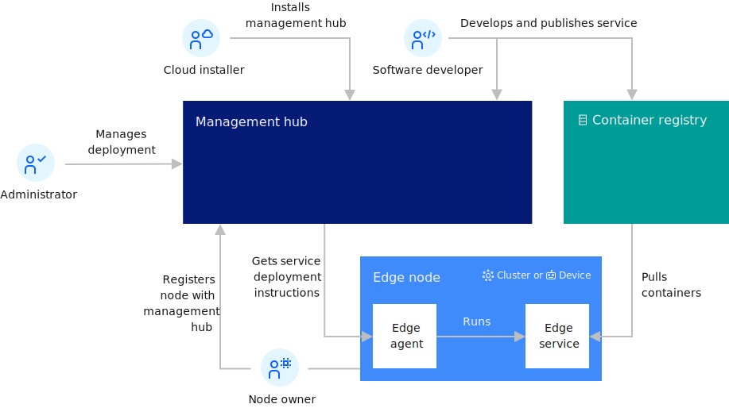

---

copyright:
years: 2021
lastupdated: "2021-02-20"

---

{:new_window: target="blank"}
{:shortdesc: .shortdesc}
{:screen: .screen}
{:codeblock: .codeblock}
{:pre: .pre}
{:child: .link .ulchildlink}
{:childlinks: .ullinks}

# Overview of {{site.data.keyword.edge_notm}}
{: #overviewofedge}

This section provides an overview of {{site.data.keyword.edge_notm}} ({{site.data.keyword.edge_abbr}}).

## {{site.data.keyword.ieam}} capabilities
{: #capabilities}

{{site.data.keyword.ieam}} provides you with edge computing features to help you manage and deploy workloads from a management hub cluster to edge devices and remote instances of OpenShift Container Platform or other Kubernetes-based clusters.

## Architecture

The goal of edge computing is to harness the disciplines that have been created for hybrid cloud computing to support remote operations of edge computing facilities. {{site.data.keyword.ieam}} is designed for that purpose.

The deployment of {{site.data.keyword.ieam}} includes the management hub that runs in an instance of OpenShift Container Platform installed in your data center. The management hub is where the management of all of your remote edge nodes (edge devices and edge clusters) occurs.

These edge nodes can be installed in remote on-premises locations to make your application workloads local to where your critical business operations physically occur, such as at your factories, warehouses, retail outlets, distribution centers, and more.

The following diagram depicts the high-level topology for a typical edge computing setup:

flowchart TD
    cr -- Pulls containers --> es
    mh -- Gets service deployment instructions --> ea
    en --> no -- Registers node with management hub --> mh
    sd -- Develops and publishes service --> mh & cr
    ad -- Manages deployment --> mh
    am -- Installs management hub --> mh
    cr[(Container registry)]
    no("#128578; Node owner")
    ad("#128578; Administrator")
    am("#128578; Administrator")
    sd("#128578; Software developer")
    subgraph en["Edge node (cluster or device)"]
        ea(Edge agent) -- runs --> es(Edge service)
    end
    subgraph mh[Management hub]
        a[Agbot]
        e[Exchange]
        m[MMS]
        s[SDO]
    end
    style cr color:#fff,fill:#128C86,stroke:#000
    style en fill:#316CEE,color:#fff
    style mh fill:#060E61,color:#fff

The {{site.data.keyword.ieam}} management hub is designed specifically for edge node management to minimize deployment risks and to manage the service software lifecycle on edge nodes fully autonomously. A Cloud installer installs and manages the {{site.data.keyword.ieam}} management hub components. Software developers develop and publish edge services to the management hub. Administrators define the deployment policies that control where edge services are deployed. {{site.data.keyword.ieam}} handles everything else.

# Components
{: #components}

{{site.data.keyword.edge_notm}} ({{site.data.keyword.ieam}}) includes several components that are bundled with the product. The following table provides a description of the {{site.data.keyword.ieam}} components:

|Component|Version|Description|
|---------|-------|----|
|**{{site.data.keyword.ieam}} management hub**|4.2.0|The {{site.data.keyword.ieam}} management hub manages the edge nodes and the edge service software lifecycle on each edge node.|
|Agbot|2.27.0|Agreement bot (agbot) instances are created centrally and are responsible for deploying workloads and machine learning models to {{site.data.keyword.ieam}} edge nodes.|
|Exchange|2.54.0|The Exchange provides a REST API to all of the {{site.data.keyword.ieam}} resources (patterns, policies, services, nodes, and so on) used by all the other components in {{site.data.keyword.ieam}}.|
|MMS|1.4.1|The Model Management System (MMS) facilitates the storage, delivery, and security of models and files needed by edge services. This enables edge nodes to easily send and receive models and files to and from the management hub.|
|SDO|1.8.6|The Secure Device Onboarding (SDO) service enables SDO-enabled edge devices to be configured with zero touch.|
|**Edge node**| |Any edge device, edge cluster, or edge gateway where edge computing takes place.|
|Edge cluster agent|2.27.0|The agent that is installed on edge clusters to enable node workload management by {{site.data.keyword.ieam}}.|
|Edge device agent|2.27.0|The agent that is installed on edge devices to enable node workload management by {{site.data.keyword.ieam}}.|
|ESS|1.4.1|The edge node part of MMS that makes AI models and files available to the edge services.|
|Example edge services|2.27.0|Edge service examples that are useful when exploring {{site.data.keyword.ieam}} and learning how to write your own services.|

## What's next

For more information about using {{site.data.keyword.ieam}} and developing edge services, review the topics that are listed in {{site.data.keyword.edge_notm}} ({{site.data.keyword.ieam}}) [Welcome page](../)
