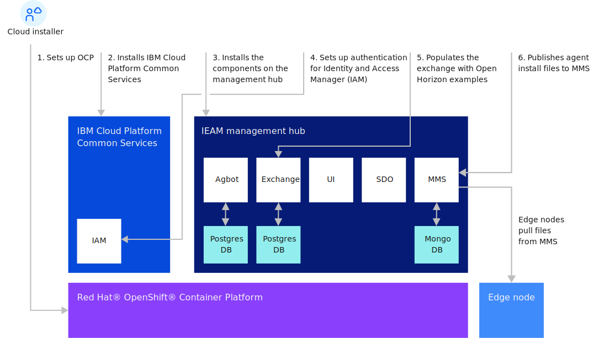

---

copyright:
years: 2021
lastupdated: "2021-02-20"

---

{:new_window: target="blank"}
{:shortdesc: .shortdesc}
{:screen: .screen}
{:codeblock: .codeblock}
{:pre: .pre}
{:child: .link .ulchildlink}
{:childlinks: .ullinks}

# Installing the management hub
{: #management_hub}

## Management hub installation overview
Complete the management hub installation and configuration before starting the {{site.data.keyword.edge_notm}} ({{site.data.keyword.ieam}}) node tasks.

* [Sizing and system requirements](cluster_sizing.md)
* [Configuration](configuration.md)
* [Installation](installation.md)
  * [Install {{site.data.keyword.ieam}}](online_installation.md)
  * [Post-installation](post_install.md)
  * [Gather edge node files](gather_files.md)
* [Uninstall](uninstalling_hub.md)

## Management hub installation flow

## Related information

* [Installing edge nodes](../installing/installing_edge_nodes.md)
