---

copyright:
years: 2021
lastupdated: "2021-02-20"

---

{:new_window: target="blank"}
{:shortdesc: .shortdesc}
{:screen: .screen}
{:codeblock: .codeblock}
{:pre: .pre}
{:child: .link .ulchildlink}
{:childlinks: .ullinks}

# Install {{site.data.keyword.ieam}}
{: #hub_install_overview}

You must install and configure a management hub before you start the {{site.data.keyword.edge_notm}} ({{site.data.keyword.ieam}}) node tasks.

## Installation summary
{: #sum}

* This content describes the steps to deploy the following components.
  * [IBM Cloud Platform Common Services](https://www.ibm.com/support/knowledgecenter/SSHKN6/kc_welcome_cs.html).
  * {{site.data.keyword.edge_notm}} Management Hub operator.
  * {{site.data.keyword.edge_notm}} exchange API.
  * {{site.data.keyword.edge_notm}} agbot.
  * {{site.data.keyword.edge_notm}} Cloud Sync Service (CSS).
  * {{site.data.keyword.edge_notm}} user interface.
  * {{site.data.keyword.edge_notm}} Secure Device Onboarding (SDO).

**Note:** Upgrade from {{site.data.keyword.edge_notm}} 4.1 is not supported.

## Prerequisites
{: #prereq}

### {{site.data.keyword.ocp_tm}}
Ensure that you have an [appropriately sized](cluster_sizing.md) and supported {{site.data.keyword.open_shift_cp}} installation, including appropriate storage services installed and working in your cluster. For more information about installing {{site.data.keyword.open_shift_cp}}, see the {{site.data.keyword.open_shift}} documentation for the supported versions:

* [{{site.data.keyword.open_shift_cp}} 4.4 Documentation ](https://www.ibm.com/links?url=https%3A%2F%2Fdocs.openshift.com%2Fcontainer-platform%2F4.4%2Fwelcome%2Findex.html)
* [{{site.data.keyword.open_shift_cp}} 4.5 Documentation ](https://www.ibm.com/links?url=https%3A%2F%2Fdocs.openshift.com%2Fcontainer-platform%2F4.5%2Fwelcome%2Findex.html)

**Note:** By default, local development databases are provisioned as part of operator deployment. For more information about connecting to your own provisioned databases and other configuration options, see the [Configuration](configuration.md) page.

You are responsible for backing up or restoring your databases, see the [backup and recovery](../admin/backup_recovery.md) page.

## Browser installation process
{: #process}

1. Log in through the {{site.data.keyword.open_shift_cp}} web UI with cluster admin privileges. Navigate to the **Storage** page to confirm you have a supported **Default** storage class defined:

   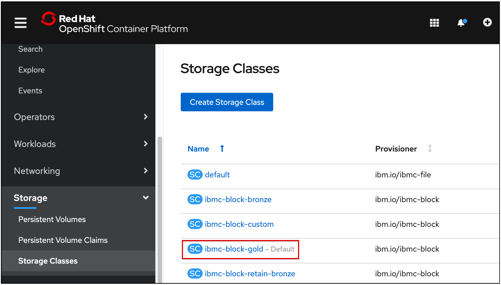

   **Note:** For more information about using a non-default storage class, see the [Configuration](configuration.md) page.

2. Create the IBM Operator Catalog Source, which provides the capability to install the **IEAM Management Hub** bundle. Copy and paste this text after you select the import plus sign as shown in the following image. After you paste the text, click **Create**:

   ```
   apiVersion: operators.coreos.com/v1alpha1
   kind: CatalogSource
   metadata:
     name: ibm-operator-catalog
     namespace: openshift-marketplace
   spec:
     displayName: IBM Operator Catalog
     publisher: IBM
     sourceType: grpc
     image: docker.io/ibmcom/ibm-operator-catalog:latest
     updateStrategy:
       registryPoll:
         interval: 45m
   ```
   {: codeblock}

   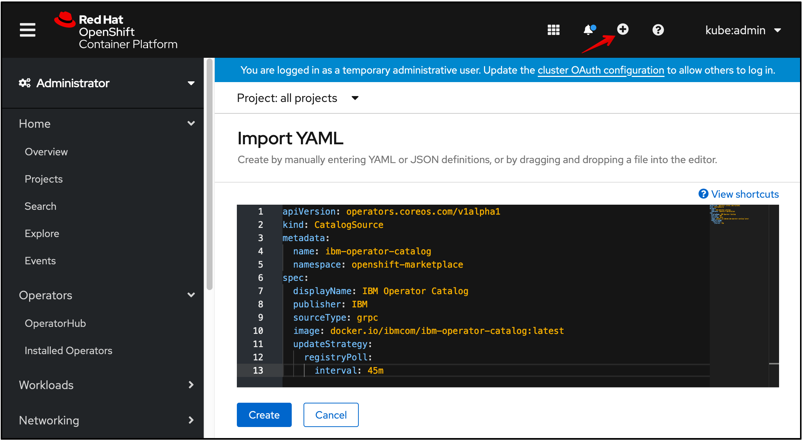

3. Create the IBM Common Services Operator Catalog Source. This provides the suite of Common Service operators which **IEAM Management Hub** will additionally install. Copy and paste this text after you select the import plus sign as shown in the following image. After you paste the text, click **Create**:
   ```
   apiVersion: operators.coreos.com/v1alpha1
   kind: CatalogSource
   metadata:
     name: opencloud-operators
     namespace: openshift-marketplace
   spec:
     displayName: IBMCS Operators
     publisher: IBM
     sourceType: grpc
     image: quay.io/opencloudio/ibm-common-service-catalog:latest
     updateStrategy:
       registryPoll:
         interval: 45m
   ```
   {: codeblock}

   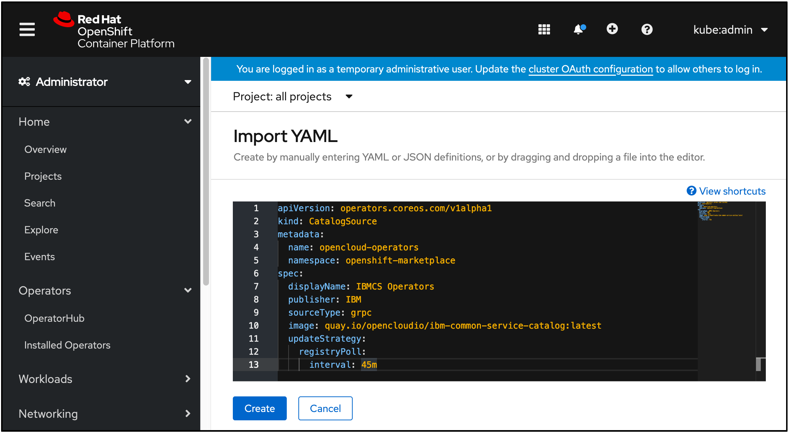

4. Navigate to the **Projects** page and create a project where you want to install the operator:

   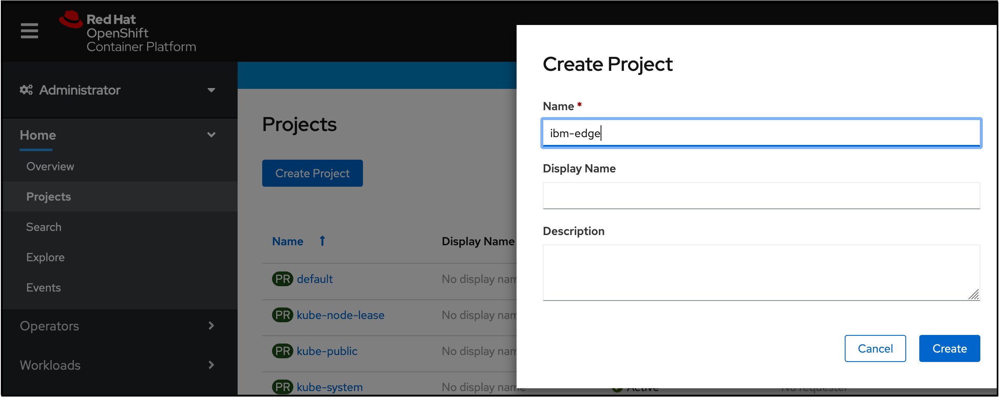

5. Define an image pull secret called **ibm-entitlement-key** to authenticate to the IBM Entitled Registry:

   **Notes:**
   * Obtain your entitlement key through [My IBM Key](https://myibm.ibm.com/products-services/containerlibrary) and fill in the fields as shown in the following content.
   * Ensure that this resource is created in the same project that was created in the previous step.

   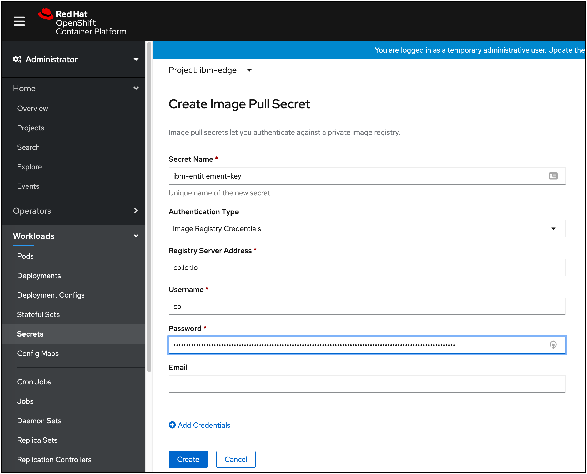

6. Navigate to the **OperatorHub** page. Search for and click on the **IEAM Management Hub** card. Ensure the project matches what was created in Step 4, and click **Install**:

   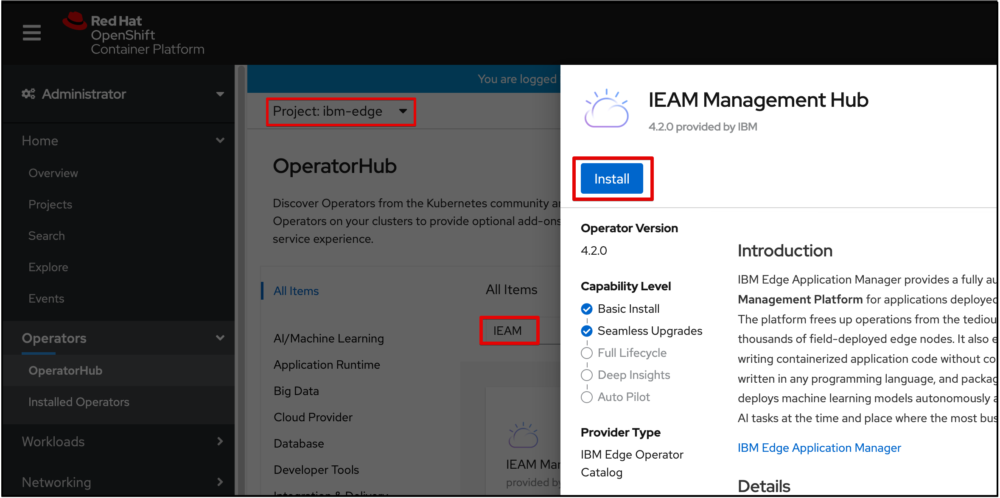

7. Install the operator, ensuring the project matches what was created in Step 4 (this is the only project the **IEAM Management Hub** operator watches after it is installed):

   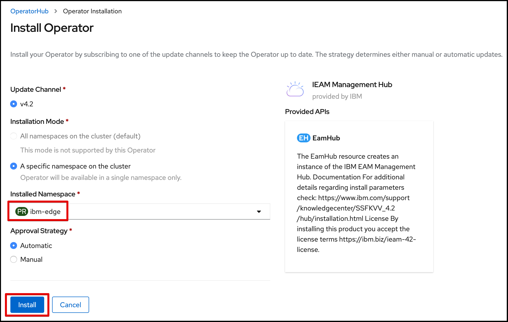

   **Note:** On {{site.data.keyword.open_shift_cp}} 4.4, you might see **Subscribe** instead of **Install**. This creates a subscription that automatically applies security and bug fix updates as they become available.

8. Wait for the following two operators to appear:

   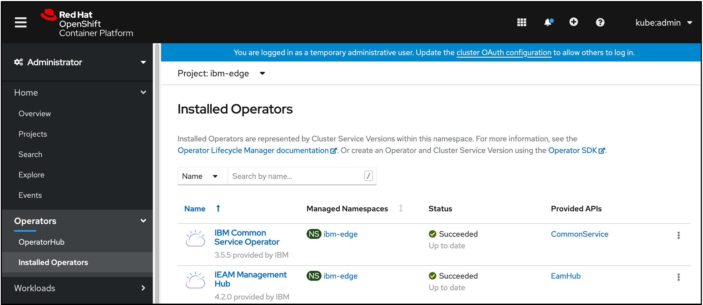
   
   **Note:** You might need to refresh the page and you may see different versions than shown.

9. Change the **Project** to **ibm-common-services** and click the **CommonService** link under the **Provided APIs** column. Click the **common-service** link under the **Name** column and click the **YAML** tab to edit the **common-service** custom resource, replacing the **spec** field with the following and click **Save**:
   ```
   spec:
     size: medium
     services:
     - name: ibm-management-ingress-operator
       spec:
         managementIngress:
           replicas: 3
     - name: ibm-mongodb-operator
       spec:
         mongoDB:
           resources:
             requests:
               cpu: 500m
               memory: 2000Mi
     - name: ibm-monitoring-prometheusext-operator
       spec:
         prometheusExt:
           prometheusConfig:
             resource:
               requests:
                 cpu: 160m
                 memory: 2500Mi
   ```
   {: codeblock}

   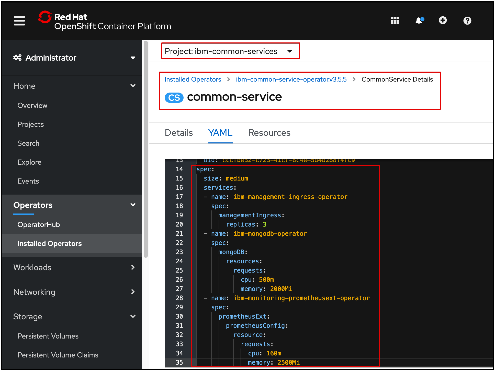

   **Note:** If the **spec:** field contains more than a single entry for **size**, it has been configured already. Contact your administrator before replacing the existing configuration.
10. Change back to the **Project** created in Step 4, click **EamHub** in the **Provided APIs** column that is shown in Step 7, and click **Create EamHub**:

   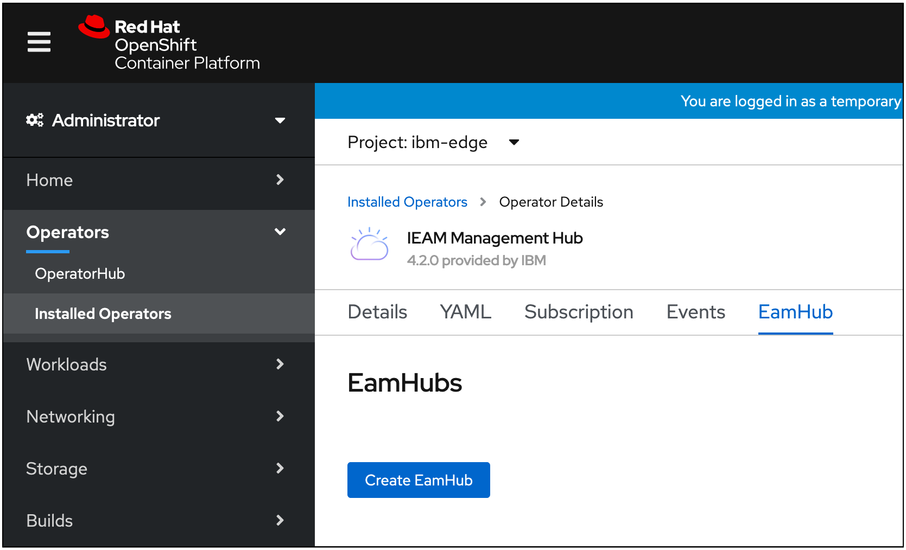

11. Create the **EamHub** Custom Resource. The **EamHub** Custom Resource defines and configures your management hub. See the [Configuration](configuration.md) page for customization options. Ensure the project matches what was created in Step 4.

   * {{site.data.keyword.open_shift_cp}} 4.4: Accept the license by changing **spec.license.accept** from **false** to **true**, and click **Create**.

   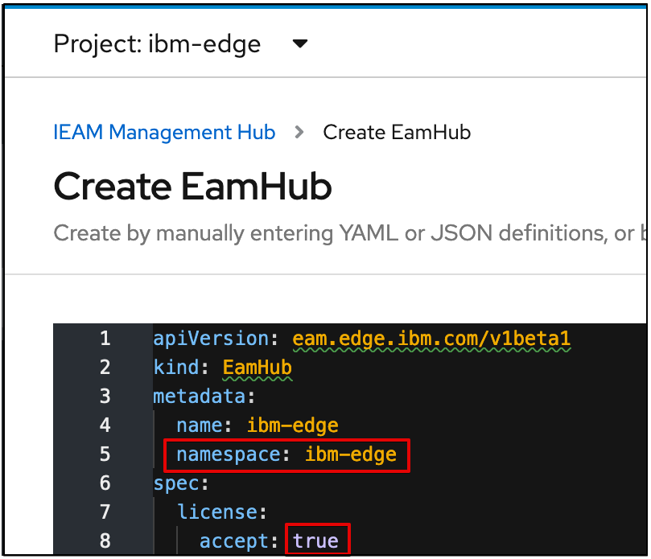

   * {{site.data.keyword.open_shift_cp}} 4.5: Click **Accept License** toggle, and click **Create** to accept the license.

   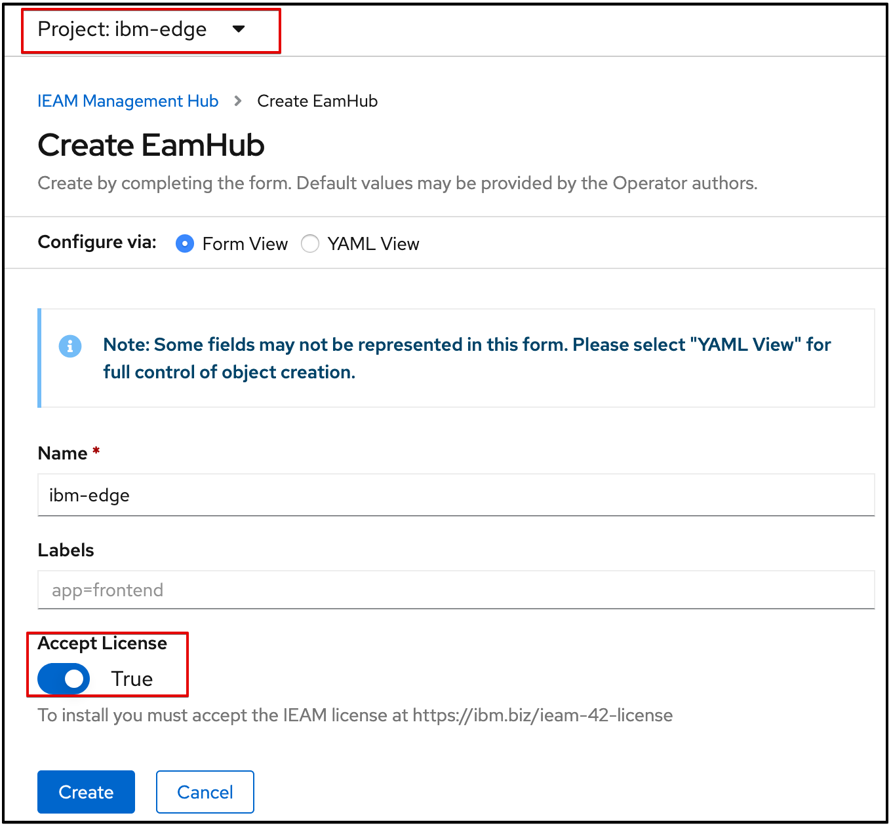

The operator will deploy the defined workloads in the project that was specified in Step 4 and the required {{site.data.keyword.common_services}} workloads in the **ibm-common-services** project.

## What's Next

Continue setting up your new management hub by performing the steps in [post installation](post_install.md).
