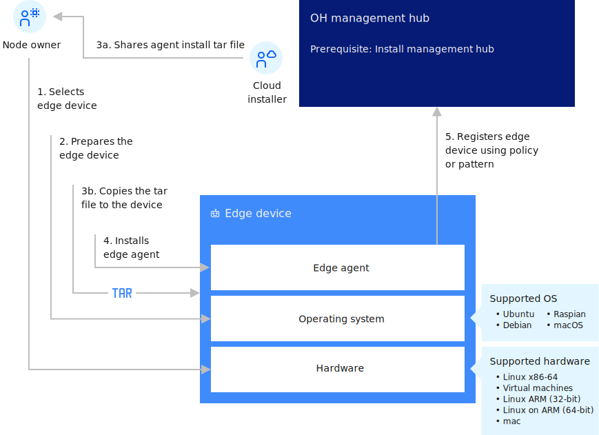

---

copyright:
years: 2021
lastupdated: "2021-02-20"

---

{:new_window: target="blank"}
{:shortdesc: .shortdesc}
{:screen: .screen}
{:codeblock: .codeblock}
{:pre: .pre}
{:child: .link .ulchildlink}
{:childlinks: .ullinks}

# Edge devices
{: #edge_devices}

An edge device provides an entry point into enterprise or service provider core networks. Examples include smartphones, security cameras, or even an internet-connected microwave oven.

{{site.data.keyword.edge_notm}} ({{site.data.keyword.ieam}}) is available for management hub or servers, including distributed devices. See the following sections for details about how to install the {{site.data.keyword.ieam}} lightweight agent on edge devices:

* [Preparing an edge device](../installing/adding_devices.md)
* [Installing the agent](../installing/registration.md)
* [Updating the agent](../installing/updating_the_agent.md)

All edge devices (edge nodes) require the {{site.data.keyword.horizon_agent}} software to be installed. The {{site.data.keyword.horizon_agent}} also depends upon [Docker ](https://www.docker.com/) software. 

Focusing in on the edge device, the following diagram shows the flow of the steps you perform to set up the edge device, and what the agent does after it is started.

