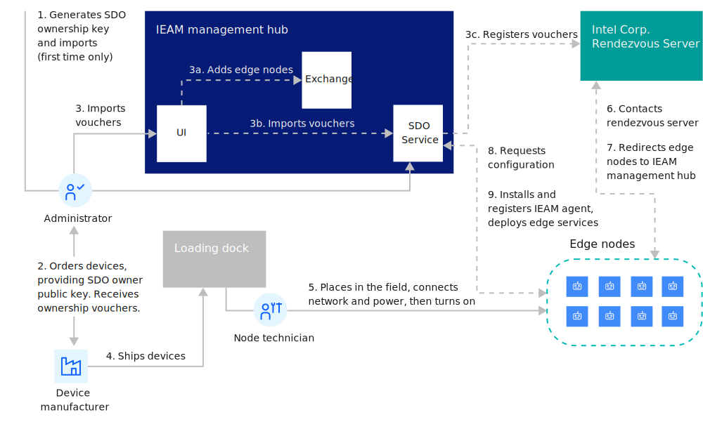

---
copyright:
years: 2020 - 2022
lastupdated: "2022-07-07"
title: "SDO agent install"

parent: Edge devices info
grand_parent: Edge devices
nav_order: 7
---

{:new_window: target="blank"}
{:shortdesc: .shortdesc}
{:screen: .screen}
{:codeblock: .codeblock}
{:pre: .pre}
{:child: .link .ulchildlink}
{:childlinks: .ullinks}

# SDO agent installation and registration
{: #sdo}

[SDO ](https://software.intel.com/en-us/secure-device-onboard){:target="_blank"}{: .externalLink} (Secure Device Onboard), created by Intel, makes it easy and secure to configure edge devices and associate them with an edge management hub. {{site.data.keyword.edge_notm}} ({{site.data.keyword.ieam}}) supports SDO-enabled devices so that the agent will be installed on the devices and registered to the {{site.data.keyword.ieam}} management hub with zero touch (by simply powering on the devices).

## SDO overview
{: #sdo-overview}

SDO consists of these components:

* The SDO module on the edge device (usually installed there by the device manufacturer)
* An ownership voucher (a file that is given to the device purchaser along with the physical device)
* The SDO rendezvous server (the well-known server that an SDO-enabled device first contacts when it starts the first time)
* SDO owner services (services run on the {{site.data.keyword.ieam}} management hub that configure the device to use this specific instance of {{site.data.keyword.ieam}})

**Note**: SDO only supports edge devices, not edge clusters.

### SDO flow



## Before you begin
{: #before_begin}

SDO requires that the agent files are stored in the {{site.data.keyword.ieam}} Cloud Sync Service (CSS). If this has not been done, ask your administrator to run one of the following commands as described in [Gather edge node files](../hub/gather_files.md):

  `edgeNodeFiles.sh ALL -c ...`

## Trying SDO
{: #trying-sdo}

Before you purchase SDO-enabled edge devices, you can test SDO support in {{site.data.keyword.ieam}} with a VM that simulates an SDO-enabled device:

1. You need an API key. See [Creating your API key](../hub/prepare_for_edge_nodes.md) for instructions to create an API key, if you do not already have one.

2. Contact your {{site.data.keyword.ieam}} administrator to get the values of these environment variables. (You need them in the next step.)

   ```bash
   export HZN_ORG_ID=<exchange-org>
   export HZN_EXCHANGE_USER_AUTH=iamapikey:<api-key>
   export HZN_SDO_SVC_URL=https://<mgmt-hub-ingress>/edge-sdo-ocs/api
   export HZN_MGMT_HUB_CERT_PATH=<path-to-mgmt-hub-self-signed-cert>
   export CURL_CA_BUNDLE=$HZN_MGMT_HUB_CERT_PATH
   ```

3. Follow the steps in the [Open Horizon SDO 1.11](https://github.com/open-horizon/SDO-support/blob/master/README-1.11.md){:target="_blank"}{: .externalLink} to observe SDO automatically install the {{site.data.keyword.ieam}} agent on a device and registers it with your {{site.data.keyword.ieam}} management hub.

## Adding SDO-enabled devices to your {{site.data.keyword.ieam}} domain
{: #using-sdo}

If you have purchased SDO-enabled devices and want to incorporate them into your {{site.data.keyword.ieam}} domain:

1. If you did not create SDO owner key pairs when trying out SDO in the previous section, perform these steps:

   1. You need an API key. See [Prepare for setting up edge nodes](../hub/prepare_for_edge_nodes.md) for instructions to create an API key, if you do not already have one.

   2. Contact your {{site.data.keyword.ieam}} administrator to get the values of these environment variables. (You need them in the next step.)

      ```bash
      export HZN_ORG_ID=<exchange-org>
      export HZN_EXCHANGE_USER_AUTH=iamapikey:<api-key>
      export HZN_SDO_SVC_URL=https://<mgmt-hub-ingress>/edge-sdo-ocs/api
      export HZN_MGMT_HUB_CERT_PATH=<path-to-mgmt-hub-self-signed-cert>
      export CURL_CA_BUNDLE=$HZN_MGMT_HUB_CERT_PATH
      ```

   3. Perform the steps in just this one section: [Generate Owner Key Pairs ](https://github.com/open-horizon/SDO-support/blob/master/README.md#gen-keypair){:target="_blank"}{: .externalLink}.

2. [Log in to the {{site.data.keyword.ieam}} management console](../console/accessing_ui.md).

3. On the **Nodes** tab, click **Add node**.

   Enter the information necessary to create a private ownership key in the SDO service and download the corresponding public key.

4. Fill in the necessary information to import the ownership vouchers you received when you purchased the devices.

5. Connect the devices to the network and power them on.

6. Back in the management console, watch the progress of the devices as they come online by viewing the **Node** overview page and filtering on the installation name.
