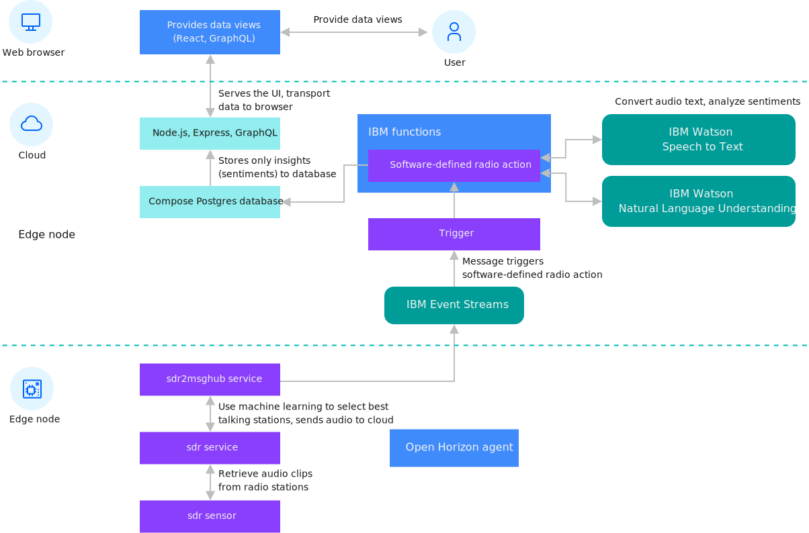

---

copyright:
years: 2021
lastupdated: "2021-02-20"

---

{:new_window: target="blank"}
{:shortdesc: .shortdesc}
{:screen: .screen}
{:codeblock: .codeblock}
{:pre: .pre}
{:child: .link .ulchildlink}
{:childlinks: .ullinks}

# Software-defined radio edge processing
{: #defined_radio_ex}

This example uses software-defined radio (SDR) as an example of edge processing. With SDR, you can send raw data across the full radio spectrum to a cloud server for processing. The edge node processes the data locally and then sends less volume of more valuable data to a cloud processing service for extra processing.
{:shortdesc}

This diagram shows the architecture for this SDR example:



SDR edge processing is a fully featured example that consumes radio station audio, extracts speech, and converts the extracted speech into text. The example completes sentiment analysis on the text and makes the data and results available through a user interface where you can view the details of the data for each edge node. Use this example to learn more about edge processing.

SDR receives radio signals by using the digital circuitry in a computer CPU to handle the work to require a set of specialized analog circuitry. That analog circuitry is usually restricted by the breadth of radio spectrum it can receive. An analog radio receiver built to receive FM radio stations, for example, cannot receive radio signals from anywhere else on the radio spectrum. SDR can access large portions of the spectrum. If you do not have the SDR hardware, that you can use mock data. When you are using mock data, the audio from the internet stream is treated as though it was broadcast over FM and received on your edge node. 

Before performing this task, register and unregister your edge device by performing the steps in [Installing the agent](registration.md).

This code contains these primary components.

|Component|Description|
|---------|-----------|
|[sdr service ](https://github.com/open-horizon/examples/tree/master/edge/services/sdr){:target="_blank"}{: .externalLink}|Lower-level service accesses the hardware on the edge node|
|[ssdr2evtstreams service ](https://github.com/open-horizon/examples/tree/master/edge/evtstreams/sdr2evtstreams){:target="_blank"}{: .externalLink}|Higher-level service receives data from the lower-level sdr service and completes local analysis of the data on the edge node. The sdr2evtstreams service then sends the processed data to the cloud back-end software.|
|[Cloud backend software ](https://github.com/open-horizon/examples/tree/master/cloud/sdr){:target="_blank"}{: .externalLink}|Cloud back-end software receives data from edge nodes for further analysis. The back-end implementation can then present a map of the edge nodes and more within a web-based UI.|
{: caption="Table 1. Software-defined radio to {{site.data.keyword.message_hub_notm}} primary components" caption-side="top"}

## Registering your device

Though this service can be run by using mock data on any edge device, if you are using an edge device like a Raspberry Pi with the SDR hardware, configure a kernel module to support your SDR hardware first. You must manually configure this module. Docker containers can establish a different distribution of Linux in their contexts, but the container cannot install kernel modules. 

Complete these steps to configure this module:

1. As a root user, create a file that is named `/etc/modprobe.d/rtlsdr.conf`.
   ```
   sudo nano /etc/modprobe.d/rtlsdr.conf
   ```
   {: codeblock}

2. Add the following lines to the file:
   ```
   blacklist rtl2830
   blacklist rtl2832
   blacklist dvb_usb_rtl28xxu
   ```
   {: codeblock}

3. Save the file and then restart before you continue:
   ```
   sudo reboot
   ```
   {: codeblock}   

4. Set the following {{site.data.keyword.message_hub_notm}} API key in your environment. This key is created for use with this example and is used for feeding the processed data that is gathered by your edge node to the IBM software-defined radio UI.
   ```
   export EVTSTREAMS_API_KEY=X2e8cSjbDAMk-ztJLaoi3uffy8qsQTnZttUjcHCfm7cp
   export EVTSTREAMS_BROKER_URL=broker-3-y420pyyyvhhmttz0.kafka.svc01.us-south.eventstreams.cloud.ibm.com:9093,broker-5-y420pyyyvhhmttz0.kafka.svc01.us-south.eventstreams.cloud.ibm.com:9093,broker-4-y420pyyyvhhmttz0.kafka.svc01.us-south.eventstreams.cloud.ibm.com:9093,broker-1-y420pyyyvhhmttz0.kafka.svc01.us-south.eventstreams.cloud.ibm.com:9093,broker-0-y420pyyyvhhmttz0.kafka.svc01.us-south.eventstreams.cloud.ibm.com:9093,broker-2-y420pyyyvhhmttz0.kafka.svc01.us-south.eventstreams.cloud.ibm.com:9093
   ```
   {: codeblock}

5. To run the sdr2evtstreams service example on your edge node, you must register your edge node with the IBM/pattern-ibm.sdr2evtstreams deployment pattern. Perform the steps in [Preconditions for Using the SDR To IBM Event Streams Example Edge Service ](https://www.ibm.com/links?url=https%3A%2F%2Fgithub.com%2Fopen-horizon%2Fexamples%2Ftree%2Fmaster%2Fedge%2Fevtstreams%2Fsdr2evtstreams){:target="_blank"}{: .externalLink}. 

6. Check the example web UI to see whether your edge node is sending results. 

## SDR implementation details

### sdr low-level service
{: #sdr}

The lowest level of the software stack for this service includes the `sdr` service implementation. This service accesses local software-defined radio hardware by using the popular `librtlsdr` library and the derived `rtl_fm` and `rtl_power` utilities along with the `rtl_rpcd` daemon. For more information about the `librtlsdr` library, see [librtlsdr ](https://github.com/librtlsdr/librtlsdr){:target="_blank"}{: .externalLink}.

The `sdr` service directly controls the software-defined radio hardware to tune the hardware to a particular frequency to receive transmitted data, or to measure the signal strength across a specified spectrum. A typical workflow for the service can be to tune to a particular frequency to receive data from the station at that frequency. Then, the service can process the collected data.

### sdr2evtstreams high-level service
{: #sdr2evtstreams}

The `sdr2evtstreams` high-level service implementation uses both the `sdr` service REST API and the `gps` service REST API over the local private virtual Docker network. The `sdr2evtstreams` service receives data from the `sdr` service, and completes some local inference on the data to select the best stations for speech. Then, the `sdr2evtstreams` service uses Kafka to publish audio clips to the cloud by using {{site.data.keyword.message_hub_notm}}.

### IBM Functions
{: #ibm_functions}

IBM Functions orchestrate the cloud side of the example software-defined radio application. IBM functions are based on OpenWhisk and enable serverless computing. Serverless computing means that code components can be deployed without any supporting infrastructure, such as an operating system, or programming language system. By using IBM Functions you can concentrate on your own code, and leave the scaling, security, and ongoing maintenance of everything else to IBM to handle for you. No hardware to provision; no VMs, and no containers are required.

Serverless code components are configured to trigger (run) in response to events. In this example, the triggering event is the receipt of messages from your edge nodes in {{site.data.keyword.message_hub_notm}} whenever audio clips are published by edge nodes to {{site.data.keyword.message_hub_notm}}. The example actions are triggered to ingest the data and act on it. They use the IBM Watson Speech-To-Text (STT) service to convert the incoming audio data into text. Then, that text is sent to the IBM Watson Natural Language Understanding (NLU) service to analyze the sentiment that is expressed to each of the nouns it contains. For more information, see [IBM Functions action code ](https://github.com/open-horizon/examples/blob/master/cloud/sdr/data-processing/ibm-functions/actions/msgreceive.js){:target="_blank"}{: .externalLink}.

### IBM database
{: #ibm_database}

The IBM Functions action code concludes by storing the computed sentiment results into IBM databases. The web server and client software then work to present this data to user web browsers from the database.

### Web interface
{: #web_interface}

The web user interface for the software-defined radio application allows users to browse the sentiment data, which is presented from IBM databases. This user interface also renders a map that shows the edge nodes that provided the data. The map is created with data from the IBM-provided `gps` service, which is used by the edge node code for the `sdr2evtstreams` service. The `gps` service can either interface with GPS hardware, or receive information from the device owner about location. In the absence of both, the GPS hardware and the device owner location, the `gps` service can estimate the edge node location by using the edge node IP address to find the geographic location. By using this service, the `sdr2evtstreams` can provide location data to the cloud when the service sends audio clips. For more information, see [software-defined radio application web UI code ](https://github.com/open-horizon/examples/tree/master/cloud/sdr/ui/sdr-app){:target="_blank"}{: .externalLink}.

Optionally, the IBM Functions, IBM databases, and web UI code can be deployed in the IBM Cloud if you wanted to create your own software-defined ration example web UI. You can do this with a single command after you [create a paid account ](https://cloud.ibm.com/login){:target="_blank"}{: .externalLink}. For more information, see [deployment repository content ](https://www.ibm.com/links?url=https%3A%2F%2Fgithub.com%2Fopen-horizon%2Fexamples%2Ftree%2Fmaster%2Fcloud%2Fsdr%2Fdeploy%2Fibm){:target="_blank"}{: .externalLink}. 

Note: This deployment process requires paid services that incur charges on your {{site.data.keyword.cloud_notm}} account.

## What to do next

If you want to deploy your own software to an edge node, you must create your own edge services, and associated deployment pattern or deployment policy. For more information, see [Developing an edge service for devices](../developing/developing.md).
