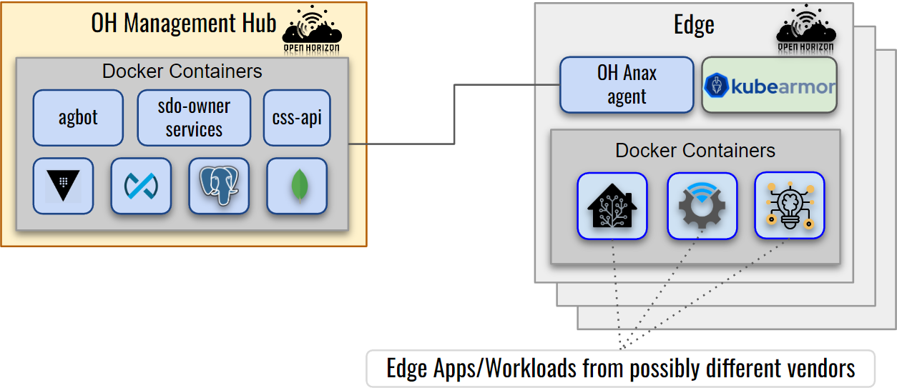
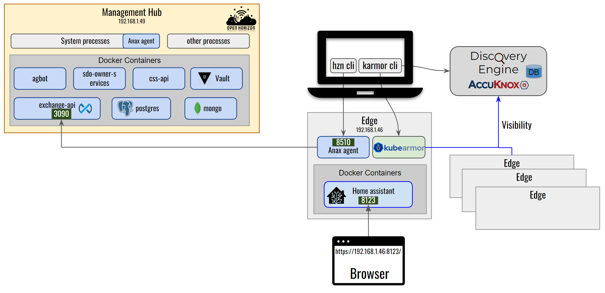

# KubeArmor security for Open Horizon workloads/agent

KubeArmor is a runtime security engine that can protect k8s-orchestrated, or
pure containerized workloads as well as VM/Bare-Metal based workloads. Open
Horizon deploys the edge workloads in either containerized mode or k8s
orchestrated mode. The Open Horizon Edge Agent operates directly on the host as
a systemd process.

<p align="center"></p>

KubeArmor running on the edge node provides visibility and protection for all the processes, files, or network operations in the containers as well as those running directly on the host.  

**Observability:** KubeArmor can provide container-aware observability information about the operations happening:
1) from Agent node to Management Hub (and vice-versa)  
2) between the containers and the agent edge node  
3) inside the containers running on the Agent node

**Enforcement:** KubeArmor can be used to apply security postures at the kernel level (using LSMs like AppArmor, BPF-LSM). It can protect both the host and workloads running on it by enforcing either some predefined security policies or automatically generated least permissive security policies (using Discovery Engine).

KubeArmor already supports k8s-orchestrated workloads and provides[ KVMService](https://github.com/kubearmor/kvm-service) that allows orchestrating security policies to VMs for non-k8s environments.  
With v0.5.5 release, KubeArmor now supports standalone un-orchestrated containers. KubeArmor in this mode supports both enforcement and observability of the host and the containers running on it.

## KubeArmor on Open Horizon

> **Note**
> This guide assumes both the Open Horizon Management Hub and Agent VM are running Ubuntu 20.04.  
We will first need to install Open Horizon Management Hub and Agent node components. For that please follow the [Open Horizon setup](https://github.com/kubearmor/KubeArmor/wiki/Open-Horizon-setup) guide.  
We also assume that [Open Horizon Home Assistant service](https://github.com/open-horizon-services/service-homeassistant) is running on the agent edge node.

<p align="center"></p>

Now we will run KubeArmor as a systemd process on the Open Horizon Agent VM

## Installation KubeArmor, kArmor, and Discovery Engine  

* **KubeArmor Installation:**

1. Download the [latest release](https://github.com/kubearmor/KubeArmor/releases) of KubeArmor  

   ```bash
   wget https://github.com/kubearmor/KubeArmor/releases/download/v0.5.5/kubearmor_0.5.5_linux-amd64.deb
   ```

2. Install KubeArmor 

   ```bash
   sudo apt install ./kubearmor_0.5.5_linux-amd64.deb
   ```

> Note that the above automatically installs `bpfcc-tools` with our package, but your distribution might have an older version of BCC. In case of errors, consider installing `bcc` from [source](https://github.com/iovisor/bcc/blob/master/INSTALL.md#source).

---
<details><summary> Note: For distributions other than Ubuntu/Debian</summary>
<p>

i. Refer [Installing BCC](https://github.com/iovisor/bcc/blob/master/INSTALL.md#installing-bcc) to install pre-requisites.

ii. Download release tarball from KubeArmor [releases](https://github.com/kubearmor/KubeArmor/releases)
    ```bash
    wget https://github.com/kubearmor/KubeArmor/releases/download/v0.5.5/kubearmor_0.5.5_linux-amd64.tar.gz
    ```

iii. Unpack the tarball to the root directory:
     ```bash
     sudo tar --no-overwrite-dir -C / -xzf kubearmor_0.5.5_linux-amd64.tar.gz
     ```
</p>
</details>

---

3. Start KubeArmor

   ```bash
   sudo systemctl daemon-reload
   sudo systemctl start kubearmor
   ```

4. To check KubeArmor running status

   ```bash
   sudo journalctl -u kubearmor -f
   ```


* **kArmor Installation:**

> **Note** kArmor should already be installed by the above KubeArmor installation. Check installation using `karmor version`.  

If kArmor is not installed run:    

```bash
curl -sfL http://get.kubearmor.io/ | sudo sh -s -- -b /usr/local/bin
```

* **Discovery Engine Installation:**

1. Download the [latest release](https://github.com/accuknox/discovery-engine/releases) of Discovery Engine  

   ```bash
   wget https://github.com/accuknox/discovery-engine/releases/download/v0.6.3/knoxAutoPolicy_0.6.3_linux-amd64.deb
   ```

2. Install Discovery Engine 

   ```bash
   sudo apt install ./knoxAutoPolicy_0.6.3_linux-amd64.deb
   ```


---
<details><summary> Note: For distributions other than Ubuntu/Debian</summary>
<p>

i. Download release tarball from KubeArmor [releases](https://github.com/kubearmor/KubeArmor/releases)
   ```bash
   wget https://github.com/accuknox/discovery-engine/releases/download/v0.6.3/knoxAutoPolicy_0.6.3_linux-amd64.tar.gz
   ```

ii. Unpack the tarball to the root directory:
    ```bash
    sudo tar --no-overwrite-dir -C / -xzf knoxAutoPolicy_0.6.3_linux-amd64.tar.gz
    ```
</p>
</details>

---

3. Start Discovery Engine  

  ```bash
  sudo systemctl daemon-reload  
  sudo systemctl start knoxAutoPolicy
  ```
If you have previously installed discovery-engine, it's advised to restart the service `sudo systemctl restart knoxAutoPolicy`

4. To check Discovery Engine running status

   ```bash
   sudo journalctl -u knoxAutoPolicy -f
   ```

5. To see alerts on policy violation, run:

   ```bash
   karmor log
   ```

6. Now, let’s apply a sample policy: *block-secrets-access.yaml* using:

   ```bash
   karmor vm policy add block-secrets-access.yaml
   ```

<details>
<summary>block-secrets-access.yaml</summary>

```yaml
apiVersion: security.kubearmor.com/v1
kind: KubeArmorPolicy
metadata:
  name: block-certificates-access
spec:
  severity: 10
  message: "a critical file was accessed"
  tags:
  - WARNING
  selector:
    matchLabels:
      kubearmor.io/container.name: homeassistant
  process:
    matchPaths:
      - path: /usr/sbin/update-ca-certificates
  file:
    matchDirectories:
    - dir: /usr/share/ca-certificates/
      recursive: true
    - dir: /etc/ssl/
      recursive: true
  action:
    Block
```

</details>

Note: More predefined policies and auto-discovered policy can be found here: [https://github.com/kubearmor/openhorizon-demo/tree/main/Open-Horizon/policies](https://github.com/kubearmor/openhorizon-demo/tree/main/Open-Horizon/policies) 

Here notice the field `kubearmor.io/container.name: homeassistant` homeassistant is the container name to which we want to apply the policy.

<details>
<summary>karmor log</summary>

```yaml
HostName: knownymousagent-VirtualBox
NamespaceName: container_namespace
PodName: homeassistant
ContainerName: homeassistant
ContainerID: 77c3916a24f74915cd7d2eb51ff6a2425c3b4d6e72b805f735800d023d355338
Type: MatchedPolicy
PolicyName: block-certificates-access
Severity: 10
Message: a critical file was accessed
Source: /bin/bash
Resource: /usr/sbin/update-ca-certificates
Operation: Process
Action: Block
Data: syscall=SYS_EXECVE
Enforcer: AppArmor
Result: Permission denied
HostPID: 4922
HostPPID: 4912
PID: 116
PPID: 110
ParentProcessName: /bin/bash
ProcessName: /usr/sbin/update-ca-certificates
Tags: WARNING
```

<details>
<summary>Available filters</summary>

```
--logFilter <system|policy|all> - Filter to receive general system logs (system) or alerts on policy violation (policy) or both (all).
--logType <ContainerLog|HostLog> - Source of logs - ContainerLog: logs from containers or HostLog: logs from the host
--operation <Process|File|Network> - Type of logs based on process, file or network
--container - Specify container name to view container specific logs
```
</details>

</details>


This will create an AppArmor profile at `/etc/apparmor.d/` with the name `kubearmor_<containername>` (kubearmor_homeassistant here) and will load the profile to AppArmor.
 
### Apply the AppArmor profile to the desired container
To run a container with KubeArmor enforcement using the AppArmor profile kubearmor_homeassistant, pass `--security-opt apparmor=kubearmor_homeassistant` with the `docker run` command or if using docker-compose add:`security_opts: apparmor=kubearmor_homeassistant` under the container name in the docker-compose.yaml.

## Auto discover least permissive security policy
`karmor discover` tool can be used to automatically generate security policies. The output of the command can be redirected to a yaml file
```bash
karmor discover --format yaml --labels "kubearmor.io/container.name=homeassistant" > discovered_policy.yaml
```
This yaml file can be applied to KubeArmor to provide the least permissive security posture for the homeassistant-service container.  

To apply security policy `discovered_policy.yaml`  

```bash
karmor vm policy add discovered_policy.yaml
```
> **Note**: Host security policies are identified by `kind: KubeArmorHostPolicy` and Container security policies have `kind: KubeArmorPolicy`. 

### Uninstall KubeArmor, kArmor, and Discovery Engine  
We will first stop the KubeArmor and Discovery Engine system service and then will uninstall the packages.

```bash
sudo systemctl stop kubearmor knoxAutoPolicy
sudo apt remove --purge kubearmor knoxautopolicy karmor
```
