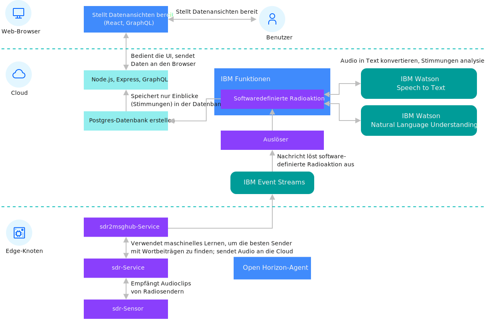

---

copyright:
years: 2019
lastupdated: "2019-06-26"

---

{:new_window: target="blank"}
{:shortdesc: .shortdesc}
{:screen: .screen}
{:codeblock: .codeblock}
{:pre: .pre}
{:child: .link .ulchildlink}
{:childlinks: .ullinks}

# Edge-Verarbeitung für Software-Defined Radio (SDR)
{: #defined_radio_ex}

***WRITER NOTE: this will be merged with software_defined_radio_ex.md when Troy combines.***

Im vorliegenden Beispiel wird SDR (Software-Defined Radio; softwaredefinierte Hochfrequenzsignalverarbeitung) als Beispiel für die Edge-Verarbeitung erläutert. Mit SDR können Sie Rohdaten über das gesamte Funkspektrum zur Verarbeitung an einen Cloud-Server senden. Der Edge-Knoten verarbeitet die Daten lokal und sendet dann eine reduzierte Menge höherwertiger Daten zur weiteren Verarbeitung an einen Cloud-Verarbeitungsservice.
{:shortdesc}

Im folgenden Diagramm wird die Architektur dieses SDR-Beispiels dargestellt:



Die Edge-Verarbeitung für Software-Defined Radio (SDR) ist ein mit allen Funktionen versehenes Beispiel, mit dem Audiodaten einer Funkstation genutzt, Sprachdaten extrahiert und die extrahierten Sprachdaten in Text umgewandelt werden können. Das Beispiel führt Stimmungsanalysen für den Text aus und stellt die gewonnenen Daten und Ergebnisse über eine Benutzerschnittstelle bereit, in der Sie die Details zu den Daten aller Edge-Knoten anzeigen können. Verwenden Sie dieses Beispiel, um mehr über die Edge-Verarbeitung zu erfahren.

Mit SDR werden Funksignale über Digitalschaltungen in der CPU eines Computers empfangen und an die dafür vorgesehene Gruppe spezialisierter Analogschaltkreise weitergeleitet. Diese Analogschaltkreise werden normalerweise durch die Bandbreite des Funkspektrums beschränkt, das empfangen werden kann. Ein analoger Funkempfänger, der Signale von Funkstationen mit Frequenzmodulation (FM) empfangen kann, ist z. B. nicht in der Lage, Funksignale aus einem anderen Bereich des Funkspektrums zu empfangen. Mit SDR kann auf große Teile dieses Spektrums zugegriffen werden. Falls Sie nicht über die SDR-Hardware verfügen, können Sie Testdaten verwenden. Wenn Sie die Testdaten verwenden, wird das Audiomaterial aus dem Internet-Datenstrom so verwendet, als würde es über FM (Frequenzmodulation) übertragen und auf Ihrem Edge-Knoten empfangen werden. 

Bevor Sie diese Task ausführen, müssen Sie Ihre Edge-Einheit registrieren und die Registrierung zurücknehmen. Führen Sie dazu die unter [Horizon-Agent auf der Edge-Einheit installieren und beim 'Hello World'-Beispiel registrieren](registration.md) beschriebenen Schritte aus.

Dieser Code besteht aus den folgenden primären Komponenten.

|Komponente|Beschreibung|
|---------|-----------|
|[Service 'sdr'](https://github.com/open-horizon/examples/tree/master/edge/services/sdr)|Dieser Low-Level-Service wird für den Zugriff auf die Hardware des Edge-Knotens verwendet.|
|[Service 'ssdr2evtstreams'](https://github.com/open-horizon/examples/tree/master/edge/evtstreams/sdr2evtstreams)|Dieser High-Level-Service dient zum Empfangen von Daten des Low-Level-Service 'sdr' und zur Ausführung lokaler Analysen der Daten auf dem Edge-Knoten. Der Service 'sdr2evtstreams' sendet die verarbeiteten Daten dann an die Cloud-Back-End-Software.|
|[Cloud-Back-End-Software ](https://github.com/open-horizon/examples/tree/master/cloud/sdr)|Die Cloud-Back-End-Software dient zum Empfangen von Daten der Edge-Knoten zur weiterführenden Analyse. Die Back-End-Implementierung kann anschließend eine Übersicht der Edge-Knoten und weitere Daten in einer webbasierten Benutzerschnittstelle bereitstellen.|
{: caption="Tabelle 1. Primäre SDR-Komponenten für {{site.data.keyword.message_hub_notm}}" caption-side="top"}

## Einheit registrieren

Obwohl dieser Service in jeder beliebigen Edge-Einheit mithilfe von Testdaten ausgeführt werden kann, sollten Sie bei Verwendung einer Edge-Einheit wie Raspberry Pi mit der SDR-Hardware zunächst ein Kernelmodul für die Unterstützung Ihrer SDR-Hardware konfigurieren. Sie müssen dieses Modul manuell konfigurieren. Docker-Container können in ihrem Kontext eine andere Linux-Distribution einrichten, der Container kann jedoch keine Kernelmodule installieren. 

Führen Sie die folgenden Schritte aus, um dieses Modul zu konfigurieren:

1. Erstellen Sie als Rootbenutzer eine Datei mit dem Namen `/etc/modprobe.d/rtlsdr.conf`.
     

   ```
     sudo nano /etc/modprobe.d/rtlsdr.conf
     ```
   {: codeblock}

2. Fügen Sie die folgenden Zeilen zur Datei hinzu:
     

   ```
     blacklist rtl2830
     blacklist rtl2832
     blacklist dvb_usb_rtl28xxu
     ```
   {: codeblock}

3. Speichern Sie die Datei und führen Sie einen Neustart durch, bevor Sie fortfahren:
     
   ```
     sudo reboot
     ```
   {: codeblock}   

4. Legen Sie den folgenden API-Schlüssel für {{site.data.keyword.message_hub_notm}} in Ihrer Umgebung fest. Dieser Schlüssel wird zur Verwendung im vorliegenden Beispiel erstellt und verwendet, um die verarbeiteten Daten, die von Ihrem Edge-Knoten erfasst wurden, für die SDR-Benutzerschnittstelle von IBM bereitzustellen.

   ```
    export EVTSTREAMS_API_KEY=X2e8cSjbDAMk-ztJLaoi3uffy8qsQTnZttUjcHCfm7cp
    export EVTSTREAMS_BROKER_URL=broker-3-y420pyyyvhhmttz0.kafka.svc01.us-south.eventstreams.cloud.ibm.com:9093,broker-5-y420pyyyvhhmttz0.kafka.svc01.us-south.eventstreams.cloud.ibm.com:9093,broker-4-y420pyyyvhhmttz0.kafka.svc01.us-south.eventstreams.cloud.ibm.com:9093,broker-1-y420pyyyvhhmttz0.kafka.svc01.us-south.eventstreams.cloud.ibm.com:9093,broker-0-y420pyyyvhhmttz0.kafka.svc01.us-south.eventstreams.cloud.ibm.com:9093,broker-2-y420pyyyvhhmttz0.kafka.svc01.us-south.eventstreams.cloud.ibm.com:9093
    ```
   {: codeblock}

5. Zur Ausführung dieses Beispiels für den Service 'sdr2evtstreams' auf Ihrem Edge-Knoten müssen Sie den Edge-Knoten für das Bereitstellungsmuster 'IBM/pattern-ibm.cpu2evtstreams' registrieren. Führen Sie die Schritte aus, die auf der Seite [Preconditions for Using the SDR To IBM Event Streams Example Edge Service ](https://www.ibm.com/links?url=https%3A%2F%2Fgithub.com%2Fopen-horizon%2Fexamples%2Ftree%2Fmaster%2Fedge%2Fevtstreams%2Fsdr2evtstreams) beschrieben sind. 

6. Überprüfen Sie die Beispiel-Webbenutzerschnittstelle, um festzustellen, ob Ihr Edge-Knoten Ergebnisse sendet. Weitere Einzelheiten finden Sie in den Informationen zum [Beispiel für die SDR-Webbenutzerschnittstelle ](https://sdr-poc-sdr-poc-app-delightful-leopard.mybluemix.net). Melden Sie sich mit den folgenden Berechtigungsnachweisen an:

   * Benutzername: guest@ibm.com
   * Kennwort: guest123

## In der Cloud bereitstellen

Der Code für IBM Functions, IBM Datenbanken und die Webbenutzerschnittstelle kann optional in IBM Cloud bereitgestellt werden, falls Sie eine eigene Beispielwebbenutzerschnittstelle für SDR erstellen wollen. Dies können Sie mit einem einzigen Befehl ausführen, nachdem Sie ein [gebührenpflichtiges Konto erstellt haben](https://cloud.ibm.com/login).

Der Bereitstellungscode befindet sich im Repository 'examples/cloud/sdr/deploy/ibm'. Weitere Informationen finden Sie auf der Seite [deployment repository content  ](https://www.ibm.com/links?url=https%3A%2F%2Fgithub.com%2Fopen-horizon%2Fexamples%2Ftree%2Fmaster%2Fcloud%2Fsdr%2Fdeploy%2Fibm). 

Dieser Code besteht aus einer Datei mit dem Namen 'README.md', die detaillierte Anweisungen enthält, und aus dem Script 'deploy.sh', das zur Verarbeitung der Workload verwendet wird. Das Repository enthält außerdem eine Makefile als weitere Schnittstelle zum Script 'deploy.sh'. Machen Sie sich mit den Repository-Anweisungen vertraut, um sich über die Bereitstellung des eigenen Cloud-Back-Ends für das SDR-Beispiel zu informieren.

Hinweis: Für diesen Bereitstellungsprozess sind gebührenpflichtige Services erforderlich, deren Gebühren über Ihr {{site.data.keyword.cloud_notm}}-Konto abgerechnet werden.

## Nächste Schritte

Wenn Sie eigene Software auf einem Edge-Knoten bereitstellen wollen, müssen Sie eigene Edge-Services und zugehörige Bereitstellungsmuster oder Bereitstellungsrichtlinien erstellen. Weitere Informationen enthält der Abschnitt [Edge-Services mit IBM Edge Application Manager for Devices entwickeln](../developing/developing.md).
