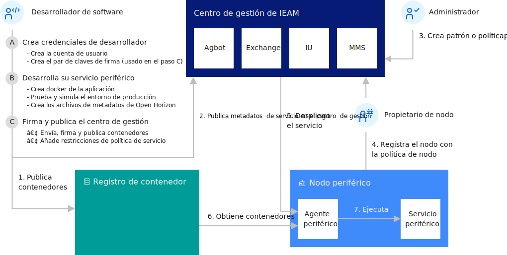

---

copyright:
years: 2020
lastupdated: "2020-04-09"

---

{:new_window: target="blank"}
{:shortdesc: .shortdesc}
{:screen: .screen}
{:codeblock: .codeblock}
{:pre: .pre}
{:child: .link .ulchildlink}
{:childlinks: .ullinks}

# Desarrollo de un servicio periférico para dispositivos
{: #developing}

Para empezar a desarrollar servicios periféricos para {{site.data.keyword.edge_notm}} ({{site.data.keyword.ieam}}), primero debe configurar las credenciales para publicar contenido. Puesto que todos los servicios deben estar firmados, también debe crear un par de claves de firma criptográfica. Asegúrese de completar los pasos de requisito previo, [Preparación para crear un servicio periférico](service_containers.md).

Este diagrama muestra las interacciones típicas entre los componentes en {{site.data.keyword.horizon}}.

 

## Ejemplos
{: #edge_devices_ex_examples}

Utilice las credenciales y las claves de firma para completar los ejemplos de desarrollo. Estos ejemplos le muestran cómo crear servicios simples y le ayudan a aprender los conceptos básicos de desarrollo de {{site.data.keyword.ieam}}.

Cada uno de estos ejemplos de desarrollo muestra algunos aspectos más del desarrollo de servicio de periféricos. Para obtener una experiencia de aprendizaje óptima, complete los ejemplos en el orden en el que se enumeran aquí.

* [Transformar imagen en servicio periférico](transform_image.md): muestra el despliegue de una imagen de Docker existente como servicio periférico.

* [Creación de su propio servicio periférico hello world](developingstart_example.md): muestra los conceptos básicos de desarrollo, pruebas, publicación y despliegue de un servicio periférico.

* [CPU en servicio {{site.data.keyword.message_hub_notm}}](cpu_msg_example.md): muestra cómo definir parámetros de configuración del servicio periférico, especificar que el servicio periférico requiere otros servicios periféricos y enviar datos a un servicio de ingestión de datos de nube.

* [Hello world utilizando la gestión de modelos](model_management_system.md): muestra cómo desarrollar un servicio periférico que utilice el servicio de gestión de modelos. El servicio de gestión de modelos proporciona de forma asíncrona actualizaciones de archivo a los servicios periféricos en nodos periféricos, por ejemplo, para actualizar de forma dinámica un modelo de aprendizaje automático cada que vez que evoluciona.

* [Actualización de un servicio periférico con
retrotracción](../using_edge_services/service_rollbacks.md): muestra cómo supervisar el éxito del despliegue y, si falla en cualquier nodo periférico,
volver a revertir el nodo a la versión anterior del servicio periférico.

Cuando haya terminado de crear estos servicios de ejemplo, consulte la documentación siguiente para obtener información más detallada sobre los servicios de desarrollo para {{site.data.keyword.ieam}}:

## Lectura adicional
{: #developing_more_info}

Consulte los principios importantes y los procedimientos recomendados para el desarrollo de software de {{site.data.keyword.ieam}}.

* [Procedimientos recomendados de desarrollo nativo de Edge](best_practices.md)

Con {{site.data.keyword.ieam}}, puede colocar opcionalmente imágenes de contenedor de servicios en el registro de contenedor seguro privado de IBM en lugar de en el Docker Hub público. Por ejemplo, si tiene una imagen de software que incluya activos que no son apropiados para incluirlos en un registro público.

* [Utilización de un registro de contenedor privado](container_registry.md)

Con {{site.data.keyword.ieam}} puede colocar contenedores de servicios en el registro de contenedor seguro privado de IBM en lugar de en el Docker Hub público.

* [Detalles de desarrollo ](developing_details.md)

Con {{site.data.keyword.ieam}} puede desarrollar cualquier contenedor de servicios que desee para las máquinas periféricas.

* [Las API](../api/edge_rest_apis.md)

{{site.data.keyword.ieam}} proporciona API RESTful para que los componentes puedan colaborar y para permitir que los desarrolladores y los usuarios de la organización controlen los componentes.
