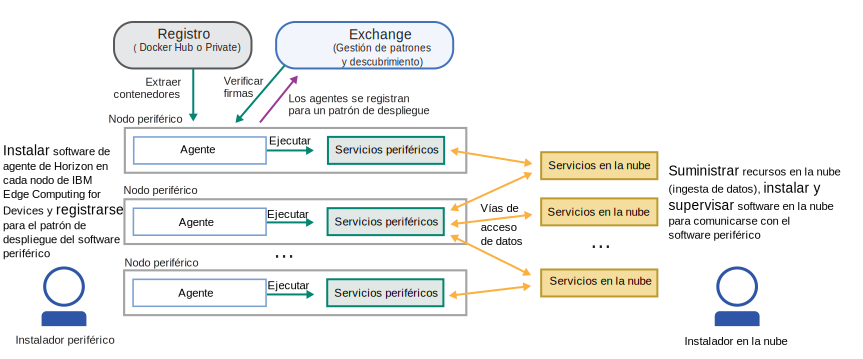
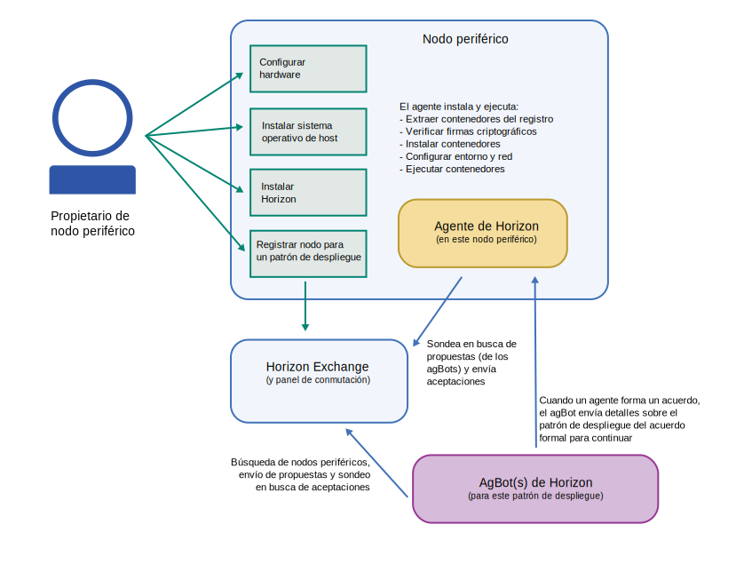

---

copyright:
years: 2020
lastupdated: "2020-4-8"

---

{:new_window: target="blank"}
{:shortdesc: .shortdesc}
{:screen: .screen}
{:codeblock: .codeblock}
{:pre: .pre}
{:child: .link .ulchildlink}
{:childlinks: .ullinks}

# Dispositivos periféricos
{: #edge_devices}

# Antes de empezar

Conozca estos requisitos previos para trabajar con dispositivos periféricos:

* [Preparación de un dispositivo periférico](#adding-devices)
* [Arquitecturas y sistemas operativos soportados](#suparch-horizon)
* [Dimensionamiento](#size)

Nota: los dispositivos periféricos también se conocen como agentes. Consulte la NOTA DEL ESCRITOR
para obtener una descripción de los clústeres y dispositivos periféricos.

## Preparación de un dispositivo periférico
{: #adding-devices}

{{site.data.keyword.edge_devices_notm}} utiliza el software del proyecto [{{site.data.keyword.horizon_open}} ](https://github.com/open-horizon/). Los {{site.data.keyword.horizon_agents}} de los dispositivos periféricas se comunican con otros componentes de {{site.data.keyword.horizon}} para organizar de forma segura la gestión de ciclo de vida de software en sus dispositivos.
{:shortdesc}

En el diagrama siguiente se muestran las interacciones típicas entre los componentes de {{site.data.keyword.horizon}}.

Todos los dispositivos periféricos (nodos periféricos) requieren que esté instalado el software de {{site.data.keyword.horizon_agent}}. El {{site.data.keyword.horizon_agent}} también depende del software de [Docker ](https://www.docker.com/). 

Centrándose en el dispositivo periférico, el diagrama siguiente muestra el flujo de los pasos que se dan para configurar el dispositivo periférico y lo que hace el agente una vez que se inicia.

Las instrucciones siguientes le guían a través del proceso de instalación del software necesario en el dispositivo periférico y de registrarlo con {{site.data.keyword.edge_devices_notm}}.

## Arquitecturas y sistemas operativos soportados
{: #suparch-horizon}

{{site.data.keyword.edge_devices_notm}} da soporte a los sistemas con las arquitecturas de hardware siguientes:

* Dispositivos o máquinas virtuales de {{site.data.keyword.linux_bit_notm}} que ejecutan Ubuntu 18.x (bionic), Ubuntu 16.x (xenial), Debian 10 (buster) o Debian 9 (stretch)
* {{site.data.keyword.linux_notm}} en ARM (32 bits), por ejemplo Raspberry Pi que ejecuta Raspbian buster o stretch
* {{site.data.keyword.linux_notm}} en ARM (64 bits), por ejemplo NVIDIA Jetson Nano, TX1 o TX2 que ejecuta Ubuntu 18.x (bionic)
* {{site.data.keyword.macOS_notm}}

## Dimensionamiento
{: #size}

El agente requiere:

1. 100 MB RAM (incluido docker). RAM aumenta por encima de esta cantidad en aproximadamente 100 K por acuerdo, además de cualquier memoria adicional necesaria para las cargas de trabajo que se ejecutan en el nodo.
2. 400 MB de disco (incluido docker). El disco aumenta por encima de esta cantidad en función del tamaño de las imágenes de contenedor que utilizan las cargas de trabajo y el tamaño de los objetos de modelo (el doble) que se despliegan en el nodo.

## Qué hacer a continuación

[Instalación del agente](installing_the_agent.md)
