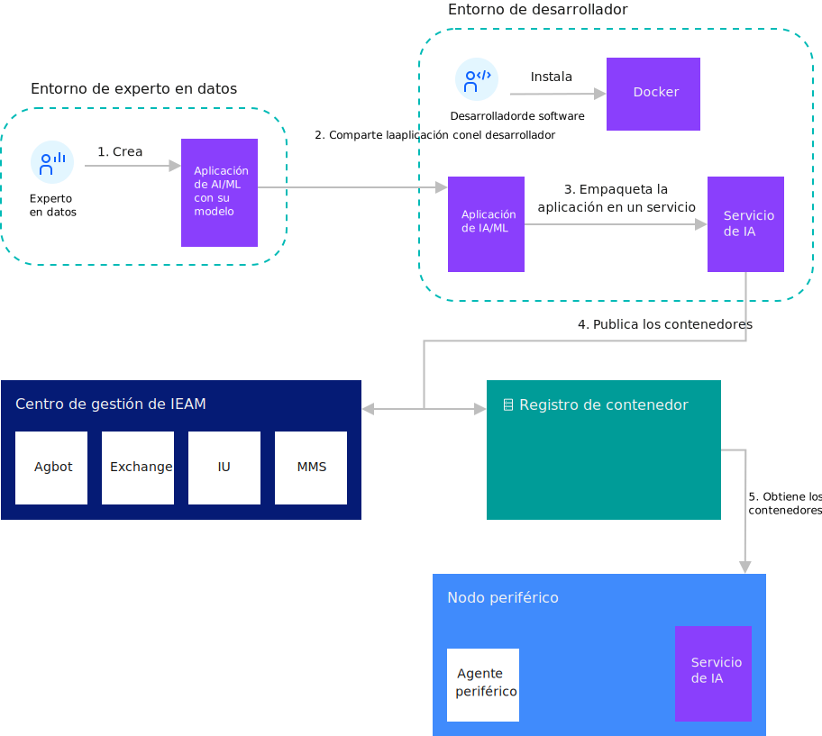
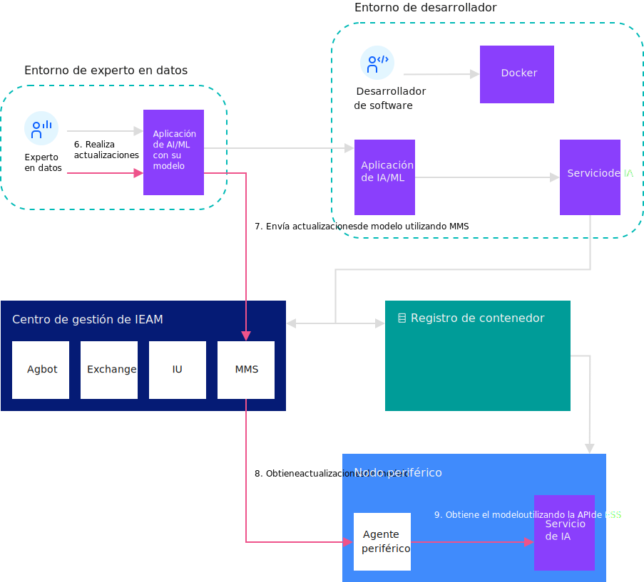

---

copyright:
  years: 2020
lastupdated: "2020-04-9"

---

{:shortdesc: .shortdesc}
{:new_window: target="_blank"}
{:codeblock: .codeblock}
{:pre: .pre}
{:screen: .screen}
{:tip: .tip}
{:download: .download}

# Detalles de gestión de modelos
{: #model_management_details}

El sistema de gestión de modelos (MMS) facilita la carga de la gestión de modelos de inteligencia artificial (IA) para los servicios cognitivos que se ejecutan en nodos periféricos. El MMS también se puede utilizar para entregar otros tipos de archivo de datos a nodos periféricos. El MMS facilita el almacenamiento, la entrega y la seguridad de los modelos, datos y otros paquetes de metadatos necesarios para los servicios periféricos. Esto permite a los nodos periféricos enviar y recibir fácilmente modelos y metadatos a la nube y desde la nube.

El MMS se ejecuta en el hub de {{site.data.keyword.edge_notm}}
({{site.data.keyword.ieam}}) y en los nodos periféricos. El Servicio de sincronización de nube (CSS)
proporciona modelos, metadatos o datos a nodos o grupos de nodos específicos dentro de una organización. Una vez
que se han entregado los objetos a los nodos periférico, hay una API disponible que permite al servicio periférico
obtener los modelos o datos del Servicio de sincronización periférico (ESS).

Los desarrolladores de servicios, los administradores de DevOps y los autores de modelos llenan los objetos en el MMS. Los componentes del MMS facilitan la integración entre las herramientas de modelo de inteligencia artificial y los servicios cognitivos que se ejecutan en el borde. A medida que los autores completan los modelos, estos se publican en el MMS, lo que los pone inmediatamente a disposición de los nodos periféricos.

{{site.data.keyword.ieam}} también proporciona una CLI (**hzn mms**) que permite la manipulación de los objetos de modelo y de los metadatos correspondientes.

Los siguientes diagramas muestran el flujo de trabajo asociado con el desarrollo y la
actualización de modelos de inteligencia artificial utilizando MMS.

 

 

## Conceptos de MMS

Hay varios componentes que conforman el MMS: CSS, ESS y objetos.

CSS y ESS proporcionan las API que los desarrolladores y los administradores utilizan para interactuar con el MMS. Los objetos son los modelos de aprendizaje automático y otros tipos de archivos de datos que se despliegan en nodos periféricos.

### CSS

El CSS se despliega en el centro de gestión de {{site.data.keyword.ieam}} cuando se instala {{site.data.keyword.ieam}}. El CSS utiliza la base de datos mongoDB para almacenar objetos y mantener el estado de cada nodo periférico.

### ESS

El ESS está incorporado en el agente de {{site.data.keyword.ieam}} que se ejecuta en el nodo periférico. El ESS sondea continuamente al CSS en busca de actualizaciones de objetos y almacena cualquier objeto que se proporciona al nodo en una base de datos local del nodo periférico. Los servicios que se despliegan en el nodo periférico pueden utilizar las API de ESS para acceder a los metadatos y a los objetos de datos o modelo.

### Objetos (metadatos y datos)

Los metadatos describen los modelos de datos. Un objeto se publica en el MMS con metadatos y datos o sólo con metadatos. En los metadatos, los campos **objectType** y **objectID** definen la identidad del objeto dentro de una organización dada. Estos campos relacionados con el destino determinan los nodos periféricos a los que se debe enviar el objeto:

* **destinationOrgID**
* **destinationType**
* **destinationID**
* **destinationList**
* **destinationPolicy**

En los metadatos se puede especificar información adicional de objeto, incluyendo la descripción, la versión
y demás. El valor de versión no tiene ningún significado semántico en el servicio de sincronización; por lo tanto, sólo existe una copia del objeto en el CSS.

Un archivo de datos es el archivo que contiene la definición de modelo específica de ML utilizada por un servicio cognitivo. Los archivos de modelo de inteligencia artificial, los archivos de configuración y los datos binarios son ejemplos de archivos de datos.

### Modelo de IA

El modelo de IA (inteligencia artificial) no es un concepto específico de MMS, pero es un caso de uso importante del MMS. Todos los modelos de IA son una representación matemática de un proceso del mundo real relacionada con la inteligencia artificial. Los servicios cognitivos que imitan las funciones cognitivas de los seres humanos utilizan y consumen el modelo de IA. Para generar un modelo de IA, aplique algoritmos de IA a los datos de entrenamiento. En resumen, el MSS distribuye el modelo de IA para que lo utilice un servicio cognitivo que se ejecuta en un nodo periférico.

## Conceptos de MMS en {{site.data.keyword.ieam}}

Existen relaciones específicas entre los conceptos de MMS y otros conceptos en {{site.data.keyword.ieam}}.

{{site.data.keyword.ieam}} puede registrar un nodo con un patrón o con una política. Al crear los metadatos para un objeto, establezca el campo **destinationType** de los metadatos de objeto en el nombre de patrón de los nodos que deben recibir este objeto. Se puede considerar que todos los nodos de {{site.data.keyword.ieam}} que utilizan el mismo patrón están en el mismo grupo. Por lo tanto, esta correlación permite destinar objetos a todos los nodos de un mismo tipo. El campo **destinationID** es el mismo que el ID de nodo periférico de {{site.data.keyword.ieam}}. Si no establece el campo de metadatos **destinationID**, el objeto se difunde a todos los nodos con el patrón (**destinationType**).

Cuando cree metadatos para los objetos que deben entregarse a los nodos registrados con una política, deje **destinationType** y **destinationID** en blanco y, en su lugar, establezca el campo **destinationPolicy**. Contiene la información de destino (propiedad de política, restricción y servicio) que define los nodos que reciben el objeto. Establezca los campos de **services** para indicar qué servicio procesa el objeto. Los campos **properties** y **constraints** son opcionales y se utilizan para limitar aún más los nodos que deben recibir el objeto.

Un nodo periférico puede tener varios servicios, que pueden haber sido desarrollados por diferentes entidades, ejecutándose sobre él. La capa de autenticación y autorización de agente {{site.data.keyword.ieam}} controla qué servicios pueden acceder a un objeto dado. Los objetos desplegados a través de la política sólo son visibles para los servicios a los que se hace referencia en **destinationPolicy**. Sin embargo, los objetos desplegados en los nodos que ejecutan un patrón no disponen de este nivel de aislamiento. En un nodo que utiliza un patrón, todos los objetos que se entregan a dicho nodo son visibles para todos los servicios del nodo.

## Mandatos de CLI de MMS

En esta sección se describe un ejemplo de MMS y cómo utilizar algunos mandatos de MMS.

Por ejemplo, un usuario opera tres cámaras en las que se despliega un servicio de aprendizaje automático (**weaponDetector**) para identificar a las personas que portan armas. Este modelo ya está entrenado, y el servicio se está ejecutando en las cámaras (que actúan como nodos).

### Comprobar el estado de MMS

Antes de publicar el modelo, envíe el mandato **hzn mms status** para comprobar el estado del MMS. Marque **heathStatus** bajo **general** y **dbStatus** bajo **dbHealth**. Los valores de estos campos deben ser green, lo que indica que el CSS y la base de datos se están ejecutando.

```
$ hzn mms status
{
  "general": {
    "nodeType": "CSS",
    "healthStatus": "green",
    "upTime": 21896
  },
  "dbHealth": {
    "dbStatus": "green",
    "disconnectedFromDB": false,
    "dbReadFailures": 0,
    "dbWriteFailures": 0
  }
}
```
{: codeblock}

### Crear el objeto MMS

En el MMS, el archivo de modelo de datos no se publica de forma independiente. El MMS requiere un archivo de metadatos junto con el archivo de modelo de datos para la publicación y la distribución. El archivo de metadatos configura un conjunto de atributos para el modelo de datos. El MMS almacena, distribuye y recupera los objetos de modelo según los atributos definidos en los metadatos.

El archivo de metadatos es un archivo json.

1. Vea una plantilla del archivo de metadatos:

   ```
   hzn mms object new
   ```
   {: codeblock}
2. Copie la plantilla en un archivo denominado **my_metadata.json**:

   ```
   hzn mms object new >> my_metadata.json
   ```
   {: codeblock}

   También puede copiar la plantilla desde el terminal y pegarla en un archivo.

Es importante comprender el significado de los campos de metadatos y el modo en que se relacionan con el ejemplo de metadatos.

|Campo|Descripción|Notas|
|-----|-----------|-----|
|**objectID**|El ID de objeto.|Un identificador exclusivo del objeto necesario dentro de la organización.|
|**objectType**|El tipo de objeto.|Un campo obligatorio definido por el usuario; no hay tipos de objeto incorporados.|
|**destinationOrgID**|La organización de destino.|Un campo necesario utilizado para distribuir el objeto a los nodos de la misma organización.|
|**destinationType**|El tipo de destino.|El patrón utilizado por los nodos que deben recibir este objeto.|
|**destinationID**|El ID de destino.|Un campo opcional establecido en el ID de nodo único (sin prefijo org) en el que se debe colocar el objeto. Si se omite, el objeto se envía a todos los nodos con destinationType.|
|**destinationsList**|La lista de destinos.|Un campo opcional establecido en una matriz de pares de pattern:nodeId que deben recibir este objeto. Esto es una alternativa a establecer **destinationType** y **destinationID**.|
|**destinationPolicy**|La política de destino.|Se utiliza cuando se distribuye el objeto a los nodos registrados con la política. No establezca **destinationType**, **destinationID** o **destinationsList** en este caso.|
|**expiration**|Un campo opcional.|Indica cuándo caducará el objeto y se eliminará del MMS.|
|**activationTime**|Un campo opcional.|La fecha en la que este objeto se debe activar automáticamente. No se entrega a ningún nodo hasta después de la hora de activación.|
|**version**|Un campo opcional.|Valor de serie arbitrario. El valor no se interpreta semánticamente. El sistema de gestión de modelos no mantiene varias versiones de un objeto.| 
|**description**|Un campo opcional.|Una descripción arbitraria.|

Notas:

1. Si utiliza **destinationPolicy**, elimine los campos **destinationType**, **destinationID** y **destinationsList** de los metadatos. Las
**propiedades**, las **restricciones** y los  **servicios**
en **destinationPolicy** determinarán los destinos que van a recibir este objeto.
2. **version** y **description** se pueden dar como series dentro de los metadatos. El valor de la versión no se interpreta semánticamente. El MMS no conserva varias versiones de un objeto.
3. **expiration** y **activationTime** se deben proporcionar en formato RFC3339.

Rellene los campos de **my_metadata.json** mediante una de estas dos opciones:

1. Envíe el objeto MMS a los nodos periféricos que se ejecutan con la política.

   En este ejemplo, los nodos periféricos de cámara node1, node2 y node3 se registran con la política. **weaponDetector** es uno de los servicios que se ejecutan en los nodos y desea que el archivo de modelo lo utilice el servicio **weaponDetector** que se ejecuta en los nodos periféricos de cámara. Puesto que los nodos de destino están registrados con política, utilice solo **destinationOrgID** y **destinationPolicy**. Establezca el campo **ObjectType** en **model**, aunque se puede establecer en cualquier serie que sea significativa para el servicio que recupera el objeto.

   En este caso de ejemplo, el archivo de metadatos puede ser:

   ```json
   {
     "objectID": "my_model",
     "objectType": "model",
     "destinationOrgID": "$HZN_ORG_ID",
     "destinationPolicy": {
       "properties": [],
       "constraints": [],
       "services": [
         {
           "orgID": "$SERVICE_ORG_ID",
           "arch": "$ARCH",
           "serviceName": "weaponDetector",
           "version": "$VERSION"
         }
       ]
     },
     "version": "1.0.0",
     "description": "weaponDetector model"
   }
   ```
   {: codeblock}

2. Envíe el objeto MMS a los nodos periféricos que se ejecutan con el patrón.

   En este caso de ejemplo, se utilizan los mismos nodos, pero ahora se registran con el patrón **pattern.weapon-detector**, que tiene **weaponDetector** como uno de los servicios.

   Para enviar el modelo a los nodos con un patrón, cambie el archivo de metadatos:

   1. Especifique el patrón de nodo en el campo **destinationType**.
   2. Elimine el campo **destinationPolicy**.

   El archivo de metadatos es parecido a:

   ```
   {
     "objectID": "my_model",
     "objectType": "model",
     "destinationOrgID": "$HZN_ORG_ID",
     "destinationType": "pattern.weapon-detector",
     "version": "1.0.0",
     "description": "weaponDetector model"
   }
   ```
   {: codeblock}

Ahora, el archivo de modelo y el archivo de metadatos están listos para su publicación.

### Publicar el objeto MMS

Publique el objeto con los metadatos y el archivo de datos:

```
hzn mms object publish -m my_metadata.json -f my_model
```
{: codeblock}

### Listar el objeto MMS

Listar el objeto MMS con este **objectID** y **objectType** dentro de la organización dada:

```
hzn mms object list --objectType=model --objectId=my_model
```
{: codeblock}

El resultado del mandato será parecido a:

```
Listing objects in org userdev:
[
  {
    "objectID": "my_model",
    "objectType": "model"
  }
]
```

Para mostrar todos los metadatos de objeto MMS, añada **-l** al mandato:

```
hzn mms object list --objectType=model --objectId=my_model -l
```
{: codeblock}

Para mostrar el estado del objeto y los destinos junto con el objeto, añada **-d** al mandato. El resultado de destino siguiente indica que el objeto se entrega a las cámaras: node1, node2 y node3. 

```
hzn mms object list --objectType=model --objectId=my_model -d
```
{: codeblock}

La salida del mandato anterior tiene el aspecto siguiente:

```
[
  {
    "objectID": "my_model",
    "objectType": "model",
    "destinations": [
      {
        "destinationType": "pattern.mask-detector",
        "destinationID": "node1",
        "status": "delivered",
        "message": ""
      },
      {
        "destinationType": "pattern.mask-detector",
        "destinationID": "node2",
        "status": "delivered",
        "message": ""
      },
      {
        "destinationType": "pattern.mask-detector",
        "destinationID": "node3",
        "status": "delivered",
        "message": ""
      },
    ],
    "objectStatus": "ready"
  }
]
```

Hay disponibles opciones de filtrado más avanzadas para acotar la lista de objetos MMS. Para ver una lista completa de distintivos:

```
hzn mms object list --help
```
{: codeblock}

### Suprimir el objeto MMS

Suprimir el objeto MMS:

```
hzn mms object delete --type=model --id=my_model
```
{: codeblock}

El objeto se elimina del MMS.

### Actualizar el objeto MMS

Los modelos pueden cambiar con el tiempo. Para publicar un modelo actualizado, utilice **hzn mms object publish** con el mismo archivo de metadatos (se recomienda el valor de versión **upgrade**). Con el MMS, no es necesario actualizar los modelos uno por uno para las tres cámaras. Utilice esta opción para actualizar el objeto **my_model** en los tres nodos.

```
hzn mms object publish -m my_metadata.json -f my_updated_model
```
{: codeblock}

## Apéndice

Nota: Consulte [Convenciones utilizadas en este documento](../../getting_started/document_conventions.md)
para obtener más información sobre la sintaxis de mandato.

A continuación se muestra un ejemplo de la salida del mandato **hzn mms object new** que se utiliza para generar una plantilla de los metadatos de objeto MMS:

```
{
  "objectID": "",            /* Necesario: un identificador exclusivo del objeto. */
  "objectType": "",          /* Necesario: el tipo del objeto. */
  "destinationOrgID": "$HZN_ORG_ID", /* Necesario: el ID de organización del objeto (un objeto pertenece exactamente a una organización). */
  "destinationID": "",       /* El ID de nodo (sin prefijo org) en el que se debe colocar el objeto. */
                             /* Si se omite, el objeto se envía a todos los nodos con el mismo destinationType. */
                             /* Suprima este campo cuando esté utilizando destinationPolicy. */
  "destinationType": "",     /* El patrón utilizado por los nodos que deben recibir este objeto. */
                             /* Si se omite (y si se omite destinationsList también), el objeto se difunde a todos los nodos conocidos. */
                             /* Suprima este campo cuando esté utilizando la política. */
  "destinationsList": null,  /* La lista de destinos es una matriz de pares pattern:nodeId que debe recibir este objeto. */
                             /* Si se proporciona, se debe omitir destinationType y destinationID. */
                             /* Suprima este campo cuando esté utilizando la política. */
  "destinationPolicy": {     /* La especificación de política que se debe utilizar para distribuir este objeto. */
                             /* Suprima estos campos si el nodo de destino utiliza un patrón. */
    "properties": [          /* Una lista de propiedades de política que describen el objeto. */
      {
        "name": "",
        "value": null,
        "type": ""           /* Los tipos válidos son string, bool, int, float, lista de serie (separadas por comas), version. */
                             /* El tipo se puede omitir si el tipo es discernible del valor, por ejemplo, true sin comillas es booleano. */
      }
    ],
    "constraints": [         /* Una lista de expresiones de restricción con el formato <nombre de propiedad> <operador> <valor de propiedad>, separado por los operadores booleanos AND (&&) o OR (||). */
      ""
    ],
    "services": [            /* Los servicios que utilizarán este objeto. */
      {
        "orgID": "",         /* La organización del servicio. */
        "serviceName": "",   /* El nombre del servicio. */
        "arch": "",          /* Se establece en '*' para indicar los servicios de cualquier arquitectura de hardware. */
        "version": ""        /* Un rango de versión. */
      }
    ]
  },
  "expiration": "",          /* Una indicación de fecha y hora que indica cuando caduca el objeto (se suprime automáticamente). La indicación de fecha y hora se debe proporcionar en formato RFC3339.  */
  "version": "",             /* Valor de serie arbitrario. El valor no se interpreta semánticamente. El sistema de gestión de modelos no mantiene varias versiones de un objeto. */
  "description": "",         /* Una descripción arbitraria. */
  "activationTime": ""       /* Una indicación de fecha y hora en la que este objeto debe activarse automáticamente. La indicación de fecha y hora se debe proporcionar en formato RFC3339. */
}
```
{: codeblock}

## Ejemplo
{: #mms}

Este ejemplo le ayuda a aprender a desarrollar un {{site.data.keyword.edge_service}} que utiliza el sistema de gestión de modelos (MMS). Puede utilizar este sistema para desplegar y actualizar los modelos de aprendizaje automático utilizados por los servicios periféricos que se ejecutan en los nodos periféricos.
{:shortdesc}

Para obtener un ejemplo que utiliza MMS, consulte [Horizon Hello Model Management Service (MMS) Example Edge Service ](https://github.com/open-horizon/examples/tree/master/edge/services/helloMMS).

## Antes de empezar
{: #mms_begin}

Complete los pasos de requisito previo en [Preparación para crear un servicio periférico](service_containers.md). Como resultado, estas variables de entorno se deben establecer, estos mandatos deben estar instalados y estos archivos deben existir.

```bash
echo "HZN_ORG_ID=$HZN_ORG_ID, HZN_EXCHANGE_USER_AUTH=$HZN_EXCHANGE_USER_AUTH, DOCKER_HUB_ID=$DOCKER_HUB_ID"
which git jq make
ls ~/.hzn/keys/service.private.key ~/.hzn/keys/service.public.pem
cat /etc/default/horizon
```

## Procedimiento
{: #mms_procedure}

Este ejemplo forma parte del proyecto de código abierto de [{{site.data.keyword.horizon_open}} ](https://github.com/open-horizon/). Siga los pasos de [Creating Your Own Hello MMS Edge Service ](https://github.com/open-horizon/examples/blob/master/edge/services/helloMMS/CreateService.md)) y, a continuación, vuelva aquí.

## Qué hacer a continuación
{: #mms_what_next}

* Pruebe los otros ejemplos de servicio periférico en
[Desarrollo de un servicio periférico para dispositivos](developing.md).

## Lectura adicional

* [Hello world utilizando la gestión de modelos](model_management_system.md)
