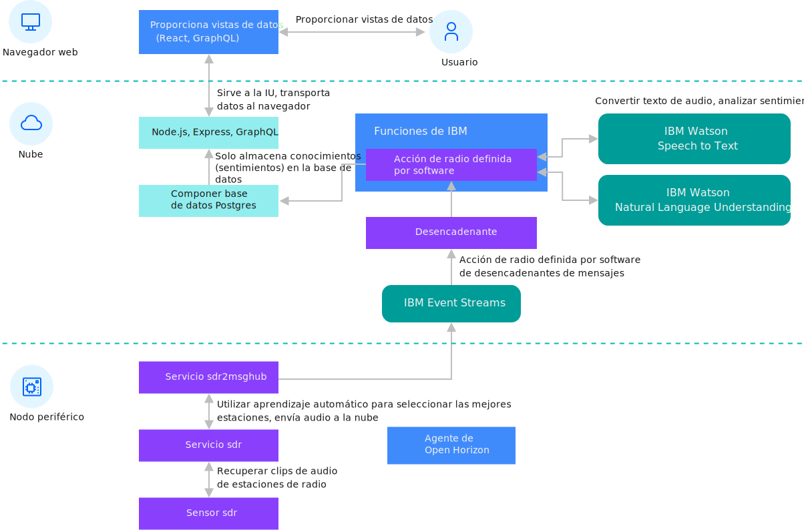

---

copyright:
years: 2019
lastupdated: "2019-06-26"

---

{:new_window: target="blank"}
{:shortdesc: .shortdesc}
{:screen: .screen}
{:codeblock: .codeblock}
{:pre: .pre}
{:child: .link .ulchildlink}
{:childlinks: .ullinks}

# Proceso periférico de radio definida por software
{: #defined_radio_ex}

***NOTA DEL ESCRITOR: esto se fusionará con software_defined_radio_ex.md cuando Troy lo combine.***

Este ejemplo utiliza la radio definida por software (SDR) como ejemplo de proceso periférico. Con SDR,
puede enviar datos en bruto a través del espectro de radio completo a un servidor de nube para su proceso. El
nodo periférico procesa los datos localmente y a continuación envía menos volumen de datos más valiosos
a un servicio de procesamiento de nube para su proceso adicional.
{:shortdesc}

Este diagrama muestra la arquitectura de este ejemplo de SDR:



El proceso periférico SDR es un ejemplo completo que consume audio de estación de radio,
extrae voz y convierte la voz extraída en texto. El ejemplo completa el análisis de emoción sobre el texto y hace que los datos y los resultados estén disponibles a través de una interfaz de usuario en la que puede ver los detalles de los datos para cada nodo periférico. Utilice este ejemplo para obtener más información sobre el proceso periférico.

SDR recibe señales de radio utilizando el circuito digital en una CPU de sistema para manejar el trabajo
de necesitar un conjunto de circuitos analógicos especializados. Ese circuito análogo está normalmente restringido por la amplitud del espectro de radio que puede recibir. Un receptor
de radio analógico construido para recibir estaciones de radio FM, por ejemplo, no puede recibir señales de radio
de ningún otro lugar del espectro de radio. El SDR puede acceder a grandes sectores del espectro. Si no
tiene el hardware de SDR, puede utilizar datos simulados. Cuando utiliza datos simulados, el audio de la corriente de Internet se trata como si se transmitiera a través de FM y se recibiera en el nodo periférico.

Antes de realizar esta tarea, registre y anule el registro del dispositivo periférico
realizando los pasos del apartado [Instalar el agente de Horizon en el
dispositivo periférico y registrarlo con el ejemplo hello world](registration.md).

Este código contiene estos componentes principales.

|Componente|Descripción|
|---------|-----------|
|[Servicio sdr ](https://github.com/open-horizon/examples/tree/master/edge/services/sdr)|El servicio de nivel inferior accede al hardware del nodo periférico|
|[Servicio ssdr2evtstreams ](https://github.com/open-horizon/examples/tree/master/edge/evtstreams/sdr2evtstreams)|El servicio de nivel superior recibe datos del servicio de sdr de nivel inferior y realiza
el análisis local de los datos en el nodo periférico. A continuación, el servicio sdr2evtstreams envía
los datos procesados al software de programa de fondo en la nube.|
|[Software de programa de fondo en la nube ](https://github.com/open-horizon/examples/tree/master/cloud/sdr)|El
software de programa de fondo en la nube recibe datos de los nodos periféricos para realizar un análisis adicional. La implementación de programa de fondo puede presentar entonces un mapa de nodos periféricos y más cosas dentro de una interfaz de usuario basada en web.|
{: caption="Tabla 1. Radio definida por software para los componentes principalesde {{site.data.keyword.message_hub_notm}}" caption-side="top"}


## Registro del dispositivo

Aunque este servicio se puede ejecutar utilizando datos simulados en cualquier dispositivo periférico,
si está utilizando un dispositivo periférico como Raspberry Pi con el hardware de SDR, configure primero un módulo
de kernel para soportar el hardware SDR. Debe configurar manualmente este módulo. Los contenedores de Docker
pueden establecer una distribución diferente de Linux en los contextos, pero el contenedor no puede instalar
los módulos de kernel. 

Siga estos pasos para configurar este módulo:

1. Como usuario root, cree un archivo llamado `/etc/modprobe.d/rtlsdr.conf`.

   ```
   sudo nano /etc/modprobe.d/rtlsdr.conf
   ```
   {: codeblock}

2. Añada las líneas siguientes al archivo:

   ```
   blacklist rtl2830
     blacklist rtl2832
     blacklist dvb_usb_rtl28xxu
   ```
   {: codeblock}

3. Guarde el archivo y, a continuación, reinicie antes de continuar:
   ```
   sudo reboot
   ```
   {: codeblock}   

4. Establezca la clave de API de {{site.data.keyword.message_hub_notm}} en su entorno. Esta
clave se crea para utilizarse con este ejemplo y se utiliza para proporcionar los datos procesados recopilados
por el nodo periférico a la interfaz de usuario de radio definida por software de IBM.

   ```
   export EVTSTREAMS_API_KEY=X2e8cSjbDAMk-ztJLaoi3uffy8qsQTnZttUjcHCfm7cp
    export EVTSTREAMS_BROKER_URL=broker-3-y420pyyyvhhmttz0.kafka.svc01.us-south.eventstreams.cloud.ibm.com:9093,broker-5-y420pyyyvhhmttz0.kafka.svc01.us-south.eventstreams.cloud.ibm.com:9093,broker-4-y420pyyyvhhmttz0.kafka.svc01.us-south.eventstreams.cloud.ibm.com:9093,broker-1-y420pyyyvhhmttz0.kafka.svc01.us-south.eventstreams.cloud.ibm.com:9093,broker-0-y420pyyyvhhmttz0.kafka.svc01.us-south.eventstreams.cloud.ibm.com:9093,broker-2-y420pyyyvhhmttz0.kafka.svc01.us-south.eventstreams.cloud.ibm.com:9093
   ```
   {: codeblock}

5. Para ejecutar el ejemplo de servicio sdr2evtstreams en el nodo periférico,
debe registrar el nodo periférico en el patrón de despliegue de IBM/pattern-ibm.sdr2evtstreams. Realice los pasos de [Condiciones previas para utilizar el SDR en el servicio periférico de ejemplo de IBM Event Streams ](https://www.ibm.com/links?url=https%3A%2F%2Fgithub.com%2Fopen-horizon%2Fexamples%2Ftree%2Fmaster%2Fedge%2Fevtstreams%2Fsdr2evtstreams). 

6. Compruebe la interfaz de usuario web de ejemplo para ver si el nodo periférico está enviando resultados. Para obtener más información, consulte [Interfaz de usuario web de ejemplo de radio definida por software ](https://sdr-poc-sdr-poc-app-delightful-leopard.mybluemix.net). Inicie
la sesión con estas credenciales:

   * Nombre de usuario: guest@ibm.com
   * Contraseña: guest123

## Despliegue en la nube

Opcionalmente, se pueden desplegar el código de IBM Functions,  bases de datos de IBM e
interfaz de usuario web en IBM Cloud si desea crear su propia interfaz de usuario web
de ejemplo de radio definida por el software. Puede hacerlo con un único mandato después de [crear una cuenta de pago ](https://cloud.ibm.com/login).

El código de despliegue está ubicado en el repositorio examples/cloud/sdr/deploy/ibm. Para obtener más información, consulte [contenido de repositorio de despliegue ](https://www.ibm.com/links?url=https%3A%2F%2Fgithub.com%2Fopen-horizon%2Fexamples%2Ftree%2Fmaster%2Fcloud%2Fsdr%2Fdeploy%2Fibm). 

Este código consta de un archivo README.md con instrucciones detalladas y un script deploy.sh que
maneja la carga de trabajo. El repositorio también contiene un Makefile como otra interfaz en
el script deploy.sh. Revise las instrucciones de repositorio para obtener más información sobre cómo
desplegar el programa de fondo en la nube propio para el ejemplo de SDR. 

Nota: Este proceso de despliegue necesita servicios de pago que incurren en cargos en
la cuenta de {{site.data.keyword.cloud_notm}}.

## Qué hacer a continuación

Si desea desplegar su propio software en un nodo periférico, debe crear sus propios servicios periféricos y el patrón de despliegue asociado o la política de despliegue. Para
obtener más información, consulte [Desarrollo de servicios periféricos
con IBM Edge Application Manager for Devices](../developing/developing.md).
