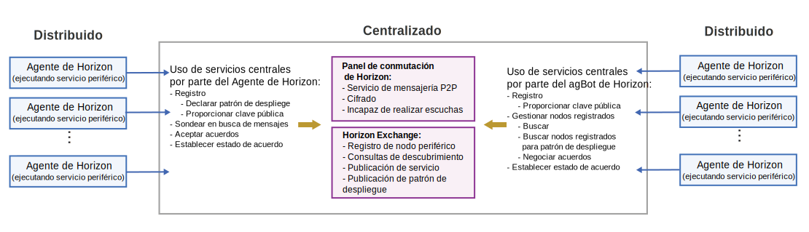

---

copyright:
years: 2019
lastupdated: "2019-06-28"

---

{:new_window: target="blank"}
{:shortdesc: .shortdesc}
{:screen: .screen}
{:codeblock: .codeblock}
{:pre: .pre}
{:child: .link .ulchildlink}
{:childlinks: .ullinks}

# Descubrimiento y negociación
{: #discovery_negotiation}

{{site.data.keyword.edge_devices_notm}}, que está basado en el proyecto {{site.data.keyword.horizon_open}}, está principalmente descentralizado y distribuido. Los procesos de agente y bot de acuerdo (agbot) autónomos colaboran en la gestión de software de todos los nodos periféricos registrados.
{:shortdesc}

Para obtener más información sobre el proyecto {{site.data.keyword.horizon_open}}, consulte [{{site.data.keyword.horizon_open}}](https://github.com/open-horizon/).

Un proceso de agente autónomo se ejecuta en cada nodo periférico de Horizon para imponer las políticas que establece el propietario de la máquina periférica.

Simultáneamente, los procesos de agbot autónomos, que se asignan a cada patrón de despliegue de software, utilizan las políticas definidas para el patrón asignado para buscar los agentes de nodo periférico que están registrados para el patrón. Independientemente de ello, estos agbots y agentes autónomos siguen las políticas de propietario de las máquinas periféricas para negociar acuerdos formales para colaborar. Cada vez que los agbots y agentes están en un acuerdo, cooperan para gestionar los ciclos de vida de software de los nodos periféricos correspondientes.

Los agbots y los agentes utilizan los servicios centralizados siguientes para buscarse el uno al otro, establecer la confianza y comunicarse de forma segura en {{site.data.keyword.edge_devices_notm}}:

* {{site.data.keyword.horizon_switch}}, que habilita las comunicaciones de igual a igual seguras y privadas entre los agbots y los agentes.
* {{site.data.keyword.horizon_exchange}}, que facilita el descubrimiento.

## {{site.data.keyword.horizon_exchange}}

{{site.data.keyword.horizon_exchange}} permite a los propietarios de máquinas periféricas registrar nodos periféricos para la gestión del ciclo de vida de software. Cuando se registra un nodo periférico con {{site.data.keyword.horizon_exchange}} para {{site.data.keyword.edge_devices_notm}}, se especifica el patrón de despliegue para el nodo periférico. Un patrón de despliegue es un conjunto de políticas para gestionar el nodo periférico, un manifiesto de software firmado criptográficamente y cualesquiera configuraciones asociadas. El patrón de despliegue se debe diseñar, desarrollar, probar, firmar y publicar en {{site.data.keyword.horizon_exchange}}.

Cada nodo de borde debe estar registrado con {{site.data.keyword.horizon_exchange}} en la organización del propietario de la máquina periférica. Cada nodo periférico se registra con una señal de ID y de seguridad que sólo es aplicable a ese nodo. Los nodos se pueden registrar para ejecutar un patrón de despliegue de software proporcionado por su propia organización, o un patrón que proporciona otra organización cuando el patrón de despliegue está disponible públicamente.

Cuando se publica un patrón de despliegue en {{site.data.keyword.horizon_exchange}}, se asignan uno o más agbots para gestionar dicho patrón de despliegue y las políticas asociadas. Estos agbots tratan de descubrir cualquier nodo periférico que esté registrado con el patrón de despliegue. Cuando se encuentra un nodo periférico registrado, los agbots negocian con los procesos de agente local del nodo periférico.

Si bien {{site.data.keyword.horizon_exchange}} habilita los agbots para encontrar los nodos periféricos que corresponden a un patrón de despliegue registrado, {{site.data.keyword.horizon_exchange}} no está directamente implicado en el proceso de gestión de software de nodo periférico. Los agbots y los agentes manejan el proceso de gestión de software. {{site.data.keyword.horizon_exchange}} no tiene autorización sobre el nodo periférico y no inicia ningún contacto con los agentes de nodo periférico.

## {{site.data.keyword.horizon_switch}}

Los agbots sondean periódicamente {{site.data.keyword.horizon_exchange}} para encontrar todos los nodos periféricos registrados para su patrón de despliegue. Cuando un agbot descubre un nodo periférico que está registrado con su patrón de despliegue, el agbot utiliza el panel de conmutación de {{site.data.keyword.horizon}} para enviar un mensaje privado al agente en dicho nodo. Este mensaje es una solicitud al agente para colaborar en la gestión del ciclo de vida de software del nodo periférico. Mientras tanto el agente sondea el buzón privado correspondiente en el {{site.data.keyword.horizon_switch}} en busca de mensajes de agbot. Cuando se recibe un mensaje, el agente lo descifra, lo valida y lo responde para aceptar la solicitud.

Además de sondear {{site.data.keyword.horizon_exchange}}, cada agbot sondea también su buzón privado en el {{site.data.keyword.horizon_switch}}. Cuando el agbot recibe una aceptación de solicitud de un agente, la negociación se ha completado.

Tanto los agentes como los agbots comparten las claves públicas con el {{site.data.keyword.horizon_switch}} para habilitar la comunicación segura y privada. Con este cifrado, el {{site.data.keyword.horizon_switch}} sirve solo de gestor de buzones. El remitente cifra todos los mensajes antes de que se envíen al {{site.data.keyword.horizon_switch}}. El {{site.data.keyword.horizon_switch}} no es capaz de descifrar los mensajes. Sin embargo, el destinatario puede descifrar cualquier mensaje que esté cifrado con su clave pública. El destinatario también utiliza la clave publica del remitente para cifrar las respuestas del destinatario al remitente.

**Nota:** puesto que toda la comunicación se ha mediado a través del {{site.data.keyword.horizon_switch}}, las direcciones IP de los nodos periféricos no se revelan a ningún agbot hasta que el agente de cada nodo periférico elije revelar esta información. El agente revela esta información cuando el agente y el agbot negocian con éxito un acuerdo.

## Gestión del ciclo de vida

Cuando un nodo periférico borde se registra con {{site.data.keyword.horizon_exchange}} para un patrón de despliegue determinado, un agbot para ese patrón de despliegue puede encontrar el agente en el nodo periférico. El agbot para el patrón de despliegue utiliza {{site.data.keyword.horizon_exchange}} para buscar el agente y utiliza el {{site.data.keyword.horizon_switch}} para negociar con el agente para colaborar en la gestión de software.

El agente de nodo periférico recibe la solicitud de colaboración desde el agbot y evalúa la propuesta para asegurarse de que se ajusta a las políticas definidas por el propietario del nodo periférico. El agente verifica las firmas criptográficas mediante los archivos de claves instalados localmente. Si la propuesta es aceptable de acuerdo con las políticas locales y se verifican las firmas, el agente acepta la propuesta y el agente y el agbot completan el acuerdo. 

Con el acuerdo en vigor, el agbot y el agente colaboran para gestionar el ciclo de vida del software del patrón de despliegue en el nodo periférico. El agbot proporciona detalles conforme el patrón de despliegue evoluciona con el tiempo y supervisa el nodo periférico a efectos de conformidad. El agente descarga software localmente en el nodo periférico, verifica la firma para el software y, en caso de aprobación, ejecuta y supervisa el software. Si es necesario, el agente actualiza el software y detiene el software cuando procede.

Para obtener más información sobre el proceso de gestión de software consulte [Gestión de software periférico](edge_software_management.md).
