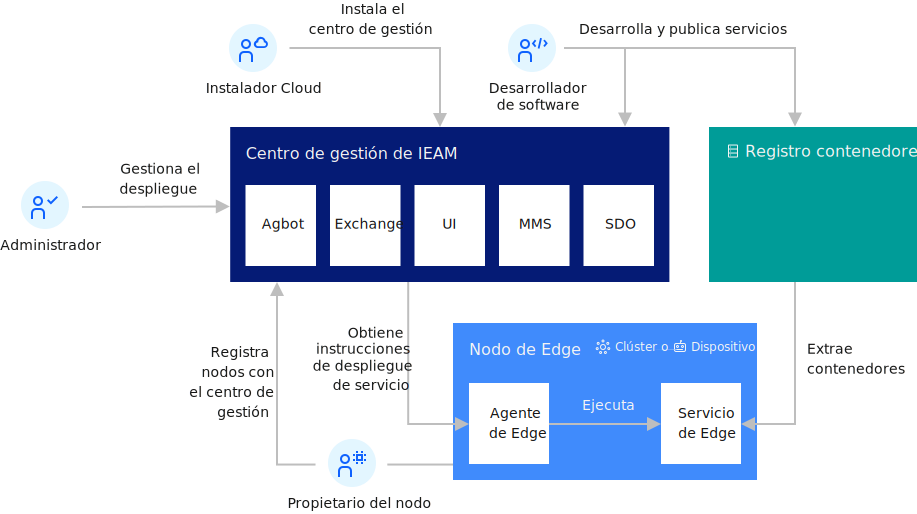

---

copyright:
years: 2020
lastupdated: "2020-05-11"

---

{:new_window: target="blank"}
{:shortdesc: .shortdesc}
{:screen: .screen}
{:codeblock: .codeblock}
{:pre: .pre}
{:child: .link .ulchildlink}
{:childlinks: .ullinks}

# Visión general de Edge Computing
{: #overviewofedge}

## Prestaciones de {{site.data.keyword.edge_notm}}
{: #capabilities}

{{site.data.keyword.edge_notm}} (IEAM) abarca sectores y varios niveles optimizados con tecnologías
abiertas y estándares actuales como Docker y Kubernetes. Esto incluye plataformas informáticas,
entornos privados de nube y de empresa, pasarelas locales y espacios de cálculo de red, controladores y servidores
y dispositivos inteligentes.

Esencialmente, las nubes públicas de hiperescala, las nubes híbridas,
los centros de datos gestionados coubicados y los centros de datos empresariales tradicionales
siguen actuando como puntos de agregación para datos, análisis y proceso de datos de fondo.

Las redes públicas, privadas y de suministro de contenido se están transformando de simples interconexiones a entornos de alojamiento de valor superior para las aplicaciones en forma de nube de red periférica. Los
casos de uso típicos para {{site.data.keyword.ieam}} incluyen:

* Computación de nube híbrida
* Redes 5G 
* Despliegue de servidores periféricos
* Capacidad de operaciones de cálculo de servidores periféricos
* Soporte y optimización de dispositivos IoT

IBM Multicloud Management Core 1.2 unifica las plataformas de nube de varios proveedores en un panel de
control coherente desde la instalación local al borde. {{site.data.keyword.ieam}} es una extensión natural que permite la distribución y gestión de cargas de trabajo más allá de la red periférica a los dispositivos y pasarelas periféricos. Además,
IBM Multicloud Management Core 1.2 reconoce las cargas de trabajo de aplicaciones empresariales con componentes periféricos,
entornos de nube privados e híbridos y nube pública, donde IBM Edge Computing Manager proporciona un nuevo entorno
de ejecución para la IA distribuida para alcanzar los orígenes de datos críticos.

Además, IBM Multicloud Manager-CE ofrece herramientas de IA para acelerar el aprendizaje profundo, el
reconocimiento visual y de voz y análisis de vídeo y de acústica, lo que permite la inferencia en todas las
resoluciones y la mayoría de los formatos de los servicios de conversación y descubrimiento de vídeo y audio.

## Riesgos de {{site.data.keyword.edge_notm}} y resolución
{: #risks}

A pesar de que {{site.data.keyword.ieam}} crea oportunidades únicas, también presenta desafíos. Por
ejemplo, supera los límites físicos de centro de datos de nube, lo que puede exponerle a problemas de seguridad,
direccionabilidad, gestión, propiedad y conformidad. Y, más importante, multiplica los problemas de escalado de las técnicas de gestión basadas en la nube.

Las redes periféricas aumentan el número de nodos de cálculo en un orden de magnitud. Las pasarelas periféricas lo aumentan en otro orden de magnitud. Los dispositivos periféricos aumentan ese número en 3 a 4 órdenes de magnitud. Si DevOps (entrega continua y despliegue continuo) es de vital importancia para gestionar una infraestructura de nube a hiperescala, zero-ops (operaciones sin intervención humana) es de vital importancia para la gestión a escala masiva que {{site.data.keyword.ieam}} representa.

Es fundamental desplegar, actualizar, supervisar y recuperar el espacio de cálculo periférico sin intervención humana. Todas
estas actividades y procesos deben:

* Estar completamente automatizado
* Ser capaces de tomar decisiones independientemente de la asignación de trabajo
* Poder reconocer las condiciones cambiantes y recuperarse de las mismas sin intervención. 

Todas estas actividades deben ser seguras, rastreables y defendibles.

<!--{{site.data.keyword.edge_devices_notm}} delivers edge node management that minimizes deployment risks and manages the service software lifecycle on edge nodes fully autonomously. This function creates the capacity to achieve meaningful insights more rapidly from data that is captured closer to its source. {{site.data.keyword.edge_notm}} is available for infrastructure or servers, including distributed devices.
{:shortdesc}

Intelligent devices are being integrated into the tools that are used to conduct business at an ever-increasing rate. Device compute capacity is creating new opportunities for data analysis where data originates and actions are taken. {{site.data.keyword.edge_notm}} innovations fuel improved quality, enhance performance, and drive deeper, more meaningful user interactions. 

{{site.data.keyword.edge_notm}} can:

* Solve new business problems by using Artificial Intelligence (AI)
* Increase capacity and resiliency
* Improve security and privacy protections
* Leverage 5G networks to reduce latency

{{site.data.keyword.edge_notm}} can capture the potential of untapped data that is created by the unprecedented growth of connected devices, which opens new business opportunities, increases operational efficiency, and improves customer experiences. {{site.data.keyword.edge_notm}} brings Enterprise applications closer to where data is created and actions need to be taken, and it allows Enterprises to leverage AI and analyze data in near-real time.

## {{site.data.keyword.edge_notm}} benefits
{: #benefits}

{{site.data.keyword.edge_notm}} helps solve speed and scale challenges by using the computational capacity of edge devices, gateways, and networks. This function retains the principles of dynamic allocation of resources and continuous delivery that are inherent to cloud computing. With {{site.data.keyword.edge_notm}}, businesses have the potential to virtualize the cloud beyond data centers. Workloads that are created in the cloud can be migrated towards the edge, and where appropriate, data that is generated at the edge can be cleansed and optimized and brought back to the cloud.

{{site.data.keyword.edge_devices_notm}} spans industries and multiple tiers that are optimized with open technologies and prevailing standards like Docker and Kubernetes. This includes computing platform, both private cloud and Enterprise environments, network compute spaces and on-premises gateways, controllers and servers, and intelligent devices.

Centrally, the hyper-scale public clouds, hybrid clouds, colocated managed data centers and traditional Enterprise data centers continue to serve as aggregation points for data, analytics, and back-end data processing.

Public, private, and content-delivery networks are transforming from simple pipes to higher-value hosting environments for applications in the form of the edge network cloud.

{{site.data.keyword.edge_devices_notm}} offers: 

* Integrated offerings that provide faster insights and actions, secure and continuous operations.
* The industry's first policy-based, autonomous edge computing platform
that intelligently manages workload life cycles in a secure and flexible way.
* Open technology and ecosystems compatibility to provide robust support and innovation for industry-wide ecosystems and partners.
* Scalable solutions for wide-ranging deployment on edge devices, servers, gateways, and network elements.

## {{site.data.keyword.edge_notm}} capabilities
{: #capabilities}

* Hybrid cloud computing
* 5G networking 
* Edge server deployment
* Edge servers compute operations capacity
* IoT devices support and optimization

## {{site.data.keyword.edge_notm}} risks and resolution
{: #risks}

Although {{site.data.keyword.edge_notm}} creates unique opportunities, it also presents challenges. For example, it transcends cloud data center's physical boundaries, which can expose security, addressability, management, ownership, and compliance issues. More importantly, it multiplies the scaling issues of cloud-based management techniques.

Edge networks increase the number of compute nodes by an order of magnitude. Edge gateways increase that by another order of magnitude. Edge devices increase that number by 3 to 4 orders of magnitude. If DevOps (continuous delivery and continuous deployment) is critical to managing a hyper-scale cloud infrastructure, then zero-ops (operations with no human intervention) is critical to managing at the massive scale that {{site.data.keyword.edge_notm}} represents.

It is critical to deploy, update, monitor, and recover the edge compute space without human intervention. All of these activities and processes must be fully automated, capable of making decisions independently about work allocation, and able to recognize and recover from changing conditions without intervention. All of these activities must be secure, traceable, and defensible.

## Extending multi-cloud deployments to the edge
{: #extend_deploy}

{{site.data.keyword.mcm_core_notm}} unifies cloud platforms from multiple vendors into a consistent dashboard from on-premises to the edge. {{site.data.keyword.edge_devices_notm}} is a natural extension that enables the distribution and management of workloads beyond the edge network to edge gateways and edge devices.

{{site.data.keyword.mcm_core_notm}} recognizes workloads from Enterprise applications with edge components, private and hybrid cloud environments, and public cloud; where {{site.data.keyword.edge_notm}} provides a new execution environment for distributed AI to reach critical data sources.

{{site.data.keyword.mcm_ce_notm}} delivers AI tools for accelerated deep learning, visual and speech recognition, and video and acoustic analytics, which enables inferencing on all resolutions and most formats of video and audio conversation services and discovery.

## {{site.data.keyword.edge_devices_notm}} architecture
{: #iec4d_arch}

Other edge computing solutions typically focus on one of the following architectural strategies:

* A powerful centralized authority for enforcing edge node software compliance.
* Passing the software compliance responsibility down to the edge node owners, who are required to monitor for software updates, and manually bring their own edge nodes into compliance.

The former focuses authority centrally, creating a single point of failure, and a target that attackers can exploit to control the entire fleet of edge nodes. The latter solution can result in large percentages of the edge nodes not having the latest software updates installed. If edge nodes are not all on the latest version or have all of the available fixes, the edge nodes can be vulnerable to attackers. Both approaches also typically rely upon the central authority as a basis for the establishment of trust.

In contrast to those solution approaches, {{site.data.keyword.edge_devices_notm}} is decentralized. {{site.data.keyword.edge_devices_notm}} manages service software compliance automatically on edge nodes without any manual intervention. On each edge node, decentralized and fully autonomous agent processes run governed by the policies that are specified during the machine registration with {{site.data.keyword.edge_devices_notm}}. Decentralized and fully autonomous agbot (agreement bot) processes typically run in a central location, but can run anywhere, including on edge nodes. Like the agent processes, the agbots are governed by policies. The agents and agbots handle most of the edge service software lifecycle management for the edge nodes and enforce software compliance on the edge nodes.

For efficiency, {{site.data.keyword.edge_devices_notm}} includes two centralized services, the exchange and the switchboard. These services have no central authority over the autonomous agent and agbot processes. Instead, these services provide simple discovery and metadata sharing services (the exchange) and a private mailbox service to support peer-to-peer communications (the switchboard). These services support the fully autonomous work of the agents and agbots.

Lastly, the {{site.data.keyword.edge_devices_notm}} console helps administrators set policy and monitor the status of the edge nodes.

Each of the five {{site.data.keyword.edge_devices_notm}} component types (agents, agbots, exchange, switchboard, and console) has a constrained area of responsibility. Each component has no authority or credentials to act outside their respective area of responsibility. By dividing responsibility and scoping authority and credentials, {{site.data.keyword.edge_devices_notm}} offers risk management for edge node deployment.

WRITER NOTE: content from https://www-03preprod.ibm.com/support/knowledgecenter/SSFKVV_4.1/hub/offline_installation.html

Merge the content in this section with the above content.

## {{site.data.keyword.edge_devices_notm}}
{: #edge_devices}

{{site.data.keyword.edge_devices_notm}} provides you with a new architecture for edge node management. It is designed specifically to minimize the risks that are inherent in the deployment of either a global or local fleet of edge nodes. You can also use {{site.data.keyword.edge_devices_notm}} to manage the service software lifecycle on edge nodes fully autonomously.
{:shortdesc}

{{site.data.keyword.edge_devices_notm}} is built on the {{site.data.keyword.horizon_open}} project. For more information about the project, see [{{site.data.keyword.horizon_open}} ](https://github.com/open-horizon).-->

Para obtener más información sobre cómo utilizar {{site.data.keyword.edge_notm}} y desarrollar servicios periféricos, consulte los temas y grupos de temas siguientes:

* [Instalación del centro de gestión](../hub/offline_installation.md) Obtenga información sobre
cómo instalar y configurar la infraestructura de {{site.data.keyword.edge_devices_notm}} y recopilar los
archivos necesarios para añadir dispositivos periféricos.

* [Instalación de nodos periféricos](../devices/installing/installing_edge_nodes.md) Obtenga
información sobre cómo instalar y configurar la infraestructura de {{site.data.keyword.edge_devices_notm}} y
recopilar los archivos necesarios para añadir dispositivos periféricos.
  
* [Utilización de servicios periféricos](../devices/developing/using_edge_services.md) Obtenga
más información sobre cómo utilizar los servicios periféricos de {{site.data.keyword.edge_notm}}.

* [Desarrollo de servicios periféricos](../devices/developing/developing_edge_services.md)
Obtenga más información sobre cómo utilizar los servicios periféricos de
{{site.data.keyword.edge_notm}}.

* [Administración de ](../devices/administering_edge_devices/administering.md)
Más información sobre cómo administrar servicios periféricos de {{site.data.keyword.edge_notm}}. 
  
* [Seguridad](../devices/user_management/security.md)
  Obtenga más información sobre cómo {{site.data.keyword.edge_notm}} mantiene la seguridad en contra de ataques y protege la privacidad de los participantes.

* [Utilización de la consola de gestión](../devices/getting_started/accessing_ui.md)
Revise las preguntas más frecuentes para obtener rápidamente información clave sobre
{{site.data.keyword.edge_notm}}.

* [Utilización de la CLI](../devices/getting_started/using_cli.md)
Revise las preguntas más frecuentes para obtener rápidamente información clave sobre
{{site.data.keyword.edge_notm}}.

* [API](../devices/installing/edge_rest_apis.md)
Revise las preguntas más frecuentes para obtener rápidamente información clave sobre
{{site.data.keyword.edge_notm}}.

* [Resolución de problemas de ](../devices/troubleshoot/troubleshooting.md)
  Cuando se produzcan problemas con la configuración o el uso de {{site.data.keyword.edge_devices_notm}}, consulte los problemas comunes que se pueden producir y las sugerencias que le pueden ayudar a resolver los problemas.
