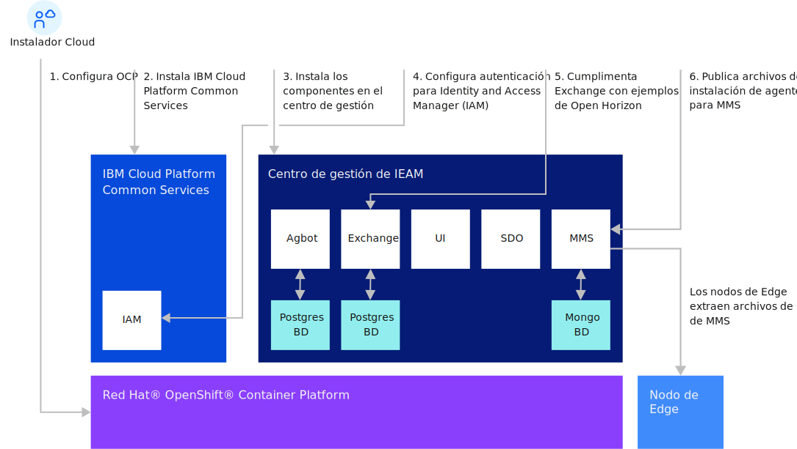

---

copyright:
years: 2020
lastupdated: "2020-10-28"

---

{:new_window: target="blank"}
{:shortdesc: .shortdesc}
{:screen: .screen}
{:codeblock: .codeblock}
{:pre: .pre}
{:child: .link .ulchildlink}
{:childlinks: .ullinks}

# Instalación del centro de gestión
{: #management_hub}

## Visión general de instalación de centro de gestión
Complete la instalación y la configuración del centro de gestión antes de iniciar las tareas del nodo de {{site.data.keyword.edge_notm}} ({{site.data.keyword.ieam}}).

* [Requisitos de sistema y dimensionamiento](cluster_sizing.md)
* [Configuración](configuration.md)
* [Instalación](installation.md)
  * [Instalar {{site.data.keyword.ieam}}](online_installation.md)
  * [Tareas posteriores a la instalación](post_install.md)
  * [Recopilar archivos de nodo periférico](gather_files.md)
* [Desinstalar](uninstalling_hub.md)

## Flujo de instalación de centro de gestión

## Información relacionada

* [Instalación de nodos periféricos](../installing/installing_edge_nodes.md)
