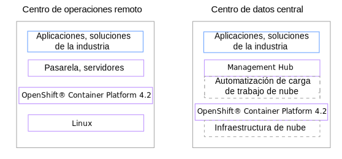
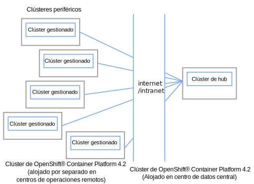
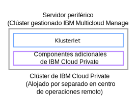
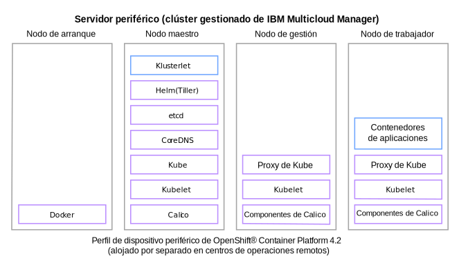

---

copyright:
  years: 2019
lastupdated: "2019-06-12"

---

{:new_window: target="blank"}
{:shortdesc: .shortdesc}
{:screen: .screen}
{:codeblock: .codeblock}
{:pre: .pre}
{:child: .link .ulchildlink}
{:childlinks: .ullinks}

# Visión general de clúster periférico
{: #edge_overview}

Edge Computing sirve para colocar aplicaciones empresariales más cerca del lugar donde se crean los datos.
{:shortdesc}

  * [Visión general](#overview)
  * [Ventajas de Edge Computing](#edge_benefits)
  * [Ejemplos](#examples)
  * [Arquitectura](#edge_arch)
  * [Conceptos](#concepts)

## Visión general
{: #overview}

Edge Computing es un importante paradigma emergente que amplía el modelo operativo virtualizando la nube más allá de un centro de datos o un centro de Cloud Computing. Edge Computing lleva las cargas de trabajo de aplicación desde una ubicación centralizada hasta ubicaciones remotas, como por ejemplo plantas de fábricas, almacenes, centros de distribución, tiendas, centros de transporte y otras. Esencialmente Edge Computing proporciona la capacidad de mover cargas de trabajo de aplicación a cualquier lugar en que sea necesario realizar proceso informático fuera de los centros de datos y del entorno de alojamiento en la nube.

{{site.data.keyword.edge_servers_notm}} proporciona características de Edge Computing para ayudarle a gestionar y desplegar cargas de trabajo de un clúster de hub en instancias remotas de {{site.data.keyword.icp_server}} u otros clústeres basados en Kubernetes.

{{site.data.keyword.edge_servers_notm}} utiliza {{site.data.keyword.mcm_core_notm}} para controlar el despliegue de las cargas de trabajo contenerizadas a los servidores periféricos, las pasarelas y los dispositivos alojados por los clústeres de {{site.data.keyword.icp_server}} en ubicaciones remotas.

{{site.data.keyword.edge_servers_notm}} también incluye soporte para un {{site.data.keyword.edge_profile}}. Este perfil soportado puede ayudarle a reducir el uso de recursos de {{site.data.keyword.icp_server}} cuando {{site.data.keyword.icp_server}} se instala para utilizarlo en el alojamiento de un servidor periférico remoto. Este perfil coloca los servicios mínimos que se necesitan para dar soporte a una gestión remota robusta de estos entornos de servidor y a las aplicaciones críticas de empresa que se alojan allí. Con este perfil, todavía puede autenticar usuarios, recopilar datos de registro y de sucesos y desplegar cargas de trabajo en un único nodo o en un conjunto de nodos de trabajador en clúster.

## Ventajas de Edge Computing
{: #edge_benefits}

* Cambio de valor añadido para la organización: mover cargas de trabajo de aplicación a nodos periféricos para dar soporte a operaciones en ubicaciones remotas en las que se recopilan los datos en lugar de enviar los datos al centro de datos para su proceso.

* Reducir la dependencia del personal de TI: la utilización de {{site.data.keyword.edge_servers_notm}} puede ayudar a reducir la dependencia del personal de TI. Con {{site.data.keyword.edge_servers_notm}} puede desplegar y gestionar cargas de trabajo críticas en servidores periféricos de forma segura y fiable a cientos de ubicaciones remotas desde una ubicación central sin que sea necesario desplegar personal de TI a tiempo completo en cada una de las ubicaciones remotas para gestionar las cargas de trabajo in situ.

## Ejemplos
{: #examples}

Edge Computing sirve para colocar aplicaciones empresariales más cerca del lugar donde se crean los datos. Por ejemplo, si gestiona una fábrica, el equipo de planta de la fábrica puede incluir sensores para registrar cualquier número de puntos de datos que proporcione detalles sobre cómo está funcionando la planta. Los sensores pueden registrar el número de piezas ensambladas por hora, el tiempo necesario para que un apilador regrese a su posición inicial o la temperatura de funcionamiento de una máquina de fabricación. La información de estos puntos de datos puede ser beneficiosa para ayudarle a determinar si está funcionando a máxima eficiencia, identificar los niveles de calidad que está alcanzando o predecir cuándo es probable que una máquina falle y requiera mantenimiento preventivo.

En otro ejemplo, si tiene trabajadores en ubicaciones remotas cuyo trabajo puede implicar que trabajen en situaciones peligrosas, como entornos calientes o ruidosos, que estén expuestos a gases de escape o de producción o a maquinaria pesada, es posible que tenga que supervisar las condiciones del entorno. Puede recopilar información de varios orígenes que se puede utilizar en las ubicaciones remotas. Los supervisores pueden utilizar estos datos para determinar cuándo indicar a los trabajadores que hagan una pausa, se rehidraten o apaguen el equipo.

En otro ejemplo, puedes usar cámaras de vídeo para supervisar las propiedades, por ejemplo para identificar la afluencia de personas a tiendas, restaurantes o lugares de entretenimiento, a modo de vigilancia de seguridad para registrar actos de vandalismo u otras actividades no deseadas o para reconocer condiciones de emergencia. Si también recopila datos de los vídeos, puede utilizar Edge Computing para procesar la analítica de vídeo localmente para ayudar a sus trabajadores a responder más rápido a las oportunidades y a los incidentes. Los trabajadores de los restaurantes pueden estimar mejor la cantidad de alimentos que se preparan, los jefes de tienda pueden determinar si abrir mostradores de venta adicionales y el personal de seguridad puede responder más rápido a las emergencias o avisar a los servicios de emergencias.

En todos estos casos, el envío de los datos registrados a un centro de Cloud Computing o a un centro de datos puede añadir latencia al proceso de datos. Esta pérdida de tiempo puede tener consecuencias negativas cuando intenta responder a situaciones u oportunidades críticas.

Si los datos registrados son datos que no necesitan ningún proceso especial ni ningún proceso sensible al tiempo, puede incurrir en costes de red y almacenamiento sustanciales por el envío innecesario de estos datos normales.

Por otro lado, si entre los datos recopilados, también hay datos confidenciales, como por ejemplo información personal, aumenta el riesgo de exposición de los datos cada vez que los mueve a otra ubicación distinta de aquella en la que se crearon.

Además, si alguna de las conexiones de red no es fiable, también puede correr el riesgo de interrumpir operaciones críticas.

## Arquitectura
{: #edge_arch}

El objetivo de Edge Computing es aprovechar las disciplinas que se han creado para Cloud Computing híbrido para dar soporte a operaciones remotas de instalaciones de Edge Computing. {{site.data.keyword.edge_servers_notm}} está diseñado para ese fin.

Un despliegue típico de {{site.data.keyword.edge_servers_notm}} incluye una instancia de {{site.data.keyword.icp_server}} que está instalada en el centro de datos de clúster de hub. Esta instancia de {{site.data.keyword.icp_server}} se utiliza para alojar un controlador de {{site.data.keyword.mcm_core_notm_novers}} dentro del clúster de hub. El clúster de hub es el lugar donde se produce la gestión de todos los servidores periféricos remotos. {{site.data.keyword.edge_servers_notm}} utiliza {{site.data.keyword.mcm_core_notm_novers}} para gestionar y desplegar cargas de trabajo del clúster de hub en los servidores periféricos basados en Kubernetes remotos cuando se necesitan operaciones remotas.

Estos servidores periféricos pueden instalarse en ubicaciones locales remotas para hacer que las cargas de trabajo de aplicación sean locales respecto donde se producen físicamente las operaciones de negocio críticas, como por ejemplo en fábricas, almacenes, puntos de venta al por menor, centros de distribución y más. Se necesitan una instancia de {{site.data.keyword.icp_server}} y un {{site.data.keyword.klust}} de {{site.data.keyword.mcm_core_notm_novers}} en cada una de las ubicaciones remotas en las que desea alojar un servidor periférico. El {{site.data.keyword.klust}} de {{site.data.keyword.mcm_core_notm_novers}} se utiliza para gestionar de forma remota los servidores periféricos.

El diagrama siguiente muestra la topología de nivel alto de una configuración típica de Edge Computing que utiliza {{site.data.keyword.icp_server}} y {{site.data.keyword.mcm_core_notm_novers}}:

El diagrama siguiente muestra la arquitectura de nivel alto típica de un sistema {{site.data.keyword.edge_servers_notm}}:

Los diagramas siguientes muestran la arquitectura de nivel alto para los despliegues típicos de los componentes de {{site.data.keyword.edge_servers_notm}}:

* Clúster de hub

  

  El clúster de hub de {{site.data.keyword.mcm_core_notm_novers}} actúa como un centro de gestión. El clúster de hub está normalmente configurado con todos los componentes de {{site.data.keyword.icp_server}} que son necesarios para llevar el negocio. Estos componentes necesarios incluyen los componentes que son necesarios para dar soporte a las operaciones que se ejecutan en los servidores periféricos remotos.

* Servidor periférico remoto

  

  Cada servidor periférico remoto es un clúster gestionado de {{site.data.keyword.mcm_core_notm_novers}} que incluye un {{site.data.keyword.klust}} instalado. Cada servidor periférico remoto se puede configurar con cualquiera de los servicios alojados de {{site.data.keyword.icp_server}} estándar que son necesarios para el centro de operaciones remoto y no están restringidos por los recursos del servidor periférico.

  Si las restricciones de recursos son un factor de limitación para un servidor periférico, la configuración mínima de {{site.data.keyword.icp_server}} se puede lograr mediante el {{site.data.keyword.edge_profile}}. Si la configuración del {{site.data.keyword.edge_profile}} se utiliza para el servidor de borde, la topología típica puede parecerse al diagrama siguiente:

  

  Los componentes dentro de esta topología sirven principalmente de proxy para sus homólogos dentro del clúster de hub y pueden descargar trabajo en el clúster de hub. Los componentes de servidor periférico también completan el procesamiento local mientras las conexiones entre el servidor periférico remoto y el clúster de hub están temporalmente desconectadas, como por ejemplo debido a una conectividad de red no fiable entre las ubicaciones.

## Conceptos
{: #concepts}

**Edge Computing**: un modelo de informática distribuida que aprovecha el cálculo disponible fuera de los centros de datos tradicionales y en la nube. Un modelo Edge Computing coloca una carga de trabajo más cerca de donde se crean los datos asociados y de donde se realizan acciones en respuesta al análisis de esos datos. La colocación de datos y cargas de trabajo en dispositivos periféricos reduce las latencias, baja la demanda de ancho de banda de red, aumenta la privacidad de la información confidencial y permite realizar operaciones durante las interrupciones de red.

**dispositivo periférico**: una pieza de equipo, como por ejemplo una máquina de ensamblaje en una fábrica, un cajero automático, una cámara inteligente o un automóvil que tiene capacidad de cálculo integrada en la que se puede realizar trabajo significativo y se pueden recopilar o generar datos.

**pasarela periférica**: Un servidor periférico que tiene servicios que realizan funciones de red como por ejemplo la conversión de protocolos, la terminación de la red, el tunelado, la protección mediante cortafuegos o las conexiones inalámbricas. Una pasarela periférica sirve como punto de conexión entre un dispositivo periférico o un servidor periférico y la nube o una red más grande.

**nodo periférico**: cualquier dispositivo periférico, servidor periférico o pasarela periférica en los que tiene lugar Edge Computing.

**servidor periférico**: un sistema de una instalación operativa remota que ejecuta cargas de trabajo de aplicación de empresa y servicios compartidos. Un servidor periférico se puede utilizar para conectarse a un dispositivo periférico, conectarse a otro servidor periférico o servir como pasarela periférica para conectar con la nube o con una red más grande.

**servicio periférico**: un servicio diseñado específicamente para desplegarse en un servidor periférico, una pasarela periférica o un dispositivo periférico. El reconocimiento visual, la percepción acústica y el reconocimiento de voz son todos ejemplos de posibles servicios periféricos.

**carga de trabajo periférica**: cualquier servicio, microservicio o fragmento de software que realiza un trabajo significativo cuando se ejecuta en un nodo periférico.

- [Requisitos y recomendaciones de hardware](cluster_sizing.md)
- [Instalación de componentes compartidos de {{site.data.keyword.edge_notm}}](install_edge.md)
{: childlinks}
