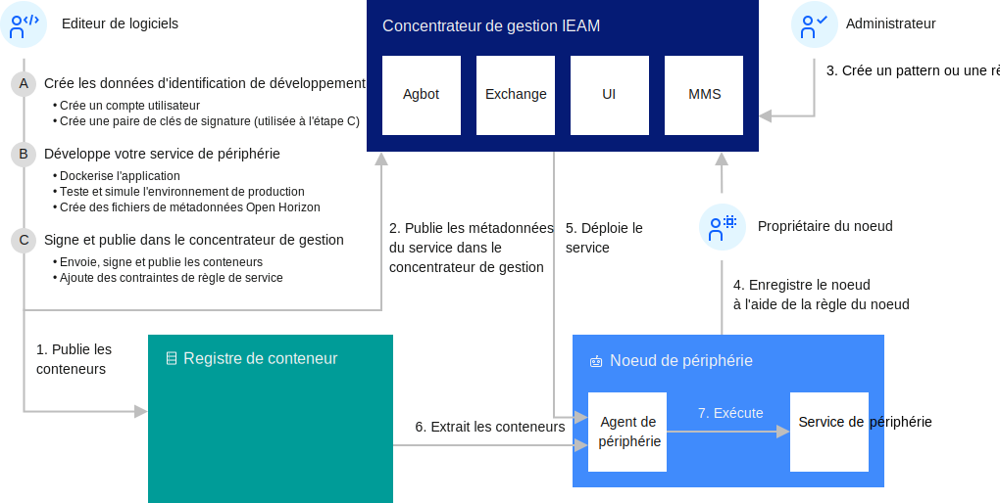

---

copyright:
years: 2020
lastupdated: "2020-04-09"

---

{:new_window: target="blank"}
{:shortdesc: .shortdesc}
{:screen: .screen}
{:codeblock: .codeblock}
{:pre: .pre}
{:child: .link .ulchildlink}
{:childlinks: .ullinks}

# Développement d'un service de périphérie pour les dispositifs
{: #developing}

Pour commencer à développer des services de périphérie pour {{site.data.keyword.edge_notm}} ({{site.data.keyword.ieam}}), vous devez d'abord configurer vos données d'identification pour la publication de contenu. Tous les services ayant besoin d'être signés, vous devez également créer une paire de clés de signature cryptographique. Assurez-vous d'effectuer les étapes préalables décrites à la section [Préparation de la création d'un service de périphérie](service_containers.md).

Le diagramme ci-dessous illustre les interactions types entre les composants {{site.data.keyword.horizon}}.

 

## Exemples
{: #edge_devices_ex_examples}

Utilisez vos données d'identification et vos clés de signature pour accomplir les exemples de développement. Ces exemples vous montrent comment générer des services simples et vous aident à comprendre les bases du développement sous {{site.data.keyword.ieam}}.

Chacun de ces exemples de développement aborde des aspects supplémentaires du développement de services de périphérie. Pour bénéficier de la meilleure expérience d'apprentissage possible, suivez les exemples dans l'ordre dans lequel ils sont présentés.

* [Transformation d'une image en un service de périphérie](transform_image.md) : illustre le déploiement d'une image Docker existante en tant que service de périphérie.

* [Création d'un service de périphérie Hello world](developingstart_example.md) : fournit les bases du développement, du test, de la publication et du déploiement d'un service de périphérie.

* [Unité centrale vers le service {{site.data.keyword.message_hub_notm}}](cpu_msg_example.md) : montre comment définir les paramètres de configuration d'un service de périphérie, comment spécifier que le service de périphérie nécessite d'autres services de périphérie et comment envoyer des données vers un service de réception des données cloud.

* [Hello world à l'aide de la gestion des modèles](model_management_system.md) : explique comment développer un service de périphérie qui utilise le service de gestion des modèles. Ce dernier fournit de manière asynchrone les mises à jour de fichier vers les services de périphérie sur les noeuds de périphérie, par exemple pour mettre à jour dynamiquement un modèle d'apprentissage automatique chaque fois que le modèle évolue.

* [Mise à jour d'un service de périphérie avec restauration de la version précédente](../using_edge_services/service_rollbacks.md) : indique comment surveiller le succès du déploiement, et en cas d'échec sur l'un des noeuds de périphérie, rétablir l'ancienne version du service de périphérie.

Une fois ces exemples de services générés, consultez la documentation suivante pour en savoir plus sur le développement de services pour {{site.data.keyword.ieam}} :

## Lecture supplémentaire
{: #developing_more_info}

Consultez les grands principes et les meilleures pratiques concernant le développement logiciel d'{{site.data.keyword.ieam}}.

* [Pratiques de développement natif Edge](best_practices.md)

{{site.data.keyword.ieam}} vous permet de placer des images de conteneur de services dans le registre de conteneurs sécurisés privé d'IBM plutôt que sur le Docker Hub public. Par exemple, si vous avez une image logicielle qui inclut des actifs qui ne sont pas appropriés pour inclure dans un registre public.

* [Utilisation d'un registre de conteneur privé](container_registry.md)

Vous pouvez utiliser {{site.data.keyword.ieam}} pour placer vos conteneurs de services dans le registre de conteneurs sécurisés privé d'IBM plutôt que sur le Docker Hub public.

* [Informations relatives au développement](developing_details.md)

Avec {{site.data.keyword.ieam}}, vous pouvez développer n'importe quel conteneur de services pour vos machines de périphérie.

* [API](../api/edge_rest_apis.md)

{{site.data.keyword.ieam}} fournit des API RESTful permettant aux composants de collaborer et aux développeurs et utilisateurs de votre organisation de contrôler ces composants.
