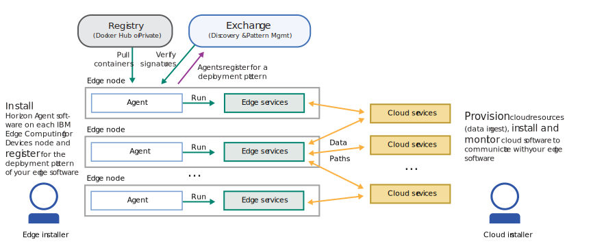

---

copyright:
years: 2020
lastupdated: "2020-4-8"

---

{:new_window: target="blank"}
{:shortdesc: .shortdesc}
{:screen: .screen}
{:codeblock: .codeblock}
{:pre: .pre}
{:child: .link .ulchildlink}
{:childlinks: .ullinks}

# Dispositifs de périphérie
{: #edge_devices}

# Avant de commencer

Prenez connaissance des prérequis suivants pour l'utilisation des dispositifs de périphérie :

* [Préparation d'un dispositif de périphérie](#adding-devices)
* [Architectures et systèmes d'exploitation pris en charge](#suparch-horizon)
* [Dimensionnement](#size)

Remarque : Les dispositifs de périphérie sont également appelés des agents. Consultez la Note du rédacteur pour obtenir une description des clusters et des dispositifs de périphérie.

## Préparation d'un dispositif de périphérie
{: #adding-devices}

{{site.data.keyword.edge_devices_notm}} utilise le logiciel de projets [{{site.data.keyword.horizon_open}} ](https://github.com/open-horizon/). Les {{site.data.keyword.horizon_agents}} installés sur vos dispositifs de périphérie communiquent avec d'autres composants {{site.data.keyword.horizon}} pour organiser de manière sécurisée la gestion du cycle de vie des logiciels sur leurs dispositifs.
{:shortdesc}

Le diagramme ci-dessous illustre les interactions types entre les composants de {{site.data.keyword.horizon}}.

Tous les dispositifs de périphérie (noeuds de périphérie) nécessitent l'installation du logiciel de l'{{site.data.keyword.horizon_agent}}. L'{{site.data.keyword.horizon_agent}} dépend également du logiciel [Docker ](https://www.docker.com/). 

Le diagramme ci-dessous illustre le flux des étapes nécessaires à la configuration du dispositif de périphérie, ainsi que les opérations exécutées par l'agent une fois celui-ci démarré.

Agbots et agents 

Les instructions ci-dessous vous guident tout au long du processus d'installation du logiciel requis sur votre dispositif de périphérie et d'enregistrement de ce dernier avec {{site.data.keyword.edge_devices_notm}}.

## Architectures et systèmes d'exploitation pris en charge
{: #suparch-horizon}

{{site.data.keyword.edge_devices_notm}} prend en charge les systèmes avec les architectures matérielles suivantes :

* Les dispositifs ou les machines virtuelles {{site.data.keyword.linux_bit_notm}} fonctionnant sous Ubuntu 18.x (Bionic), Ubuntu 16.x (Xenial), Debian 10 (Buster) ou Debian 9 (Stretch)
* {{site.data.keyword.linux_notm}} sur ARM (32 bits), par exemple Raspberry Pi, fonctionnant sous Raspbian Buster ou Stretch
* {{site.data.keyword.linux_notm}} sur ARM (64 bits), par exemple NVIDIA Jetson Nano, TX1 ou TX2, fonctionnant sous Ubuntu 18.x (Bionic)
* {{site.data.keyword.macOS_notm}}

## Dimensionnement
{: #size}

L'agent nécessite :

1. 100 Mo de RAM (Docker inclus). La taille de la mémoire RAM augmente d'environ 100 K par accord, plus toute autre mémoire requise par les charges de travail qui s'exécutent sur le noeud.
2. Disque de 400 Mo (Docker inclus). La taille de disque peut augmenter en fonction de la taille des images de conteneur qui sont utilisées par les charges de travail et de la taille des objets de modèle (x2) qui sont déployés sur le noeud.

## Etapes suivantes

[Installation de l'agent](installing_the_agent.md)
