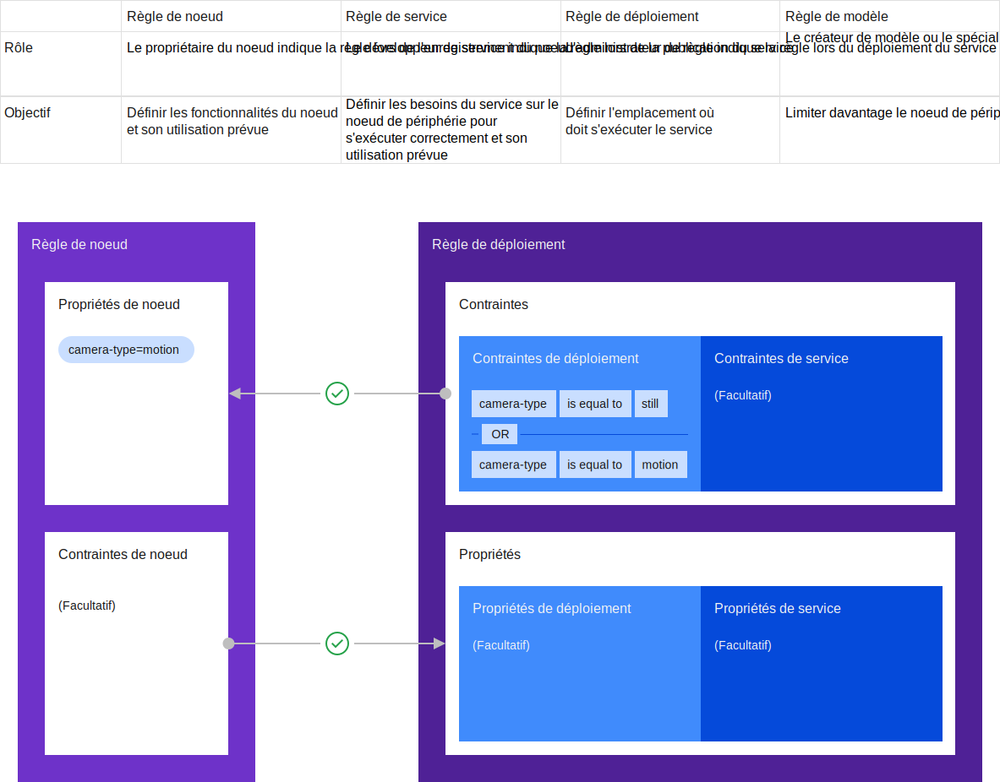

---

copyright:
  years: 2020
lastupdated: "2020-04-8"

---

{:new_window: target="blank"}
{:shortdesc: .shortdesc}
{:screen: .screen}
{:codeblock: .codeblock}
{:pre: .pre}
{:child: .link .ulchildlink}
{:childlinks: .ullinks}

# Scénario d'utilisation d'une règle de déploiement
{: #developing_edge_services}

Cette section propose un cas d'utilisation concret des types de règles.



Un client a installé des caméras aux distributeurs automatiques de billets (DAB) afin de détecter d'éventuelles fraudes (le client possède également d'autres types de noeuds de périphérie). Ce client exploite des DAB accessibles à pied et d'autres accessibles en voiture. Dans notre exemple, deux services tiers sont disponibles. Chaque service permet de détecter les activités frauduleuses aux DAB, mais les tests effectués par le client ont montré que le service atm1 est plus efficace sur les DAB accessibles à pied et que le service atm2 est plus fiable sur ceux accessibles en voiture.

Voici la manière dont la règle est formulée pour obtenir le service et le modèle de déploiement souhaités :

* Définition des propriétés dans la règle de noeud sur tous les DAB accessibles à pied : propriétés : `sensor: camera`, `atm-type: walk-up`
* Définition des propriétés dans la règle de noeud sur tous les DAB accessibles en voiture : propriétés : `sensor: camera`, `atm-type: drive-thru`
* Définition des contraintes dans la règle de service définie par les développeurs tiers des services atm1 et atm2 : contraintes : `sensor == camera`
* Définition des contraintes dans la règle de déploiement définie par le client pour le service atm1 : contraintes : `atm-type == walk-up`
* Définition des contraintes dans la règle de déploiement définie par le client pour le service atm2 : contraintes : `atm-type == drive-thru`

Remarque: La commande `hzn` utilise parfois le terme règle métier lorsque l'on fait référence à la règle de déploiement.

La règle de noeud (définie par le technicien qui a installé les DAB) fournit des informations sur chaque noeud, par exemple, si le DAB est muni d'une caméra et le type d'emplacement du DAB. Ces informations sont simples à déterminer et à spécifier.

La règle de service est une instruction relative aux spécifications nécessaires au bon fonctionnement du service (dans notre exemple, une caméra). Le développeur du service tiers connaît ces informations, même s'il ne sait pas quel client les utilisent. Si le client possède d'autres DAB qui ne sont pas munis de caméras, les services ne sont pas déployés sur ces DAB en raison de cette contrainte.

La règle de déploiement est définie par le DSI du client (ou quiconque est responsable de la gestion de flotte des noeuds). Elle permet de définir la totalité du déploiement du service pour l'entreprise. Dans notre exemple, le DSI exprime le résultat attendu du déploiement de service, à savoir que le service atm1 soit utilisé sur les DAB accessibles à pied et que le service atm2 soit utilisé sur les DAB accessibles en voiture.

## Règle de noeud
{: #node_policy}

Une règle peut être associée à un noeud. Le propriétaire du noeud peut la spécifier au moment de l'enregistrement du noeud, et elle peut être modifiée à tout moment, directement sur le noeud ou de manière centralisée par un administrateur {{site.data.keyword.edge_devices_notm}}. Si la règle du noeud est modifiée de manière centralisée, les modifications s'appliqueront la prochaine fois que le noeud enverra des signaux de présence au concentrateur de gestion. Si elle est modifiée directement sur le noeud, les modifications s'appliqueront immédiatement au concentrateur de gestion afin que le déploiement du service et du modèle puisse être réévalué au plus vite. Par défaut, un noeud possède certaines [propriétés intégrées](#node_builtins) qui spécifient la mémoire, l'architecture et le nombre d'unités centrales. Il peut également contenir des propriétés arbitraires, telles que le modèle du produit, les dispositifs associés, la configuration logicielle ou toute autre information jugée utile par le propriétaire du noeud. Des contraintes de règle de noeud peuvent être fixées afin de limiter les services autorisés à s'exécuter sur ce noeud. Chaque noeud possède une seule règle qui contient toutes les propriétés et contraintes définies pour ce noeud.

## Règle de service
{: #service_policy}

Remarque : La règle de service est une fonction facultative.

A l'instar des noeuds, les services peuvent inclure une règle et recourir à certaines [propriétés intégrées](#service_builtins). Ce type de règle s'applique à un service qui est publié dans Exchange et qui est créé par le développeur du service. Les propriétés de la règle de service peuvent définir les caractéristiques du code de service que les auteurs de la règle de noeud pourraient trouver pertinentes. Des contraintes de règle de service peuvent être fixées afin de limiter le champ d'application du service (localisation et type de dispositif). Par exemple, le développeur du service peut stipuler que le service nécessite une configuration matérielle particulière, par exemple en termes de contraintes de CPU/GPU, de contraintes de mémoire, de capteurs spécifiques, de régulateurs ou d'autres dispositifs de périphérie. En règle générale, les propriétés et les contraintes restent statiques pour toute la durée de vie du service, car elles décrivent les aspects de la mise en oeuvre de ce service. Dans les scénarios d'utilisation attendue, toute modification apportée au niveau des propriétés et des contraintes se traduit généralement par une modification du code qui nécessite une nouvelle version du service. Les règles de déploiement permettent alors de capturer les aspects plus dynamiques du déploiement de service qui relèvent des exigences métier.

## Règle de déploiement
{: #deployment_policy}

Une règle de déploiement sert à déployer un service. Elle contient un ensemble de propriétés et de contraintes comme pour les autres types de règles, avec d'autres éléments en plus. Par exemple, elle détecte explicitement un service à déployer, et elle peut éventuellement contenir des informations sur les valeurs de variable de configuration, sur les versions de service antérieures et sur les paramètres de santé du noeud. L'utilisation conjointe d'une règle de déploiement et de valeurs de configuration se révèle très efficace dans la mesure où elle permet d'effectuer l'opération de manière centralisée, sans avoir besoin de se connecter directement au noeud de périphérie.

Les administrateurs peuvent créer une règle de déploiement qui est ensuite utilisée par {{site.data.keyword.edge_devices_notm}} pour localiser tous les dispositifs correspondant aux contraintes définies et pour déployer le service spécifié sur ces dispositifs à l'aide des variables de service configurées dans la règle. Les versions antérieures du service indiquent à {{site.data.keyword.edge_devices_notm}} quelle version de service déployer en cas d'échec de déploiement d'une version ultérieure du service. Les paramètres sur la santé du noeud indiquent la façon dont {{site.data.keyword.edge_devices_notm}} doit évaluer la santé (signaux de présence et communication du concentrateur de gestion) d'un noeud avant de déterminer s'il n'est plus conforme.

Etant donné que les règles de déploiement capturent les propriétés et les contraintes de service métier les plus dynamiques, elles sont censées changer plus souvent qu'une règle de service. Leur cycle de vie est indépendant du service auquel elles font référence, ce qui donne à l'administrateur de règle la possibilité d'indiquer une version ou une plage de versions de service spécifique. {{site.data.keyword.edge_devices_notm}} fusionne ensuite la règle de service et la règle de déploiement, puis recherche les noeuds dont la règle est compatible.

## Règle de modèle
{: #model_policy}

Les services basés sur l'apprentissage automatique nécessitent des types de modèles spécifiques pour fonctionner correctement, et les clients d'{{site.data.keyword.edge_devices_notm}} doivent être en mesure de placer les modèles spécifiques sur les mêmes noeuds, ou un sous-ensemble de ces noeuds, que ceux où se trouvent ces services. Une règle de modèle a pour objectif de réduire davantage l'ensemble des noeuds où un service donné est déployé, ce qui permet à un sous-ensemble de ces noeuds de recevoir un objet de modèle spécifique via [Hello world à l'aide de la gestion des modèles](../developing/model_management_system.md).

## Scénario d'utilisation étendu d'une règle
{: #extended_policy_use_case}

Dans notre exemple avec les DAB, le client exploite des DAB accessibles à pied dans des zones rurales peu fréquentées. Le client ne souhaite pas exploiter ces DAB en continu et ne souhaite pas non plus activer les DAB chaque fois qu'un objet à proximité est détecté. Par conséquent, le développeur du service ajoute un modèle d'apprentissage automatique au service atm1 qui va activer le DAB lorsqu'il identifie une personne qui se rapproche. Pour pouvoir déployer spécifiquement le modèle d'apprentissage sur ces DAB en zones rurales, il configure la règle comme suit :

* Définition des propriétés dans la règle de noeud relative aux DAB accessibles à pied dans une zone rurale : propriétés : `sensor: camera`, `atm-type: walk-up`, `location:  rural`
* Définition des contraintes dans la règle de service définie par les développeurs tiers pour le service atm1 : contraintes : `sensor == camera`
* Définition des contraintes dans la règle de déploiement définie par le client pour le service atm1 : contraintes : `atm-type == walk-up`
* Définition des contraintes suivantes dans la règle de modèle définie par les développeurs tiers dans l'objet MMS pour le service atm1 :

```
"destinationPolicy": {
  "constraints": [ "location == rural"  ],
  "services": [
       { "orgID": "$HZN_ORG_ID",
         "serviceName": "atm1",
         "arch": "$ARCH",  
         "version": "$VERSION"
       }
  ]
}
```
{: codeblock}

Dans l'objet MMS, la règle de modèle déclare un service (ou une liste de services) qui peut accéder à l'objet (dans notre exemple, le service atm1) et déclare les propriétés et les contraintes qui permettent à {{site.data.keyword.edge_devices_notm}} de restreindre davantage l'emplacement approprié de l'objet sur les DAB situés en zones rurales. Les autres services qui s'exécutent sur le DAB ne seront pas en mesure d'accéder à l'objet.

## Propriétés
{: #properties}

Les propriétés portent essentiellement sur des faits exprimés sous la forme de paires nom=valeur. Les propriétés sont également saisies, ce qui permet de construire des expressions puissantes. Les tableaux ci-dessous décrivent les types de valeurs de propriétés prises en charge par {{site.data.keyword.edge_devices_notm}} et présentent les propriétés des règles de service et de noeud intégrées. Les propriétaires de noeud, les développeurs de service et les administrateurs de règle de déploiement peuvent définir des propriétés individuelles pour répondre à leurs besoins. Les propriétés n'ont pas besoin d'être définies dans un référentiel central ; vous pouvez les définir et les référencer (dans des expressions de contraintes) selon vos besoins.

|Types de valeurs de propriétés admis|
|-----------------------------|
|version - dotted decimal expression supporting 1, 2 or 3 parts; for example, 1.2, 2.0.12, etc|
|string *|
|list of strings (comma-separated strings)|
|integer|
|boolean|
|float|
{: caption="Tableau 1. Types de valeurs de propriétés admis"}

*Les chaînes de valeur qui contiennent des espaces doivent être placées entre guillemets.

Les propriétés intégrées fournissent des noms clairement définis pour les propriétés communes afin que les contraintes puissent toutes s'y référer de la même manière. Par exemple, si un service a besoin de `x` unités centrales pour s'exécuter correctement ou efficacement, il peut utiliser la propriété `openhorizon.cpu` dans sa contrainte. La plupart de ces propriétés ne sont pas configurables, mais sont lues par le système sous-jacent et ne tiennent pas compte des valeurs définies par l'utilisateur.

### Propriétés de noeud intégrées
{: #node_builtins}

|Nom|Type|Description|Type de règle|
|----|----|-----------|-----------|
|openhorizon.cpu|Entier|Nombre d'unités centrales|Noeud|
|openhorizon.memory|Entier|Quantité de mémoire en Mo|Noeud|
|openhorizon.arch|Chaîne|Architecture matérielle du noeud (par exemple, amd64, armv6, etc.)|Noeud|
|openhorizon.hardwareId|Chaîne|Numéro de série du matériel du noeud, si disponible, via l'interface de programmation Linux ; sinon, numéro aléatoire sécurisé qui reste identique pendant toute la durée d'enregistrement du noeud|Noeud|
|openhorizon.allowPrivileged|Booléen|Permet aux conteneurs d'utiliser des privilèges, tels que l'exécution de fonctions avec privilèges ou la connexion réseau de l'hôte au conteneur.|Noeud|
{: caption="Tableau 2. Propriétés de noeud intégrées"}

### Propriétés de service intégrées
{: #service_builtins}

|Nom|Type|Description|Type de règle|
|----|----|-----------|-----------|
|openhorizon.service.url|Chaîne|Nom unique du service|Service|
|openhorizon.service.org|Chaîne|Organisation à service partagé dans laquelle le service est défini*|Service|
|openhorizon.service.version|Version|Version d'un service utilisant la même syntaxe de version (par exemple, 1.0.0)|Service|
{: caption="Tableau 3. Propriétés de service intégrées"}

*Dans une contrainte, si la valeur service.url est spécifiée, mais pas la valeur service.org, l'organisation par défaut est celle de la règle de noeud ou de déploiement qui définit la contrainte.

## Contraintes
{: #constraints}

Dans {{site.data.keyword.edge_devices_notm}}, les règles de noeud, de service et de déploiement permettent de définir des contraintes. Les contraintes sont exprimées sous la forme d'un prédicat en texte simple et se rapportent aux propriétés et à leurs valeurs, ou à une plage de leurs valeurs possibles. Les contraintes peuvent également contenir des opérateurs booléens, tels que AND (&&) ou OR (||), entre les différentes expressions des propriétés et des valeurs pour former des clauses plus longues. Par exemple, `openhorizon.arch == amd64 && OS == Mojave`. Enfin, vous pouvez utiliser des parenthèses pour accorder une priorité au sein d'une expression unique.

|Type de valeur de propriété|Opérateurs pris en charge|
|-------------------|-------------------|
|integer|==, <, >, <=, >=, =, !=|
|string*|==, !=, =|
|List of string|in|
|Booléen|==, =|
|version|==, =, in**|
{: caption="Tableau 4. Contraintes"}

*Pour les types de chaînes, une chaîne entre guillemets avec plusieurs chaînes séparées par des virgules indique la liste des valeurs acceptables ; par exemple, `hello == "beautiful, world"` a la valeur "true" si hello correspond à "beautiful" ou à "world".

** Pour utiliser une plage de versions, indiquez `in` au lieu de `==`.

## Scénario d'utilisation d'une règle encore plus étendu
{: #extended_policy_use_case_more}

Pour illustrer toute la puissance du caractère bidirectionnel de la règle, nous allons reprendre notre exemple et ajouter des contraintes au noeud. Dans notre exemple, si certains des DAB accessibles à pied en zone rurale sont situés à proximité d'une source d'eau, cela crée des reflets que le service atm1 existant utilisé par les autres DAB accessibles à pied ne peut pas traiter. Un troisième service est donc requis pour traiter plus efficacement les reflets lumineux sur ces DAB et la règle configurée comme suit :

* Définition des paramètres suivants dans la règle de noeud pour les DAB accessibles à pieds en bordure d'eau : propriétés : `sensor: camera`, `atm-type: walk-up`; contraintes : `feature == glare-correction`
* Définition des contraintes suivantes dans la règle de service définie par les développeurs tiers pour le service atm 3 : `sensor == camera`
* Définition des paramètres suivants dans la règle de déploiement définie par le client pour le service atm3 : contraintes : `atm-type == walk-up` ; propriétés : `feature: glare-correction`  

Là encore, la règle définit des faits concernant le noeud. Toutefois, dans notre exemple, le technicien qui a configuré les DAB à proximité d'une source d'eau a ajouté une contrainte comme quoi le service à déployer sur ce noeud doit être équipé d'une fonction de correction des reflets.

La règle de service du service atm3 possède la même contrainte que les deux autres services, à savoir équiper le DAB d'une caméra.

Compte tenu que le client sait que le service atm3 gère mieux les reflets, il définit cette contrainte dans la règle de déploiement associée au service atm3, qui satisfait ainsi la propriété fixée sur le noeud et déploie ce service sur les DAB à proximité d'une source d'eau.

## Commandes de règles
{: #policy_commands}

|Commande|Description|
|-------|-----------|
|`hzn policy list`|Règle du dispositif de périphérie.|
|`hzn policy new`|Modèle de règle de noeud vide pouvant être complété.|
|hzn policy update --input-file=INPUT-FILE|Met à jour la règle du noeud. Les propriétés de noeud intégrées sont automatiquement ajoutées si la règle d'entrée ne les contient pas déjà.|
|`hzn policy remove [<flags>]`|Supprime la règle du noeud.|
|`hzn exchange node listpolicy [<flags>`] <node>|Affiche la règle de noeud depuis Horizon Exchange.|
|`hzn exchange node addpolicy --json-file=JSON-FILE [<flags>`] <node>|Ajoute ou remplace la règle de noeud dans Horizon Exchange.|
|`hzn exchange node updatepolicy --json-file=JSON-FILE [<flags>`] <node>|Met à jour un attribut de la règle pour ce noeud dans Horizon Exchange.|
|`hzn exchange node removepolicy [<flags>`] <node>|Supprime la règle de noeud dans Horizon Exchange.|
|`hzn exchange service listpolicy [<flags>`] <service>|Affiche la règle du service depuis Horizon Exchange.|
|`hzn exchange service newpolicy|Affiche un modèle de règle de service vide à compléter.|
|`hzn exchange service addpolicy --json-file=JSON-FILE [<flags>`] <service>|Ajoute ou remplace la règle de service dans Horizon Exchange.|
|`hzn exchange service removepolicy [<flags>`] <service>|Supprime la règle de service dans Horizon Exchange.|
|`hzn exchange business listpolicy [<flags>] [<policy>]`|Affiche les règles métier depuis Horizon Exchange.|
|`hzn exchange business new`|Affiche un modèle de règle de déploiement vide à compléter.|
|`hzn exchange business addpolicy --json-file=JSON-FILE [<flags>`] <policy>|Ajoute ou remplace une règle de déploiement dans Horizon Exchange. Utilisez 'hzn exchange business new' pour un modèle de règle de déploiement vide.|
|`hzn exchange business updatepolicy --json-file=JSON-FILE [<flags>`] <policy>|Met à jour un attribut d'une règle de déploiement existante dans Horizon Exchange. Les attributs pris en charge sont les attributs de niveau supérieur dans la définition de règle, comme affiché par la commande 'hzn exchange business new'.|
|`hzn exchange business removepolicy [<flags>`] <policy>|Supprime la règle de déploiement dans Horizon Exchange.|
|`hzn dev service new [<flags>`]|Crée un projet de service. Cette commande génère tous les fichiers de métadonnées du service IEC, y compris le modèle de règle de service.|
|`hzn deploycheck policy [<flags>`]|Vérifie la compatibilité entre les règles de noeud, de service et de déploiement. Il est également conseillé d'utiliser la commande 'hzn deploycheck all' pour vérifier que les variables de service sont correctement configurées.|
{: caption="Tableau 5. Outils de développement de règles"}

Pour obtenir davantage d'informations sur l'utilisation de la commande `hzn`, voir la rubrique [Informations sur la commande hzn](../installing/exploring_hzn.md).
