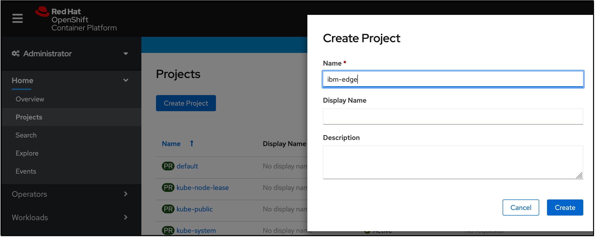
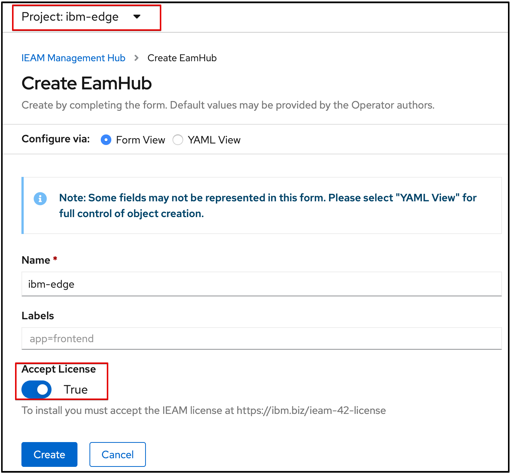

---

copyright:
  years: 2020
lastupdated: "2020-10-28"

---

{:new_window: target="blank"}
{:shortdesc: .shortdesc}
{:screen: .screen}
{:codeblock: .codeblock}
{:pre: .pre}
{:child: .link .ulchildlink}
{:childlinks: .ullinks}

# Installation de {{site.data.keyword.ieam}}
{: #hub_install_overview}

Vous devez installer et configurer un concentrateur de gestion avant de démarrer les tâches de noeud {{site.data.keyword.edge_notm}} ({{site.data.keyword.ieam}}).

## Récapitulatif de l'installation
{: #sum}

* Ce contenu décrit les étapes de déploiement des composants ci-dessous.
  * [IBM Cloud Platform Common Services 3.6.x](https://www.ibm.com/docs/en/cpfs).
  * Opérateur de concentrateur de gestion {{site.data.keyword.edge_notm}}
  * Interface de programmation d'{{site.data.keyword.edge_notm}} Exchange
  * Agbot d'{{site.data.keyword.edge_notm}}
  * Service de synchronisation Cloud (CSS) d'{{site.data.keyword.edge_notm}}
  * Interface utilisateur d'{{site.data.keyword.edge_notm}}
  * SDO (Secure Device Onboarding) pour {{site.data.keyword.edge_notm}}
  * {{site.data.keyword.edge_notm}} Gestionnaire des secrets (Vault).

**Remarque**: Consultez la [documentation de mise à niveau](upgrade.md) si vous tentez de faire une mise à niveau à partir d'une version précédente.

## Prérequis
{: #prereq}

### {{site.data.keyword.ocp_tm}}
Assurez-vous que vous avez une installation 4.6 [de taille et de support](cluster_sizing.md) appropriés{{site.data.keyword.open_shift_cp}}, y compris une classe de stockage appropriée installée et fonctionnant dans votre cluster.

Pour plus d'informations sur la mise à disposition d'un cluster {{site.data.keyword.open_shift_cp}} 4.6 géré par IBM Cloud, voir:

* [{{site.data.keyword.ocp_tm}} sur {{site.data.keyword.cloud}}](https://www.ibm.com/cloud/openshift)

Pour plus d'informations sur la création de votre propre cluster {{site.data.keyword.open_shift_cp}} géré, reportez-vous à la documentation {{site.data.keyword.open_shift}} :

* [{{site.data.keyword.open_shift_cp}} 4.6 Documentation](https://docs.openshift.com/container-platform/4.6/welcome/index.html)

**Remarque**: Par défaut, un gestionnaire de secrets de développement local et des bases de données de développement sont mis à disposition dans le cadre du déploiement de l'opérateur. Pour plus d'informations sur la connexion à vos propres bases de données mises à disposition et sur d'autres options de configuration, consultez la page [Configuration](configuration.md).

Vous êtes responsable de la sauvegarde et de la restauration de toutes les données persistantes, voir [sauvegarde et reprise](../admin/backup_recovery.md).

## Processus d'installation du navigateur
{: #process}

1. Connectez-vous à l'interface utilisateur Web d'{{site.data.keyword.open_shift_cp}} avec les droits d'administrateur de cluster. Accédez à la page **Stockage** pour confirmer qu'une classe de stockage **par défaut** prise en charge est définie :

   

   **Remarque** : pour plus d'informations sur l'utilisation d'une classe de stockage autre que celle par défaut, voir la page [Configuration](configuration.md).

2. Créez l'IBM Operator Catalog Source, qui permet d'installer le bundle du **concentrateur de gestion IEAM**. Copiez et collez ce texte après avoir sélectionné le signe plus d'importation, comme illustré dans ci-dessous suivante. Après avoir collé le texte, cliquez sur **Créer** :

   ```
   apiVersion: operators.coreos.com/v1alpha1    kind: CatalogSource    metadata:      name: ibm-operator-catalog      namespace: openshift-marketplace    spec:      displayName: IBM Operator Catalog      publisher: IBM      sourceType: grpc      image: icr.io/cpopen/ibm-operator-catalog:latest      updateStrategy:        registryPoll:          interval: 45m
   ```
   {: codeblock}

   

3. Créez l'IBM Common Services Operator Catalog Source. Il fournit la suite d'opérateurs de services communs que le **concentrateur de gestion IEAM** installera en supplément. Copiez et collez ce texte après avoir sélectionné le signe plus d'importation, comme illustré dans ci-dessous suivante. Après avoir collé le texte, cliquez sur **Créer** :
   ```
   apiVersion: operators.coreos.com/v1alpha1   kind: CatalogSource   metadata:     name: opencloud-operators     namespace: openshift-marketplace   spec:     displayName: IBMCS Operators     publisher: IBM     sourceType: grpc     image: quay.io/opencloudio/ibm-common-service-catalog:3.6     updateStrategy:       registryPoll:         interval: 45m
   ```
   {: codeblock}

   

4. Accédez à la page **Projets** et créez un projet dans lequel vous souhaitez installer l'opérateur :

   

5. Définissez un secret d'extraction d'image appelé **ibm-entitlement-key** pour vous authentifier auprès d'IBM Entitled Registry :

   **Remarques** :
   * Obtenez votre clé d'autorisation via [Ma clé IBM](https://myibm.ibm.com/products-services/containerlibrary) et remplissez les zones comme indiqué dans le contenu ci-dessous.
   * Assurez-vous que cette ressource est créée dans le même projet que celui créé à l'étape précédente.

   

6. Accédez à la page **OperatorHub** et recherchez **IEAM Management Hub**.

7. Cliquez sur la carte **IEAM Management Hub**, puis sur **Install**.

8. Installez l'opérateur, en vous assurant que le projet correspond à ce qui a été créé à l'étape 4.

   **Remarque** : il s'agit du seul projet que l'opérateur **IEAM Management Hub** surveille après son installation.

   

9. Revenez au **Projet** créé à l'étape 4, cliquez sur **EamHub** dans la colonne **API fournies** présentée à l'étape 7, puis cliquez sur **Créer EamHub** :

   

10. Créez la ressource personnalisée **EamHub**, qui définit et configure votre concentrateur de gestion. Pour plus d'informations sur les options de personnalisation, voir [Configuration](configuration.md). Assurez-vous que le projet correspond à celui créé à l'étape 4.

   * Cliquez sur la bascule **Accepter la licence** et sur **Créer** pour accepter la licence.

   

L'opérateur va déployer les charges de travail définies du projet spécifié à l'étape 4 et les charges de travail {{site.data.keyword.common_services}} requises dans le projet **ibm-common-services**.

## Etape suivante

Continuez à configurer votre nouveau concentrateur de gestion en effectuant les étapes de la [post-installation](post_install.md).
