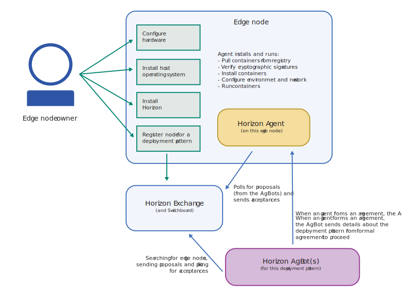

---

copyright:
years: 2020
lastupdated: "2020-4-8"

---

{:new_window: target="blank"}
{:shortdesc: .shortdesc}
{:screen: .screen}
{:codeblock: .codeblock}
{:pre: .pre}
{:child: .link .ulchildlink}
{:childlinks: .ullinks}

# エッジ・デバイス
{: #edge_devices}

# 始める前に

エッジ・デバイスを処理するための以下の前提条件を確認してください。

* [エッジ・デバイスの準備](#adding-devices)
* [サポートされるアーキテクチャーおよびオペレーティング・システム](#suparch-horizon)
* [サイジング](#size)

注: エッジ・デバイスは、エージェントとも呼ばれます。 エッジ・デバイスおよびクラスターの説明については WRITER NOTE を参照してください。

## エッジ・デバイスの準備
{: #adding-devices}

{{site.data.keyword.edge_devices_notm}} は、[{{site.data.keyword.horizon_open}} ](https://github.com/open-horizon/) プロジェクト・ソフトウェアを使用します。 エッジ・デバイス上の {{site.data.keyword.horizon_agents}} は、他の {{site.data.keyword.horizon}} コンポーネントと通信して、デバイス上のソフトウェア・ライフサイクル管理をセキュアに調整します。
{:shortdesc}

次の図は、{{site.data.keyword.horizon}} 内のコンポーネント間の一般的な相互作用を示しています。

すべてのエッジ・デバイス (エッジ・ノード) で {{site.data.keyword.horizon_agent}} ・ソフトウェアがインストールされている必要があります。 さらに、{{site.data.keyword.horizon_agent}} は、[Docker ](https://www.docker.com/) ソフトウェアに依存しています。 

以下の図は、エッジ・デバイスに焦点が合わせてあり、エッジ・デバイスをセットアップする際に実行するステップのフローと、開始後にエージェントが実行する処理を示しています。

以下の手順では、必要なソフトウェアをエッジ・デバイスにインストールし、{{site.data.keyword.edge_devices_notm}} に登録するプロセスについて説明します。

## サポートされるアーキテクチャーおよびオペレーティング・システム
{: #suparch-horizon}

{{site.data.keyword.edge_devices_notm}} では、以下のハードウェア・アーキテクチャーを備えたシステムがサポートされます。

* Ubuntu 18.x (bionic)、Ubuntu 16.x (xenial)、Debian 10 (buster)、または Debian 9 (stretch) が実行されている、{{site.data.keyword.linux_bit_notm}} デバイスまたは仮想マシン
* {{site.data.keyword.linux_notm}} on ARM (32 ビット): 例えば、Raspbian buster または stretch が実行されている Raspberry Pi
* {{site.data.keyword.linux_notm}} on ARM (64 ビット): 例えば、Ubuntu 18.x (bionic) が実行されている、NVIDIA Jetson Nano、TX1、または TX2
* {{site.data.keyword.macOS_notm}}

## サイジング
{: #size}

エージェントには以下が必要です:

1. 100 MB RAM (Docker を含む)。 RAM 容量は、合意ごとに約 100 K と、ノード上で実行されるワークロードに必要な追加メモリーを加算して増加します。
2. 400 MB ディスク (Docker を含む)。 ディスク容量は、ワークロードに使用されるコンテナー・イメージのサイズと、ノードにデプロイされるモデル・オブジェクトのサイズ (2 倍) に応じて増加します。

## 次の作業

[エージェントのインストール](installing_the_agent.md)
