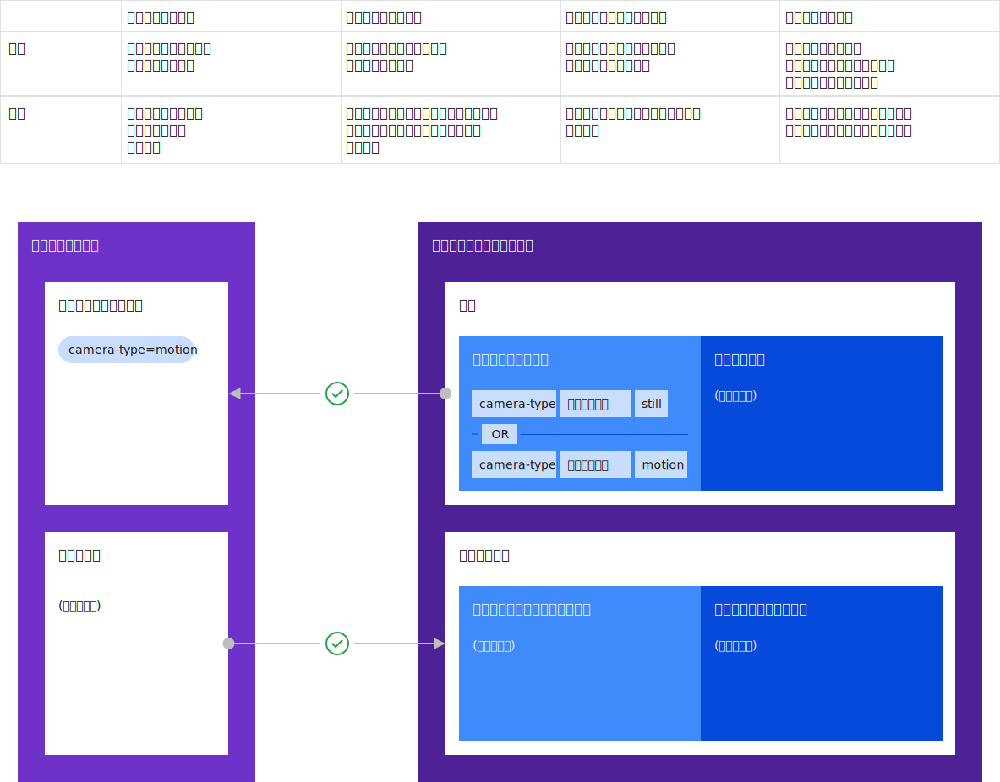

---

copyright:
  years: 2020
lastupdated: "2020-04-8"

---

{:new_window: target="blank"}
{:shortdesc: .shortdesc}
{:screen: .screen}
{:codeblock: .codeblock}
{:pre: .pre}
{:child: .link .ulchildlink}
{:childlinks: .ullinks}

# デプロイメント・ポリシーのユース・ケース
{: #developing_edge_services}

このセクションでは、ポリシー・タイプを記述する現実的なシナリオを中心に説明します。



盗難を検出するために ATM カメラを設置した顧客を考えてみましょう (この顧客は他のタイプのエッジ・ノードも持っています)。 この顧客は、店舗外の ATM (通常の ATM) とドライブスルー ATM を組み合わせて使用しています。 このケースでは、2 つのサード・パーティー・サービスが使用可能です。 どちらのサービスも ATM での疑わしい動きを検出できますが、顧客によるテストで、atm1 サービスは店舗外 ATM での疑わしい動きの検出の信頼性が高く、atm2 サービスはドライブスルー ATM での疑わしい動きの検出の信頼性が高いことが判明しました。

必要なサービスおよびモデルのデプロイメントを実現するため、ポリシーは以下のように表現されます。

* すべての店舗外 ATM に関するノード・ポリシーにプロパティーを設定します。プロパティー: `sensor: camera`、`atm-type: walk-up`
* すべてのドライブスルー ATM に関するノード・ポリシーにプロパティーを設定します。プロパティー: `sensor: camera`、`atm-type: drive-thru`
* atm1 と atm2 両方のサード・パーティー開発者によるサービス・ポリシーに制約を設定します。制約: `sensor == camera`
* atm1 サービスに関して顧客が設定するデプロイメント・ポリシーに制約を設定します。制約: `atm-type == walk-up`
* atm2 サービスに関して顧客が設定するデプロイメント・ポリシーに制約を設定します。制約: `atm-type == drive-thru`

注: `hzn` コマンドは、デプロイメント・ポリシーを指すときにビジネス・ポリシーという用語を使用することがあります。

ノード・ポリシー (ATM をセットアップする技術者によって設定される) は、例えば、ATM にカメラがあるかどうかや、ATM が置かれている場所のタイプなど、各ノードについての事実を記述します。 この情報を技術者が判断して指定するのは簡単です。

サービス・ポリシーは、サービスの正しい運用に必要なもの (このケースではカメラ) を記述します。 サード・パーティー・サービスの開発者は、サービスを使用するのがどの顧客なのかを知らなくても、この情報は知っています。 カメラが設置されていない他の ATM の場合、この制約のため、これらのサービスはそれらの ATM にはデプロイされません。

デプロイメント・ポリシーは、顧客 CIO (または、エッジ・ファブリックを管理している人) によって定義されます。 これは、ビジネスのための全体的なサービス・デプロイメントを定義します。 このケースでは、CIO は、店舗外 ATM に atm1 が、ドライブスルー ATM に atm2 が使用される必要があるという、望ましいサービス・デプロイメント結果を表現します。

## ノード・ポリシー
{: #node_policy}

ノードにポリシーを付加できます。 ノード所有者は登録時にこれを指定できます。いつでもノード上で直接変更することができ、{{site.data.keyword.edge_devices_notm}} 管理者が中央で変更することもできます。 ノード・ポリシーが中央で変更される場合、ノードが次に管理ハブにハートビートを送るタイミングでそれがノードに反映されます。 ノード・ポリシーがノード上で直接変更される場合、サービスおよびモデルのデプロイメントを即時に再評価できるように、変更は即時に管理ハブに反映されます。 ノードには、デフォルトで、メモリー、アーキテクチャー、および CPU 数を反映するいくつかの[組み込みプロパティー](#node_builtins)があります。 オプションで任意のプロパティー (例えば、製品モデル、接続されているデバイス、ソフトウェア構成、または、ノード所有者が関連していると見なすその他のもの) を含めることもできます。 ノード・ポリシー制約を使用して、どのサービスがこのノードでの実行を許可されるのかを制限できます。ノードごとにポリシーは 1 つのみであり、ポリシーに含まれているすべてのプロパティーおよび制約がそのノードに割り当てられます。

## サービス・ポリシー
{: #service_policy}

注: サービス・ポリシーは、オプション機能です。

ノードと同様に、サービスはポリシーを表現することができ、いくつかの[組み込みプロパティー](#service_builtins)もあります。 このポリシーは、Exchange に公開されたサービスに適用され、サービス開発者によって作成されます。 サービス・ポリシーのプロパティーは、サービス・コードの特性を記述するものであり、ノード・ポリシー作成者が関連を見つけることがあり得ます。サービス・ポリシー制約を使用して、どこのどのタイプのデバイスでこのサービスを実行できるのかを制限できます。 例えば、サービス開発者は、このサービスには特定のハードウェアのセットアップ (例えば、CPU/GPU 制約、メモリー制約、特定のセンサー、アクチュエーター、またはその他の周辺デバイス) が必要であることを表明できます。 プロパティーおよび制約は、サービス実装の側面を記述するものであるため、サービスの存続期間中ずっと静的なままであるのが一般的です。 予期されている使用シナリオでは、通常、これらのいずれかに変更があるのは、サービスのバージョンを新しくする必要のあるコード変更が行われるときです。 ビジネス要件から生じるもっと動的なサービス・デプロイメントの側面を取り込むためには、デプロイメント・ポリシーが使用されます。

## デプロイメント・ポリシー
{: #deployment_policy}

デプロイメント・ポリシーは、サービスのデプロイメントを駆動します。 他のタイプのポリシーと同様にプロパティーおよび制約のセットを含みますが、他にも含まれるものがあります。 例えば、デプロイされるサービスを明示的に識別します。また、オプションで、構成変数値、サービス・ロールバック・バージョン、およびノード・ヘルス構成情報を含むことができます。 デプロイメント・ポリシーでの構成値の手法は、エッジ・ノードに直接接続する必要のない、中央で実行できる運用であるため、強力です。

管理者はデプロイメント・ポリシーを作成することができます。{{site.data.keyword.edge_devices_notm}} は、そのポリシーを使用して、定義された制約を満たすすべてのデバイスを見つけ、ポリシーに構成されているサービス変数を使用して、指定されたサービスをそれらのデバイスにデプロイします。 サービス・ロールバック・バージョンは、新しいバージョンのサービスのデプロイが失敗した場合にデプロイする必要のあるサービス・バージョンを {{site.data.keyword.edge_devices_notm}} に指示します。 ノード・ヘルス構成は、ノードがポリシー外であるかどうかを判別する前に {{site.data.keyword.edge_devices_notm}} がノードの正常性を測定する方法 (ハートビートと管理ハブの通信) を指示します。

デプロイメント・ポリシーは、より動的で実務的なサービス・プロパティーおよび制約を取り込むため、サービス・ポリシーよりも変更頻度は高いと予期されています。 ポリシーのライフサイクルは、それが参照しているサービスから独立しています。これにより、ポリシー管理者は、特定のサービス・バージョンまたはバージョン範囲を記述することができます。 そのため、{{site.data.keyword.edge_devices_notm}} は、サービス・ポリシーとデプロイメント・ポリシーをマージしてから、それに適合しているポリシーを持つノードを見つけようとします。

## モデル・ポリシー
{: #model_policy}

機械学習 (ML) ベースのサービスの適切な運用には特定のモデル・タイプが必要であり、{{site.data.keyword.edge_devices_notm}} ユーザーは、それらのサービスが配置されたノードのすべてまたはサブセットに特定のモデルを配置できる必要があります。 モデル・ポリシーの目的は、特定のサービスがデプロイされるノードのセットをさらに絞り込むことです。これにより、それらのノードのサブセットが特定のモデル・オブジェクトを、[モデル管理を使用する Hello World](../developing/model_management_system.md) を介して受け取ることができるようになります。

## 拡張ポリシー・ユース・ケース
{: #extended_policy_use_case}

この ATM 例では、顧客は、あまり頻繁に使用されない地方の場所にある店舗外 ATM を運用しています。 この顧客は、地方の ATM が稼働し続けることも、近くの物体を認識するたびに ATM をオンにすることも望んでいません。 そのため、サービス開発者は、人間が近づいてくるのを識別したら ATM をオンにする ML モデルを atm1 サービスに追加します。 この ML モデルを地方の ATM を特定してデプロイするために、以下のポリシーを構成します。

* 地方の店舗外 ATM に関するノード・ポリシー: プロパティー: `sensor: camera`、`atm-type: walk-up`、`location: rural`
* atm1 に関してサード・パーティー開発者が設定するサービス・ポリシー制約は同じままです: 制約: `sensor == camera`
* atm1 サービスに関して顧客が設定するデプロイメント・ポリシーも同じままです: 制約: `atm-type == walk-up`
* モデル・ポリシー制約は、atm1 サービスの MMS オブジェクト内にサード・パーティー開発者によって設定されます。

```
"destinationPolicy": {
  "constraints": [ "location == rural"  ],
  "services": [
       { "orgID": "$HZN_ORG_ID",
         "serviceName": "atm1",
         "arch": "$ARCH",  
         "version": "$VERSION"
       }
  ]
}
```
{: codeblock}

MMS オブジェクト内で、モデル・ポリシーは、オブジェクトにアクセスできるサービスまたはサービス・リスト (このケースでは atm1) を宣言し、さらにプロパティーおよび制約を宣言することで、{{site.data.keyword.edge_devices_notm}} が、地方の場所にある ATM へのオブジェクトの適切な配置をさらに絞り込めるようにします。 ATM で実行されているその他のサービスはオブジェクトにアクセスできません。

## プロパティー
{: #properties}

プロパティーは、本質的には、name=value ペアで表される事実の記述です。 プロパティーにもタイプがあり、それによって、強力な式を作成する方法が提供されます。 以下の表は、{{site.data.keyword.edge_devices_notm}} によってサポートされるプロパティー値タイプと、ノード・ポリシーおよびサービス・ポリシーの組み込みプロパティーを示します。 ノード所有者、サービス開発者、およびデプロイメント・ポリシー管理者は、それぞれのニーズに合わせて個々のプロパティーを定義できます。 プロパティーは、中央リポジトリーに定義される必要はなく、必要に応じて設定され、参照されます (制約式内で)。

|許容されるプロパティー値タイプ|
|-----------------------------|
|バージョン - ドット 10 進。1 つ、2 つ、または 3 つの部分から成る形式がサポートされます (例: 1.2、2.0.12 など)|
|ストリング *|
|ストリングのリスト (コンマ区切り)|
|整数|
|ブール値|
|浮動小数点|
{: caption="表 1. 許容されるプロパティー値タイプ"}

* スペースを含んでいるストリング値は引用符で囲む必要があります。

組み込みプロパティーは、すべての制約が同じように参照できるように、一般的なプロパティーの適切に定義された名前を提供します。 例えば、適切または効率的に実行するために `x` 個の CPU を必要とするサービスは、制約内で `openhorizon.cpu` プロパティーを使用できます。 これらのプロパティーのほとんどは、設定できませんが、その代わりに基礎にあるシステムから読み取られ、ユーザーが設定した値は無視されます。

### ノードの組み込みプロパティー
{: #node_builtins}

|名前|タイプ|説明|ポリシー・タイプ|
|----|----|-----------|-----------|
|openhorizon.cpu|整数|CPU の数|ノード|
|openhorizon.memory|整数|メモリーの量 (MB)|ノード|
|openhorizon.arch|ストリング|ノード・ハードウェア・アーキテクチャー (例: amd64、armv6 など)|ノード|
|openhorizon.hardwareId|ストリング|linux API を介して入手可能な場合はノード・ハードウェアのシリアル番号であり、それ以外の場合はノード登録の存続期間中変わらない暗号論的乱数です|ノード|
|openhorizon.allowPrivileged|ブール値|コンテナーが特権機能を使用すること (特権を持った状態での実行、コンテナーへのホストのネットワークの接続など) を許可します|ノード|
{: caption="表 2. ノードの組み込みプロパティー"}

### サービスの組み込みプロパティー
{: #service_builtins}

|名前|タイプ|説明|ポリシー・タイプ|
|----|----|-----------|-----------|
|openhorizon.service.url|ストリング|サービスの固有名|サービス|
|openhorizon.service.org|ストリング|サービスが定義されているマルチテナント組織 *|サービス|
|openhorizon.service.version|バージョン|同じセマンティック・バージョン構文を使用するサービスのバージョン (例: 1.0.0)|サービス|
{: caption="表 3. サービスの組み込みプロパティー"}

* 制約内に service.url が指定されているが、service.org が省略されている場合は、組織はデフォルトで、制約を定義するノード・ポリシーまたはデプロイメント・ポリシーの組織になります。

## 制約
{: #constraints}

{{site.data.keyword.edge_devices_notm}} では、ノード・ポリシー、サービス・ポリシー、およびデプロイメント・ポリシーが制約を定義できます。 制約は、単純なテキスト形式で述部として表され、プロパティーとその値 (または可能な値の範囲) を参照します。 制約では、プロパティーの式と値の間に AND (&&) や OR (||) などのブール演算子を入れて、長い節を形成することもできます。 例えば、`openhorizon.arch == amd64 && OS == Mojave` です。 最後に、括弧を使用して、1 つの式内で評価の優先順位を作成できます。

|プロパティー値タイプ|サポートされる演算子|
|-------------------|-------------------|
|整数|==, <, >, <=, >=, =, !=|
|ストリング *|==, !=, =|
|ストリングのリスト|in|
|ブール値|==, =|
|バージョン|==、=、in **|
{: caption="表 4. 制約"}

* ストリング・タイプの場合、コンマで区切ったストリングのリストが引用符で囲まれているストリングは、許容値のリストを指定しています。例えば、`hello == "beautiful, world"` は、hello が「beautiful」または「world」である場合に true になります。

** バージョン範囲を表すには、`==` の代わりに `in` を使用してください。

## さらに拡張されたポリシー・ユース・ケース
{: #extended_policy_use_case_more}

ポリシーが双方向であるという特性の全力を示すために、このセクションでは現実的な例を想定し、ノードにいくつかの制約を加えます。 この例では、地方にある店舗外 ATM のうちのいくつかがウォーターフロントの場所にあり、そこでの光が非常にまぶしく、他の店舗外 ATM で使用される既存の atm1 が対処できないとします。 この場合、それらの数台の ATM のためにまぶしい光に対処できる 3 つ目のサービスと、次のように構成されたポリシーが必要になります。

* ウォーターフロントの店舗外 ATM に関するノード・ポリシー: プロパティー: `sensor: camera`、`atm-type: walk-up`; 制約: `feature == glare-correction`
* atm3 に関してサード・パーティー開発者が設定するサービス・ポリシー: 制約: `sensor == camera`
* atm3 サービスに関して顧客が設定するデプロイメント・ポリシー: 制約: `atm-type == walk-up`; プロパティー: `feature: glare-correction`  

繰り返しになりますが、ノード・ポリシーは、ノードに関する事実を記述します。しかし、このケースでは、ウォーターフロント ATM をセットアップした技術者が、このノードにデプロイするサービスには glare-correction (まぶしさ補正) フィーチャーが必要であるという制約を指定しました。

atm3 のサービス・ポリシーの制約は他のものと同じであり、ATM にカメラが必要であるということです。

顧客は atm3 サービスがまぶしさを適切に処理することを知っているので、ノードに設定されたプロパティーを満たす atm3 と関連付けられたデプロイメント・ポリシーにこの制約を設定します。その結果、このサービスがウォーターフロント ATM にデプロイされます。

## ポリシーのコマンド
{: #policy_commands}

|コマンド|説明|
|-------|-----------|
|`hzn policy list`|このエッジ・ノードのポリシー。|
|`hzn policy new`|入力可能な空のノード・ポリシー・テンプレート。|
|hzn policy update --input-file=INPUT-FILE|ノードのポリシーを更新します。 入力ポリシーに含まれていない場合、ノードの組み込みプロパティーが自動的に追加されます。|
|`hzn policy remove [<flags>]`|ノードのポリシーを削除します。|
|`hzn exchange node listpolicy [<flags>`] <node>|Horizon Exchange からノード・ポリシーを表示します。|
|`hzn exchange node addpolicy --json-file=JSON-FILE [<flags>`] <node>|Horizon Exchange 内のノード・ポリシーを追加または置換します。|
|`hzn exchange node updatepolicy --json-file=JSON-FILE [<flags>`] <node>|Horizon Exchange 内のこのノードのポリシー属性を更新します。|
|`hzn exchange node removepolicy [<flags>`] <node>|Horizon Exchange 内のノード・ポリシーを削除します。|
|`hzn exchange service listpolicy [<flags>`] <service>|Horizon Exchange からサービス・ポリシーを表示します。|
|`hzn exchange service newpolicy|入力可能な空のサービス・ポリシー・テンプレートを表示します。|
|`hzn exchange service addpolicy --json-file=JSON-FILE [<flags>`] <service>|Horizon Exchange 内のサービス・ポリシーを追加または置換します。|
|`hzn exchange service removepolicy [<flags>`] <service>|Horizon Exchange 内のサービス・ポリシーを削除します。|
|`hzn exchange business listpolicy [<flags>] [<policy>]`|Horizon Exchange からビジネス・ポリシーを表示します。|
|`hzn exchange business new`|入力可能な空のデプロイメント・ポリシー・テンプレートを表示します。|
|`hzn exchange business addpolicy --json-file=JSON-FILE [<flags>`] <policy>|Horizon Exchange 内のデプロイメント・ポリシーを追加または置換します。 空のデプロイメント・ポリシー・テンプレートには、「hzn exchange business new」を使用します。|
|`hzn exchange business updatepolicy --json-file=JSON-FILE [<flags>`] <policy>|Horizon Exchange 内の既存デプロイメント・ポリシーの 1 つの属性を更新します。 サポートされる属性は、コマンド「hzn exchange business new」で表示されるポリシー定義の最上位属性です。|
|`hzn exchange business removepolicy [<flags>`] <policy>|Horizon Exchange からデプロイメント・ポリシーを削除します。|
|`hzn dev service new [<flags>`]|新規サービス・プロジェクトを作成します。 このコマンドは、サービス・ポリシー・テンプレートを含めて、すべての IEC サービス・メタデータ・ファイルを生成します。|
|`hzn deploycheck policy [<flags>`]|ノード・ポリシー、サービス・ポリシー、およびデプロイメント・ポリシー間のポリシー互換性を検査します。 「hzn deploycheck all」を使用して、サービス変数構成が正しいことも検査することをお勧めします。|
{: caption="表 5. ポリシー開発ツール"}

`hzn` コマンドの使用に関する詳細情報については、[hzn コマンドの探索](../installing/exploring_hzn.md)を参照してください。
