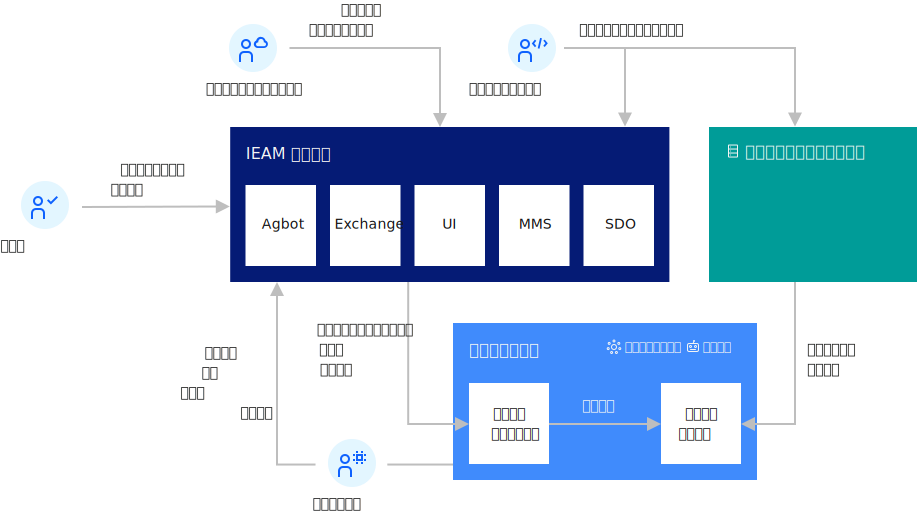
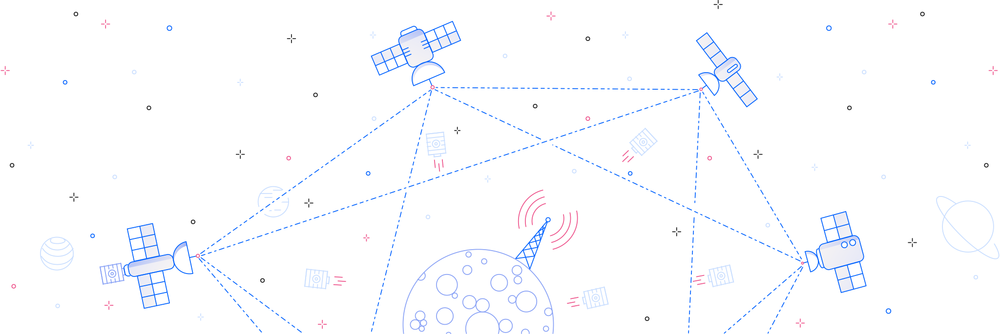

---

copyright:
years: 2020
lastupdated: "2020-05-11"

---

{:new_window: target="blank"}
{:shortdesc: .shortdesc}
{:screen: .screen}
{:codeblock: .codeblock}
{:pre: .pre}
{:child: .link .ulchildlink}
{:childlinks: .ullinks}

# エッジ・コンピューティングの概要
{: #overviewofedge}

## {{site.data.keyword.edge_notm}} の機能
{: #capabilities}

{{site.data.keyword.edge_notm}} (IEAM) は、Docker や Kubernetes などのオープンなテクノロジーおよび一般的な標準規格などで最適化されたさまざまな業界および層を対象にしています。 これには、コンピューティング・プラットフォーム、プライベート・クラウドとエンタープライズ環境の両方、ネットワーク・コンピュート・スペースとオンプレミス・ゲートウェイ、コントローラーとサーバー、およびインテリジェント・デバイスが含まれます。

基本的に、ハイパー・スケールのパブリック・クラウド、ハイブリッド・クラウド、共同設置の管理データ・センター、および従来のエンタープライズ・データ・センターは、データ、アナリティクス、およびバックエンドのデータ処理のための集約ポイントとして機能し続けます。

パブリック・ネットワーク、プライベート・ネットワーク、およびコンテンツ配信ネットワークは、単純なパイプから、エッジ・ネットワーク・クラウドを形成する、アプリケーション用のより高価値なホスティング環境へと変化しています。 {{site.data.keyword.ieam}} の典型的なユース・ケースには次のものがあります。

* ハイブリッド・クラウド・コンピューティング
* 5G ネットワーキング 
* エッジ・サーバーのデプロイメント
* エッジ・サーバーの計算演算能力
* IoT デバイスのサポートおよび最適化

IBM Multicloud Management Core 1.2 は、複数のベンダーのクラウド・プラットフォームを、オンプレミスからエッジにいたるまで一貫性のあるダッシュボードに統合します。 {{site.data.keyword.ieam}} は、ワークロードの分散と管理を、エッジ・ネットワークを超えて、エッジ・ゲートウェイやエッジ・デバイスで行えるようにする自然な拡張です。 また、IBM Multicloud Management Core 1.2 は、エッジ・コンポーネントのあるエンタープライズ・アプリケーション、プライベート・クラウド環境およびハイブリッド・クラウド環境、およびパブリック・クラウドからのワークロードを把握します。これらの場所では、分散 AI が重要なデータ・ソースに到達するための新しい実行環境を IBM Edge Computing Manager が提供します。

さらに、IBM Multicloud Manager-CE では、ディープ・ラーニング、ビジュアル認識、音声認識、および映像と音響の分析を促進する AI ツールが提供され、あらゆる解像度とほとんどの形式の映像および音声会話サービスおよびディスカバリーに対する推論が可能になります。

## {{site.data.keyword.edge_notm}} のリスクと解決
{: #risks}

{{site.data.keyword.ieam}} は、固有の機会を実現しますが、課題もあります。 例えば、クラウド・データ・センターの物理境界を大きく超えるため、セキュリティー、アドレス可能度、管理、所有権、およびコンプライアンスの問題が生じる可能性があります。 さらに重要なのは、クラウド・ベースの管理技法におけるスケーリングの問題が増加することです。

エッジ・ネットワークでは、計算ノードの数が 1 桁増加します。 エッジ・ゲートウェイにより、その数はさらに 1 桁増加します。 エッジ・デバイスにより、その数はさらに 3 から 4 桁増加します。 ハイパー・スケールのクラウド・インフラストラクチャーの管理において DevOps (継続的デリバリーおよび継続的デプロイメント) が重要であるように、{{site.data.keyword.ieam}} が実現する膨大な規模の管理においては、zero-ops (人の介入なしの運用) が重要となります。

エッジ・コンピュート・スペースのデプロイメント、更新、モニター、およびリカバリーは人の介入なしで行うことが重要です。 これらのすべてのアクティビティーおよびプロセスは、以下が必須です。

* 完全に自動化されている
* 作業の割り振りについて独立して決定を行うことができる
* 介入なしで、変化する条件を認識して復旧することができる 

これらすべてのアクティビティーは、セキュアであり、トレース可能で、防御できる必要があります。

<!--{{site.data.keyword.edge_devices_notm}} delivers edge node management that minimizes deployment risks and manages the service software lifecycle on edge nodes fully autonomously. This function creates the capacity to achieve meaningful insights more rapidly from data that is captured closer to its source. {{site.data.keyword.edge_notm}} is available for infrastructure or servers, including distributed devices.
{:shortdesc}

Intelligent devices are being integrated into the tools that are used to conduct business at an ever-increasing rate. Device compute capacity is creating new opportunities for data analysis where data originates and actions are taken. {{site.data.keyword.edge_notm}} innovations fuel improved quality, enhance performance, and drive deeper, more meaningful user interactions. 

{{site.data.keyword.edge_notm}} can:

* Solve new business problems by using Artificial Intelligence (AI)
* Increase capacity and resiliency
* Improve security and privacy protections
* Leverage 5G networks to reduce latency

{{site.data.keyword.edge_notm}} can capture the potential of untapped data that is created by the unprecedented growth of connected devices, which opens new business opportunities, increases operational efficiency, and improves customer experiences. {{site.data.keyword.edge_notm}} brings Enterprise applications closer to where data is created and actions need to be taken, and it allows Enterprises to leverage AI and analyze data in near-real time.

## {{site.data.keyword.edge_notm}} benefits
{: #benefits}

{{site.data.keyword.edge_notm}} helps solve speed and scale challenges by using the computational capacity of edge devices, gateways, and networks. This function retains the principles of dynamic allocation of resources and continuous delivery that are inherent to cloud computing. With {{site.data.keyword.edge_notm}}, businesses have the potential to virtualize the cloud beyond data centers. Workloads that are created in the cloud can be migrated towards the edge, and where appropriate, data that is generated at the edge can be cleansed and optimized and brought back to the cloud.

{{site.data.keyword.edge_devices_notm}} spans industries and multiple tiers that are optimized with open technologies and prevailing standards like Docker and Kubernetes. This includes computing platform, both private cloud and Enterprise environments, network compute spaces and on-premises gateways, controllers and servers, and intelligent devices.

Centrally, the hyper-scale public clouds, hybrid clouds, colocated managed data centers and traditional Enterprise data centers continue to serve as aggregation points for data, analytics, and back-end data processing.

Public, private, and content-delivery networks are transforming from simple pipes to higher-value hosting environments for applications in the form of the edge network cloud.

{{site.data.keyword.edge_devices_notm}} offers: 

* Integrated offerings that provide faster insights and actions, secure and continuous operations.
* The industry's first policy-based, autonomous edge computing platform
that intelligently manages workload life cycles in a secure and flexible way.
* Open technology and ecosystems compatibility to provide robust support and innovation for industry-wide ecosystems and partners.
* Scalable solutions for wide-ranging deployment on edge devices, servers, gateways, and network elements.

## {{site.data.keyword.edge_notm}} capabilities
{: #capabilities}

* Hybrid cloud computing
* 5G networking 
* Edge server deployment
* Edge servers compute operations capacity
* IoT devices support and optimization

## {{site.data.keyword.edge_notm}} risks and resolution
{: #risks}

Although {{site.data.keyword.edge_notm}} creates unique opportunities, it also presents challenges. For example, it transcends cloud data center's physical boundaries, which can expose security, addressability, management, ownership, and compliance issues. More importantly, it multiplies the scaling issues of cloud-based management techniques.

Edge networks increase the number of compute nodes by an order of magnitude. Edge gateways increase that by another order of magnitude. Edge devices increase that number by 3 to 4 orders of magnitude. If DevOps (continuous delivery and continuous deployment) is critical to managing a hyper-scale cloud infrastructure, then zero-ops (operations with no human intervention) is critical to managing at the massive scale that {{site.data.keyword.edge_notm}} represents.

It is critical to deploy, update, monitor, and recover the edge compute space without human intervention. All of these activities and processes must be fully automated, capable of making decisions independently about work allocation, and able to recognize and recover from changing conditions without intervention. All of these activities must be secure, traceable, and defensible.

## Extending multi-cloud deployments to the edge
{: #extend_deploy}

{{site.data.keyword.mcm_core_notm}} unifies cloud platforms from multiple vendors into a consistent dashboard from on-premises to the edge. {{site.data.keyword.edge_devices_notm}} is a natural extension that enables the distribution and management of workloads beyond the edge network to edge gateways and edge devices.

{{site.data.keyword.mcm_core_notm}} recognizes workloads from Enterprise applications with edge components, private and hybrid cloud environments, and public cloud; where {{site.data.keyword.edge_notm}} provides a new execution environment for distributed AI to reach critical data sources.

{{site.data.keyword.mcm_ce_notm}} delivers AI tools for accelerated deep learning, visual and speech recognition, and video and acoustic analytics, which enables inferencing on all resolutions and most formats of video and audio conversation services and discovery.

## {{site.data.keyword.edge_devices_notm}} architecture
{: #iec4d_arch}

Other edge computing solutions typically focus on one of the following architectural strategies:

* A powerful centralized authority for enforcing edge node software compliance.
* Passing the software compliance responsibility down to the edge node owners, who are required to monitor for software updates, and manually bring their own edge nodes into compliance.

The former focuses authority centrally, creating a single point of failure, and a target that attackers can exploit to control the entire fleet of edge nodes. The latter solution can result in large percentages of the edge nodes not having the latest software updates installed. If edge nodes are not all on the latest version or have all of the available fixes, the edge nodes can be vulnerable to attackers. Both approaches also typically rely upon the central authority as a basis for the establishment of trust.

In contrast to those solution approaches, {{site.data.keyword.edge_devices_notm}} is decentralized. {{site.data.keyword.edge_devices_notm}} manages service software compliance automatically on edge nodes without any manual intervention. On each edge node, decentralized and fully autonomous agent processes run governed by the policies that are specified during the machine registration with {{site.data.keyword.edge_devices_notm}}. Decentralized and fully autonomous agbot (agreement bot) processes typically run in a central location, but can run anywhere, including on edge nodes. Like the agent processes, the agbots are governed by policies. The agents and agbots handle most of the edge service software lifecycle management for the edge nodes and enforce software compliance on the edge nodes.

For efficiency, {{site.data.keyword.edge_devices_notm}} includes two centralized services, the exchange and the switchboard. These services have no central authority over the autonomous agent and agbot processes. Instead, these services provide simple discovery and metadata sharing services (the exchange) and a private mailbox service to support peer-to-peer communications (the switchboard). These services support the fully autonomous work of the agents and agbots.

Lastly, the {{site.data.keyword.edge_devices_notm}} console helps administrators set policy and monitor the status of the edge nodes.

Each of the five {{site.data.keyword.edge_devices_notm}} component types (agents, agbots, exchange, switchboard, and console) has a constrained area of responsibility. Each component has no authority or credentials to act outside their respective area of responsibility. By dividing responsibility and scoping authority and credentials, {{site.data.keyword.edge_devices_notm}} offers risk management for edge node deployment.

WRITER NOTE: content from https://www-03preprod.ibm.com/support/knowledgecenter/SSFKVV_4.1/hub/offline_installation.html

Merge the content in this section with the above content.

## {{site.data.keyword.edge_devices_notm}}
{: #edge_devices}

{{site.data.keyword.edge_devices_notm}} provides you with a new architecture for edge node management. It is designed specifically to minimize the risks that are inherent in the deployment of either a global or local fleet of edge nodes. You can also use {{site.data.keyword.edge_devices_notm}} to manage the service software lifecycle on edge nodes fully autonomously.
{:shortdesc}

{{site.data.keyword.edge_devices_notm}} is built on the {{site.data.keyword.horizon_open}} project. For more information about the project, see [{{site.data.keyword.horizon_open}} ](https://github.com/open-horizon).-->

{{site.data.keyword.edge_notm}} の使用およびエッジ・サービスの開発について詳しくは、以下のトピックおよびトピック・グループを確認してください。

* [管理ハブのインストール](../hub/offline_installation.md): {{site.data.keyword.edge_devices_notm}} インフラストラクチャーをインストールして構成する方法、およびエッジ・デバイスの追加に必要なファイルを収集する方法について説明しています。

* [エッジ・ノードのインストール](../devices/installing/installing_edge_nodes.md): {{site.data.keyword.edge_devices_notm}} インフラストラクチャーをインストールして構成する方法、およびエッジ・デバイスの追加に必要なファイルを収集する方法について説明しています。
  
* [エッジ・サービスの使用](../devices/developing/using_edge_services.md): {{site.data.keyword.edge_notm}} エッジ・サービスの使用について説明しています。

* [エッジ・サービスの開発](../devices/developing/developing_edge_services.md): {{site.data.keyword.edge_notm}} エッジ・サービスの使用について説明しています。

* [管理](../devices/administering_edge_devices/administering.md): {{site.data.keyword.edge_notm}} エッジ・サービスを管理する方法について説明しています。 
  
* [セキュリティー](../devices/user_management/security.md):
  {{site.data.keyword.edge_notm}} が攻撃に対してどのようにセキュリティーを維持し、関与しているエンティティーのプライバシーを保護しているかについて説明しています。

* [管理コンソールの使用](../devices/getting_started/accessing_ui.md):
  {{site.data.keyword.edge_notm}} に関する重要な情報を迅速に得るために、よくあるご質問を確認してください。

* [CLI の使用](../devices/getting_started/using_cli.md):
  {{site.data.keyword.edge_notm}} に関する重要な情報を迅速に得るために、よくあるご質問を確認してください。

* [API](../devices/installing/edge_rest_apis.md):
  {{site.data.keyword.edge_notm}} に関する重要な情報を迅速に得るために、よくあるご質問を確認してください。

* [トラブルシューティング](../devices/troubleshoot/troubleshooting.md):
  {{site.data.keyword.edge_devices_notm}} のセットアップまたは使用で問題が発生した場合は、発生する可能性がある一般的な問題、および問題のトラブルシューティングに役立つヒントを確認してください。
