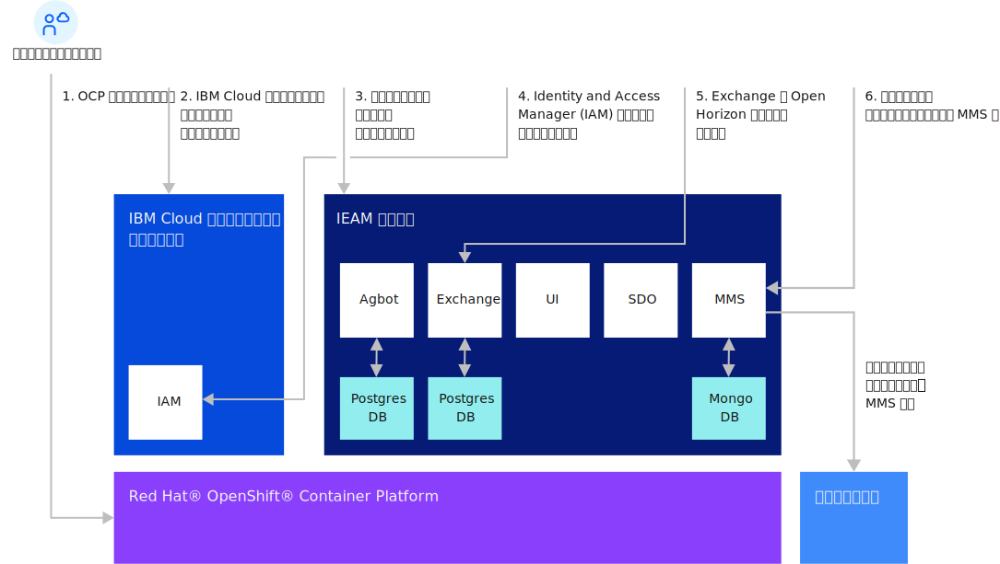

---

copyright:
years: 2020
lastupdated: "2020-10-28"

---

{:new_window: target="blank"}
{:shortdesc: .shortdesc}
{:screen: .screen}
{:codeblock: .codeblock}
{:pre: .pre}
{:child: .link .ulchildlink}
{:childlinks: .ullinks}

# 管理ハブのインストール
{: #management_hub}

## 管理ハブのインストール概要
{{site.data.keyword.edge_notm}} ({{site.data.keyword.ieam}}) ノードのタスクを開始する前に、管理ハブのインストールおよび構成を完了します。

* [サイジングおよびシステム要件](cluster_sizing.md)
* [構成](configuration.md)
* [インストール](installation.md)
  * [{{site.data.keyword.ieam}} のインストール](online_installation.md)
  * [インストール後の構成](post_install.md)
  * [エッジ・ノード・ファイルの収集](gather_files.md)
* [アンインストール](uninstalling_hub.md)

## 管理ハブのインストール・フロー

## 関連情報

* [エッジ・ノードのインストール](../installing/installing_edge_nodes.md)
