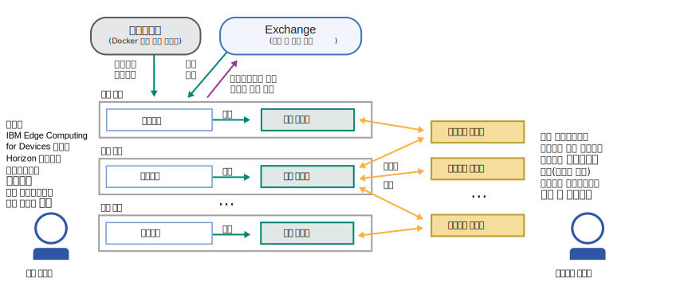
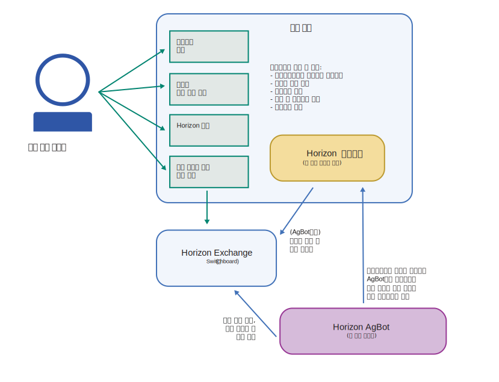

---

copyright:
years: 2020
lastupdated: "2020-4-8"

---

{:new_window: target="blank"}
{:shortdesc: .shortdesc}
{:screen: .screen}
{:codeblock: .codeblock}
{:pre: .pre}
{:child: .link .ulchildlink}
{:childlinks: .ullinks}

# 에지 디바이스
{: #edge_devices}

# 시작하기 전에

에지 디바이스에 대해 작업하려면 해당 전제조건을 이해하십시오.

* [에지 디바이스 준비](#adding-devices)
* [지원되는 아키텍처 및 운영 체제](#suparch-horizon)
* [크기 조정](#size)

참고: 에지 디바이스는 에이전트라고도 합니다. 에지 디바이스 및 클러스터에 대한 설명은 기록기 참고를 참조하십시오.

## 에지 디바이스 준비
{: #adding-devices}

{{site.data.keyword.edge_devices_notm}}는 [{{site.data.keyword.horizon_open}} ](https://github.com/open-horizon/) 프로젝트 소프트웨어를 사용합니다. 에지 디바이스의 {{site.data.keyword.horizon_agents}}가 다른 {{site.data.keyword.horizon}} 컴포넌트와 통신하여 해당 디바이스에서 소프트웨어 라이프사이클 관리를 안전하게 오케스트레이션합니다.
{:shortdesc}

다음 다이어그램은 {{site.data.keyword.horizon}} 내 컴포넌트 간의 일반적인 상호작용을 보여줍니다.

모든 에지 디바이스(에지 노드)에서는 {{site.data.keyword.horizon_agent}} 소프트웨어를 설치해야 합니다. {{site.data.keyword.horizon_agent}}는 또한 [Docker ](https://www.docker.com/) 소프트웨어에 따라 다릅니다. 

에지 디바이스를 중심으로 다음 다이어그램은 에지 디바이스를 설정하기 위해 수행하는 단계 플로우 및 시작 후 에이전트가 수행하는 작업을 표시합니다.

다음 지시사항은 에지 디바이스에서 필수 소프트웨어를 설치하고 {{site.data.keyword.edge_devices_notm}}에 등록하는 프로세스를 안내합니다.

## 지원되는 아키텍처 및 운영 체제
{: #suparch-horizon}

{{site.data.keyword.edge_devices_notm}}는 다음 하드웨어 아키텍처의 시스템을 지원합니다.

* Ubuntu 18.x(bionic), Ubuntu 16.x(xenial), Debian 10(buster) 또는 Debian 9(stretch)을 실행하는 {{site.data.keyword.linux_bit_notm}} 디바이스 또는 가상 머신
* Raspbian buster 또는 stretch를 실행하는 ARM(32비트)의 {{site.data.keyword.linux_notm}}(예: Raspberry Pi)
* Ubuntu 18.x(bionic)을 실행하는 ARM(64비트)의 {{site.data.keyword.linux_notm}}(예: NVIDIA Jetson Nano, TX1 또는 TX2)
* {{site.data.keyword.macOS_notm}}

## 크기 조정
{: #size}

에이전트에는 다음이 필요합니다.

1. 100MB RAM(Docker 포함). RAM은 이 크기를 초과하여 계약당 약 100K 및 노드에서 실행되는 워크로드에 필요한 추가 메모리만큼 증가합니다.
2. 400MB 디스크(Docker 포함). 디스크는 노드에 배치된 모델 오브젝트 크기(2배) 및 워크로드에서 사용되는 컨테이너 이미지의 크기에 따라 이 크기를 초과하여 증가합니다.

## 다음 수행할 작업

[에이전트 설치](installing_the_agent.md)
