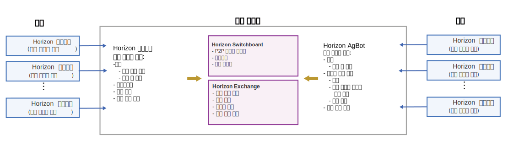

---

copyright:
  years: 2019
lastupdated: "2019-06-28"

---

{:new_window: target="blank"}
{:shortdesc: .shortdesc}
{:screen: .screen}
{:codeblock: .codeblock}
{:pre: .pre}
{:child: .link .ulchildlink}
{:childlinks: .ullinks}

# {{site.data.keyword.edge_devices_notm}} 작동 방식의 개요
{: #overview}

{{site.data.keyword.edge_devices_notm}}는 배치 위험을 최소화하고 에지 노드의 서비스 소프트웨어 라이프사이클을 완전히 자율적으로 관리하기 위해 특별히 에지 노드 관리용으로 디자인되었습니다.
{:shortdesc}

## {{site.data.keyword.edge_devices_notm}} 아키텍처

{: #iec4d_arch}

다른 에지 컴퓨팅 솔루션은 일반적으로 다음 아키텍처 전략 중 하나에 중점을 둡니다.

* 에지 노드 소프트웨어 규제 준수를 강화하기 위한 강력한 중앙 집중식 권한
* 소프트웨어 업데이트를 모니터하고 수동으로 자체 에지 노드가 규제를 준수하도록 해야 하는 에지 노드 소유자에게 소프트웨어 규제 준수 책임 전달

전자는 중앙 집중식 권한에 중점을 두어 단일 실패 지점 및 공격자가 전체 에지 노드 집합을 제어하기 위해 악용할 수 있는 대상을 작성합니다. 후자의 솔루션을 사용하면 최신 소프트웨어 업데이트가 설치되어 있지 않은 에지 노드의 비율이 커질 수 있습니다. 에지 노드가 모두 최신 버전이 아니거나 사용 가능한 모든 수정사항을 보유하는 경우 에지 노드가 공격자에게 취약할 수 있습니다. 일반적으로 두 접근 방식 모두 신뢰 구축에 대한 기초로 중앙 권한에 의존합니다.

이러한 솔루션 접근 방식과 달리 {{site.data.keyword.edge_devices_notm}}는 분산되어 있습니다. {{site.data.keyword.edge_devices_notm}}는 수동 개입 없이 에지 노드에서 자동으로 서비스 소프트웨어 준수를 관리합니다. 각 에지 노드에서, 분산된 완전 자율 에이전트 프로세스가 머신을 {{site.data.keyword.edge_devices_notm}}에 등록하는 동안 지정된 정책에 따라 관리되어 실행됩니다. 분산된 완전 자율 agbot(계약 봇) 프로세스는 일반적으로 중앙 위치에서 실행되지만 에지 노드를 포함하여 어디서나 실행될 수 있습니다. 에이전트 프로세스와 마찬가지로 agbot은 정책에 의해 관리됩니다. 에이전트와 agbot은 에지 노드에 대한 대부분의 에지 서비스 소프트웨어 라이프사이클 관리를 처리하고 에지 노드에서 소프트웨어 준수를 시행합니다.

효율성을 위해 {{site.data.keyword.edge_devices_notm}}에는 exchange 및 switchboard라는 두 개의 중앙 집중식 서비스가 포함되어 있습니다. 이러한 서비스에는 자율 에이전트 및 agbot 프로세스에 대한 중앙 권한이 없습니다. 대신, 이러한 서비스는 단순 발견 및 메터데이터 공유 서비스(exchange) 및 피어 투 피어 통신을 지원하기 위한 사설 메일함 서비스(switchboard)를 제공합니다. 이러한 서비스는 에이전트 및 agbot의 완전 자율 작업을 지원합니다.

마지막으로 {{site.data.keyword.edge_devices_notm}} 콘솔은 관리자가 정책을 설정하고 에지 노드의 상태를 모니터하도록 돕습니다.

다섯 개의 각 {{site.data.keyword.edge_devices_notm}} 컴포넌트 유형(에이전트, agbot, exchange, switchboard, 콘솔)에는 제한된 책임 영역이 있습니다. 각 컴포넌트에는 각 책임 영역 외부에서 작업할 수 있는 권한이나 인증 정보가 없습니다. {{site.data.keyword.edge_devices_notm}}는 책임을 나누고 권한 및 인증 정보에 범위를 지정하여 에지 노드 배치에 대한 위험 관리를 제공합니다.

## 발견 및 협상
{: #discovery_negotiation}

{{site.data.keyword.edge_devices_notm}}는 [1{{site.data.keyword.horizon_open}} ](https://github.com/open-horizon/) 프로젝트를 기반으로 하며 주로 분산 및 분배됩니다. 자율 에이전트 및 계약 봇(agbot) 프로세스가 등록된 모든 에지 노드의 소프트웨어 관리를 위해 협업합니다.

자율 에이전트 프로세스가 각 Horizon 에지 노드에서 실행되어 에지 디바이스 소유자가 설정한 정책을 적용합니다.

자율 agbot은 exchange에서 배치 패턴 및 정책을 모니터하고 아직 준수되지 않은 에지 노드 에이전트를 찾습니다. Agbot은 에지 노드에게 규제를 준수하도록 계약을 제안합니다. agbot 및 에이전트가 계약에 도달하면 에지 노드에서 에지 서비스의 소프트웨어 라이프사이클을 관리하기 위해 협력합니다.

agbot 및 에이전트는 다음과 같은 중앙 집중식 서비스를 사용하여 서로를 찾고 신뢰를 구축하며 {{site.data.keyword.edge_devices_notm}}에서 안전하게 통신합니다.

* {{site.data.keyword.horizon_exchange}}: 발견을 용이하게 합니다.
* {{site.data.keyword.horizon_switch}}: agbot과 에이전트 간의 안전한 사설 피어 투 피어 통신을 가능하게 합니다.

### {{site.data.keyword.horizon_exchange}}
{: #iec4d_exchange}

{{site.data.keyword.horizon_exchange}}는 에지 디바이스 소유자가 소프트웨어 라이프사이클 관리를 위해 에지 노드를 등록하도록 합니다. {{site.data.keyword.edge_devices_notm}}용 {{site.data.keyword.horizon_exchange}}에 에지 노드를 등록할 때 에지 노드에 대한 배치 패턴 또는 정책을 지정합니다. (해당 코어에서 배치 패턴은 에지 노드를 관리하기 위해 단순히 사전 정의되고 이름 지정된 정책 세트입니다.) 패턴 및 정책은 {{site.data.keyword.horizon_exchange}}에서 디자인, 개발, 테스트, 서명, 공개되어야 합니다.

각 에지 노드는 고유 ID 및 보안 토큰에 등록됩니다. 다른 조직에서 제공하는 패턴 또는 고유한 조직에서 제공하는 패턴 또는 정책을 사용하기 위해 노드를 등록할 수 있습니다.

패턴 또는 정책이 {{site.data.keyword.horizon_exchange}}에 공개되는 경우 agbot은 업데이트된 또는 새 패턴이나 정책에 영향을 받는 에지 노드를 발견합니다. 등록된 에지 노드를 찾으면 agbot은 에지 노드 에이전트와 협상합니다.

{{site.data.keyword.horizon_exchange}}는 agbot이 패턴 또는 정책을 사용하기 위해 등록된 에지 노드를 찾을 수 있도록 하지만 {{site.data.keyword.horizon_exchange}}는 에지 노드 소프트웨어 관리 프로세스에 직접 관여하지 않습니다. agbot과 에이전트는 소프트웨어 관리 프로세스를 처리합니다. {{site.data.keyword.horizon_exchange}}는 에지 노드에 대한 권한을 갖지 않으며 에지 노드 에이전트와의 연결을 시작하지 않습니다.

### {{site.data.keyword.horizon_switch}}
{: #horizon_switch}

agbot이 업데이트된 또는 새 패턴이나 정책에 영향을 받는 에지 노드를 발견하면 agbot이 {{site.data.keyword.horizon}} switchboard를 사용하여 해당 노드의 에이전트에 사설 메시지를 전송합니다. 이 메시지는 에지 노드의 소프트웨어 라이프사이클 관리에 대해 협업하기 위한 계약 제안입니다. 에이전트가 {{site.data.keyword.horizon_switch}}의 사설 메일함에 있는 agbot에서 메시지를 수신하면 제안을 복호화하고 평가합니다. 고유한 노드 정책 내에 있는 경우 노드가 agbot에 수락 메시지를 전송합니다. 그렇지 않으면 노드가 제안을 거부합니다. agbot이 {{site.data.keyword.horizon_switch}}의 사설 메일함에 계약 수락을 수신하는 경우 협상이 완료됩니다.

에이전트와 agbot은 모두 {{site.data.keyword.horizon_switch}}에서 공개 키를 게시하여 완전 순방향 비밀성을 사용하는 보안 및 사설 통신이 가능하도록 합니다. 이 암호화를 통해 {{site.data.keyword.horizon_switch}}는 메일함 관리자 역할만 수행합니다. 메시지를 복호화할 수 없습니다.

참고: 모든 통신이 {{site.data.keyword.horizon_switch}}를 통해 중개되기 때문에 각 에지 노드의 에이전트가 이 정보를 표시하도록 선택할 때까지 에지 노드의 IP 주소가 agbot에 표시되지 않습니다. 에이전트와 agbot이 성공적으로 계약을 협상하면 에이전트가 이 정보를 표시합니다.

## 에지 소프트웨어 라이프사이클 관리
{: #edge_lifecycle}

agbot 및 에이전트가 특정 패턴 또는 정책 세트의 계약에 도달한 후에 에지 노드에서 패턴 또는 정책의 소프트웨어 라이프사이클을 관리하기 위해 협력합니다. agbot은 시간 경과에 따라 진화하는 패턴 또는 정책을 모니터하고 에지 노드의 준수를 모니터합니다. 에이전트가 에지 노드에 로컬로 소프트웨어를 다운로드하고 소프트웨어에 대한 서명을 확인하며 확인된 경우 소프트웨어를 실행하고 모니터합니다. 필요한 경우 에이전트가 소프트웨어를 업데이트하고 적절한 때에 소프트웨어를 중지합니다.

에이전트는 적절한 레지스트리에서 지정된 에지 서비스 Docker 컨테이너 이미지를 가져오고 컨테이너 이미지 서명을 확인합니다. 그런 다음 에이전트는 패턴 또는 정책에서 지정된 구성으로 종속성의 역순으로 컨테이너를 시작합니다. 컨테이너가 실행되는 동안 로컬 에이전트가 컨테이너를 모니터합니다. 컨테이너가 예기치 않게 실행을 중지하면 에이전트가 컨테이너를 재실행하여 패턴 또는 정책이 에지 노드를 준수하도록 유지하려고 시도합니다.

에이전트의 결함 허용은 제한되어 있습니다. 컨테이너가 반복적으로 그리고 신속하게 작동 중단되는 경우, 에이전트는 영구적으로 실패한 서비스의 다시 시작을 중지하고 계약을 취소합니다.

### {{site.data.keyword.horizon}} 서비스 종속성
{: #service_dependencies}

에지 서비스는 사용하는 다른 에지 서비스의 메타데이터 종속 항목에서 지정할 수 있습니다. 에지 서비스가 패턴 또는 정책의 결과로 에지 노드에 배치되는 경우 에이전트는 필요한 모든 에지 서비스를 배치합니다(종속성의 역순으로). 서비스 종속성의 레벨 수가 지원됩니다.

### {{site.data.keyword.horizon}} Docker 네트워킹
{: #docker_networking}

{{site.data.keyword.horizon}}은 Docker 네트워킹 기능을 사용하여 필요한 서비스만 연결할 수 있는 Docker 컨테이너를 격리합니다. 다른 서비스에 따라 달라지는 서비스 컨테이너가 시작될 때 서비스 컨테이너는 종속 서비스 컨테이너의 사설 네트워크에 연결됩니다. 그러면 각 에지 서비스가 메타데이터에만 나열되는 기타 서비스에 액세스할 수 있으므로 다른 조직에 의해 작성된 에지 서비스를 용이하게 실행할 수 있습니다.
