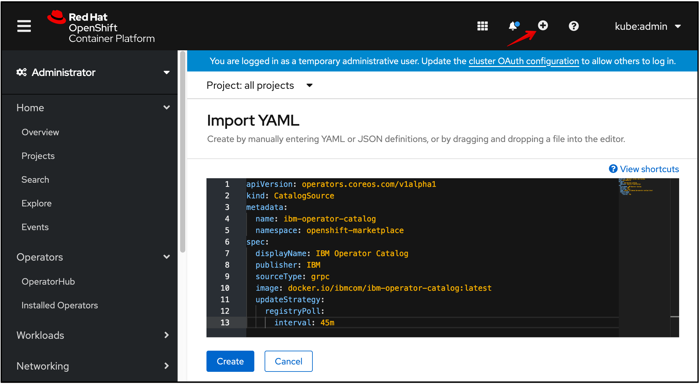

---

copyright:
  years: 2020
lastupdated: "2020-10-28"

---

{:new_window: target="blank"}
{:shortdesc: .shortdesc}
{:screen: .screen}
{:codeblock: .codeblock}
{:pre: .pre}
{:child: .link .ulchildlink}
{:childlinks: .ullinks}

# {{site.data.keyword.ieam}} 설치
{: #hub_install_overview}

{{site.data.keyword.edge_notm}}({{site.data.keyword.ieam}}) 노드 태스크를 시작하기 전에 관리 허브를 설치 및 구성해야 합니다.

## 설치 요약
{: #sum}

* 이 컨텐츠는 다음 컴포넌트를 배치하는 단계에 대해 설명합니다.
  * [IBM Cloud Platform Common Services 3.6.x](https://www.ibm.com/docs/en/cpfs).
  * {{site.data.keyword.edge_notm}} 관리 허브 운영자.
  * {{site.data.keyword.edge_notm}} exchange API.
  * {{site.data.keyword.edge_notm}} agbot.
  * {{site.data.keyword.edge_notm}} CSS(Cloud Sync Service).
  * {{site.data.keyword.edge_notm}} 사용자 인터페이스.
  * {{site.data.keyword.edge_notm}} Secure Device Onboarding(SDO).
  * {{site.data.keyword.edge_notm}} Secrets manager(볼트).

**참고**: 이전 버전에서 업그레이드하려는 경우 [문서 업그레이드](upgrade.md)를 참조하십시오.

## 선행 조건
{: #prereq}

### {{site.data.keyword.ocp_tm}}
[적절한 크기](cluster_sizing.md)의 지원되는 {{site.data.keyword.open_shift_cp}} 4.6설치가 있는지 확인하십시오. 적절한 스토리지 클래스가 설치되어 있고 클러스터에서 작동하는지 확인하십시오.

IBM Cloud 관리 {{site.data.keyword.open_shift_cp}} 4.6 클러스터 프로비저닝에 대한 자세한 정보는 다음을 참조하십시오.

* {{site.data.keyword.cloud}}의 [{{site.data.keyword.ocp_tm}}

자체 관리 {{site.data.keyword.open_shift_cp}} 클러스터 작성에 대한 자세한 정보는 {{site.data.keyword.open_shift}} 문서를 참조하십시오.

* [{{site.data.keyword.open_shift_cp}} 4.6문서](https://docs.openshift.com/container-platform/4.6/welcome/index.html)(https://www.ibm.com/cloud/openshift)]

**참고**: 기본적으로 로컬 개발 Secrets Manager 및 개발 데이터베이스는 운영자 배치의 일부로 프로비저닝됩니다. 사용자의 프로비저닝된 데이터베이스에 연결 및 기타 구성 옵션에 대한 자세한 정보는 [구성](configuration.md)을 참조하십시오.

모든 지속적 데이터 백업 및 복원은 사용자의 책임이며, [백업 및 복구](../admin/backup_recovery.md)를 참조하십시오.

## 브라우저 설치 프로세스
{: #process}

1. 클러스터 관리자 권한으로 {{site.data.keyword.open_shift_cp}} 웹 UI를 통해 로그인하십시오. **스토리지** 페이지로 이동하여 지원되는 **기본** 스토리지 클래스가 정의되었는지 확인하십시오.

   

   **참고**: 비기본 스토리지 클래스를 사용하는 방법에 대한 자세한 정보는 [구성](configuration.md) 페이지를 참조하십시오.

2. IBM Operator Catalog Source를 작성하십시오. 여기에서는 **IEAM 관리 허브** 번들을 설치하는 기능을 제공합니다. 다음 이미지에 표시된 대로 가져오기 더하기 부호를 선택한 후에 이 텍스트를 복사하여 붙여넣으십시오. 텍스트를 붙여넣은 후 **작성**을 클릭하십시오.

   ```
   apiVersion: operators.coreos.com/v1alpha1 kind: CatalogSource metadata: name: ibm-operator-catalog namespace: openshift-marketplace spec: displayName: IBM Operator Catalog publisher: IBM sourceType: grpc image: icr.io/cpopen/ibm-operator-catalog:latest updateStrategy: registryPoll: interval: 45m
   ```
   {: codeblock}

   

3. IBM Common Services Operator Catalog Source를 작성하십시오. 여기에서는 **IEAM 관리 허브**에서 추가적으로 설치하는 공통 서비스 운영자 제품군을 제공합니다. 다음 이미지에 표시된 대로 가져오기 더하기 부호를 선택한 후에 이 텍스트를 복사하여 붙여넣으십시오. 텍스트를 붙여넣은 후 **작성**을 클릭하십시오.
   ```
   apiVersion: operators.coreos.com/v1alpha1    kind: CatalogSource    metadata:      name: opencloud-operators      namespace: openshift-marketplace    spec:      displayName: IBMCS Operators      publisher: IBM      sourceType: grpc      image: quay.io/opencloudio/ibm-common-service-catalog:3.6      updateStrategy:        registryPoll:          interval: 45m
   ```
   {: codeblock}

   

4. **프로젝트** 페이지로 이동하고 운영자를 설치할 프로젝트를 작성하십시오.

   

5. **ibm-entitlement-key**라고 하는 이미지 가져오기 시크릿을 정의하여 IBM Entitled Registry에서 인증하십시오.

   **참고**:
   * [내 IBM 키](https://myibm.ibm.com/products-services/containerlibrary)를 통해 인타이틀먼트 키를 확보한 후 다음 컨텐츠에 표시된 것과 같이 필드를 완성하십시오.
   * 이 리소스가 이전 단계에서 작성된 것과 동일한 프로젝트에서 작성되었는지 확인하십시오.

   

6. **OperatorHub 페이지**로 이동하여 **IEAM 관리 허브**를 검색하십시오.

7. **IEAM 관리 허브** 카드를 클릭하고 **설치**를 클릭하십시오.

8. 프로젝트가 4단계에서 작성된 항목과 일치하는지 확인하여 운영자를 설치하십시오.

   **참고**: 이는 **IEAM 관리 허브** 운영자가 설치한 후에 감시하는 유일한 프로젝트입니다.

   

9. 4단계에서 작성한 **프로젝트**로 다시 변경하고 7단계에서 표시된 **제공된 API** 열의 **EamHub**를 클릭하고 **EamHub 작성**을 클릭하십시오.

   

10. 관리 허브를 정의하고 구성하는 **EamHub** 사용자 정의 자원을 작성하십시오. 사용자 정의 옵션에 대한 자세한 정보는 [구성](configuration.md)을 참조하십시오. 프로젝트가 4단계에서 작성한 것과 일치하는지 확인하십시오.

   * **라이센스 동의** 토글을 클릭한 후 **작성**을 클릭하여 라이센스에 동의하십시오.

   

운영자가 4단계에서 지정한 프로젝트에 정의된 워크로드 및 **ibm-common-services** 프로젝트에 필요한 {{site.data.keyword.common_services}} 워크로드를 배치합니다.

## 다음 단계

[설치 후](post_install.md) 단계를 수행하여 새 관리 허브를 계속 설정하십시오.
