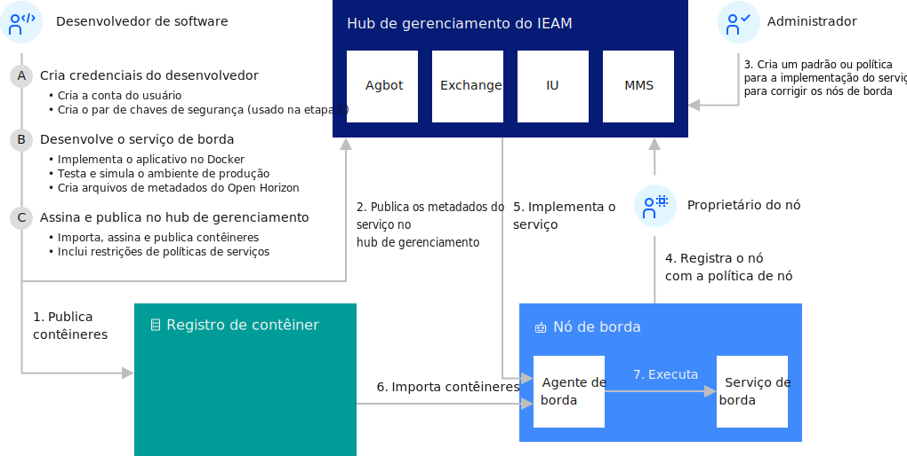

---

copyright:
years: 2020
lastupdated: "2020-04-09"

---

{:new_window: target="blank"}
{:shortdesc: .shortdesc}
{:screen: .screen}
{:codeblock: .codeblock}
{:pre: .pre}
{:child: .link .ulchildlink}
{:childlinks: .ullinks}

# Desenvolvendo um serviço de borda para dispositivos
{: #developing}

Para iniciar o desenvolvimento de serviços de borda para o {{site.data.keyword.edge_notm}} ({{site.data.keyword.ieam}}), primeiro é necessário configurar suas credenciais para a publicação do conteúdo. Como todos os serviços devem ser assinados, você também deve criar um par de chaves de assinatura criptográfica. Certifique-se de concluir as etapas de pré-requisito em [Preparando-se para criar um serviço de borda](service_containers.md). 

Este diagrama mostra as interações típicas entre os componentes no {{site.data.keyword.horizon}}.

 

## Exemplos
{: #edge_devices_ex_examples}

Use suas credenciais e chaves de assinatura para concluir os exemplos de desenvolvimento. Estes exemplos mostram como construir serviços simples e o ajudam a aprender sobre os fundamentos de desenvolvimento do {{site.data.keyword.ieam}}.

Cada um desses exemplos de desenvolvimento demonstra mais alguns aspectos do desenvolvimento de serviços de borda. Para ter uma experiência de aprendizado ideal, conclua os exemplos na ordem em que estão listados aqui.

* [Transformar imagem em um serviço de borda](transform_image.md) - Demonstra como implementar uma imagem do Docker existente como um serviço de borda.

* [Criando seu próprio serviço de borda Hello World](developingstart_example.md) - demonstra os fundamentos de desenvolvimento, teste, publicação e implementação de um serviço de borda.

* [CPU para {{site.data.keyword.message_hub_notm}} serviço](cpu_msg_example.md) - demonstra como definir parâmetros de configuração de serviço de borda, especificar se seu serviço de borda requer outros serviços de borda e enviar dados para um serviço de alimentação de dados em nuvem.

* [Hello World usando o gerenciamento de modelo](model_management_system.md) - Demonstra como desenvolver um serviço de borda que usa o serviço de gerenciamento de modelo. O serviço de gerenciamento de modelo fornece de forma assíncrona as atualizações de arquivos para serviços de borda em nós de borda, por exemplo, para atualizar dinamicamente um modelo de aprendizado de máquina toda vez que ele evolui.

* [Atualizando um serviço de borda com uma ação de retrocesso](../using_edge_devices/service_rollbacks.md) - Demonstra como monitorar o êxito da implementação e, em caso de falha em qualquer nó de borda, mostra como reverter o nó para a versão anterior do serviço de borda.

Depois de concluir a construção desses serviços de exemplo, revise a documentação a seguir para obter informações mais detalhadas sobre o desenvolvimento de serviços para o {{site.data.keyword.ieam}}:

## Leitura Adicional
{: #developing_more_info}

Revise os princípios e as melhores práticas importantes para o desenvolvimento de software do {{site.data.keyword.ieam}}.

* [Melhores práticas de desenvolvimento de borda nativa](best_practices.md)

Com o {{site.data.keyword.ieam}}, é possível colocar, opcionalmente, imagens de contêiner de serviço no registro de contêiner seguro privado da IBM em vez de colocar no Docker Hub público. Por exemplo, se você tiver uma imagem de software que inclua ativos que não são apropriados para incluir em um registro público.

* [Usando um registro de contêiner privado](container_registry.md)

É possível {{site.data.keyword.ieam}} usar para colocar seus contêineres de serviço no registro de contêiner seguro e privado da IBM em vez do Docker Hub público.

* [Detalhes do desenvolvimento](developing_details.md)

Com o {{site.data.keyword.ieam}}, é possível desenvolver quaisquer contêineres de serviço que você deseje para suas máquinas de borda.

* [APIs](../installing/edge_rest_apis.md)

O {{site.data.keyword.ieam}} fornece APIs RESTful para permitir que os componentes colaborarem e que os desenvolvedores e usuários da organização controlem os componentes.
