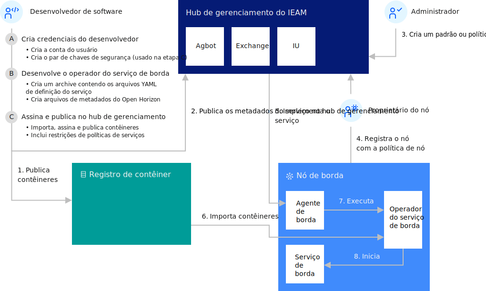

---

copyright:
  years: 2020
lastupdated: "2020-04-9"

---

{:shortdesc: .shortdesc}
{:new_window: target="_blank"}
{:codeblock: .codeblock}
{:pre: .pre}
{:screen: .screen}
{:tip: .tip}
{:download: .download}

# Desenvolvendo um serviço de borda para clusters
{: #developing_clusters}

O recurso de cluster de borda do {{site.data.keyword.edge_notm}} ({{site.data.keyword.ieam}}) fornece recursos de computação de borda que o ajudam a gerenciar e implementar cargas de trabalho a partir de um cluster de hub de gerenciamento em instâncias remotas do OpenShift® Container Platform ou outros clusters baseados em Kubernetes. Clusters de borda são nós de borda do {{site.data.keyword.ieam}} que são clusters Kubernetes. Um cluster de borda permite casos de uso na borda, que requerem a colocação de recursos de cálculo para operações de negócios ou que requerem mais escalabilidade, disponibilidade e capacidade de cálculo do que o que pode ser suportado por um dispositivo de borda. Além disso, não é incomum que os clusters de borda forneçam os serviços de aplicativos que são necessários para oferecer suporte aos serviços que são executados em um dispositivo de borda devido à proximidade com os dispositivos de borda, o que resulta em um aplicativo de borda multicamadas. O {{site.data.keyword.ieam}} implementa serviços de borda em um cluster de borda por meio de um operador do Kubernetes, ativando os mesmos mecanismos de implementação autônomos usados com dispositivos de borda. O poder total do Kubernetes como uma plataforma de gerenciamento de contêiner está disponível para serviços de borda que são implementados pelo {{site.data.keyword.ieam}}.

* [Desenvolvendo um operador do Kubernetes](service_operators.md)
* [Criando seu próprio Hello World para clusters](creating_hello_world.md)
