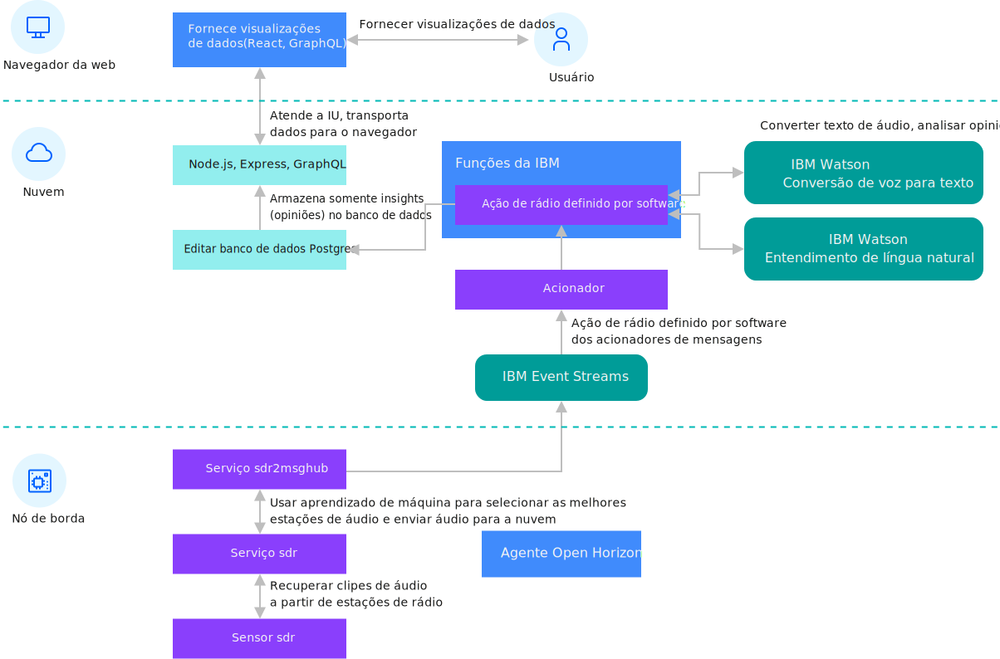

---

copyright:
years: 2020
lastupdated: "2020-02-5" 

---

{:new_window: target="blank"}
{:shortdesc: .shortdesc}
{:screen: .screen}
{:codeblock: .codeblock}
{:pre: .pre}
{:child: .link .ulchildlink}
{:childlinks: .ullinks}

# Processamento de borda de rádio definido por software
{: #defined_radio_ex}

Este exemplo usa o rádio definido por software (SDR) como um exemplo de processamento de borda. Com o SDR, é possível enviar dados brutos por meio do espectro de rádio completo para um servidor de nuvem para processamento. O nó de borda processa os dados localmente e, em seguida, envia menos volume de dados mais valiosos para um serviço de processamento em nuvem para processamento adicional.
{:shortdesc}

Este diagrama mostra a arquitetura para este exemplo de SDR:



O processamento de borda SDR é um exemplo cheio de recursos que consome áudio da estação de rádio, extrai discurso e converte o discurso extraído em texto. O exemplo conclui a análise de sentimentos no texto e disponibiliza os dados e os resultados por meio de uma interface com o usuário na qual é possível visualizar os detalhes dos dados de cada nó de borda. Use esse exemplo para saber mais sobre o processamento de borda.

O SDR recebe sinais de rádio usando o circuito digital em uma CPU do computador para manipular o trabalho para requerer um conjunto de circuitos analógicos especializados. Esses circuitos analógicos normalmente são restringidos pela amplitude do espectro de rádio que eles podem receber. Um receptor de rádio analógico construído para receber estações de rádio FM, por exemplo, não pode receber sinais de rádio de qualquer outro lugar no espectro de rádio. O SDR pode acessar grandes partes do espectro. Se você não tiver o hardware SDR, será possível usar dados simulados. Quando você estiver usando dados simulados, o áudio do
fluxo
da Internet será tratado como se fosse transmitido pela FM e recebido
no nó de borda.

Antes de executar esta tarefa, registre e cancele o registro do dispositivo de borda, executando as etapas em [Instalando o agente](registration.md).

Este código contém esses componentes primários.

|Componente|Descrição|
|---------|-----------|
|[sdr service ](https://github.com/open-horizon/examples/tree/master/edge/services/sdr)|O serviço de nível inferior acessa o hardware no nó de borda|
|[ssdr2evtstreams service ](https://github.com/open-horizon/examples/tree/master/edge/evtstreams/sdr2evtstreams)|O serviço de nível superior recebe dados do serviço sdr de nível inferior e conclui a análise local dos dados no nó de borda. O
serviço sdr2evtstreams então envia os dados processados para o software de back-end em nuvem.|
|[Software de back-end de nuvem ](https://github.com/open-horizon/examples/tree/master/cloud/sdr)|O software back-end de nuvem recebe dados de nós de borda para análise adicional. Em seguida, a implementação back-end pode apresentar um mapa dos nós de borda e mais informações dentro de uma interface com o usuário baseada na web.|
{: caption="Tabela 1. Rádio definido por software para componentes primários do {{site.data.keyword.message_hub_notm}}" caption-side="top"}

## Registrando seu dispositivo

Embora esse serviço possa ser executado usando dados simulados em qualquer dispositivo de borda, se você estiver usando um dispositivo de borda, como um Raspberry Pi com o hardware SDR, configure um módulo kernel para suportar primeiro o hardware do SDR. Deve-se configurar esse
módulo manualmente. Os contêineres do Docker podem estabelecer uma distribuição diferente do Linux em seus contextos, mas o contêiner não pode instalar módulos do kernel. 

Conclua estas etapas para configurar este módulo:

1. Como um usuário raiz, crie um arquivo denominado
`/etc/modprobe.d/rtlsdr.conf`.
   ```
   sudo nano /etc/modprobe.d/rtlsdr.conf
   ```
   {: codeblock}

2. Inclua
as seguintes linhas no arquivo:
   ```
   blacklist rtl2830
     blacklist rtl2832
     blacklist dvb_usb_rtl28xxu
   ```
   {: codeblock}

3. Salve o arquivo e, em seguida, reinicie antes de
continuar:
   ```
   sudo reboot
   ```
   {: codeblock}   

4. Configure a seguinte chave de API do
{{site.data.keyword.message_hub_notm}} no ambiente. Esta chave é criada para uso com este exemplo e é usada para alimentar os dados processados reunidos pelo seu nó de borda para a IU de rádio definida por software IBM.
   ```
   export EVTSTREAMS_API_KEY=X2e8cSjbDAMk-ztJLaoi3uffy8qsQTnZttUjcHCfm7cp
    export EVTSTREAMS_BROKER_URL=broker-3-y420pyyyvhhmttz0.kafka.svc01.us-south.eventstreams.cloud.ibm.com:9093,broker-5-y420pyyyvhhmttz0.kafka.svc01.us-south.eventstreams.cloud.ibm.com:9093,broker-4-y420pyyyvhhmttz0.kafka.svc01.us-south.eventstreams.cloud.ibm.com:9093,broker-1-y420pyyyvhhmttz0.kafka.svc01.us-south.eventstreams.cloud.ibm.com:9093,broker-0-y420pyyyvhhmttz0.kafka.svc01.us-south.eventstreams.cloud.ibm.com:9093,broker-2-y420pyyyvhhmttz0.kafka.svc01.us-south.eventstreams.cloud.ibm.com:9093
   ```
   {: codeblock}

5. Para executar o exemplo de serviço sdr2evtstreams em seu nó de borda, deve-se registrar seu nó de borda com o padrão de implementação IBM/pattern-ibm.sdr2evtstreams. Execute as etapas em [Condições prévias para o uso do SDR para o IBM Event Streams Exemplo Edge Service](https://www.ibm.com/links?url=https%3A%2F%2Fgithub.com%2Fopen-horizon%2Fexamples%2Ftree%2Fmaster%2Fedge%2Fevtstreams%2Fsdr2evtstreams). 


6. Verifique a UI da Web de exemplo para saber se o nó de borda
está enviando resultados. Para obter mais informações, consulte
[UI
da web de exemplo de rádio definida por software](https://sdr-poc-sdr-poc-app-delightful-leopard.mybluemix.net). Efetue login com essas credenciais:

   * Nome do usuário: guest@ibm.com
   * Senha: guest123

## Detalhes da implementação do SDR

### Serviço de nível baixo do sdr
{: #sdr}

O nível mais baixo da pilha de software deste serviço inclui a implementação do serviço `sdr`. Esse serviço acessa o hardware local da rádio definida por software usando a biblioteca popular `librtlsdr` e os utilitários `rtl_fm` e `rtl_power` derivados, juntamente com o daemon `rtl_rpcd`. Para obter mais informações sobre a biblioteca `librtlsdr`, consulte [librtlsdr ](https://github.com/librtlsdr/librtlsdr).

O serviço `sdr` controla diretamente o hardware de rádio definida por software para ajustar o hardware a uma frequência específica para receber dados transmitidos ou para medir a intensidade do sinal em um espectro especificado. Um fluxo de trabalho típico para o serviço pode ser ajustado para uma frequência específica para receber dados da estação nessa frequência. Em seguida, o serviço pode processar os dados coletados.

### Serviço de alto nível do sdr2evtstreams
{: #sdr2evtstreams}

A implementação de serviço de alto nível `sdr2evtstreams` usa a API de REST do serviço `sdr` e a API de REST de serviço `gps` na rede virtual privada do Docker local. O serviço `sdr2evtstreams` recebe dados do serviço `sdr` e conclui uma inferência local nos dados para selecionar as melhores estações com contêm fala. Em seguida, o serviço `sdr2evtstreams` usa o Kafka para publicar clipes de áudio na nuvem usando o {{site.data.keyword.message_hub_notm}}.

### IBM Functions
{: #ibm_functions}

O IBM Functions orquestra o lado da nuvem do exemplo de aplicativo de rádio definida por software. As funções IBM são baseadas no OpenWhisk e permitem a computação sem servidor. A computação sem servidor significa que os componentes de código podem ser implementados sem nenhuma infraestrutura de suporte, como um sistema operacional ou sistema de linguagem de programação. Usando o IBM Functions, é possível concentrar-se em seu próprio código e deixar que a IBM manipule o ajuste de escala, a segurança e a manutenção contínua de todos os componentes para você. Não é necessário nenhum hardware para provisionar, nenhuma VM e nenhum contêiner.

Os componentes do código sem servidor são configurados para acionar (executar) em resposta a eventos. Neste exemplo, o evento de acionamento é o recebimento de mensagens dos nós de borda no {{site.data.keyword.message_hub_notm}} sempre que clipes de áudio são publicados por nós de borda no {{site.data.keyword.message_hub_notm}}. As ações do exemplo são acionadas para alimentar os dados e executar ações a respeito deles. Elas usam o serviço do IBM Watson Speech-To-Text (STT) para converter os dados de áudio recebidos em texto. Em seguida, esse texto é enviado para o serviço do IBM Watson Natural Language Understanding (NLU) para analisar o sentimento expresso em cada um dos substantivos que ele contém. Para obter mais informações, consulte [Código de ação do IBM Functions ](https://github.com/open-horizon/examples/blob/master/cloud/sdr/data-processing/ibm-functions/actions/msgreceive.js).

### Banco de dados IBM
{: #ibm_database}

O código de ação do IBM Functions é concluído armazenando os resultados de sentimentos computados em bancos de dados IBM. Em seguida, o servidor da Web e o software cliente trabalham para apresentar esses dados aos navegadores da web do usuário a partir do banco de dados.

### interface da web
{: #web_interface}

A interface com o usuário da web para o aplicativo de rádio definido por software permite que os usuários naveguem pelos dados de sentimento, que são apresentados a partir de bancos de dados IBM. Essa interface com o usuário também renderiza um mapa que mostra os nós de borda que forneceram os dados. O mapa é criado com dados do serviço `gps` fornecido pela IBM, que são usados pelo código do nó de borda para o serviço `sdr2evtstreams`. O serviço `gps` pode fazer interface com o hardware do GPS ou receber informações do proprietário do dispositivo sobre a localização. Na ausência de ambos, o hardware de GPS e a localização do proprietário do dispositivo, o serviço `gps` pode estimar a localização do nó de borda usando o endereço IP do nó de borda para encontrar a localização geográfica. Ao usar esse serviço, o `sdr2evtstreams` pode fornecer dados da localização para a nuvem quando o serviço envia clipes de áudio. Para obter mais informações, consulte [Código da IU da Web do aplicativo de rádio definida por software do ](https://github.com/open-horizon/examples/tree/master/cloud/sdr/ui/sdr-app).

Opcionalmente, as IBM Functions, os bancos de dados IBM e o código da IU da web podem ser implementados no IBM Cloud se caso você deseja criar sua própria IU da web de exemplo de rádio definido por software. É possível fazer isso com um único comando depois que você [criar uma conta paga ](https://cloud.ibm.com/login). Para obter mais informações, consulte [Conteúdo do repositório de implementação ](https://www.ibm.com/links?url=https%3A%2F%2Fgithub.com%2Fopen-horizon%2Fexamples%2Ftree%2Fmaster%2Fcloud%2Fsdr%2Fdeploy%2Fibm). 

Nota: este processo de implementação requer serviços pagos que incorrem em encargos em sua conta do {{site.data.keyword.cloud_notm}}.

## O que fazer a seguir

Se você deseja implementar seu próprio software em um nó de borda, deve criar seus próprios serviços de borda e padrão de implementação ou política de implementação associados. Para obter mais informações, consulte [Desenvolvendo um serviço de borda para dispositivos](../developing/developing.md).
