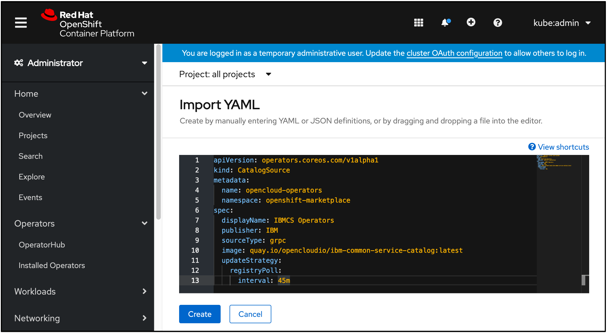

---

copyright:
  years: 2020
lastupdated: "2020-10-28"

---

{:new_window: target="blank"}
{:shortdesc: .shortdesc}
{:screen: .screen}
{:codeblock: .codeblock}
{:pre: .pre}
{:child: .link .ulchildlink}
{:childlinks: .ullinks}

# Instale o {{site.data.keyword.ieam}}
{: #hub_install_overview}

Deve-se instalar e configurar um hub de gerenciamento antes de iniciar as tarefas de nó do {{site.data.keyword.edge_notm}} ({{site.data.keyword.ieam}}).

## Resumo da Instalação
{: #sum}

* Este conteúdo descreve as etapas para implementar os componentes a seguir.
  * [IBM Cloud Platform Common Services 3.6.x](https://www.ibm.com/docs/en/cpfs).
  * Operador do hub de gerenciamento do {{site.data.keyword.edge_notm}}.
  * API do Exchange {{site.data.keyword.edge_notm}}.
  * Robô de contrato do {{site.data.keyword.edge_notm}}.
  * {{site.data.keyword.edge_notm}} Cloud Sync Service (CSS).
  * Interface com o usuário do {{site.data.keyword.edge_notm}}.
  * Secure Device Onboarding (SDO) do {{site.data.keyword.edge_notm}}.
  * Gerenciador de segredos do {{site.data.keyword.edge_notm}} (Vault).

**Nota**: Veja a [documentação de upgrade](upgrade.md) se você estiver tentando fazer upgrade de uma versão anterior.

## Pré-requisito
{: #prereq}

### {{site.data.keyword.ocp_tm}}
Certifique-se de ter uma instalação do {{site.data.keyword.open_shift_cp}} 4.6 [adequadamente dimensionada](cluster_sizing.md) e suportada, incluindo uma classe de armazenamento apropriada instalada e funcionando em seu cluster.

Para obter mais informações sobre o fornecimento de um cluster do {{site.data.keyword.open_shift_cp}} 4.6 gerenciado pela IBM Cloud, consulte o seguinte:

* [{{site.data.keyword.ocp_tm}} no {{site.data.keyword.cloud}}](https://www.ibm.com/cloud/openshift)

Para obter mais informações sobre a criação do seu próprio cluster gerenciado do {{site.data.keyword.open_shift_cp}}, consulte a documentação do {{site.data.keyword.open_shift}}:

* [Documentação do {{site.data.keyword.open_shift_cp}} 4.6](https://docs.openshift.com/container-platform/4.6/welcome/index.html)

**Nota**: Por padrão, um gerenciador de segredos de desenvolvimento e bancos de dados de desenvolvimento locais são fornecidos como parte da implementação do operador. Para obter mais informações sobre conectar aos seus próprios bancos de dados provisionados e outras opções de configuração, consulte [configuração](configuration.md).

Você é responsável por fazer backup e restaurar todos os dados persistentes, consulte [backup e recuperação](../admin/backup_recovery.md).

## Processo de instalação do navegador
{: #process}

1. Efetue login por meio da IU da web do {{site.data.keyword.open_shift_cp}} com privilégios do administrador do cluster. Navegue até a página **Armazenamento** para confirmar que você tem uma classe de armazenamento **Padrão** suportada definida:

   

   **Nota**: para obter mais informações sobre como usar uma classe de armazenamento não padrão, consulte a página [Configuração](configuration.md).

2. Crie o IBM Operator Catalog Source, que fornece a capacidade de instalar o pacote configurável **IEAM Management Hub**. Copie e cole este texto depois de selecionar o sinal de mais de importação, conforme mostrado na imagem a seguir. Depois de colar o texto, clique em **Criar**:

   ```
   apiVersion: operators.coreos.com/v1alpha1 kind: CatalogSource metadata: name: ibm-operator-catalog namespace: openshift-marketplace spec: displayName: IBM Operator Catalog publisher: IBM sourceType: grpc image: icr.io/cpopen/ibm-operator-catalog:latest updateStrategy: registryPoll: interval: 45m
   ```
   {: codeblock}

   

3. Crie o IBM Common Services Operator Catalog Source. Isso fornece o conjunto de operadores de serviços comuns que o **hub de gerenciamento do IEAM** irá instalar adicionalmente. Copie e cole este texto depois de selecionar o sinal de mais de importação, conforme mostrado na imagem a seguir. Depois de colar o texto, clique em **Criar**:
   ```
   apiVersion: operators.coreos.com/v1alpha1    kind: CatalogSource    metadata:      name: opencloud-operators      namespace: openshift-marketplace    spec:      displayName: IBMCS Operators      publisher: IBM      sourceType: grpc      image: quay.io/opencloudio/ibm-common-service-catalog:3.6      updateStrategy:        registryPoll:          interval: 45m
   ```
   {: codeblock}

   

4. Navegue até a página **Projetos** e crie um projeto no qual deseja instalar o operador:

   

5. Defina um segredo de extração de imagem chamado **ibm-entitlement-key** para autenticar no IBM Entitled Registry:

   **Notas**:
   * Obtenha sua chave de autorização por meio do [My IBM Key](https://myibm.ibm.com/products-services/containerlibrary) e preencha os campos, conforme mostrado no conteúdo a seguir.
   * Assegure-se de que este recurso seja criado no mesmo projeto que foi criado na etapa anterior.

   

6. Navegue até a página **OperatorHub** e procure **IEAM Management Hub**.

7. Clique no cartão **IEAM Management Hub** e clique em **Instalar**.

8. Instale o operador, assegurando que o projeto corresponda ao que foi criado na Etapa 4.

   **Nota**: esse é o único projeto que o operador **IEAM Management Hub** observa depois que ele é instalado.

   

9. Mude de volta para o **Projeto** criado na Etapa 4, clique em **EamHub** na coluna **APIs fornecidas** que é mostrada na Etapa 7 e clique em **Criar o EamHub**:

   

10. Crie o recurso customizado **EamHub**, o qual define e configura o seu hub de gerenciamento. Para obter mais informações sobre as opções de customização, consulte [Configuração](configuration.md). Certifique-se de que o projeto corresponda ao que você criou na Etapa 4.

   * Clique na alternância **Aceitar licença** e em **Criar** para aceitar a licença.

   

O operador implementará as cargas de trabalho definidas no projeto que foi especificado na Etapa 4 e as cargas de trabalho necessárias do {{site.data.keyword.common_services}} no projeto **ibm-common-services**.

## O que Vem a Seguir

Continue configurando seu novo hub de gerenciamento executando as etapas em [pós-instalação](post_install.md).
