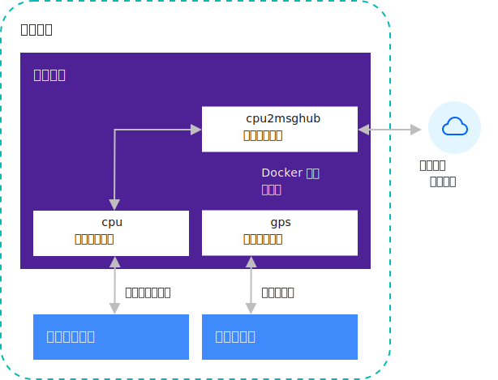

---

copyright:
years: 2019
lastupdated: "2019-07-05"

---

{:new_window: target="blank"}
{:shortdesc: .shortdesc}
{:screen: .screen}
{:codeblock: .codeblock}
{:pre: .pre}
{:child: .link .ulchildlink}
{:childlinks: .ullinks}

# 开发详细信息
{: #developing}

以下内容提供有关 {{site.data.keyword.edge_notm}} ({{site.data.keyword.ieam}}) 开发的软件开发实践和概念的更多详细信息。
{:shortdesc}

## 简介
{: #developing_intro}

{{site.data.keyword.edge_notm}} ({{site.data.keyword.ieam}}) 基于 [Open Horizon - EdgeX Project Group ](https://wiki.edgexfoundry.org/display/FA/Open+Horizon+-+EdgeX+Project+Group) 开放式源代码软件进行构建。

利用 {{site.data.keyword.ieam}}，您可以针对边缘机器开发想要的任何服务容器。 然后，可以以加密方式对代码进行加密和发布代码。 最后，可以在 {{site.data.keyword.edge_deploy_pattern}} 中指定策略以监管软件安装、监视和更新。 完成这些任务后，您可以查看 {{site.data.keyword.horizon_agents}} 和 {{site.data.keyword.horizon_agbots}} 构成协议来协作管理软件生命周期。 然后，这些组件基于针对每个边缘节点注册的部署模式完全自动化地管理 {{site.data.keyword.edge_nodes}} 上的软件生命周期详细信息。 {{site.data.keyword.ieam}} 还可以使用策略来确定自主部署服务和机器学习模型的位置和时间。 策略是部署模式的替代方法。

{{site.data.keyword.ieam}} 中的软件开发流程关注于维护系统安全性和完整性，同时大幅简化边缘节点上的活动软件管理所需的工作。 {{site.data.keyword.ieam}} 还可以使用策略来确定自主部署服务和机器学习模型的位置和时间。 策略是部署模式的替代方法。 您可以将 {{site.data.keyword.ieam}} 发布过程构建到持续集成和部署管道中。 分布式自主代理程序在软件或策略中（例如，在 {{site.data.keyword.edge_deploy_pattern}} 或部署策略中）发现已发布的更改时，自主代理程序将独立进行操作以更新软件，或者强制在整个边缘机器群上实施策略，与机器所在的位置无关。

## 服务和部署模式
{: #services_deploy_patterns}

{{site.data.keyword.edge_services}} 是部署模式的构建块。 每个服务可包含一个或多个 Docker 容器。 每个 Docker 容器又可包含一个或多个长期运行的进程。 这些进程几乎可采用任何编程语言进行编写，并使用任何库或实用程序。 但是，必须针对 Docker 容器的上下文开发和运行这些进程。 此灵活性意味着对 {{site.data.keyword.ieam}} 可为您管理的节点上的代码几乎无任何约束。 在容器运行时，在安全沙箱中约束容器。 此沙箱限制对硬件设备、某些操作系统服务、主机文件系统和主机边缘机器网络的访问。 有关沙箱约束的信息，请参阅[沙箱](#sandbox)。

`cpu2evtstreams` 示例代码包含使用其他两个本地边缘服务的 Docker 容器。 这些本地边缘服务使用 HTTP REST API 通过本地专用 Docker 虚拟网络进行连接。 这些服务被命名为 `cpu` 和 `gps`。 代理程序在单独的专用网络上随在服务上声明依赖关系的每个服务一起部署每个服务。 针对 `cpu2evtstreams` 和 `cpu` 创建一个网络，并针对 `cpu2evtstreams` 和 `gps` 创建另一个网络。 如果此部署模式中有第四个服务也共享 `cpu` 服务，那么仅针对 `cpu` 和第四个服务创建另一个专用网络。 在 {{site.data.keyword.ieam}} 中，在发布其他服务时，此网络策略将服务访问限制为仅在 `requiredServices` 中列出的其他服务。 下图显示模式在边缘节点上运行时的 `cpu2evtstreams` 部署模式：

**注**：仅对某些示例需要设置 IBM Event Streams。

两个虚拟网络支持 `cpu2evtstreams` 服务容器访问 `cpu` 和 `gps` 服务容器提供的 REST API。 这两个容器管理对操作系统服务和硬件设备的访问。 虽然使用 REST API，仍存在多种其他可能的通信，可用于支持服务共享数据和共享。

通常，边缘节点的最有效编码模式包括部署多个小型、独立可配置且可部署的服务。 例如，物联网模式通常具有需要访问边缘节点硬件的低级别服务，例如，传感器或传动结构。 这些服务提供对此硬件的共享访问以供其他服务使用。

在硬件上需要互斥访问以提供有用功能时，此模式非常有用。 低级别服务可正确管理此访问。 `cpu` 和 `gps` 服务容器的角色在原则上类似于主机操作系统中设备驱动程序软件，但是级别更高。 将代码分段为独立小服务，其中部分专门用于低级别硬件访问，这样实现明确问题分离。 每个组件都可自由地在现场进行独立改进和更新。 也可以通过有选择地允许第三方应用程序访问特定硬件或其他服务，从而安全地随您的专有传统嵌入式软件堆栈一起部署这些应用程序。

例如，工业控制器部署模式可能包含一个用于监视电力使用情况传感器的低级别服务和其他低级别服务。 这些其他低级别服务可用于支持控制传动结构以供对监视的设备供电。 部署模式还可能具有另一个顶级服务容器，此容器使用传感器和传动结构的服务。 在检测到异常功耗时，此顶级服务可以使用服务以向操作者发出警报从而自动关闭设备。 此部署模式也可能包含一个历史记录服务，此服务记录并归档传感器和传动结构数据，并且可能完成数据分析。 此类部署模式的其他有用组件可能是 GPS 定位服务。

可使用此设计独立更新每个单独的服务容器。 每个独立服务也可进行配置并组合到其他有用部署模式，而无需任何代码更改。 如果需要，可以向模式添加第三方分析服务。 可以向此第三方服务仅授予一组特定只读 API 的访问权，这限制服务与平台上的传动结构进行交互。

或者，可以在单个服务容器中运行此工业控制器示例中的所有任务。 此替代方法通常不是最佳方法，因为较小的独立和互连服务的集合通常可使软件更新更快且更灵活。 较小的服务集合在现场也可能更稳固。 有关如何设计部署模式的更多信息，请参阅[边缘本机开发实践](best_practices.md)。

## 沙箱
{: #sandbox}

服务运行所在的沙箱限制对服务容器所提供的 API 的访问。此操作通过在一个或多个虚拟专用网中部署每个服务来完成。只允许访问明确在服务上声明依赖关系的服务。请参阅[服务定义](#service_definition)以获取有关如何在虚拟专用网上配置容器的 DNS 名称的描述。主机上的其他进程通常没有这些服务的访问权。类似，其他远程主机通常没有任何这些服务的访问权，除非服务显式地将端口发布到主机的外部网络接口。

## 使用其他服务的服务
{: #using_services}

边缘服务通常使用其他边缘服务所提供的各种 API 接口以从这些接口获取数据，或者向它们提交控制命令。 这些 API 接口通常是 HTTP REST API，例如 `cpu2evtstreams` 示例中的低级别 `cpu` 和 `gps` 服务所提供的接口。 但是，这些接口实际上可以是您想要的任何项，例如，共享内存、TCP 或 UDP，并且可以使用加密也可以不使用。 因为这些通信通常在单个边缘节点中发生，消息从不会离开此主机，因此通常不需要加密。

作为 REST API 的替代方法，您可以使用发布和预订接口，例如，MQTT 提供的接口。 在服务仅间歇性提供数据时，发布和预订接口通常比重复轮询 REST API 更加简单，因为 REST API 可能超时。例如，假设有一个服务，其监视一个硬件按钮，并针对其他服务提供 API 以检测是否按下按钮。 如果使用 REST API，那么调用者无法调用 REST API 并等待在按下按钮时将到来的回复。 如果按钮保持未按下的时间过长，那么 REST API 将超时。相反，API 提供者将需要及时响应以避免错误。 调用者必须重复且频繁地调用 API 以确保不会错失短暂的按钮按下。 更好的解决方案是调用者在发布和预订服务和块上预订相应的主题。 然后，调用者可以等待发布某些事项，这可能在很久之后发生。 API 提供者可监视按钮硬件，然后仅将状态更改发布到主题，例如，`button pressed` 或 `button released`。

MQTT 是可使用的非常受欢迎的发布和预订工具之一。 您可以部署 MQTT 代理作为边缘服务，并拥有需要其的发布程序和订户服务。 MQTT 还经常用作云服务。 例如，IBM Watson IoT Platform 使用 MQTT 以与 IoT 服务通信。 有关更多信息，请参阅 [IBM Watson IoT Platform ](https://www.ibm.com/cloud/watson-iot-platform)。 其中一些 {{site.data.keyword.horizon_open}} 项目示例使用 MQTT。 有关更多信息，请参阅 [{{site.data.keyword.horizon_open}} 示例](https://github.com/open-horizon/examples)。

另一个受欢迎的发布和预订工具是 Apache Kafka，其也经常用作云服务。 {{site.data.keyword.message_hub_notm}} 也是基于 Kafka，`cpu2evtstreams` 示例使用其将数据发送到 {{site.data.keyword.cloud_notm}}。 有关更多信息，请参阅 [{{site.data.keyword.message_hub_notm}} ](https://www.ibm.com/cloud/event-streams)。

任何边缘服务容器可在相同主机以及在本地 LAN 中的相邻主机上提供的边缘服务上提供或使用其他本地边缘服务。 容器可以与远程公司或云提供者数据中心中的中心系统进行通信。 作为服务维护，您确定服务通信的人员和方式。

您可能会发现，最好再次查看 `cpu2evtstreams` 示例以查看示例代码如何使用其他两个本地服务。 例如，示例代码如何在两个本地服务上指定依赖关系、声明和使用配置变量以及与 Kafka 通信。 有关更多信息，请参阅 [`cpu2evtstreams` 示例](cpu_msg_example.md)。

## 服务定义
{: #service_definition}

**注**：请参阅[此文档中使用的约定](../getting_started/document_conventions.md)以获取有关命令语法的更多信息。

在每个 {{site.data.keyword.ieam}} 项目中，您具有一个 `horizon/service.definition.json` 文件。 此文件针对两个原因定义边缘服务。 其中一个原因是支持您通过 `hzn dev` 工具模拟服务运行，类似于 {{site.data.keyword.horizon_agent}} 中的运行方式。 此模拟可用于确定您可能需要的任何特殊部署指示信息，例如，端口绑定和硬件设备访问。 模拟还可用于在代理程序为您创建的 Docker 虚拟专用网上验证两个服务容器之间的通信。 此文件的另一个原因是支持您将服务发布到 {{site.data.keyword.horizon_exchange}}。 在提供的示例中，`horizon/service.definition.json` 文件在示例 GitHub 存储库中为您提供或者由 `hzn dev service new` 命令生成。

打开包含一个示例服务实现的 `horizon/service.definition.json` 元数据的 {{site.data.keyword.horizon}} 文件，例如，[cpu2evtstreams](https://github.com/open-horizon/examples/blob/master/edge/evtstreams/cpu2evtstreams/horizon/service.definition.json)。

在 {{site.data.keyword.horizon}} 中发布的每个服务都需要具有一个 `url`，其在您的组织中唯一标识服务。 此字段不是 URL。 而是，与组织名称以及特定实现 `version` 和 `arch` 组合在一起，`url` 字段构成全局唯一标识。 您可以编辑 `horizon/service.definition.json` 文件以针对 `url` 和 `version` 提供相应的值。 对于 `version` 值，使用语义版本控制样式值。 在推送、签名和发布服务容器时，使用新的值。 或者，您可以编辑 `horizon/hzn.json` 文件，并且工具替换在其中找到的任何变量值，代替在 `horizon/service.definition.json` 文件中使用的任何变量引用。

`horizon/service.definition.json` 文件的 `requiredServices` 部分逐项列出任何服务依赖关系，例如，此容器使用的任何其他边缘服务。 `hzn dev dependency fetch` 工具可使您向此列表添加依赖关系，因此无需手动编辑列表。 添加依赖关系后，在代理程序运行容器时，这些其他 `requiredServices` 也将自动运行（例如，在使用 `hzn dev service start` 时或者在向包含此服务的部署模式注册节点时）。 有关所需服务的更多信息，请参阅 [cpu2evtstreams](cpu_msg_example.md)。

在 `userInput` 部分中，声明服务可用来针对特定部署配置自身的配置变量。 您在此提供变量名称、数据类型和缺省值，而且还可以为每个项提供人类可读描述。 在使用 `hzn dev service start` 或者在向包含此服务的部署模式注册边缘节点时，需要提供 `userinput.json` 文件来为没有缺省值的变量定义值。 有关 `userInput` 配置变量和 `userinput.json` 文件的更多信息，请参阅 [cpu2evtstreams](cpu_msg_example.md)。

`horizon/service.definition.json` 文件还包含一个 `deployment` 部分，此部分靠近文件末尾。 部署部分包含名为 `services` 的图，它为执行逻辑服务的每个容器映像定义了 DNS 名称和配置。`services` 图中定义的每个服务的 DNS 名称与定义容器配置的图密钥相同。DNS 名称被其他容器用来启动由此容器托管的远程 API。每个容器的 DNS 名称在任何一组协作容器中都必须唯一。例如，如果此容器提供 REST API 以供其他容器使用，那么其他容器中的应用程序可以通过使用 `curl http://<dns-name>/<your-rest-api-uri>` 来启动此 REST API。无法确保 DNS 名称的唯一性会导致在访问相同专用虚拟网络上具有冲突名称的容器所托管的远程 API 时发生非确定性的行为。每个名称的 `image` 字段提供对应 Docker 容器映像的引用，例如，在 DockerHub 或某些专用容器注册表中。 您可以使用 `deployment` 部分中的其他字段来更改代理程序指示 Docker 运行容器的方式。有关更多信息，请参阅 [{{site.data.keyword.horizon}} 部署配置 ](https://github.com/open-horizon/anax/blob/master/docs/deployment_string.md)。

## 后续操作
{: #developing_what_next}

有关开发边缘节点代码的更多信息，请查看以下文档：

* [边缘本机开发实践](best_practices.md)

   查看 {{site.data.keyword.ieam}} 软件开发的开发边缘服务的重要原则和最佳实践。

* [使用 {{site.data.keyword.cloud_registry}}](container_registry.md)

  利用 {{site.data.keyword.ieam}}，您可以选择将服务容器放入 IBM 专用安全容器注册表中，代替公用 Docker Hub。 例如，如果您具有包含不适合包含在公用注册表中的资产的软件映像，那么可以使用专用 Docker 容器注册表，例如，{{site.data.keyword.cloud_registry}}。

* [API](../api/edge_rest_apis.md)

  {{site.data.keyword.ieam}} 提供 RESTful API 进行协作，并支持贵组织的开发人员和用户控制组件。

* [使用回滚更新边缘服务](../using_edge_services/service_rollbacks.md)

  查看如何推广现有边缘服务新版本的更多详细信息，以及在模式和部署策略中更新回滚设置的软件开发最佳实践。
