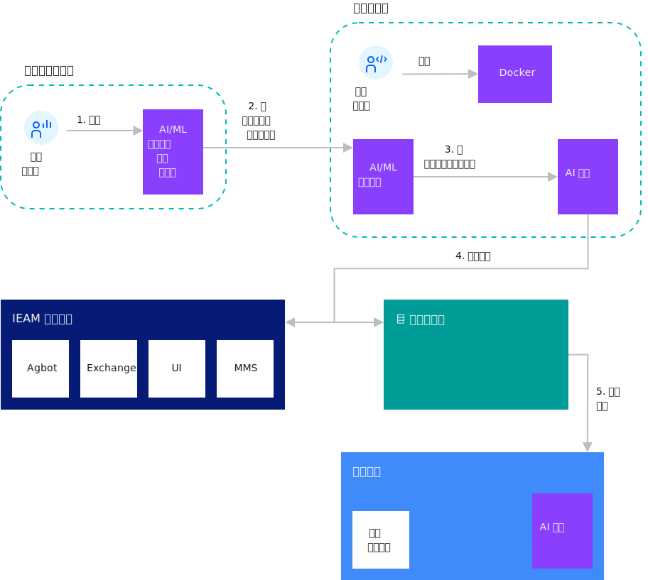

---

copyright:
  years: 2020
lastupdated: "2020-04-9"

---

{:shortdesc: .shortdesc}
{:new_window: target="blank"}
{:codeblock: .codeblock}
{:pre: .pre}
{:screen: .screen}
{:tip: .tip}
{:download: .download}

# 模型管理详细信息
{: #model_management_details}

模型管理系统 (MMS) 针对在边缘节点上运行的认知服务，减轻人工智能 (AI) 模型管理的负担。 MMS 还可用于向边缘节点传递其他数据文件类型。 MMS 实现了边缘服务所需的模型、数据和其他元数据包的存储、交付和安全性。 这使边缘节点能够轻松地向云发送和从云接收模型和元数据。

MMS 在 {{site.data.keyword.edge_notm}} ({{site.data.keyword.ieam}}) 中心和边缘节点上运行。 Cloud Sync Service (CSS) 将模型、元数据或数据传递到组织中的特定节点或节点组。 在将对象传递到边缘节点后，提供了允许边缘服务从 Edge Sync Service (ESS) 获取模型或数据的 API。

对象由服务开发者、devOps 管理员和模型作者在 MMS 中填充。MMS 组件可促进 AI 模型工具与在边缘上运行的认知服务之间的集成。 作者完成模型后，这些模型将发布到 MMS，从而使其立即可用于边缘节点。

{{site.data.keyword.ieam}} 还提供了支持对模型对象及其元数据进行操作的 CLI (**hzn mms**)。

以下各图显示了与使用 MMS 开发和更新 AI 模型相关联的工作流程。

### 通过 MMS 开发和使用 AI 模型

 

### 使用 MMS 更新 AI 模型

 

## MMS 概念

多个组件组成 MMS：CSS、ESS 和对象。

CSS 和 ESS 提供开发者和管理员用于与 MMS 交互的 API。 对象是部署到边缘节点的机器学习模型和其他类型的数据文件。

### CSS

安装 {{site.data.keyword.ieam}} 时，CSS 将部署在 {{site.data.keyword.ieam}} 管理中心中。 CSS 使用 mongoDB 数据库来存储对象并维护每个边缘节点的状态。

### ESS

ESS 嵌入在运行在边缘节点上的 {{site.data.keyword.ieam}} 代理程序中。 ESS 持续轮询 CSS 以获取对象更新，并将传递给节点的任何对象存储在边缘节点上的本地数据库中。 部署在边缘节点上的服务可使用 ESS API 来访问元数据和数据或模型对象。

### 对象 (元数据和数据)

元数据描述数据模型。 对象与元数据和数据这两者或者仅与元数据一起发布到 MMS。 在元数据中，字段 **objectType** 和 **objectID** 定义给定组织内对象的身份。 这些目标相关字段确定要将对象发送到的边缘节点：

* **destinationOrgID**
* **destinationType**
* **destinationID**
* **destinationList**
* **destinationPolicy**

可以在元数据中指定其他对象信息，包括描述和版本等。 版本值对同步服务没有语义上的意义，因此，CSS 中仅存在对象的一个副本。

数据文件包含认知服务使用的特定于 ML 的模型定义。 AI 模型文件、配置文件和二进制数据都是数据文件示例。

### AI 模型

AI（人工智能）模型不是 MMS 特定概念，但它是 MMS 的主要用例。 AI 模型是与 AI 相关的现实过程的数学表示。 模仿人类认知功能并使用 AI 模型的认知服务。 要生成 AI 模型，请对训练数据应用 AI 算法。 总之，AI 模型由 MMS 分发，并由在边缘节点上运行的认知服务使用。

## {{site.data.keyword.ieam}} 中的 MMS 概念

MMS 概念与 {{site.data.keyword.ieam}} 中的其他概念之间存在特定关系。

{{site.data.keyword.ieam}} 可以使用模式或策略注册节点。 为对象创建元数据时，请将对象元数据中的 **destinationType** 字段设置为应接收此对象的节点的模式名称。 可以认为所有使用相同模式的 {{site.data.keyword.ieam}} 节点在同一组中。 因此，此映射会将对象定位到给定类型的所有节点。 **destinationID** 字段与 {{site.data.keyword.ieam}} 边缘节点节点标识相同。 如果未设置 **destinationID** 元数据字段，那么会将对象广播到模式为 **destinationType** 的所有节点。

为应该传递到使用策略注册的节点的对象创建元数据时，将 **destinationType** 和 **destinationID** 留空，改为设置 **destinationPolicy** 字段。 它保存定义哪些节点接收对象的目标信息（策略属性、约束和服务）。 设置 **services** 字段以指示哪个服务处理对象。 **properties** 和 **constrains** 字段是可选字段，用于进一步缩小应该接收对象的节点范围。

边缘节点可以运行多个服务，这些服务可能是由不同实体开发的。 {{site.data.keyword.ieam}} 代理程序认证和授权层控制哪些服务可以访问给定对象。 通过策略部署的对象仅对 **destinationPolicy** 中引用的服务可见。 但是，没有为部署到运行模式的节点的对象提供此级别的隔离。 在使用模式的节点上，传递到该节点的所有对象对于节点上的所有服务都可见。

## MMS CLI 命令

本部分描述了 MMS 示例，以及如何使用某些 MMS 命令。

例如，用户操作三个摄像头，其中部署了机器学习服务 (**weaponDetector**) 以识别携带武器的人员。 此模型已经过培训，并且服务正在摄像头（充当节点）上运行。

### 检查 MMS 状态

发布模型之前，发出 **hzn mms status** 命令以检查 MMS 状态。 检查 **general** 下的 **heathStatus** 以及 **dbHealth** 下的 **dbStatus**。 这些字段的值应该为绿色，这表示 CSS 和数据库正在运行。

```
$ hzn mms status
{
  "general": {
    "nodeType": "CSS",
    "healthStatus": "green",
    "upTime": 21896
  },
  "dbHealth": {
    "dbStatus": "green",
    "disconnectedFromDB": false,
    "dbReadFailures": 0,
    "dbWriteFailures": 0
  }
}
```
{: codeblock}

### 创建 MMS 对象

在 MMS 中，不会单独发布数据模型文件。 MMS 需要元数据文件和数据模型文件以进行发布和分发。 元数据文件为数据模型配置一组属性。 MMS 基于元数据中定义的属性存储、分发和检索模型对象。

元数据文件是 json 文件。

1. 查看元数据文件的模板：

   ```
   hzn mms object new
   ```
   {: codeblock}
2. 将模板复制到名为 **my_metadata.json** 的文件：

   ```
   hzn mms object new >> my_metadata.json
   ```
   {: codeblock}

   或者，您可以从终端复制模板并将其粘贴到文件中。

了解元数据字段的含义以及它们与元数据示例的关系非常重要。

|字段|描述|备注|
|-----|-----------|-----|
|**objectID**|对象标识。|组织内对象的必需唯一标识。|
|**objectType**|对象类型。|用户定义的必填字段，没有内置对象类型。|
|**destinationOrgID**|目标组织。|用于将对象分发到同一组织中节点的必需字段。|
|**destinationType**|目标类型。|应接收此对象的节点所使用的模式。|
|**destinationID**|目标标识。|可选字段，设置为应放置对象的单个节点标识（无组织前缀）。 如果省略，那么对象将发送到带 destinationType 的所有节点。|
|**destinationsList**|目标列表。|可选字段，设置为应该接收此对象的 pattern:nodeId 对的数组。 这是设置 **destinationType** 和 **destinationID** 的替代方法。|
|**destinationPolicy**|目标策略。|将对象分发到使用策略注册的节点时使用。 在此情况下，不要设置 **destinationType**、**destinationID** 或 **destinationsList**。|
|**expiration**|可选字段。|指示对象何时到期并从 MMS 中移除。|
|**activationTime**|可选字段。|应自动激活此对象的日期。 激活时间之后，它才会传递到任何节点。|
|**version**|可选字段。|任意字符串值。 The value is not semantically interpreted. 模型管理系统不会保留一个对象的多个版本。| 
|**description**|可选字段。|任意描述。|

**注**：

1. 如果使用 **destinationPolicy**，请从元数据中移除 **destinationType**、**destinationID** 和 **destinationsList** 字段。 **destinationPolicy** 内的 **properties**、**constraints** 和 **services** 确定接收此对象的目标。
2. **version** 和 **description** 可指定为元数据中的字符串。 version 的值未在语义上解释。 MMS 不会保留对象的多个版本。
3. **expiration** 和 **activationTime** 应该以 RFC3339 格式提供。

使用以下两个选项之一填写 **my_metadata.json** 中的字段：

1. 将 MMS 对象发送到使用策略运行的边缘节点。

   在此示例中，使用策略注册了摄像头边缘节点 node1、node2 和 node3。 **weaponDetector** 是在节点上运行的其中一个服务，您希望模型文件由在摄像头边缘节点上运行的 **weaponDetector** 服务使用。 因为目标节点已使用策略注册，请仅使用 **destinationOrgID** 和 **destinationPolicy**。 将 **ObjectType** 字段设置为 **model**，但可以将其设置为对检索对象的服务有意义的任何字符串。

   在此场景中，元数据文件可以是：

   ```json
   {
      "objectID": "my_model",
     "objectType": "model",
     "destinationOrgID": "$HZN_ORG_ID",
     "destinationPolicy": {
    
         "properties": [],
       "constraints": [],
       "services": [
         {
       
               "orgID": "$SERVICE_ORG_ID",
           "arch": "$ARCH",
           "serviceName": "weaponDetector",
           "version": "$VERSION"
         }
      
         ]
      },
     "version": "1.0.0",
     "description": "weaponDetector model"
   }
   ```
   {: codeblock}

2. 将 MMS 对象发送到使用模式运行的边缘节点。

   在此场景中，将使用相同的节点，但现在它们已使用模式 **pattern.weapon-detector** 注册，该模式具有 **weaponDetector** 作为其中一个服务。

   要将模型发送到具有模式的节点，请更改元数据文件：

   1. 在 **destinationType** 字段中指定节点模式。
   2. 移除 **destinationPolicy** 字段。

   元数据文件类似于：

   ```
   {
      "objectID": "my_model",
     "objectType": "model",
     "destinationOrgID": "$HZN_ORG_ID",
     "destinationType": "pattern.weapon-detector",
     "version": "1.0.0",
     "description": "weaponDetector model"
   }
   ```
   {: codeblock}

现在，模型文件和元数据文件已准备好发布。

### 发布 MMS 对象

使用元数据和数据文件发布对象：

```
hzn mms object publish -m my_metadata.json -f my_model
```
{: codeblock}

**注**：如果对象发布返回 504 超时错误，那么增大 {{site.data.keyword.common_services}} 的超时值：

1. 以集群管理员身份使用 **oc login** 登录 {{site.data.keyword.ieam}} 管理中心 OCP 集群。

2. 增大 {{site.data.keyword.common_services}} 的超时值。将 <timeout_seconds> 替换为需要的数字：

```
oc -n ibm-common-services annotate route cp-console --overwrite haproxy.router.openshift.io/timeout=<timeout_seconds>s
```
{: codeblock}

### 列出 MMS 对象

列出给定组织中具有此 **objectID** 和 **objectType** 的 MMS 对象：

```
hzn mms object list --objectType=model --objectId=my_model
```
{: codeblock}

命令结果类似于：

```
Listing objects in org userdev:
[
  {
    "objectID": "my_model",
    "objectType": "model"
  }
]
```

要显示所有 MMS 对象元数据，请将 **-l** 添加到命令中：

```
hzn mms object list --objectType=model --objectId=my_model -l
```
{: codeblock}

要显示对象以及对象状态和目标，请将 **-d** 添加到命令。 以下目标结果指示对象已传递到摄像头：node1、node2 和 node3。

```
hzn mms object list --objectType=model --objectId=my_model -d
```
{: codeblock}

先前命令的输出类似于：

```
[
  {
    "objectID": "my_model",
    "objectType": "model",
    "destinations": [
      {
        "destinationType": "pattern.mask-detector",
        "destinationID": "node1",
        "status": "delivered",
        "message": ""
      },
      {
        "destinationType": "pattern.mask-detector",
        "destinationID": "node2",
        "status": "delivered",
        "message": ""
      },
      {
        "destinationType": "pattern.mask-detector",
        "destinationID": "node3",
        "status": "delivered",
        "message": ""
      },
    ],
    "objectStatus": "ready"
  }
]
```

提供了更多高级过滤选项以缩小 MMS 对象列表范围。 要查看完整的标志列表：

```
hzn mms object list --help
```
{: codeblock}

### 删除 MMS 对象

删除 MMS 对象：

```
hzn mms object delete --type=model --id=my_model
```
{: codeblock}

对象已从 MMS 中移除。

### 更新 MMS 对象

模型可随时间变化。 要发布更新的模型，请将 **hzn mms object publish** 与同一元数据文件配合使用（建议使用版本值 **upgrade**）。 借助 MMS，无需为所有三个摄像头逐一更新模型。 使用此项来更新所有三个节点上的 **my_model** 对象。

```
hzn mms object publish -m my_metadata.json -f my_updated_model
```
{: codeblock}

## 附录

**注**：有关命令语法的更多信息，请参阅[此文档中使用的约定](../getting_started/document_conventions.md)。

以下是用于生成 MMS 对象元数据模板的 **hzn mms object new** 命令的输出示例：

```
{
  "objectID": "",            /* Required: A unique identifier of the object. */
  "objectType": "",          /* Required: The type of the object. */
  "destinationOrgID": "$HZN_ORG_ID", /* Required: The organization ID of the object (an object belongs to exactly one organization). */
  "destinationID": "",       /* The node id (without org prefix) where the object should be placed. */
                             /* If omitted the object is sent to all nodes with the same destinationType. */
                             /* Delete this field when you are using destinationPolicy. */
  "destinationType": "",     /* The pattern in use by nodes that should receive this object. */
                             /* If omitted (and if destinationsList is omitted too) the object is broadcast to all known nodes. */
                             /* Delete this field when you are using policy. */
  "destinationsList": null,  /* The list of destinations as an array of pattern:nodeId pairs that should receive this object. */
                             /* If provided, destinationType and destinationID must be omitted. */
                             /* Delete this field when you are using policy. */
  "destinationPolicy": {     /* The policy specification that should be used to distribute this object. */
                             /* Delete these fields if the target node is using a pattern. */
    "properties": [          /* A list of policy properties that describe the object. */
      {
        "name": "",
        "value": null,
        "type": ""           /* Valid types are string, bool, int, float, list of string (comma separated), version. */
                             /* Type can be omitted if the type is discernable from the value, e.g. unquoted true is boolean. */
      }
    ],
    "constraints": [         /* A list of constraint expressions of the form <property name> <operator> <property value>, separated by boolean operators AND (&&) or OR (||). */
      ""
    ],
    "services": [            /* The service(s) that will use this object. */
      {
        "orgID": "",         /* The org of the service. */
        "serviceName": "",   /* The name of the service. */
        "arch": "",          /* Set to '*' to indcate services of any hardware architecture. */
        "version": ""        /* A version range. */
      }
    ]
  },
  "expiration": "",          /* A timestamp/date indicating when the object expires (it is automatically deleted). The time stamp should be provided in RFC3339 format.  */
  "version": "",             /* Arbitrary string value. The value is not semantically interpreted. The Model Management System does not keep multiple version of an object. */
  "description": "",         /* An arbitrary description. */
  "activationTime": ""       /* A timestamp/date as to when this object should automatically be activated. The timestamp should be provided in RFC3339 format. */
}
```
{: codeblock}

## 示例
{: #mms}

此示例帮助您了解如何开发使用模型管理系统 (MMS) 的 {{site.data.keyword.edge_service}}。 您可以使用此系统以部署和更新在边缘节点上运行的边缘服务所使用的学习机器模型。
{:shortdesc}

有关使用 MMS 的示例，请参阅 [Horizon Hello 模型管理服务 (MMS) 示例边缘服务 ](https://github.com/open-horizon/examples/tree/master/edge/services/helloMMS)。

## 准备工作
{: #mms_begin}

完成[准备创建边缘服务](service_containers.md)中的先决条件步骤。 因此，应该设置这些环境变量、安装这些命令，并且这些文件应该存在：

```bash
echo "HZN_ORG_ID=$HZN_ORG_ID, HZN_EXCHANGE_USER_AUTH=$HZN_EXCHANGE_USER_AUTH, DOCKER_HUB_ID=$DOCKER_HUB_ID"
which git jq make
ls ~/.hzn/keys/service.private.key ~/.hzn/keys/service.public.pem
cat /etc/default/horizon
```

## 过程
{: #mms_procedure}

此示例属于 [{{site.data.keyword.horizon_open}} ](https://github.com/open-horizon/) 开放式源代码项目。 执行 [Creating Your Own Hello MMS Edge Service](https://github.com/open-horizon/examples/blob/master/edge/services/helloMMS/CreateService.md) 中的步骤，然后返回到此处。

## 后续操作
{: #mms_what_next}

* 在[为设备开发边缘服务](developing.md)中尝试使用其他边缘服务示例。

## 进一步阅读资料

* [使用模型管理的 Hello World](model_management_system.md)
