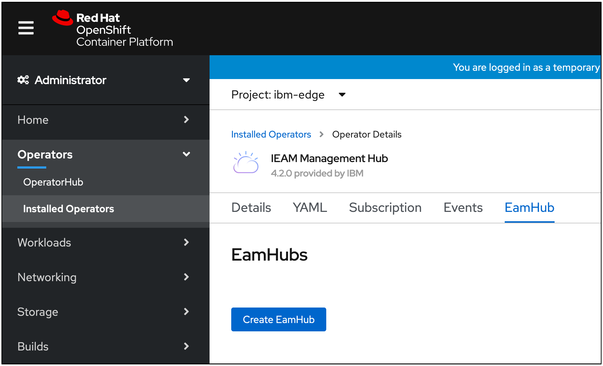

---

copyright:
  years: 2020
lastupdated: "2020-10-28"

---

{:new_window: target="blank"}
{:shortdesc: .shortdesc}
{:screen: .screen}
{:codeblock: .codeblock}
{:pre: .pre}
{:child: .link .ulchildlink}
{:childlinks: .ullinks}

# 安装 {{site.data.keyword.ieam}}
{: #hub_install_overview}

您必须先安装并配置管理中心，然后才能开始执行 {{site.data.keyword.edge_notm}} ({{site.data.keyword.ieam}}) 节点任务。

## 安装摘要
{: #sum}

* 此内容描述部署以下组件的步骤。
  * [IBM Cloud Platform Common Services ](https://www.ibm.com/support/knowledgecenter/SSHKN6/kc_welcome_cs.html)。
  * {{site.data.keyword.edge_notm}} 管理中心操作程序。
  * {{site.data.keyword.edge_notm}} Exchange API。
  * {{site.data.keyword.edge_notm}} agbot。
  * {{site.data.keyword.edge_notm}} Cloud Sync Service (CSS)。
  * {{site.data.keyword.edge_notm}} 用户界面。
  * {{site.data.keyword.edge_notm}} Secure Device Onboarding (SDO)。

**注**：不支持从 {{site.data.keyword.edge_notm}} 4.1 升级。

## 先决条件
{: #prereq}

### {{site.data.keyword.ocp_tm}}
确保您拥有[设置了适当大小](cluster_sizing.md)并且受支持的 {{site.data.keyword.open_shift_cp}} 安装，包括在集群中安装且正常运行的相应的存储服务。 有关安装 {{site.data.keyword.open_shift_cp}} 的更多信息，请参阅受支持版本的 {{site.data.keyword.open_shift}} 文档：

* [{{site.data.keyword.open_shift_cp}} 4.6 文档 ](https://docs.openshift.com/container-platform/4.6/welcome/index.html)

**注**：缺省情况下，本地开发数据库在操作程序部署期间进行供应。有关与您自己的已供应数据库进行连接的更多信息和其他配置选项，请参阅[配置](configuration.md)页面。

您负责备份或复原数据库，请参阅[备份和恢复](../admin/backup_recovery.md)页面。

## 浏览器安装流程
{: #process}

1. 使用集群管理员特权通过 {{site.data.keyword.open_shift_cp}} Web UI 登录。 浏览至**存储**页面以确认您已定义受支持的**缺省**存储类：

   

   **注**：有关使用非缺省存储类的更多信息，请参阅[配置](configuration.md)页面。

2. 创建 IBM Operator Catalog Source，其提供能力以安装 **IEAM 管理中心**捆绑软件。 在选择导入加号后，复制并粘贴此文本，如下图中所示。 粘贴文本后，单击**创建**：

   ```
   apiVersion: operators.coreos.com/v1alpha1
    kind: CatalogSource
    metadata:
      name: ibm-operator-catalog
      namespace: openshift-marketplace
    spec:
      displayName: IBM Operator Catalog
      publisher: IBM
      sourceType: grpc
      image: docker.io/ibmcom/ibm-operator-catalog:latest
      updateStrategy:
        registryPoll:
          interval: 45m
   ```
   {: codeblock}

   

3. 创建 IBM Common Services Operator Catalog Source。 这将提供 **IEAM 管理中心**将额外安装的公共服务操作程序套件。 在选择导入加号后，复制并粘贴此文本，如下图中所示。 粘贴文本后，单击**创建**：
   ```
   apiVersion: operators.coreos.com/v1alpha1
   kind: CatalogSource
   metadata:
     name: opencloud-operators
     namespace: openshift-marketplace
   spec:
     displayName: IBMCS Operators
     publisher: IBM
     sourceType: grpc
     image: quay.io/opencloudio/ibm-common-service-catalog:3.6
     updateStrategy:
       registryPoll:
         interval: 45m
   ```
   {: codeblock}

   

4. 浏览至**项目**页面并创建要在其中安装操作程序的项目：

   

5. 定义名为 **ibm-entitlement-key** 的映像拉取私钥以向 IBM Entitled Registry 进行认证：

   **注**：
   * 通过[我的 IBM 密钥](https://myibm.ibm.com/products-services/containerlibrary) 获取权利密钥，并填写字段，如以下内容所示。
   * 确保在先前步骤中创建的同一项目中创建此资源。

   

6. 浏览至 **OperatorHub** 页面。 搜索并单击 **IEAM 管理中心**卡。确保项目与步骤 4 中创建的项目相匹配，然后单击**安装**：

   

7. 安装操作程序，确保项目与步骤 4 中创建的项目相匹配（这是安装 **IEAM 管理中心**操作程序后其所观察的唯一项目）：

   

8. 等待以下两个操作程序显示：

   
   
   **注**：您可能需要刷新页面并且可能看到与所显示版本不同的版本。

9. 将**项目**更改为 **ibm-common-services**，然后单击**提供的 API** 列下的 **CommonService** 链接。 单击**名称**列下的 **common-service** 链接，然后单击 **YAML** 选项卡以编辑 **common-service** 定制资源，将 **spec** 字段替换为以下内容，然后单击**保存**：
   ```
   spec:
     size: medium
     services:
     - name: ibm-management-ingress-operator
       spec:
         managementIngress:
           replicas: 3
     - name: ibm-mongodb-operator
       spec:
         mongoDB:
           resources:
             requests:
               cpu: 500m
               memory: 2000Mi
     - name: ibm-monitoring-prometheusext-operator
       spec:
         prometheusExt:
           prometheusConfig:
             resource:
               requests:
                 cpu: 160m
                 memory: 2500Mi
   ```
   {: codeblock}

   

   **注**：如果 **spec:** 字段不仅仅包含 **size** 的单个条目，那么其已进行配置。请在替换现有配置前联系管理员。
10. 改回在步骤 4 中创建的**项目**，单击步骤 7 中显示的**提供的 API** 列中的 **EamHub**，然后单击**创建 EamHub**：

   

11. 创建 **EamHub** 定制资源。 **EamHub** 定制资源定义并配置管理中心。 请参阅[配置](configuration.md)页面以获取定制选项。 确保项目与步骤 4 中创建的项目相匹配。

   * 单击**接受许可证**开关，然后单击**创建**以接受许可证。

   

操作程序将在步骤 4 中指定的项目中部署定义的工作负载，并在 **ibm-common-services** 项目中部署必需的 {{site.data.keyword.common_services}} 工作负载。

## 下一步是什么

通过执行[安装后](post_install.md)中的步骤，继续设置新的管理中心。
