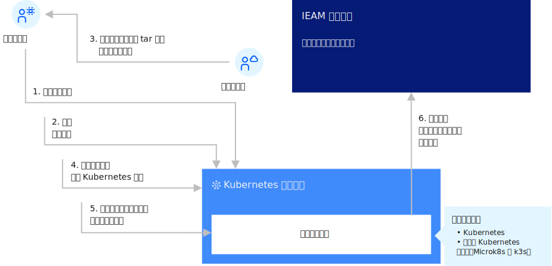

---

copyright:
years: 2020
lastupdated: "2020-4-8"

---

{:new_window: target="blank"}
{:shortdesc: .shortdesc}
{:screen: .screen}
{:codeblock: .codeblock}
{:pre: .pre}
{:child: .link .ulchildlink}
{:childlinks: .ullinks}

# 边缘集群
{: #edge_clusters}

{{site.data.keyword.edge_notm}} ({{site.data.keyword.ieam}}) 边缘集群功能帮助您管理工作负载并将其从管理中心集群部署到 OpenShift® Container Platform 或其他基于 Kubernetes 的集群的远程实例。 边缘集群是作为 Kubernetes 集群的 {{site.data.keyword.ieam}} 边缘节点。 边缘集群启用位于边缘的用例，这要求计算与业务运营共存，或要求可伸缩性、可用性和计算功能多于边缘设备可支持的范围。 此外，边缘集群提供支持在边缘设备上运行的服务所需的应用程序服务并不少见，因为它们非常接近边缘设备。 {{site.data.keyword.ieam}} 通过 Kubernetes 操作程序将边缘服务部署到边缘集群，以启用与边缘设备配合使用的相同自主部署机制。 Kubernetes 作为容器管理平台的全部功能可用于由 {{site.data.keyword.ieam}} 部署的边缘服务。

以下部分描述了如何安装边缘集群并在其上安装 {{site.data.keyword.ieam}} 代理程序。

- [准备边缘集群](preparing_edge_cluster.md)
- [安装代理程序](edge_cluster_agent.md)
{: childlinks}
