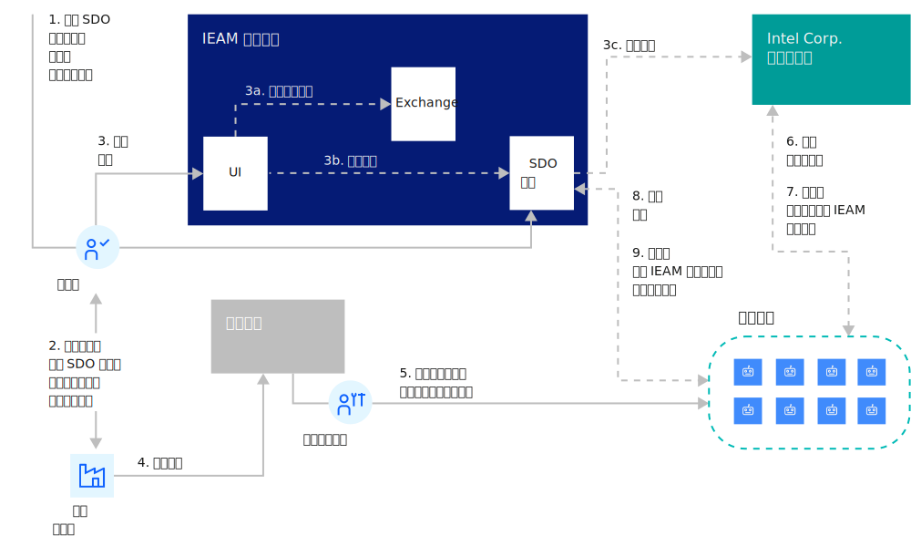

---

copyright:
years: 2020
lastupdated: "2020-4-24"

---

{:new_window: target="blank"}
{:shortdesc: .shortdesc}
{:screen: .screen}
{:codeblock: .codeblock}
{:pre: .pre}
{:child: .link .ulchildlink}
{:childlinks: .ullinks}

# SDO 代理程序安装和注册
{: #sdo}

[SDO ](https://software.intel.com/en-us/secure-device-onboard) (Secure Device Onboard) 由 Intel 创造，用于轻松、安全地配置边缘设备并将其与边缘管理中心相关联。 {{site.data.keyword.edge_notm}} ({{site.data.keyword.ieam}}) 支持启用 SDO 的设备，以便代理程序将以零接触的方式安装在设备上并注册到 {{site.data.keyword.ieam}} 管理中心（只需打开设备的电源即可）。

## SDO 概述
{: #sdo-overview}

SDO 包括以下组件：

* 边缘设备上的 SDO 模块（通常由设备制造商安装在其中）
* 所有权凭单（随物理设备提供给设备购买者的文件）
* SDO 集中服务器（启用 SDO 的设备在首次启动时首次联系的已知服务器）
* SDO 所有者服务（在 {{site.data.keyword.ieam}} 管理中心上运行的服务，用于配置设备以使用此特定 {{site.data.keyword.ieam}} 实例）

**注**：SDO 仅支持边缘设备，而不支持边缘集群。

### SDO 流程



## 准备工作
{: #before_begin}

SDO 要求代理程序文件存储在 {{site.keyword.ieam}} Cloud Sync Service (CSS) 中。 如果尚未完成此操作，请要求您的管理员运行以下某个命令，如[收集边缘节点文件](../hub/gather_files.md)中所述：

  `edgeNodeFiles.sh ALL -c ...`

## 试用 SDO
{: #trying-sdo}

甚至在购买启用 SDO 的边缘设备之前，您可以利用模拟启用 SDO 设备的 VM 在 {{site.data.keyword.ieam}} 中试用 SDO 支持：

1. 您需要 API 密钥。 如果还没有，请参阅[准备设置边缘节点](../hub/prepare_for_edge_nodes.md)以获取指示信息来创建 API 密钥。

2. 请联系 {{site.data.keyword.ieam}} 管理员以获取这些环境变量的值。 （在下一步中需要它们。）

   ```bash
   export HZN_ORG_ID=<exchange-org>
   export HZN_EXCHANGE_USER_AUTH=iamapikey:<api-key>
   export HZN_SDO_SVC_URL=https://<ieam-mgmt-hub-ingress>/edge-sdo-ocs/api
   export HZN_MGMT_HUB_CERT_PATH=<path-to-mgmt-hub-self-signed-cert>
   export CURL_CA_BUNDLE=$HZN_MGMT_HUB_CERT_PATH
   ```

3. 遵循 [open-horizon/SDO-support 存储库 ](https://github.com/open-horizon/SDO-support/blob/master/README-1.10.md) 中的步骤以试用 SDO，并查看其自动在设备上安装 {{site.data.keyword.ieam}} 代理程序并向 {{site.data.keyword.ieam}} 管理中心进行注册。

## 向 {{site.data.keyword.ieam}} 域添加启用 SDO 的设备
{: #using-sdo}

如果您已购买启用 SDO 的设备并且想要将它们包含在 {{site.data.keyword.ieam}} 域中：

1. 如果在先前部分中试用 SDO 时未创建 SDO 所有者密钥对，请执行这些步骤：

   1. 您需要 API 密钥。 如果还没有，请参阅[准备设置边缘节点](../hub/prepare_for_edge_nodes.md)以获取指示信息来创建 API 密钥。

   2. 请联系 {{site.data.keyword.ieam}} 管理员以获取这些环境变量的值。 （在下一步中需要它们。）

      ```bash
      export HZN_ORG_ID=<exchange-org>
      export HZN_EXCHANGE_USER_AUTH=iamapikey:<api-key>
      export HZN_SDO_SVC_URL=https://<ieam-mgmt-hub-ingress>/edge-sdo-ocs/api
      export HZN_MGMT_HUB_CERT_PATH=<path-to-mgmt-hub-self-signed-cert>
      export CURL_CA_BUNDLE=$HZN_MGMT_HUB_CERT_PATH
      ```

   3. 仅执行[生成所有者密钥对 ](https://github.com/open-horizon/SDO-support/blob/master/README-1.10.md#gen-keypair)的这一部分中的步骤。
   
2. [登录到 {{site.data.keyword.ieam}} 管理控制台](../console/accessing_ui.md)，然后单击**添加节点**。

3. 填写必需的信息以导入在购买设备时收到的所有权凭单。

4. 将设备连接到网络并开启电源。

5. 回到管理控制台，通过查看**节点**概述页面并过滤在步骤 1 中提供的安装名称，观察设备联机时的进度。
