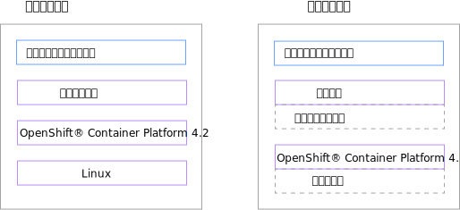
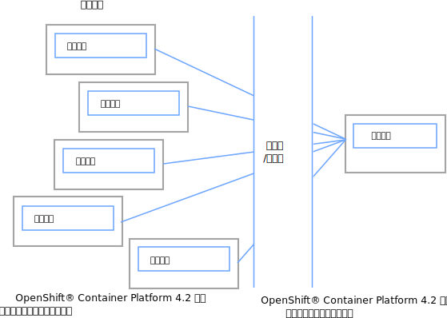
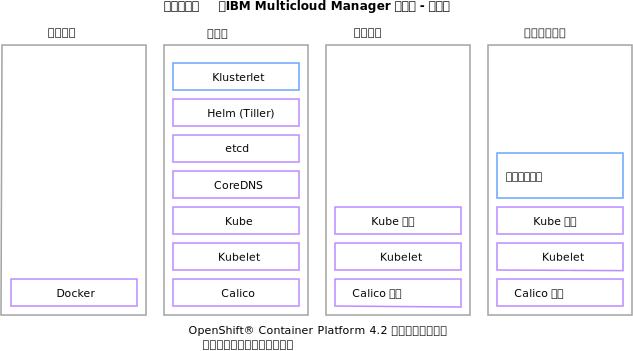

---

copyright:
  years: 2019
lastupdated: "2019-06-12"

---

{:new_window: target="blank"}
{:shortdesc: .shortdesc}
{:screen: .screen}
{:codeblock: .codeblock}
{:pre: .pre}
{:child: .link .ulchildlink}
{:childlinks: .ullinks}

# 边缘集群概述
{: #edge_overview}

边缘计算是为了使企业应用程序更接近于创建数据的位置。
{:shortdesc}

  * [概述](#overview)
  * [边缘计算的优点](#edge_benefits)
  * [示例](#examples)
  * [ 体系结构](#edge_arch)
  * [概念](#concepts)

## 概述
{: #overview}

边缘计算是一种重要的新兴模式，它可以通过在数据中心或云计算中心之外虚拟化云来扩展您的操作模型。 边缘计算将应用程序工作负载从一个集中位置移动到远程位置，例如工厂楼层、仓库、配送中心、零售店和运输中心等。 从本质上讲，边缘计算使您能够将应用程序工作负载移动到数据中心和云托管环境之外任何需要计算的地方。

{{site.data.keyword.edge_servers_notm}} 为您提供边缘计算功能，帮助您管理工作负载并将其从中心集群部署到
{{site.data.keyword.icp_server}} 或其他基于 Kubernetes 的集群的远程实例。

{{site.data.keyword.edge_servers_notm}} 使用 {{site.data.keyword.mcm_core_notm}} 控制将容器化工作负载部署到远程位置上的
{{site.data.keyword.icp_server}} 集群托管的边缘服务器、网关和设备。

{{site.data.keyword.edge_servers_notm}} 还支持 {{site.data.keyword.edge_profile}}。 此受支持的概要文件可以帮助您在安装用于托管远程边缘服务器的 {{site.data.keyword.icp_server}}
时，减少 {{site.data.keyword.icp_server}} 的资源使用。 此概要文件提供了对这些服务器环境和托管在其中的企业关键型应用程序进行可靠远程管理所需的最低服务。 使用此概要文件，您仍然能够对用户进行身份验证，收集日志和事件数据，并在单个或一组聚集的工作程序节点中部署工作负载。

## 边缘计算的优点
{: #edge_benefits}

* 对组织的增值更改：将应用程序工作负载移动到边缘节点，可支持在收集数据的远程位置执行操作，而不是将数据发送到中央数据中心进行处理。

* 减少 IT 人员依赖性：使用 {{site.data.keyword.edge_servers_notm}} 可能有助于减少对 IT 人员的依赖。 使用 {{site.data.keyword.edge_servers_notm}}，您可以安全可靠地将边缘服务器上的关键工作负载从中心位置部署到数百个远程位置并进行管理，而无需在每个远程位置部署全职 IT 人员来管理工作现场装载。

## 示例
{: #examples}

边缘计算是为了使企业应用程序更接近于创建数据的位置。 例如，如果您操作一个工厂，您的工厂地面设备可以包括用于记录任意数量的数据点的传感器，这些数据点提供有关工厂如何操作的详细信息。 The sensors can record the number of parts that are being assembled per hour, the time that is required for a stacker to return to its starting position, or the operating temperature of a fabricating machine.
传感器可每小时记录数的部件组装，时间所需的积纸箱以返回到其起始位置，fabricating机器或操作的温度。 来自这些数据点的信息可帮助您确定您是否以最高效率运行，确定您正在达到的质量水平，或预测机器何时可能出现故障并需要预防性维护。

在另一个示例中，如果您的工人在偏远地区工作，其工作可能导致他们在危险情况下工作，例如炎热或嘈杂的环境、靠近废气或生产烟雾或重型机械，那么可能需要监控环境条件。 您可以从各种来源（可在远程位置使用）收集信息。 监督人员可使用该监测数据确定何时指示工人休息、补水或关闭设备。

在另一个示例中，您可以使用摄像机监视属性，例如识别进入零售店、餐厅或娱乐场所的行人流量，作为安全监视器记录破坏行为或其他不需要的活动，或识别紧急情况。 如果您收集视频中的数据，那么可以使用边缘计算在本地处理视频分析，以帮助您的员工更快地响应机会和事件。 餐厅工作人员可以更好地估计要准备多少食物，零售经理可以决定是否开设额外的退房柜台，保安人员可以更快地对紧急情况作出反应，或提醒第一反应者。

在所有这些情况下，将记录的数据发送到云计算中心或数据中心会增加数据处理的延迟。 当你试图对危急情况或机遇做出反应时，这种时间损失可能会产生负面后果。

如果记录的数据是不需要任何特殊或时间敏感处理的数据，您可能会因不必要地发送此正常数据而产生大量的网络和存储成本。

或者，如果收集到的任何数据（如个人信息）也是敏感的，那么每次将数据从创建该数据的位置移到其他位置时，都会增加暴露该数据的风险。

此外，如果您的任何网络连接不可靠，您也会有中断关键操作的风险。

## 体系结构
{: #edge_arch}

边缘计算的目标是利用为混合云计算创建的规程来支持边缘计算设施的远程操作。 {{site.data.keyword.edge_servers_notm}} 是为此目的而设计的。

{{site.data.keyword.edge_servers_notm}} 的典型部署包括安装在中央集群数据中心上的 {{site.data.keyword.icp_server}} 实例。 此 {{site.data.keyword.icp_server}} 实例用于在中央集群中托管 {{site.data.keyword.mcm_core_notm_novers}} 控制器。 中央集群是管理所有远程边缘服务器的位置。 {{site.data.keyword.edge_servers_notm}} 在需要远程操作时，使用 {{site.data.keyword.mcm_core_notm_novers}}
将工作负载从中央集群部署到基于 Kubernetes 的远程边缘服务器并进行管理。

这些边缘服务器可以安装在远程本地位置，使您的应用程序工作负载本地到您的关键业务操作实际发生的位置，例如在您的工厂、仓库、零售店和配送中心等。 要托管边缘服务器的每个远程位置都需要 {{site.data.keyword.icp_server}} 实例和 {{site.data.keyword.mcm_core_notm_novers}} {{site.data.keyword.klust}}。 {{site.data.keyword.mcm_core_notm_novers}} {{site.data.keyword.klust}} 用于远程管理边缘服务器。

下图描述使用 {{site.data.keyword.icp_server}} 和 {{site.data.keyword.mcm_core_notm_novers}} 的典型边缘计算设置的高级拓扑：

下图显示 {{site.data.keyword.edge_servers_notm}} 系统的典型高级体系结构：

以下各图显示 {{site.data.keyword.edge_servers_notm}} 组件的典型部署的高级体系结构：

* 中央集群

  

  {{site.data.keyword.mcm_core_notm_novers}} 中央集群作为管理中心。 中央集群通常配置有运行业务所必需的所有 {{site.data.keyword.icp_server}} 组件。 这些必需组件包括支持远程边缘服务器上运行的操作所需的任何组件。

* 远程边缘服务器

  

  每个远程边缘服务器都是一个 {{site.data.keyword.mcm_core_notm_novers}} 受管集群，其中包括已安装的 {{site.data.keyword.klust}}。 每个远程边缘服务器都可以配置远程操作中心所需且不受边缘服务器资源约束的任何标准
{{site.data.keyword.icp_server}} 托管服务。

  如果资源约束是边缘服务器的限制因素，那么可以使用 {{site.data.keyword.edge_profile}}
来实现 {{site.data.keyword.icp_server}} 的最小配置。 如果对边缘服务器使用 {{site.data.keyword.edge_profile}} 配置，那么典型的拓扑结构可以类似于下图：

  

  此拓扑中的组件主要充当中央集群中对应组件的代理，并可以将工作卸载到中央集群。 当远程边缘服务器与中央集群之间的连接暂时断开（例如从位置之间不可靠的网络连接断开）时，边缘服务器组件也会完成本地处理。

## 概念
{: #concepts}

**边缘计算**：利用传统和云数据中心外部可用的计算的分布式计算模型。 边缘计算模型使工作负载更接近于创建关联数据的位置以及执行操作以响应此数据分析的位置。 将数据和工作负载放置在边缘设备上可降低等待时间、降低网络带宽需求、提高敏感信息的隐私并且支持网络中断期间操作。

**边缘设备**：一件具有集成的计算能力从而可执行有意义的工作以及收集或生成数据的设备，例如，厂房中的组合机器、ATM、智能照相机或汽车。

**边缘网关**：边缘服务器包含执行网络功能的服务，例如，协议转换、网络终端、隧道、防火墙保护或无线连接。 边缘网关充当边缘设备或边缘服务器与云或更大型网络之间的连接点。

**边缘节点**：发生边缘计算的任何边缘设备、边缘服务器或边缘网关。

**边缘服务器**：远程运营设施中的计算机，其运行企业应用程序工作负载和共享服务。 边缘服务器可用于连接到边缘设备、连接到另一个边缘服务器或者充当边缘网关以连接到云或更大的网络。

**边缘服务**：专门设计以在边缘服务器、边缘网关或边缘设备上部署的服务。 视觉识别、声音洞察和语音识别全都是潜在边缘服务的示例。

**边缘工作负载**：在边缘节点上运行时执行有意义工作的任何服务、微服务或软件片段。

- [硬件需求和建议](cluster_sizing.md)
- [安装 {{site.data.keyword.edge_notm}} 共享硬件](install_edge.md)
{: childlinks}
