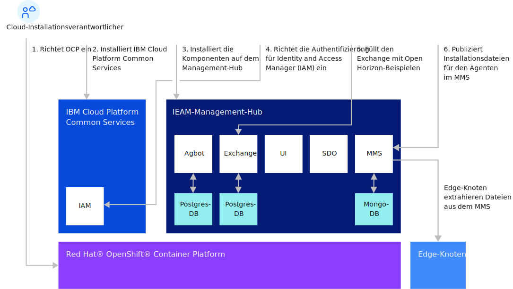

---

copyright:
years: 2020
lastupdated: "2020-10-28"

---

{:new_window: target="blank"}
{:shortdesc: .shortdesc}
{:screen: .screen}
{:codeblock: .codeblock}
{:pre: .pre}
{:child: .link .ulchildlink}
{:childlinks: .ullinks}

# Management-Hub installieren
{: #management_hub}

## Management-Hub-Installation im Überblick
Führen Sie die Installation und Konfiguration des Management-Hubs aus, bevor Sie die Knotentasks für {{site.data.keyword.edge_notm}} ({{site.data.keyword.ieam}}) starten.

* [Dimensionierung und Systemvoraussetzungen](cluster_sizing.md)
* [Konfiguration](configuration.md)
* [Installieren](installation.md)
  * [Installation von {{site.data.keyword.ieam}}](online_installation.md)
  * [Installationsabschluss](post_install.md)
  * [Edge-Knotendateien zusammenstellen](gather_files.md)
* [Deinstallation durchführen](uninstalling_hub.md)

## Installationsablauf für Management-Hub

## Zugehörige Informationen

* [Edge-Knoten installieren](../installing/installing_edge_nodes.md)
