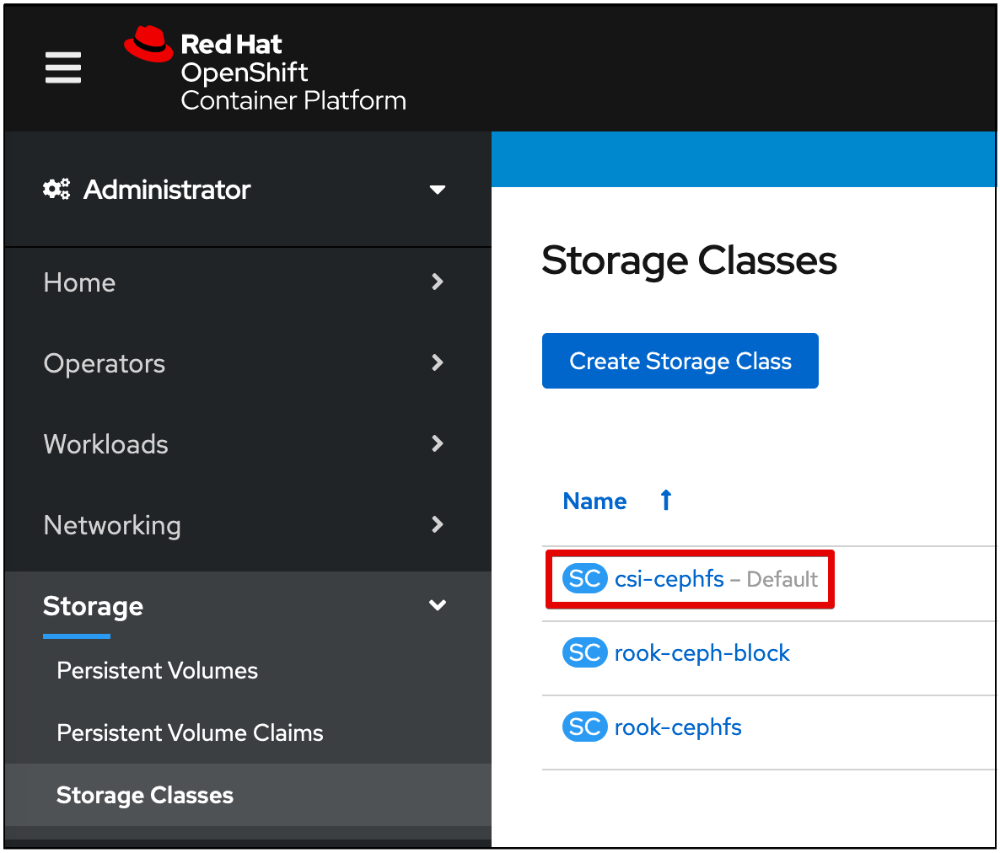

---

copyright:
  years: 2020
lastupdated: "2020-10-28"

---

{:new_window: target="blank"}
{:shortdesc: .shortdesc}
{:screen: .screen}
{:codeblock: .codeblock}
{:pre: .pre}
{:child: .link .ulchildlink}
{:childlinks: .ullinks}

# Instale {{site.data.keyword.ieam}}
{: #hub_install_overview}

Debe instalar y configurar un centro de gestión antes de iniciar las tareas de nodo de {{site.data.keyword.edge_notm}} ({{site.data.keyword.ieam}}).

## Resumen de instalación
{: #sum}

* En este contenido se describen los pasos para desplegar los componentes siguientes.
  * [IBM Cloud Platform Common Services 3.6.x](https://www.ibm.com/docs/en/cpfs).
  * Operador de centro de gestión de {{site.data.keyword.edge_notm}}.
  * API de Exchange de {{site.data.keyword.edge_notm}}.
  * Agbot de {{site.data.keyword.edge_notm}}.
  * CSS (servicio de sincronización de nube) de {{site.data.keyword.edge_notm}}.
  * Interfaz de usuario de {{site.data.keyword.edge_notm}}.
  * SDO (Secure Device Onboarding - Incorporación de dispositivo seguro) de {{site.data.keyword.edge_notm}}.
  * {{site.data.keyword.edge_notm}} Gestor de secretos (Vault).

**Nota**: consulte la [documentación de actualización](upgrade.md) si está intentando actualizar desde una versión anterior.

## Requisitos previos
{: #prereq}

### {{site.data.keyword.ocp_tm}}
Asegúrese de que tiene una instalación de {{site.data.keyword.open_shift_cp}} 4.6  [de tamaño adecuado](cluster_sizing.md) y soportada, incluyendo una clase de almacenamiento apropiada instalada y funcionando en su clúster.

Para obtener más información sobre el suministro de un clúster de {{site.data.keyword.open_shift_cp}} 4.6 gestionado por IBM Cloud, consulte lo siguiente:

* [{{site.data.keyword.ocp_tm}} en {{site.data.keyword.cloud}}](https://www.ibm.com/cloud/openshift)

Para obtener más información sobre la creación de su propio clúster {{site.data.keyword.open_shift_cp}} gestionado, consulte la documentación de {{site.data.keyword.open_shift}}:

* [Documentación de {{site.data.keyword.open_shift_cp}} 4.6](https://docs.openshift.com/container-platform/4.6/welcome/index.html)

**Nota**: de forma predeterminada, se suministra un gestor de secretos de desarrollo local y bases de datos de desarrollo como parte del despliegue del operador. Para obtener más información sobre la conexión con las bases de datos suministradas y otras opciones de configuración, consulte [Configuración](configuration.md).

Es responsable de realizar la copia de seguridad y la restauración de todos los datos persistentes; consulte [copia de seguridad y recuperación](../admin/backup_recovery.md).

## Proceso de instalación de navegador
{: #process}

1. Inicie la sesión a través de la interfaz de usuario web de {{site.data.keyword.open_shift_cp}} con privilegios de administrador de clúster. Vaya a la página **Almacenamiento** para confirmar que tiene una clase de almacenamiento predeterminada (**Default**) soportada definida:

   

   **Nota**: Para obtener más información sobre el uso de una clase de almacenamiento no predeterminada, consulte la página [Configuración](configuration.md).

2. Cree el origen de catálogo de operador de IBM, que proporciona la posibilidad de instalar el paquete de **Centro de gestión de IEAM**. Copie y pegue este texto después de seleccionar el signo más de importación como se muestra en la imagen siguiente. Después de pegar el texto, pulse **Crear**:

   ```
   apiVersion: operators.coreos.com/v1alpha1    kind: CatalogSource    metadata:      name: ibm-operator-catalog      namespace: openshift-marketplace    spec:      displayName: IBM Operator Catalog      publisher: IBM      sourceType: grpc      image: icr.io/cpopen/ibm-operator-catalog:latest      updateStrategy:        registryPoll:          interval: 45m
   ```
   {: codeblock}

   

3. Cree el origen de catálogo de operadores de IBM Common Services. Esto proporciona la suite de operadores de Common Service que el **centro de gestión de IEAM** instalará adicionalmente. Copie y pegue este texto después de seleccionar el signo más de importación como se muestra en la imagen siguiente. Después de pegar el texto, pulse **Crear**:
   ```
   apiVersion: operators.coreos.com/v1alpha1 kind: CatalogSource metadata: name: opencloud-operators namespace: openshift-marketplace spec: displayName: IBMCS Operators publisher: IBM sourceType: grpc image: quay.io/opencloudio/ibm-common-service-catalog:latest updateStrategy: registryPoll: interval: 45m
   ```
   {: codeblock}

   

4. Vaya a la página **Proyectos** y cree un proyecto donde desea instalar el operador:

   

5. Defina un secreto de extracción de imagen denominado **ibm-entitlement-key** para autenticarse en el registro autorizado de IBM:

   **Notas**:
   * Obtenga el título de titularidad a través de [Mi clave de IBM](https://myibm.ibm.com/products-services/containerlibrary) y cumplimente los campos tal como se muestra en el siguiente contenido.
   * Asegúrese de que este recurso se crea en el mismo proyecto que se ha creado en el paso anterior.

   

6. Vaya a la **página OperatorHub** y busque **Centro de gestión de IEAM**.

7. Pulse la tarjeta **Centro de gestión de IEAM** y, a continuación, pulse **Instalar**.

8. Instale el operador, asegurándose de que el proyecto coincida con lo que se ha creado en el paso 4.

   **Nota**: Este es el único proyecto que observa el operador del **Centro de gestión de IEAM** tras su instalación.

   

9. Vuelva al **Proyecto** creado en el paso 4, pulse **EamHub** en la columna **API proporcionadas** que se muestra en el paso 7 y pulse **Crear EamHub**:

   

10. Cree el recurso personalizado **EamHub**, que define y configura el centro de gestión. Para obtener más información sobre las opciones de personalización, consulte [Configuración](configuration.md). Asegúrese de que el proyecto coincide con lo que se ha creado en el paso 4.

   * Pulse el conmutador **Aceptar licencia** y pulse **Crear** para aceptar la licencia.

   

El operador desplegará las cargas de trabajo definidas en el proyecto especificado en el Paso 4 y las cargas de trabajo de {{site.data.keyword.common_services}} necesarias en el proyecto **ibm-common-services**.

## Qué hacer a continuación

Continúe configurando el nuevo centro de gestión realizando los pasos de [postinstalación](post_install.md).
