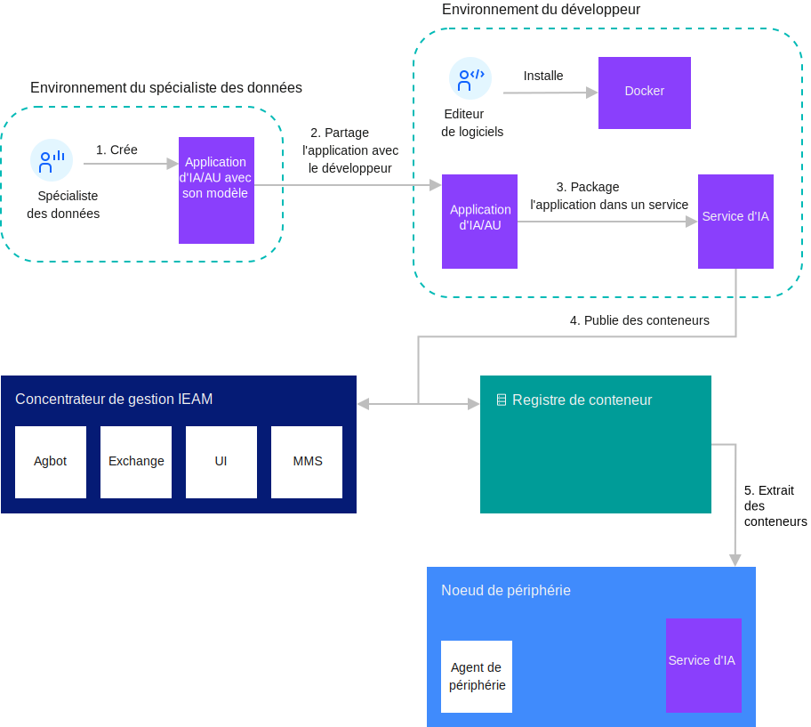

---

copyright:
  years: 2020
lastupdated: "2020-04-9"

---

{:shortdesc: .shortdesc}
{:new_window: target="blank"}
{:codeblock: .codeblock}
{:pre: .pre}
{:screen: .screen}
{:tip: .tip}
{:download: .download}

# Détails concernant la gestion des modèles
{: #model_management_details}

Le système de gestion des modèles (MMS) facilite la gestion du modèle d'intelligence artificielle (IA) associé aux services cognitifs qui s'exécutent sur les noeuds de périphérie. Il peut également être utilisé pour transmettre d'autres types de fichiers de données aux noeuds de périphérie. Le système de gestion des modèles simplifie le stockage, la distribution et la sécurité des modèles, des données et d'autres packages de métadonnées nécessaires aux services de périphérie. Les noeuds de périphérie peuvent ainsi envoyer et recevoir des modèles et des métadonnées depuis et vers le Cloud, en toute simplicité.

Le système de gestion des modèles s'exécute dans le concentrateur {{site.data.keyword.edge_notm}} ({{site.data.keyword.ieam}}) et sur les noeuds de périphérie. Le composant CSS distribue des modèles, des métadonnées ou des données à des noeuds ou des groupes de noeuds spécifiques au sein d'une organisation. Une fois les objets transférés vers les noeuds de périphérie, une interface de programmation est mise à disposition pour permettre au service de périphérie d'obtenir les modèles ou les données à partir du composant ESS.

Les objets sont remplis dans MMS par les développeurs de services, les administrateurs devOps et les créateurs de modèles. Les composants MMS facilitent l'intégration entre les outils du modèle d'intelligence artificielle (IA) et les services cognitifs qui s'exécutent sur la périphérie. A mesure que les auteurs terminent les modèles, ceux-ci sont publiés dans le MMS, qui les met immédiatement à la disposition des noeuds de périphérie.

{{site.data.keyword.ieam}} fournit également une interface de ligne de commande (**hzn mms**) qui permet de manipuler les objets du modèle et leurs métadonnées.

Les diagrammes suivants montrent le flux de travail associé au développement et à la mise à jour des modèles IA en utilisant MMS.

### Développement et utilisation d'un modèle d'IA avec MMS

 

### Mise à jour d'un modèle d'IA avec MMS

 

## Concepts relatifs au système de gestion des modèles

Le système de gestion des modèles est formé de plusieurs composants : le composant de cloud (CSS), le composant de périphérie (ESS) et des objets.

Les composants CSS et ESS fournissent les interfaces de programmation nécessaires aux développeurs et aux administrateurs pour interagir avec le MMS. Les objets sont des modèles d'apprentissage automatique et d'autres types de fichiers de données déployés sur les noeuds de périphérie.

### CSS

Le composant CSS est déployé dans le concentrateur de gestion d'{{site.data.keyword.ieam}} lorsqu'{{site.data.keyword.ieam}} est installé. Il utilise la base de données mongoDB pour stocker les objets et maintenir le statut de chaque noeud de périphérie.

### ESS

Le composant ESS est intégré dans l'agent {{site.data.keyword.ieam}} qui s'exécute sur le noeud de périphérie. Il interroge en continu le composant CSS pour rechercher les mises à jour d'objet et stocke tous les objets distribués au noeud dans une base de données locale sur le noeud de périphérie. Les API du composant ESS peuvent être utilisées par les services déployés sur le noeud de périphérie pour accéder aux métadonnées et aux données, ou aux objets de modèle.

### Objets (métadonnées et données)

Les métadonnées décrivent les modèles de vos données. Un objet est publié dans le MMS avec des métadonnées et des données, ou avec des métadonnées uniquement. Dans les métadonnées, les zones **objectType** et **objectID** servent à définir l'identité de l'objet au sein d'une organisation donnée. Ces zones concernant la destination permettent de déterminer vers quels noeuds de périphérie envoyer l'objet :

* **destinationOrgID**
* **destinationType**
* **destinationID**
* **destinationList**
* **destinationPolicy**

D'autres informations sur les objets, notamment la description, la version, etc., peuvent être spécifiées dans les métadonnées. La valeur de version n'a aucune signification sémantique pour le service de synchronisation. Par conséquent, une seule copie de l'objet existe dans le CSS.

Un fichier de données est un fichier qui contient la définition du modèle d'apprentissage automatique utilisée par un service cognitif. Les fichiers de modèle d'intelligence artificielle, les fichiers de configuration et les données binaires sont des exemples de fichiers de données.

### Modèle d'intelligence artificielle

Le modèle d'intelligence artificielle n'est pas un concept propre au système de gestion des modèles, mais constitue un cas d'utilisation majeur de ce système. Les modèles d'IA sont des représentations mathématiques d'un processus du monde réel en lien avec l'IA. Les services cognitifs qui imitent les fonctions cognitives des humains utilisent et exploitent le modèle d'IA. Pour générer un modèle d'intelligence artificielle, vous appliquez des algorithmes d'IA aux données d'apprentissage. Pour résumer, le modèle d'IA est distribué par le MMS et est utilisé par un service cognitif qui s'exécute sur un noeud de périphérie.

## Concepts MMS dans {{site.data.keyword.ieam}}

Des relations spécifiques existent entre les concepts du système de gestion des modèles et d'autres concepts d'{{site.data.keyword.ieam}}.

{{site.data.keyword.ieam}} peut enregistrer un noeud avec un pattern ou une règle. Lorsque vous créez les métadonnées pour un objet, définissez la zone **destinationType** dans les métadonnées de l'objet sur le nom de pattern du noeud qui doit recevoir cet objet. Tous les noeuds {{site.data.keyword.ieam}} qui utilisent le même pattern peuvent être considérés comme appartenant au même groupe. Par conséquent, ce mappage permet de cibler les objets sur tous les noeuds d'un type donné. La zone **destinationID** est la même que celle de l'ID de noeud de périphérie {{site.data.keyword.ieam}}. Si vous ne définissez pas la zone des métadonnées **destinationID**, l'objet est diffusé sur l'ensemble des noeuds avec le pattern (**destinationType**).

Lorsque vous créez des métadonnées pour les objets qui doivent être distribués aux noeuds enregistrés à l'aide d'une règle, laissez les zones **destinationType** et **destinationID** vides, et définissez à la place la zone **destinationPolicy**. Celle-ci contient les informations de destination (propriété, contrainte et service de la règle) qui servent à définir les noeuds qui doivent recevoir l'objet. Définissez les zones **services** pour indiquer quel service traite l'objet. Les zones **properties** et **constraints** sont facultatives et permettent d'affiner les résultats des noeuds pouvant recevoir l'objet.

Un noeud de périphérie peut être associé à plusieurs services, qui peuvent avoir été développés par des entités différentes. La couche relative à l'authentification et à l'autorisation de l'agent {{site.data.keyword.ieam}} contrôle les services qui peuvent accéder à un objet donné. Les objets déployés à l'aide d'une règle ne sont visibles que par les services mentionnés dans la zone **destinationPolicy**. Toutefois, les objets déployés sur les noeuds exécutant un pattern ne bénéficient pas de ce niveau d'isolement. Sur un noeud qui utilise un pattern, tous les objets distribués au noeud sont visibles par tous les services sur ce noeud.

## Commandes de l'interface de ligne de commande MMS

La présente section propose un exemple de système de gestion des modèles (MMS) et explique comment utiliser certaines commandes MMS.

Prenons l'exemple d'un utilisateur qui exploite trois caméras sur lesquelles un service d'apprentissage automatique (**weaponDetector**) est déployé pour identifier les personnes transportant des armes. Ce modèle est déjà entraîné et le service est exécuté sur les caméras (qui agissent comme des noeuds).

### Vérification du statut du MMS

Avant de publier le modèle, émettez la commande **hzn mms status** pour vérifier le statut du système de gestion des modèles (MMS). Contrôlez le paramètre **heathStatus** sous **general** et le paramètre **dbStatus** sous **dbHealth**. Les valeurs de ces champs doivent apparaître en vert pour indiquer que le composant CSS et la base de données sont en cours d'exécution.

```
$ hzn mms status {   "general": {     "nodeType": "CSS",     "healthStatus": "green",     "upTime": 21896   },   "dbHealth": {     "dbStatus": "green",     "disconnectedFromDB": false,     "dbReadFailures": 0,     "dbWriteFailures": 0   }
}
```
{: codeblock}

### Création de l'objet MMS

Dans le système de gestion des modèles (MMS), le fichier de modèle des données n'est pas publié de manière indépendante. Le MMS nécessite un fichier de métadonnées avec le fichier de modèle de données pour la publication et la distribution. Le fichier de métadonnées configure un ensemble d'attributs pour le modèle de données. Le MMS stocke, distribue et extrait les objets du modèle en fonction des attributs définis dans les métadonnées.

Le fichier de métadonnées est un fichier json.

1. Affichez un modèle de fichier de métadonnées :

   ```
   hzn mms object new
   ```
   {: codeblock}
2. Copiez le modèle dans un fichier appelé **my_metadata.json** :

   ```
   hzn mms object new >> my_metadata.json
   ```
   {: codeblock}

   Vous pouvez également copier le modèle à partir du terminal et le coller dans un fichier.

Il est important de comprendre la signification des zones de métadonnées et la façon dont elles s'articulent avec l'exemple de métadonnées.

|Zone|Description|Remarques|
|-----|-----------|-----|
|**objectID**|Identificateur de l'objet.|Identificateur unique de l'objet requis au sein de votre organisation.|
|**objectType**|Type d'objet.|Zone obligatoire qui est définie par l'utilisateur et qui ne contient aucun type d'objet intégré.|
|**destinationOrgID**|Organisation de destination.|Zone obligatoire utilisée pour distribuer l'objet aux noeuds au sein d'une même organisation.|
|**destinationType**|Type de destination.|Le pattern utilisé par les noeuds devant recevoir cet objet.|
|**destinationID**|ID de destination.|Zone facultative définie sur l'ID de noeud unique (sans le préfixe de l'organisation) où l'objet doit être placé. Si la zone n'est pas renseignée, l'objet est envoyé à l'ensemble des noeuds associés à la zone destinationType.|
|**destinationsList**|Liste de destination.|Zone facultative définie sur une matrice de paires pattern:nodeId devant recevoir cet objet. Cette zone constitue une solution de remplacement à la définition des zones **destinationType** et **destinationID**.|
|**destinationPolicy**|Règle de destination.|Utilisez cette zone lorsqu'un objet est distribué à des noeuds ayant été enregistrés à l'aide d'une règle. Ne définissez pas les zones **destinationType**, **destinationID** ni **destinationsList** dans ce cas.|
|**expiration**|Zone facultative.|Indique lorsque l'objet arrive à expiration et est retiré du système de gestion des modèles.|
|**activationTime**|Zone facultative.|Date à laquelle l'objet doit être automatiquement activé. L'objet cesse d'être distribué sur les noeuds au-delà de la date d'activation.|
|**version**|Zone facultative.|Valeur de chaîne arbitraire qui n'est pas interprétée sémantiquement. Le système de gestion des modèles ne conserve pas plusieurs versions d'un objet.| 
|**description**|Zone facultative.|Description arbitraire.|

**Remarques** :

1. Si vous utilisez la zone **destinationPolicy**, retirez les zones **destinationType**, **destinationID** et **destinationsList** des métadonnées. Les **propriétés**, les **contraintes** et les **services** dans **destinationPolicy** déterminent les destinations de réception de cet objet.
2. Les valeurs **version** et **description** peuvent être fournies sous forme de chaînes dans les métadonnées. La valeur de la version n'est pas interprétée sémantiquement. Le système de gestion des modèles ne conserve pas plusieurs versions d'un même objet.
3. Les valeurs **expiration** et **activationTime** doivent être indiquées au format RFC3339.

Renseignez les zones du fichier dans **my_metadata.json** à l'aide de l'une des deux options suivantes :

1. Envoyez l'objet MMS aux noeuds de périphérie qui s'exécutent avec une règle.

   Dans cet exemple, les noeuds de périphérie (caméras) node1, node2 et node3 sont enregistrés avec la règle. **weaponDetector** est l'un des services qui s'exécutent sur les noeuds et vous voulez que votre fichier de modèle soit utilisé par le service **weaponDetector** qui s'exécute sur les caméras. Les noeuds cibles étant enregistrés avec une règle, utilisez seulement les zones **destinationOrgID** et **destinationPolicy**. Définissez **model** dans la zone **ObjectType**, mais sa valeur peut désigner n'importe quelle chaîne significative pour le service qui extrait l'objet.

   Dans ce scénario, le fichier de métadonnées peut ressembler à ce qui suit :

   ```json
   {
      "objectID": "my_model",      "objectType": "model",      "destinationOrgID": "$HZN_ORG_ID",      "destinationPolicy": {     
         "properties": [],        "constraints": [],        "services": [          {        
               "orgID": "$SERVICE_ORG_ID",            "arch": "$ARCH",            "serviceName": "weaponDetector",            "version": "$VERSION"          }       
         ]
      },      "version": "1.0.0",      "description": "weaponDetector model"    }
   ```
   {: codeblock}

2. Envoyez l'objet MMS aux noeuds de périphérie qui s'exécutent à l'aide d'un pattern.

   Dans ce scénario, les mêmes noeuds sont utilisés, mais ils sont enregistrés cette fois avec le pattern **pattern.weapon-detector**, qui compte **weaponDetector** parmi ses services.

   Pour envoyer le modèle aux noeuds à l'aide d'un pattern, modifiez le fichier de métadonnées comme suit :

   1. Spécifiez le pattern du noeud dans la zone **destinationType**.
   2. Retirez la zone **destinationPolicy**.

   Le fichier de métadonnées peut ressembler à ce qui suit :

   ```
   {
      "objectID": "my_model",      "objectType": "model",      "destinationOrgID": "$HZN_ORG_ID",      "destinationType": "pattern.weapon-detector",      "version": "1.0.0",      "description": "weaponDetector model"    }
   ```
   {: codeblock}

Le fichier de modèle et le fichier de métadonnées sont maintenant prêts à être publiés.

### Publication de l'objet MMS

Publiez l'objet à l'aide des métadonnées et du fichier de données :

```
hzn mms object publish -m my_metadata.json -f my_model
```
{: codeblock}

**Remarque** : si la publication d'objet renvoie une erreur de délai d'attente 504, augmentez la valeur de délai d'attente de {{site.data.keyword.common_services}} :

1. Connectez-vous au cluster OCP du concentrateur de gestion {{site.data.keyword.ieam}} comme administrateur de cluster en utilisant **oc login**.

2. Augmentez la valeur du délai d'attente pour {{site.data.keyword.common_services}}. Remplacez <timeout_seconds> par la valeur souhaitée :

```
oc -n ibm-common-services annotate route cp-console --overwrite haproxy.router.openshift.io/timeout=<timeout_seconds>s
```
{: codeblock}

### Liste des objets MMS

Etablissez la liste des objets MMS avec les paramètres **objectID** et **objectType** au sein de l'organisation donnée :

```
hzn mms object list --objectType=model --objectId=my_model
```
{: codeblock}

Le résultat de la commande est similaire à ce qui suit :

```
Listing objects in org userdev: [   {     "objectID": "my_model",     "objectType": "model"   }
]
```

Pour afficher l'ensemble des métadonnées de l'objet MMS, ajoutez **-l** à la commande :

```
hzn mms object list --objectType=model --objectId=my_model -l
```
{: codeblock}

Pour afficher le statut de l'objet et les destinations avec l'objet, ajoutez **-d** à la commande. Le résultat suivant de la destination indique que l'objet est distribué aux caméras : node1, node2 et node3. 

```
hzn mms object list --objectType=model --objectId=my_model -d
```
{: codeblock}

La sortie de la commande ci-dessus se présente comme suit :

```
[   {     "objectID": "my_model",     "objectType": "model",     "destinations": [       {         "destinationType": "pattern.mask-detector",         "destinationID": "node1",         "status": "delivered",         "message": ""       },       {         "destinationType": "pattern.mask-detector",         "destinationID": "node2",         "status": "delivered",         "message": ""       },       {         "destinationType": "pattern.mask-detector",         "destinationID": "node3",         "status": "delivered",         "message": ""       },     ],     "objectStatus": "ready"   }
]
```

D'autres options de filtre avancées sont disponibles pour affiner la liste des objets MMS. Pour afficher la liste complète des indicateurs :

```
hzn mms object list --help
```
{: codeblock}

### Suppression de l'objet MMS

Supprimez l'objet MMS :

```
hzn mms object delete --type=model --id=my_model
```
{: codeblock}

L'objet est retiré du système de gestion des modèles.

### Mise à jour de l'objet MMS

Les modèles peuvent varier dans le temps. Pour publier un modèle mis à jour, utilisez la commande **hzn mms object publish** avec le même fichier de métadonnées (la valeur de version **upgrade** est suggérée). Grâce au système de gestion des modèles, il n'est pas nécessaire d'actualiser chaque modèle pour les trois caméras. Exécutez la commande ci-dessous pour mettre à jour l'objet **my_model** sur les trois noeuds.

```
hzn mms object publish -m my_metadata.json -f my_updated_model
```
{: codeblock}

## Annexe

**Remarque **: Pour plus d'informations sur la syntaxe des commandes, voir [Conventions de ce guide](../getting_started/document_conventions.md).

Vous trouverez ci-dessous un exemple de sortie de la commande **hzn mms object new** utilisée pour générer un modèle des métadonnées de l'objet MMS :

```
{     "objectID": "",            /* Required: A unique identifier of the object. */   "objectType": "",          /* Required: The type of the object. */   "destinationOrgID": "$HZN_ORG_ID", /* Required: The organization ID of the object (an object belongs to exactly one organization). */   "destinationID": "",       /* The node id (without org prefix) where the object should be placed. */                              /* If omitted the object is sent to all nodes with the same destinationType. */                              /* Delete this field when you are using destinationPolicy. */   "destinationType": "",     /* The pattern in use by nodes that should receive this object. */                              /* If omitted (and if destinationsList is omitted too) the object is broadcast to all known nodes. */                              /* Delete this field when you are using policy. */   "destinationsList": null,  /* The list of destinations as an array of pattern:nodeId pairs that should receive this object. */                              /* If provided, destinationType and destinationID must be omitted. */                              /* Delete this field when you are using policy. */   "destinationPolicy": {     /* The policy specification that should be used to distribute this object. */                              /* Delete these fields if the target node is using a pattern. */     "properties": [          /* A list of policy properties that describe the object. */       {         "name": "",         "value": null,         "type": ""           /* Valid types are string, bool, int, float, list of string (comma separated), version. */                              /* Type can be omitted if the type is discernable from the value, e.g. unquoted true is boolean. */       }     ],     "constraints": [         /* A list of constraint expressions of the form <property name> <operator> <property value>, separated by boolean operators AND (&&) or OR (||). */       ""     ],     "services": [            /* The service(s) that will use this object. */       {         "orgID": "",         /* The org of the service. */         "serviceName": "",   /* The name of the service. */         "arch": "",          /* Set to '*' to indcate services of any hardware architecture. */         "version": ""        /* A version range. */       }     ]   },   "expiration": "",          /* A timestamp/date indicating when the object expires (it is automatically deleted). The time stamp should be provided in RFC3339 format.  */   "version": "",             /* Arbitrary string value. qui n'est pas interprétée sémantiquement. The Model Management System does not keep multiple version of an object. */   "description": "",         /* An arbitrary description. */   "activationTime": ""       /* A timestamp/date as to when this object should automatically be activated. The timestamp should be provided in RFC3339 format. */ }
```
{: codeblock}

## Exemple
{: #mms}

L'exemple suivant vous aide à développer des {{site.data.keyword.edge_service}} qui font appel au système de gestion des modèles (MMS). Vous pouvez recourir à ce système pour déployer et mettre à jour les modèles d'apprentissage automatique utilisés par les services de périphérie qui s'exécutent sur vos noeuds de périphérie.
{:shortdesc}

Pour un exemple utilisant MMS, voir [Horizon Hello Model Management Service (MMS) Example Edge Service](https://github.com/open-horizon/examples/tree/master/edge/services/helloMMS).

## Avant de commencer
{: #mms_begin}

Effectuez les étapes préalables décrites dans la section [Préparation de la création d'un service de périphérie](service_containers.md). Ainsi, les variables d'environnement ci-dessous doivent être définies, les commandes doivent être installées et les fichiers doivent exister :

```bash
echo "HZN_ORG_ID=$HZN_ORG_ID, HZN_EXCHANGE_USER_AUTH=$HZN_EXCHANGE_USER_AUTH, DOCKER_HUB_ID=$DOCKER_HUB_ID" which git jq make ls ~/.hzn/keys/service.private.key ~/.hzn/keys/service.public.pem cat /etc/default/horizon
```

## Procédure
{: #mms_procedure}

Cet exemple fait partie du projet open source [{{site.data.keyword.horizon_open}}](https://github.com/open-horizon/). Suivez les étapes de la page [Creating Your Own Hello MMS Edge Service](https://github.com/open-horizon/examples/blob/master/edge/services/helloMMS/CreateService.md)), puis revenez ici.

## Etape suivante
{: #mms_what_next}

* Testez les autres exemples de service de périphérie de la rubrique [Développement d'un service de périphérie pour les dispositifs](developing.md).

## Lecture supplémentaire

* [Hello world à l'aide de la gestion des modèles](model_management_system.md)
