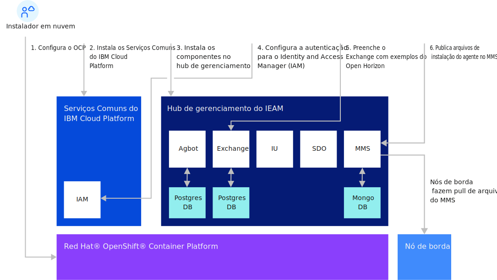

---

copyright:
years: 2020
lastupdated: "2020-10-28"

---

{:new_window: target="blank"}
{:shortdesc: .shortdesc}
{:screen: .screen}
{:codeblock: .codeblock}
{:pre: .pre}
{:child: .link .ulchildlink}
{:childlinks: .ullinks}

# Instalando o hub de gerenciamento
{: #management_hub}

## Visão geral da instalação do hub de gerenciamento
Conclua a instalação e a configuração do hub de gerenciamento antes de iniciar as tarefas do nó do {{site.data.keyword.edge_notm}} ({{site.data.keyword.ieam}}).

* [Dimensionamento e requisitos do sistema](cluster_sizing.md)
* [Configuração](configuration.md)
* [Instalação](installation.md)
  * [Instalação do {{site.data.keyword.ieam}}](online_installation.md)
  * [Pós-instalação ](post_install.md)
  * [Reunir arquivos de nó de borda](gather_files.md)
* [Desinstalação](uninstalling_hub.md)

## Fluxo da instalação do hub de gerenciamento

## Informações relacionadas

* [Instalando nós de borda](../installing/installing_edge_nodes.md)
