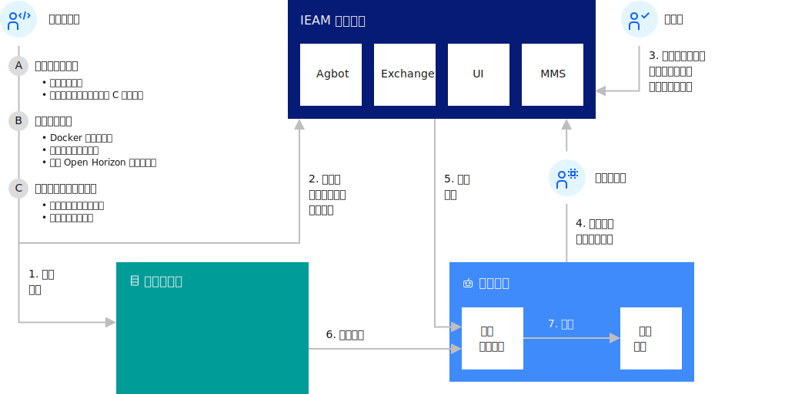

---

copyright:
years: 2020
lastupdated: "2020-04-09"

---

{:new_window: target="blank"}
{:shortdesc: .shortdesc}
{:screen: .screen}
{:codeblock: .codeblock}
{:pre: .pre}
{:child: .link .ulchildlink}
{:childlinks: .ullinks}

# 为设备开发边缘服务
{: #developing}

要开始为 {{site.data.keyword.edge_notm}} ({{site.data.keyword.ieam}}) 开发边缘服务，首先需要设置凭证以发布内容。因为所有服务必须进行签名，因此您还必须创建加密签名密钥对。 确保完成[准备创建边缘服务](service_containers.md)中的先决条件步骤。

此图显示 {{site.data.keyword.horizon}} 中各个组件之间的典型交互。

 

## 示例
{: #edge_devices_ex_examples}

使用凭证和签名密钥来完成开发示例。 这些示例显示如何构建简单服务并帮助您了解 {{site.data.keyword.ieam}} 开发基础。

其中每个开发示例都说明了开发边缘服务的另一些方面。 要获取最佳学习体验，请按此处列出的顺序完成示例。

* [将映像转换为边缘服务](transform_image.md) - 演示将现有 Docker 映像部署为边缘服务。

* [创建您自己的 Hello world 边缘服务](developingstart_example.md) - 演示开发、测试、发布和部署边缘服务的基础知识。

* [CPU 到 {{site.data.keyword.message_hub_notm}} 服务 ](cpu_msg_example.md) - 演示如何定义边缘服务配置参数、指定边缘服务需要其他边缘服务，以及将数据发送到云数据采集服务。

* [使用模型管理的 Hello World](model_management_system.md) - 演示如何开发使用模型管理服务的边缘服务。 模型管理服务异步提供边缘节点上边缘服务的文件更新，例如，在每次机器学习模型演进时进行动态更新。

* [使用回滚更新边缘服务](../using_edge_devices/service_rollbacks.md) - 演示如何监视部署是否成功，如果在任何边缘节点上失败，请将该节点还原为边缘服务的先前版本。

完成构建这些示例服务后，请复审以下文档，以获取有关为 {{site.data.keyword.ieam}} 开发服务的更多详细信息：

## 进一步阅读资料
{: #developing_more_info}

查看 {{site.data.keyword.ieam}} 软件开发的重要原则和最佳实践。

* [边缘本机开发最佳实践](best_practices.md)

利用 {{site.data.keyword.ieam}}，您可以选择将服务容器映像放入 IBM 专用安全容器注册表中，代替公用 Docker Hub。 例如，如果您具有包含不适合包含在公用注册表中的资产的软件映像。

* [使用专用容器注册表](container_registry.md)

您可以使用 {{site.data.keyword.ieam}} 将服务容器放入 IBM 专用安全容器注册表中，代替公用 Docker Hub。

* [开发详细信息](developing_details.md)

利用 {{site.data.keyword.ieam}}，您可以针对边缘机器开发想要的任何服务容器。

* [API](../installing/edge_rest_apis.md)

{{site.data.keyword.ieam}} 提供了 RESTful API 来使各个组件能够彼此协作，以及使贵组织的开发者和用户能够控制组件。
