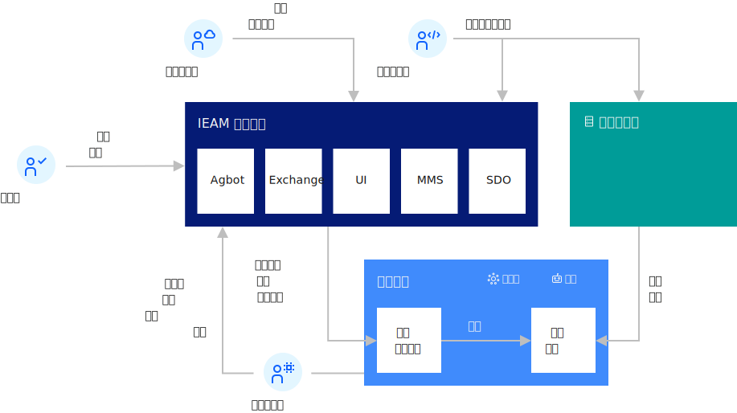

---

copyright:
years: 2020
lastupdated: "2020-05-11"

---

{:new_window: target="blank"}
{:shortdesc: .shortdesc}
{:screen: .screen}
{:codeblock: .codeblock}
{:pre: .pre}
{:child: .link .ulchildlink}
{:childlinks: .ullinks}

# {{site.data.keyword.edge_notm}} 概述
{: #overviewofedge}

此部分概述 {{site.data.keyword.edge_notm}} ({{site.data.keyword.ieam}})。

## {{site.data.keyword.ieam}} 功能
{: #capabilities}

{{site.data.keyword.ieam}} 为您提供边缘计算功能，帮助您管理工作负载并将其从管理中心集群部署到 OpenShift Container Platform 或其他基于 Kubernetes 的集群的边缘设备和远程实例。

## 体系结构

边缘计算的目标是利用为混合云计算创建的规程来支持边缘计算设施的远程操作。 {{site.data.keyword.ieam}} 是为此目的而设计的。

{{site.data.keyword.ieam}} 部署包含在数据中心中安装的 OpenShift Container Platform 实例中运行的管理中心。 管理中心是发生所有远程边缘节点（边缘设备和边缘集群）管理的位置。

这些边缘节点可以安装在远程本地位置，使您的应用程序工作负载位于您的关键业务运营物理发生位置本地，例如在您的工厂、仓库、零售店和配送中心等。

下图描述典型边缘计算设置的高级别拓扑：

{{site.data.keyword.ieam}} 管理中心专为边缘节点管理而设计，旨在最大限度减少部署风险，以及完全自主地管理边缘节点上的服务软件生命周期。 云安装程序安装和管理 {{site.data.keyword.ieam}} 管理中心组件。 软件开发人员可开发边缘服务并将其发布到管理中心。 管理员定义控制边缘服务部署位置的部署策略。 {{site.data.keyword.ieam}} 处理其他一切事项。

# 组件
{: #components}

有关与 {{site.data.keyword.ieam}} 绑定的组件的更多信息，请参阅[组件](components.md)。

## 下一步是什么

有关使用 {{site.data.keyword.ieam}} 和开发边缘服务的更多信息，请查看 {{site.data.keyword.edge_notm}} ({{site.data.keyword.ieam}}) [“欢迎”页面](../kc_welcome_containers.html)中列出的主题。
