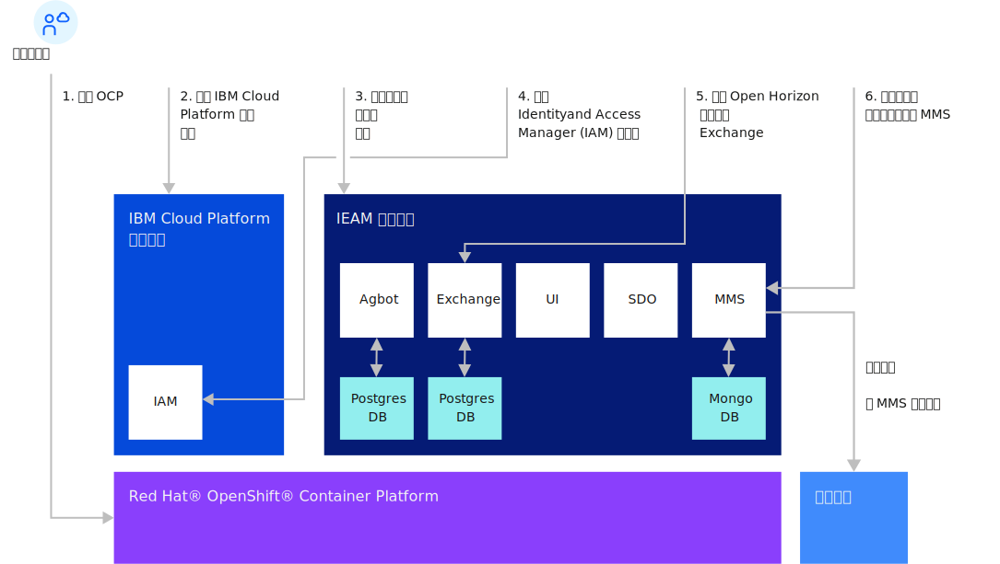

---

copyright:
years: 2020
lastupdated: "2020-10-28"

---

{:new_window: target="blank"}
{:shortdesc: .shortdesc}
{:screen: .screen}
{:codeblock: .codeblock}
{:pre: .pre}
{:child: .link .ulchildlink}
{:childlinks: .ullinks}

# 安装管理中心
{: #management_hub}

## 管理中心安装概述
在启动 {{site.data.keyword.edge_notm}} ({{site.data.keyword.ieam}}) 节点任务前完成管理中心安装和配置。

* [大小调整和系统需求](cluster_sizing.md)
* [配置](configuration.md)
* [安装](installation.md)
  * [安装 {{site.data.keyword.ieam}}](online_installation.md)
  * [安装后](post_install.md)
  * [收集边缘节点文件](gather_files.md)
* [卸载](uninstalling_hub.md)

## 管理中心安装流程

## 相关信息

* [安装边缘节点](../installing/installing_edge_nodes.md)
